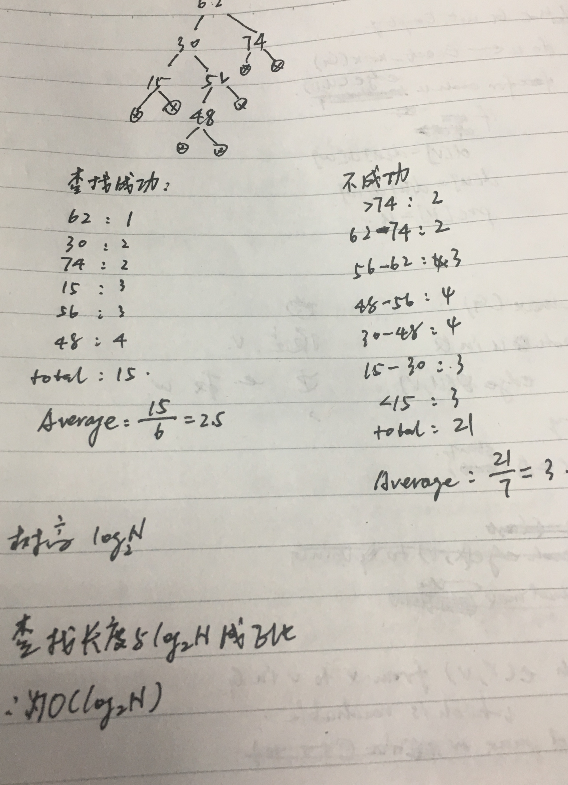
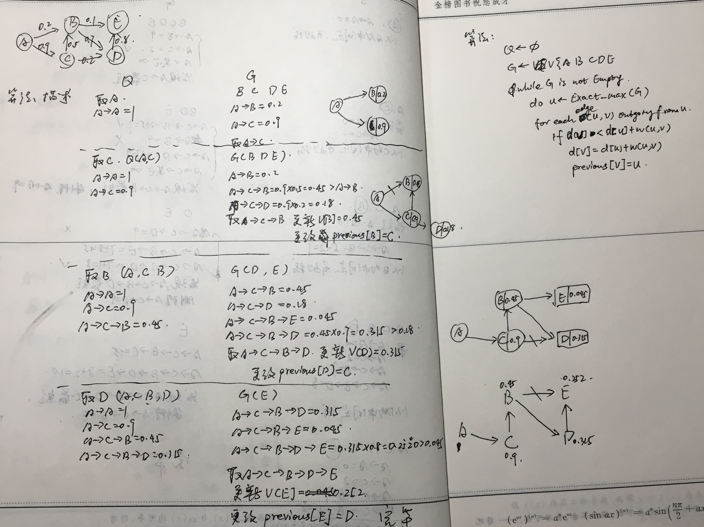

#数据结构
```
void exchange(a[],len){
	for(i=0;i>=len/2;i++){
		tmp = a[i];
		a[i]= a[len-1-i];
		a[len-1-i]=tmp;
	}
}
时间复杂度 O(n)

```
###七 栈
```
bcd
bdc
cbd
cdb
dcb
(dbc 不可能)
```

###八 排序

```
冒泡
3728|9
327|89
23|789
2|3789

选择排序
7382|9
732|89
23|789
2|3789
```

###九 请分析一个半宽带为2的带状矩阵的值为0的元素个数
```
n=3 零的个数:0
n=4 num:2*(1)
n=5 num:2*(1+2)
n=5 num:2*(1+2+3)
n=k num:2*(1+2+3+...+(k-2))
```

###十 二叉树

```
二叉树:
```

###十一 查找树


###十二 有向图最小路径问题
