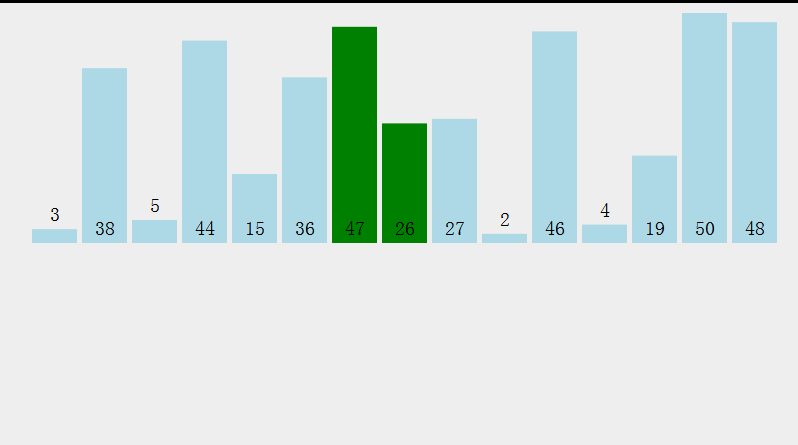
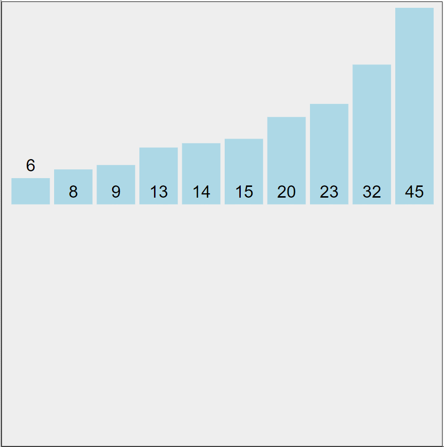
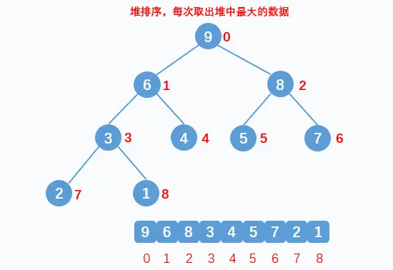
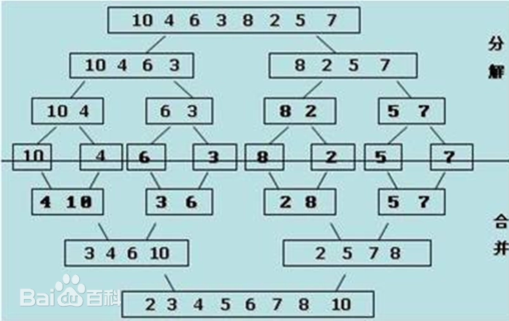
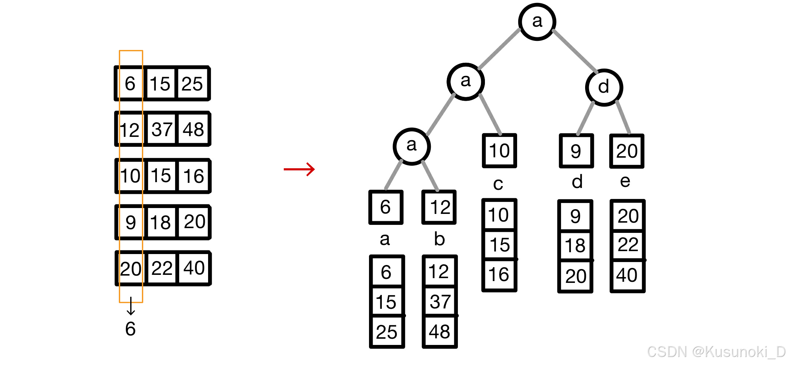

# 排序算法
## 交换排序
### 冒泡排序


[BucketSort.java](BucketSort.java)

### 快速排序


[L912_quick.java](L912_quick.java)

## 插入排序
### 直接插入


[L912_insert.java](L912_insert.java)
### 希尔排序
```text
[49, 38, 65, 97, 76, 13, 27, 49*, 55, 04]

第一轮（增量 = 5）：
分组：(49, 13), (38, 27), (65, 49*), (97, 55), (76, 04)。
排序后：[13, 27, 49*, 55, 04, 49, 38, 65, 97, 76]

第二轮（增量 = 2）：
分组：(13, 49*, 04, 38, 97), (27, 55, 49, 65, 76)。
排序后：[04, 27, 13, 49, 38, 55, 49*, 65, 97, 76]。

第三轮（增量 = 1）：
此时对整个数组做一次插入排序，因为数据已经很有序了，所以这一步非常快。
最终结果：[04, 13, 27, 38, 49, 49*, 55, 65, 76, 97]。
```
[L912_shell.java](L912_shell.java)

## 选择排序
### 简单选择排序


[L912_selection.java](L912_selection.java)

### 堆排序
- build max heap
```text
  original                  i = 2                   i = 1                  i = 0      
     5                        5                       5                     *7        
  2     3         ====>    2    *6       ====>    *7     6      ====>     5     6     
 1  7  4  6               1  7  4  3              1  2  4  3             1  2  4  3   
```
- heap sort



## 归并排序


多路归并排序：\


# Reference
- [排序算法](https://zh.wikipedia.org/wiki/%E6%8E%92%E5%BA%8F%E7%AE%97%E6%B3%95)