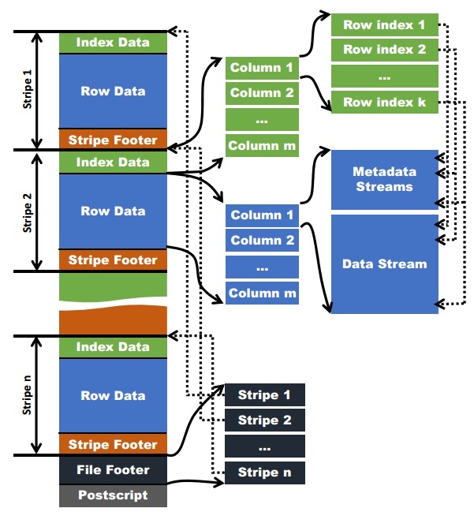

# ORC
## ORCFile:
无固定大小，通常按 64MB 切分 Stripe



```text
ORC 文件
├── File Footer（文件尾：记录所有 Stripe 元数据、文件级统计）
├── Postscript（文件配置：压缩算法、Footer 长度等）
└── Stripe（数据块，默认 ~256MB）→ 点查时先定位到目标 Stripe
    ├── Stripe Footer（Stripe 尾：记录该 Stripe 内所有 Stream 的偏移/长度）
    ├── Index Data（索引数据：RowIndex + 列统计）→ 点查时核心依赖
    │   └── RowIndex（每行组的 min/max 统计 + 偏移）
    └── Stripe Data（实际列数据）→ 由多个 Stream 组成
        ├── Preset Stream（元数据流：如 NULL 位图、字典编码映射表）
        └── Data Stream（实际列值流：如 id/name 的编码数据）
            └── 按 Row Group 拆分（默认每 1000 行一个 Row Group）→ 点查时定位到目标 Row Group
```
- PostScript: 固定大小 < 256B
  - footerLength
  - 压缩算法
  - 校验和
    ```text
    message PostScript {
      uint64 footerLength = 1;      // File Footer的字节长度
      CompressionKind compression = 2; // 压缩算法(ZLIB, SNAPPY等)
      uint64 compressionBlockSize = 3; // 压缩块大小
      uint32 versionMajor = 4;      // 主版本号
      uint32 versionMinor = 5;      // 次版本号
      bytes metadataKey = 6;        // 可选元数据键
      bytes metadataValue = 7;      // 可选元数据值
      uint64 checksum = 8;          // 校验和
    }
    ```
- File Footer: 
  - 每个 Stripe metadata
  - 总行数
  - 每个列的统计信息
    ```text
    message Footer {
      repeated StripeInformation stripes = 1; // 所有条带信息
      repeated Type types = 2;                // 文件schema
      repeated ColumnStatistics columnStats = 3; // 列统计
      uint64 numberOfRows = 4;                // 总行数
      string writer = 5;                      // 写入器信息
      uint32 stripeStatisticsOffset = 6;      // 条带统计偏移
      // ... 其他详细元数据
    }
    
    message ColumnStatistics {
      // 通用统计
      optional uint64 numberOfValues = 1; // 非空值数量
      optional bool hasNull = 2;          // 是否包含空值
    
      // 数值类型统计（int/bigint/float/double等）
      optional string minimum = 3;        // 最小值（字符串存储，兼容不同类型）
      optional string maximum = 4;        // 最大值
      optional string sum = 5;            // 总和
    
      // 字符串类型统计
      optional uint64 sumOfLengths = 6;   // 所有字符串长度总和
    
      // 布尔类型统计
      optional uint64 numberOfTrues = 7;  // true的数量
      optional uint64 numberOfFalses = 8; // false的数量
    
      // 日期/时间类型统计
      optional uint64 minimumTimestamp = 9;  // 最小时间戳（毫秒级）
      optional uint64 maximumTimestamp = 10; // 最大时间戳
    
      // 复杂类型统计（数组/Map/结构体）
      optional uint64 numElements = 11;   // 元素总数
      optional uint64 nulls = 12;         // 空元素数量
      optional uint64 distinctCount = 13; // 去重后数量（近似）
    }
    
    message StripeInformation {
      optional uint64 offset = 1;          // Stripe在文件中的起始偏移量（字节）
      optional uint64 indexLength = 2;     // Stripe Index部分的长度
      optional uint64 dataLength = 3;      // Stripe 数据部分的长度
      optional uint64 footerLength = 4;    // Stripe Footer的长度
      optional uint64 numberOfRows = 5;    // 该Stripe包含的行数
      optional uint64 stripeId = 6;        // Stripe唯一ID（可选）
    }
    
    ```
    
## Stripe
- [Stripe Index] -> [Row Data] -> [Stripe Footer]
### 索引数据（Index Data）
- Stripe Index 是该 Stripe 的索引元数据，用于谓词下推（Predicate Pushdown） 和快速定位数据，避免全量扫描。
- 它包含 RowIndex 和 Bloom Filter（可选）两部分：
    - RowIndex 是 Row Group 的索引，每个 Entry 对应一个 Row Group
    - Bloom Filter 是可选的，用于快速判断是否包含某个值（不保证 100% 准确）
    ```text
    message RowIndex {
    repeated RowIndexEntry entries = 1; // 每个Entry对应一个Row Group
    optional uint32 column = 2;         // 所属列的ID
    }
    
    message RowIndexEntry {
    // 该Row Group的列统计（与Footer的ColumnStatistics结构完全一致）
    repeated ColumnStatistics statistics = 1;
    
    // 该Row Group在Row Data中的偏移量（压缩后）
    repeated uint64 positions = 2;      
    }
    
    message BloomFilterIndex {
      optional uint32 column = 1;                // 所属列ID
      repeated BloomFilter bloomFilters = 2;     // 每个Row Group对应一个布隆过滤器
    }
    
    message BloomFilter {
      optional uint32 numHashFunctions = 1;      // 哈希函数数量
      optional uint64 numBits = 2;               // 位图总位数
      optional bytes bits = 3;                   // 位图数据（压缩存储）
    }
    ```

### 行数据（Row Data）
- 元数据流（Metadata Stream）
    ```text
    PRESENT流
    原始数据：[1, NULL, 3, NULL, NULL, 6]
    PRESENT流位图：101001
    RLE编码后：(1,1), (0,1), (1,1), (0,2), (1,1)
    
    LENGTH流
    原始字符串：["apple", "banana", "cherry"]
    LENGTH流：5, 6, 6
    VLQ编码后：05, 06, 06（实际存储为紧凑二进制）
    ```
    
- 数据流（Data Stream）
    ```text
    原始字符串：["apple", "banana", "apple", "cherry", "banana"]
    DICTIONARY_DATA流：["apple", "banana", "cherry"]
    DATA流：[0, 1, 0, 2, 1] （字典索引）
    
    
    流组合：
    PRESENT流：位图 1011110111 → RLE编码后存储
    LENGTH流：5, 6, 5, 6, 6, 5, 6, 5 → VLQ编码
    DICTIONARY_DATA流："apple", "banana", "cherry" → 字符串序列
    DATA流：0, 1, 0, 2, 1, 0, 2, 0 → 字典索引（RLE编码）
    ```

- Data Stream 是根据 Row Group 拆分的
  - Row Group 的规则是：以整个 Stripe 的行号为基准，按固定行数（默认 1000 行）拆分，所有列的 Row Group 都对应相同的行范围。
- **PLAIN 编码**
  - 下面实例：session_id PLAIN 编码
  - ORC 会在解析 session_id 列 Row Group 数据时，先构建一个行位置索引表（内存级，极快）


**实例**：
```text
Stripe 数据区 (物理字节顺序)
│
├─ Column 0 (root struct) - 无实际数据流
│
├─ Column 1 (id: INT)
│  ├─ Stream 1.1: PRESENT (1.25KB) - NULL值位图
│  └─ Stream 1.2: DATA (40KB) - RLE编码的整数值
│
├─ Column 2 (session_id: STRING) - 变长唯一键
│  ├─ Stream 2.1: PRESENT (1.25KB) - NULL值位图（Preset Stream）
│  │  作用：标记每行 session_id 是否为 NULL，1 位对应 1 行，1=非空/0=空
│  │  特点：体积极小，Stripe 级存储，无 Row Group 拆分
│  ├─ Stream 2.2: LENGTH (8.5KB) - 长度流（Data Stream）
│  │  作用：存储每行 session_id 的字节长度（以 VLI 编码，1~5 字节/个）
│  │  特点：按 Row Group 拆分，与 DATA Stream 一一对应
│  └─ Stream 2.3: DATA (120KB) - 内容流（Data Stream）
│     作用：存储每行 session_id 的 UTF-8 原始字节内容
│     特点：按 Row Group 拆分，长度与 LENGTH Stream 中的值一一匹配
│
├─ Column 3 (salary: DOUBLE)
│  ├─ Stream 3.1: PRESENT (1.25KB) - NULL值位图
│  ├─ Stream 3.2: DATA (70KB) - 浮点值尾数
│  └─ Stream 3.3: SECONDARY (35KB) - 浮点值指数
│
├─ Column 4 (is_active: BOOLEAN)
│  ├─ Stream 4.1: PRESENT (1.25KB) - NULL值位图
│  └─ Stream 4.2: DATA (1.25KB) - 位打包的布尔值
│
├─ Column 5 (hire_date: DATE)
│  ├─ Stream 5.1: PRESENT (1.25KB) - NULL值位图
│  └─ Stream 5.2: DATA (20KB) - 日期值(从1970-01-01的天数)
│
├─ Column 6 (tags: ARRAY<STRING>)
│  ├─ Stream 6.1: PRESENT (1.25KB) - NULL值位图
│  ├─ Stream 6.2: LENGTH (10KB) - 数组长度
│  ├─ Stream 6.3: DATA (25KB) - 元素字典索引
│  └─ Stream 6.4: DICTIONARY_DATA (40KB) - 唯一标签值
│
├─ Column 7 (contact_info: MAP<STRING, STRING>)
│  ├─ Stream 7.1: PRESENT (1.25KB) - NULL值位图
│  ├─ Stream 7.2: LENGTH (8KB) - 键值对数量
│  ├─ Stream 7.3: KEY_DATA (15KB) - 键字典索引
│  ├─ Stream 7.4: KEY_DICTIONARY (20KB) - 唯一键值
│  ├─ Stream 7.5: VALUE_DATA (15KB) - 值字典索引
│  └─ Stream 7.6: VALUE_DICTIONARY (25KB) - 唯一值
│
└─ Column 8 (details: STRUCT<city:STRING, age:INT>)
   ├─ Stream 8.1: PRESENT (1.25KB) - NULL值位图
   ├─ Sub-column 8.1 (city: STRING)
   │  ├─ Stream 8.1.1: PRESENT (1.25KB) - 子字段NULL位图
   │  ├─ Stream 8.1.2: DATA (18KB) - 字典索引
   │  └─ Stream 8.1.3: DICTIONARY_DATA (30KB) - 唯一城市名
   └─ Sub-column 8.2 (age: INT)
      ├─ Stream 8.2.1: PRESENT (1.25KB) - 子字段NULL位图
      └─ Stream 8.2.2: DATA (10KB) - 年龄值
```
### Stripe Footer
- 流位置信息
- 列编码信息
- 列统计信息
```text
stripe_footer {
  // ========== 流位置信息 ==========
  streams {
    column: 1  // id 列
    kind: PRESENT  // NULL 位图
    offset: 0
    length: 160  // 10,000 位 = 1,250 字节，压缩后 160 字节
  }
  streams {
    column: 1
    kind: DATA  // 整数值
    offset: 160
    length: 4096  // RLE 编码的整数
  }
  
  streams {
    column: 2  // user_uuid 列 (唯一 ID)
    kind: PRESENT  // NULL 位图
    offset: 4256
    length: 160  // 同样 160 字节
  }
  streams {
    column: 2
    kind: LENGTH  // 每个 UUID 长度 (固定 36 字节)
    offset: 4416
    length: 128  // 高度压缩 (全 36)
  }
  streams {
    column: 2
    kind: DATA  // 实际 UUID 字节
    offset: 4544
    length: 360000  // 10,000 × 36 字节
  }
  
  streams {
    column: 3  // event_time 列
    kind: PRESENT
    offset: 364544
    length: 160
  }
  streams {
    column: 3
    kind: DATA  // 时间戳秒部分
    offset: 364704
    length: 8000
  }
  streams {
    column: 3
    kind: SECONDARY  // 时间戳纳秒部分
    offset: 372704
    length: 2000
  }

  // ========== 列编码信息 ==========
  column_encodings {
    column: 1
    kind: DIRECT_V2  // 整数直接编码
  }
  column_encodings {
    column: 2
    kind: DIRECT_V2  // 字符串直接编码 (唯一 ID 不用字典)
  }
  column_encodings {
    column: 3
    kind: DIRECT_V2  // 时间戳直接编码
  }

  // ========== 列统计信息 ==========
  column_statistics {
    column: 0  // 根列
    hasNull: false
    numberOfValues: 10000
  }
  column_statistics {
    column: 1  // id 列
    hasNull: false
    numberOfValues: 10000
    intStats {
      minimum: 950001
      maximum: 960000
      sum: 9550005000
    }
  }
  column_statistics {
    column: 2  // user_uuid 列
    hasNull: false
    numberOfValues: 10000
    stringStats {
      minimum: "0019a8f3-d1e2-4c7a-b0a5-1234567890ab"
      maximum: "fff8e7d6-c5b4-4321-a987-9876543210dc"
      sum: 360000  // 10,000 × 36 字节
    }
  }
  column_statistics {
    column: 3  // event_time 列
    hasNull: false
    numberOfValues: 10000
    timestampStats {
      minimum: 1686441600000  // 2023-06-10 00:00:00 UTC
      maximum: 1686527999000  // 2023-06-10 23:59:59 UTC
      minimumNanos: 0
      maximumNanos: 999000000
    }
  }

  writerTimezone: 0  // UTC
}
```
