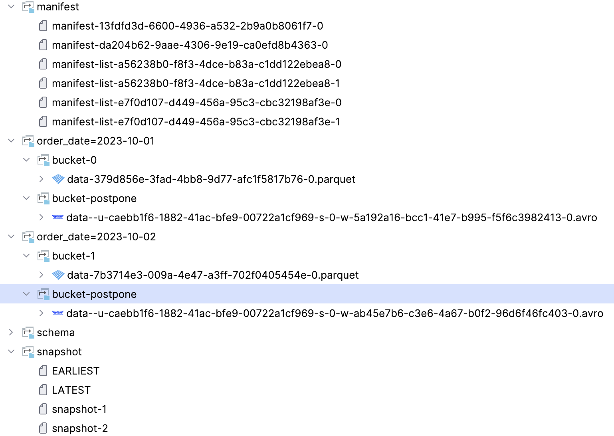
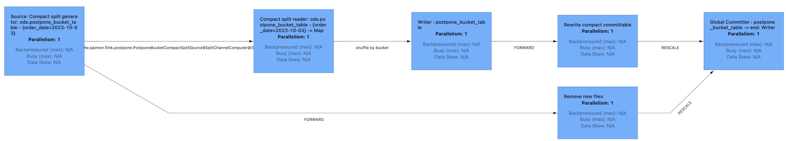
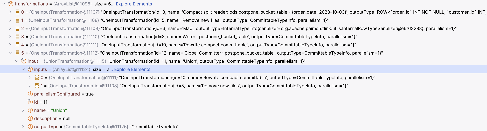
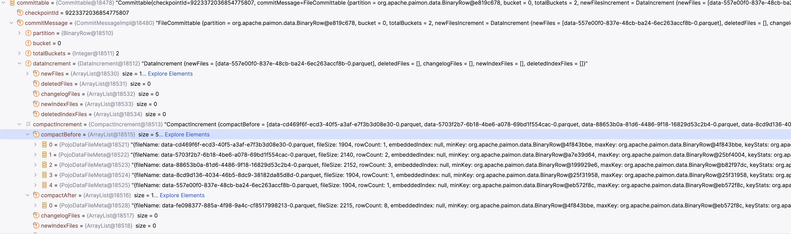

# Data Distribution

## AppendOnly(Table w/o PK)
```sql
CREATE TABLE wo_pk_table (
    order_id BIGINT,
    price DECIMAL(32, 2),
    ts TIMESTAMP(3)
) WITH (
    'bucket' = '2',
    'bucket-key' = 'order_id'
);

insert into wo_pk_table values (1, 100.0, CAST('2025-04-05 11:45:00' AS TIMESTAMP(3)));
insert into wo_pk_table values (2, 200.0, CAST('2025-04-05 11:45:01' AS TIMESTAMP(3))), (3, 300.0, CAST('2025-04-05 11:45:02' AS TIMESTAMP(3)));
```

Cannot define 'bucket-key' with bucket = -1, please remove the 'bucket-key' setting or specify a bucket number.

```sql
CREATE TABLE wo_pk_table (
    product_id BIGINT,
    price DOUBLE,
    sales BIGINT
) WITH (
    'bucket' = '-1',
    'bucket-key' = 'product_id'
);
```

## Table with PK

- [primary-key-table data-distribution](https://paimon.apache.org/docs/master/primary-key-table/data-distribution/)

```sql
SET 'execution.runtime-mode' = 'batch';
    
CREATE TABLE with_pk_table (
    order_id BIGINT,
    price DECIMAL(32, 2),
    ts TIMESTAMP(3),
    PRIMARY KEY (order_id) NOT ENFORCED
);
insert into with_pk_table values (1, 100.0, CAST('2025-04-05 11:45:00' AS TIMESTAMP(3)));

insert into with_pk_table values (2, 200.0, CAST('2025-04-05 11:45:01' AS TIMESTAMP(3))), (3, 300.0, CAST('2025-04-05 11:45:02' AS TIMESTAMP(3)));

insert into with_pk_table values (4, 400.0, CAST('2025-04-05 11:45:03' AS TIMESTAMP(3))), (5, 500.0, CAST('2025-04-05 11:45:04' AS TIMESTAMP(3))), (6, 600.0, CAST('2025-04-05 11:45:05' AS TIMESTAMP(3))), (7, 700.0, CAST('2025-04-05 11:45:06' AS TIMESTAMP(3)));

delete from with_pk_table where order_id in (2, 3);

CALL sys.compact('ods.with_pk_table', '', '', '', '');
```
### Dynamic Bucket
Default mode for primary key table, or configure 'bucket' = '-1'.

### Postpone Bucket

#### File structure:




#### Postpone bucket example
```sql
SET 'execution.runtime-mode' = 'batch';
CREATE TABLE postpone_bucket_table (
  order_id INT,
  customer_id INT,
  order_date STRING,
  total_amount DECIMAL(10, 2),
  status STRING,
  PRIMARY KEY (order_date, order_id) NOT ENFORCED
) PARTITIONED BY (order_date) WITH (
  'bucket' = '-2',
  'postpone.batch-write-fixed-bucket' = 'false',
  'postpone.default-bucket-num' = '2',
  'file.format' = 'parquet'
);

-- Whether to write the data into fixed bucket for batch writing a postpone bucket table.
-- postpone.default-bucket-num:1

INSERT INTO postpone_bucket_table VALUES 
  (1, 1001, '2023-10-01', 100.50, 'COMPLETED'),
  (2, 1002, '2023-10-01', 200.75, 'PENDING'),
  (3, 1001, '2023-10-02', 150.20, 'COMPLETED');

-- 使用OPTIONS子句设置写入参数
INSERT INTO postpone_bucket_table /*+ OPTIONS('postpone.batch-write-fixed-bucket' = 'true') */ VALUES 
  (4, 1003, '2023-10-02', 300.00, 'COMPLETED');

-- 使用并行度写入
INSERT INTO postpone_bucket_table /*+ OPTIONS('postpone.batch-write-fixed-bucket' = 'true') */ VALUES 
  (5, 1004, '2023-10-03', 450.80, 'PENDING'),
  (6, 1005, '2023-10-03', 220.30, 'COMPLETED');


-- currently only see order_id=4, because of bucket-postpone directory of each partition and are not available to readers.
CALL sys.compact(`table` => 'ods.postpone_bucket_table', compact_strategy => 'full');

-- after compact, see all order_id
    
CALL sys.rescale(
  `table` => 'ods.postpone_bucket_table',
  `bucket_num` => 1,
  `partition` => 'order_date=2023-10-02'
);

-- after rescale, 2023-10-02 merge two files

insert into postpone_bucket_table /*+ OPTIONS('postpone.batch-write-fixed-bucket' = 'true') */ values (7, 1006, '2023-10-03', 500.00, 'COMPLETED');
insert into postpone_bucket_table values (8, 1007, '2023-10-03', 600.00, 'COMPLETED');
insert into postpone_bucket_table values (9, 1008, '2023-10-03', 700.00, 'COMPLETED');
insert into postpone_bucket_table /*+ OPTIONS('postpone.batch-write-fixed-bucket' = 'true') */ values (10, 1009, '2023-10-03', 800.00, 'COMPLETED');
```

### Postpone bucket deep dive

- read postpone bucket partitions
    ```java
    List<BinaryRow> partitions =
            fileStoreTable
                    .newSnapshotReader()
                    .withBucket(BucketMode.POSTPONE_BUCKET)
                    .partitions();
    ```

- Flink compact : `buildForPostponeBucketCompaction`, 只处理 POSTPONE_BUCKET 对应的 manifest 文件
  - postpone bucket compaction Flink job
    
  - Flink transformations:
    

- Spark compact : SparkPostponeCompactProcedure

- `postpone.batch-write-fixed-bucket=false`, 默认写入bucket-postpone目录, 对reader不可见
  目前看是 avro 格式，只有bucket-postpone目录存在未处理的文件，才会触发compaction

- `CompactAction.buildForPostponeBucketCompaction` build Flink operators:
  - Compact split generator：按分桶/文件范围生成Compact Split（待压缩的文件分片）→ 输出Split转为RowData
  - Compact split reader：读取Split对应的原始小文件数据→ 解析为InternalRow（Paimon 内部行格式）
  - Writer table：将InternalRow合并写入新的大文件 → 输入流结束（endInput）后执行precommit（预提交）
  - Rewrite compact committable：封装预提交的新文件元数据为“压缩可提交项”→ 原子性提交并更新表元数据
  - Remove new files：清理Compact过程中产生的临时文件/过期旧文件
  - Global Committer : 5 + 4 的文件合并之后，提交 manifest 元数据

- MergeTreeWriter.prepareCommit will merge small files


- table trigger commit messages, which will make a new snapshot
    ```scala
    assert(finalCommitMessages.nonEmpty, "No commit message to commit")
    val commitUser = table.coreOptions.createCommitUser
    val commit = realTable.newCommit(commitUser)
    commit.commit(finalCommitMessages.asJava)
    ```

## troubleshooting
<details>
<summary>Fix rescale procedure to only read real buckets for postpone bucket table</summary>

https://github.com/apache/paimon/pull/7184
</details>
<details>
<summary>Support Spark Compaction for Postpone Bucket Tables</summary>

https://github.com/apache/paimon/pull/7168
</details>
<details>
<summary>Postpone bucket compaction currently does not support specifying partitions</summary>

not support partitions `CALL sys.compact(`table` => 'ods.postpone_bucket_table', `partitions` => 'order_date=2023-10-03');`\
直觉上针对固定分区是合理的，而且实现也不困难？\
我不太确定这个是否应该支持？
</details>


