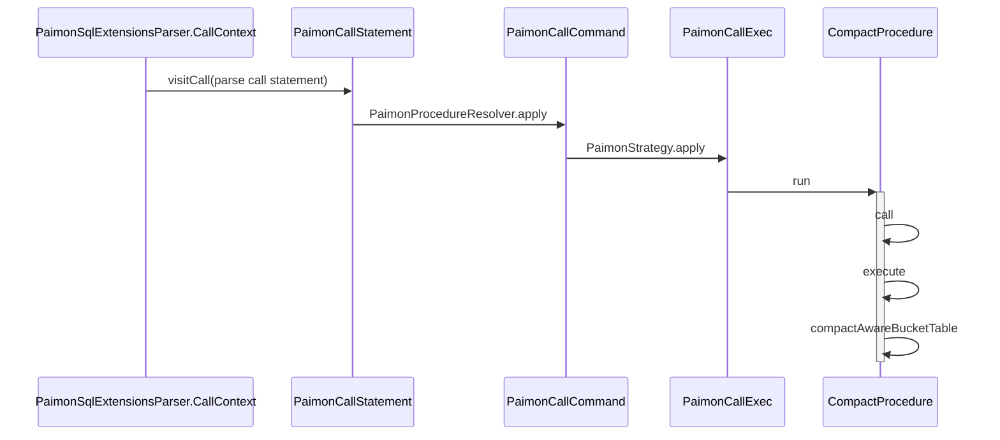
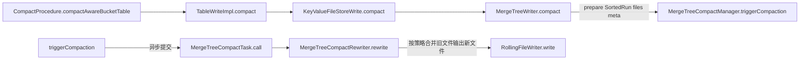
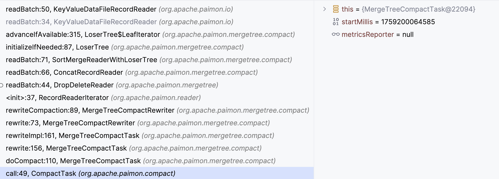
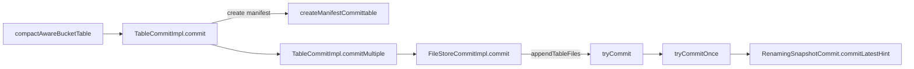

## Flink CompactAction TODO

## Spark sql
### Paimon Procedure: compact aware bucket pk table with many small files
`org.apache.paimon.spark.procedure.CompactProcedureTest`

#### compact high level pipeline

#### compactAwareBucketTable, spark mapPartitions task
- get `readParallelism` from partitions and buckets, 每个task处理一个bucket compact具体流程如下：

- 真实合并文件在`MergeTreeCompactRewriter`, 基于策略挑选需要压缩的文件集合，判断是否可丢弃删除标记，然后提交对应的压缩任务, 
create reader pipeline:

- 然后`readBatch` stack:

  

#### commit metadata
`compactAwareBucketTable` commit manifest

- [Concurrency Control](https://paimon.apache.org/docs/master/concepts/concurrency-control/)
`tryCommit` will wait for a while if `tryCommitOnce` failed, then retry again, until success or exceed max retry times.
`tryCommitOnce` will base on the lastest snapshot as base `baseManifestList`, then create new `deltaManifestList`, then generates a new snapshot based on the current snapshot,
if commit failed due to other client already committed, try again by lastest snapshot.
