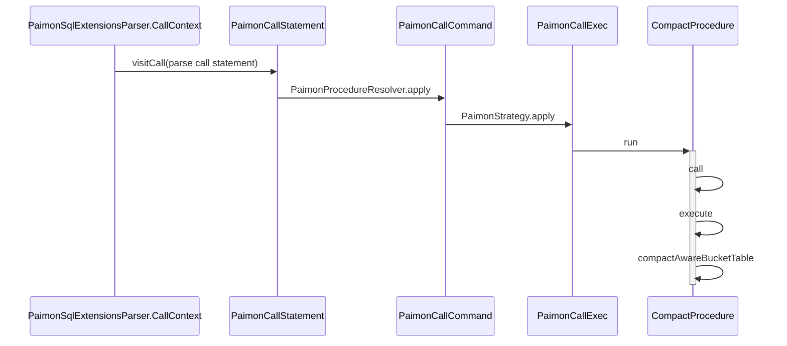
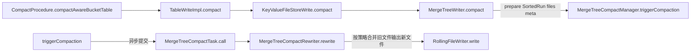

## Flink CompactAction TODO

## Spark sql
### Paimon Procedure: compact aware bucket pk table with many small files
`org.apache.paimon.spark.procedure.CompactProcedureTest`

#### compact high level pipeline


#### compactAwareBucketTable, spark mapPartitions task
- get `readParallelism` from partitions and buckets, 每个task处理一个bucket compact具体流程如下：


- 真实合并文件在`MergeTreeCompactRewriter`, 基于策略挑选需要压缩的文件集合，判断是否可丢弃删除标记，然后提交对应的压缩任务, 
create reader pipeline:


- 然后`readBatch` stack:


#### commit metadata
`compactAwareBucketTable` commit manifest


- [Concurrency Control](https://paimon.apache.org/docs/master/concepts/concurrency-control/)
`tryCommit` will wait for a while if `tryCommitOnce` failed, then retry again, until success or exceed max retry times.
`tryCommitOnce` will base on the lastest snapshot as base `baseManifestList`, then create new `deltaManifestList`, then generates a new snapshot based on the current snapshot,
if commit failed due to other client already committed, try again by lastest snapshot.


## Compaction

### UniversalCompaction MINOR
`UniversalCompactionTest`\
case0:
```java
    @Test
    public void testUniversalCompaction() {
        UniversalCompaction compaction = ofTesting(25, 1, 3);
        compaction.pick(6, Lists.newArrayList(
                new LevelSortedRun(0, SortedRun.fromSingle(file(1))),
                new LevelSortedRun(0, SortedRun.fromSingle(file(1))),
                new LevelSortedRun(0, SortedRun.fromSingle(file(1)))
        ));
    }
```
达到numRunCompactionTrigger 3，触发compact, 合并level 0的sortedRuns 1,2,3 到 level 5
```text
+-------+-------+------+               +-------+-------+------+                                     
| index | level | size |               | index | level | size |                                     
|-------|-------|------|               |-------|-------|------|                                     
|  1    |  0    |  1   |    =======>   |  1    |  5    |  3   |                                     
|  2    |  0    |  1   |               +-------+-------+------+                     
|  3    |  0    |  1   |                                    
+-------+-------+------+                                                    
```

case1:\
maxSizeAmp 主要比较最后一个sortedRun和其他sortedRun的size比例是否超过阈值
```text
+-------+-------+------+         +-------+-------+------+ 
| index | level | size |         | index | level | size | 
|-------|-------|------|         |-------|-------|------| 
|  1    |  0    |  1   |  ===>   |  1    |  4    |  2   | 
|  2    |  0    |  1   |         |  2    |  5    |  10  | 
|  3    |  5    |  10  |         +-------+-------+------+ 
+-------+-------+------+          
```
maxSizeAmp = 25 即 sum(sortedRuns[1,2]) * 100/25 >? sortedRuns[3]\
2 * 4 < 10 ==> CompactUnit(outputLevel=5,files=[1,2])

```text
+-------+-------+------+         +-------+-------+------+ 
| index | level | size |         | index | level | size | 
|-------|-------|------|         |-------|-------|------| 
|  1    |  0    |  1   |  ===>   |  1    |  5    |  9   | 
|  2    |  0    |  1   |         +-------+-------+------+ 
|  3    |  5    |  7  |          
+-------+-------+------+          
```
maxSizeAmp = 25 即 sum(sortedRuns[1,2]) * 100/25 >? sortedRuns[3]\
2 * 4 > 7 ==> CompactUnit(outputLevel=5,files=[1,2,3])

case2:\
确定哪些sortedRuns需要compact成新level 4
sizeRatio = 1\
sum(sortedRuns[1,2]) * (1 + sizeRatio/100) = (1 + 1) * 1.01 < sortedRuns[3], 合并 [1,2] 到 level 4
```text
+-------+-------+------+         +-------+-------+------+ 
| index | level | size |         | index | level | size | 
|-------|-------|------|         |-------|-------|------| 
|  1    |  0    |  1   |  ===>   |  1    |  4    |  2   | 
|  2    |  0    |  1   |         |  2    |  5    |  10  | 
|  3    |  5    |  10  |         +-------+-------+------+ 
+-------+-------+------+          
```

case3:\
maxSizeAmp: 4 远远大于其他
sizeRatio: 找到 1 和 2 可以合并成 level 3 这两个sortedRuns的和 小于第3个sortedRun的size
```text
+-------+-------+------+         +-------+-------+------+ 
| index | level | size |         | index | level | size | 
|-------|-------|------|         |-------|-------|------| 
|  1    |  0    |  1   |  ===>   |  1    |  3    |  2   | 
|  2    |  0    |  1   |         |  2    |  4    |  10  | 
|  3    |  4    |  10  |         |  3    |  5    |  100 | 
|  4    |  5    |  100 |         +-------+-------+------+ 
+-------+-------+------+          
```

case4:\
sizeRatio: sortedRun1*1.01 < sortedRun2, 合并 [1,2,3,4] 重新扩展到 level 4[1,2,3,4,5]
```text
+-------+-------+------+         +-------+-------+------+ 
| index | level | size |         | index | level | size | 
|-------|-------|------|         |-------|-------|------| 
|  1    |  0    |  1   |  ===>   |  1    |  4    |  25  | 
|  2    |  0    |  2   |         |  2    |  5    |  100 | 
|  3    |  0    |  2   |         +-------+-------+------+ 
|  4    |  4    |  10  |          
|  5    |  4    |  10  |          
|  6    |  5    |  100 |          
+-------+-------+------+          
```

### ForceUpLevel0Compaction
MINOR compact
```java
    @Test
    public void testCompaction() {
        ForceUpLevel0Compaction compaction = new ForceUpLevel0Compaction(new UniversalCompaction(25, 1, 5, null, null),null);
        compaction.pick(6, Lists.newArrayList(
                new LevelSortedRun(0, SortedRun.fromSingle(file(1))),
                new LevelSortedRun(0, SortedRun.fromSingle(file(1))),
                new LevelSortedRun(1, SortedRun.fromSingle(file(10))),
                new LevelSortedRun(5, SortedRun.fromSingle(file(100)))
        ));
    }
```
UniversalCompaction 没有触发compact，执行ForceUpLevel0Compaction.forcePickL0:\
强制合并Level0的所有文件
```text
+-------+-------+------+         +-------+-------+------+ 
| index | level | size |         | index | level | size | 
|-------|-------|------|         |-------|-------|------| 
|  1    |  0    |  1   |  ===>   |  1    |  3    |  3   | 
|  2    |  0    |  2   |         |  2    |  4    |  10  | 
|  3    |  4    |  10  |         |  3    |  5    |  100 | 
|  4    |  5    |  100 |         +-------+-------+------+ 
+-------+-------+------+          
```


### Full Compaction
`CompactStrategy.pickFullCompaction`: will compact all file in level 0 to level 5
```text
+-------+-------+------+         +-------+-------+------+ 
| index | level | size |         | index | level | size | 
|-------|-------|------|         |-------|-------|------| 
|  1    |  0    |  1   |  ===>   |  1    |  5    |  113 | 
|  2    |  0    |  2   |         +-------+-------+------+ 
|  3    |  4    |  10  |          
|  4    |  5    |  100 |          
+-------+-------+------+          
```