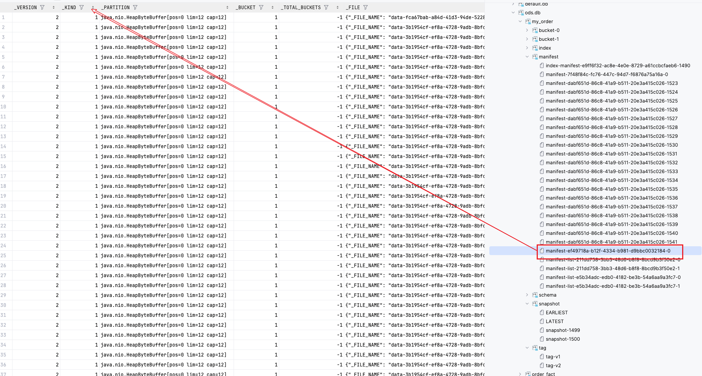
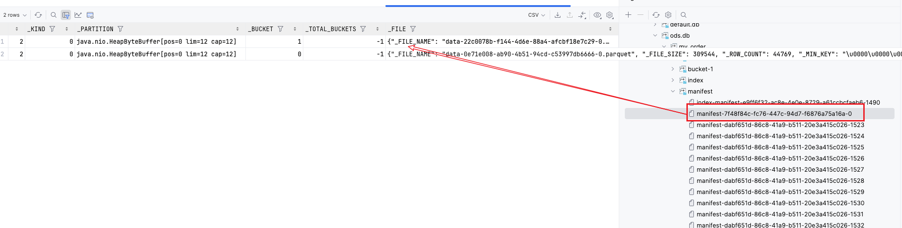

# 

[FlinkDeduplicateExample.java](../flink1.17/src/main/java/com/example/paimon/FlinkDeduplicateExample.java)

## expire_snapshots
run in spark sql:
```shell
update my_order set price=0 where order_id =1;

CALL sys.compact(table => 'my_order');
CALL sys.expire_snapshots(table => 'my_order', retain_max => 3, retain_min=>3, options => 'snapshot.expire.limit=100');
```

expire error:
> CALL sys.expire_snapshots(table => 'my_order', retain_max => 10, retain_min=>5);
```text
25/09/28 12:03:00 ERROR SparkSQLDriver: Failed in [CALL sys.expire_snapshots(table => 'my_order', retain_max => 10, retain_min=>5)]
java.lang.RuntimeException: java.util.concurrent.ExecutionException: java.util.ConcurrentModificationException
	at org.apache.paimon.operation.FileDeletionBase.deleteFiles(FileDeletionBase.java:470)
	at org.apache.paimon.operation.FileDeletionBase.cleanUnusedIndexManifests(FileDeletionBase.java:301)
	at org.apache.paimon.operation.FileDeletionBase.cleanUnusedManifests(FileDeletionBase.java:339)
	at org.apache.paimon.operation.SnapshotDeletion.cleanUnusedManifests(SnapshotDeletion.java:87)
	at org.apache.paimon.table.ExpireSnapshotsImpl.expireUntil(ExpireSnapshotsImpl.java:252)
	at org.apache.paimon.table.ExpireSnapshotsImpl.expire(ExpireSnapshotsImpl.java:132)
	at org.apache.paimon.spark.procedure.ExpireSnapshotsProcedure.lambda$call$0(ExpireSnapshotsProcedure.java:94)
	at org.apache.paimon.spark.procedure.BaseProcedure.execute(BaseProcedure.java:89)
	at org.apache.paimon.spark.procedure.BaseProcedure.modifyPaimonTable(BaseProcedure.java:79)
	at org.apache.paimon.spark.procedure.ExpireSnapshotsProcedure.call(ExpireSnapshotsProcedure.java:82)
	at org.apache.paimon.spark.execution.PaimonCallExec.run(PaimonCallExec.scala:32)
	at org.apache.spark.sql.execution.datasources.v2.V2CommandExec.result$lzycompute(V2CommandExec.scala:43)
	at org.apache.spark.sql.execution.datasources.v2.V2CommandExec.result(V2CommandExec.scala:43)
	at org.apache.spark.sql.execution.datasources.v2.V2CommandExec.executeCollect(V2CommandExec.scala:49)
	at org.apache.spark.sql.execution.QueryExecution$$anonfun$eagerlyExecuteCommands$1.$anonfun$applyOrElse$1(QueryExecution.scala:107)
	at org.apache.spark.sql.execution.SQLExecution$.$anonfun$withNewExecutionId$6(SQLExecution.scala:125)
	at org.apache.spark.sql.execution.SQLExecution$.withSQLConfPropagated(SQLExecution.scala:201)
	at org.apache.spark.sql.execution.SQLExecution$.$anonfun$withNewExecutionId$1(SQLExecution.scala:108)
	at org.apache.spark.sql.SparkSession.withActive(SparkSession.scala:900)
	at org.apache.spark.sql.execution.SQLExecution$.withNewExecutionId(SQLExecution.scala:66)
	at org.apache.spark.sql.execution.QueryExecution$$anonfun$eagerlyExecuteCommands$1.applyOrElse(QueryExecution.scala:107)
	at org.apache.spark.sql.execution.QueryExecution$$anonfun$eagerlyExecuteCommands$1.applyOrElse(QueryExecution.scala:98)
	at org.apache.spark.sql.catalyst.trees.TreeNode.$anonfun$transformDownWithPruning$1(TreeNode.scala:461)
	at org.apache.spark.sql.catalyst.trees.CurrentOrigin$.withOrigin(origin.scala:76)
	at org.apache.spark.sql.catalyst.trees.TreeNode.transformDownWithPruning(TreeNode.scala:461)
	at org.apache.spark.sql.catalyst.plans.logical.LogicalPlan.org$apache$spark$sql$catalyst$plans$logical$AnalysisHelper$$super$transformDownWithPruning(LogicalPlan.scala:32)
	at org.apache.spark.sql.catalyst.plans.logical.AnalysisHelper.transformDownWithPruning(AnalysisHelper.scala:267)
	at org.apache.spark.sql.catalyst.plans.logical.AnalysisHelper.transformDownWithPruning$(AnalysisHelper.scala:263)
	at org.apache.spark.sql.catalyst.plans.logical.LogicalPlan.transformDownWithPruning(LogicalPlan.scala:32)
	at org.apache.spark.sql.catalyst.plans.logical.LogicalPlan.transformDownWithPruning(LogicalPlan.scala:32)
	at org.apache.spark.sql.catalyst.trees.TreeNode.transformDown(TreeNode.scala:437)
	at org.apache.spark.sql.execution.QueryExecution.eagerlyExecuteCommands(QueryExecution.scala:98)
	at org.apache.spark.sql.execution.QueryExecution.commandExecuted$lzycompute(QueryExecution.scala:85)
	at org.apache.spark.sql.execution.QueryExecution.commandExecuted(QueryExecution.scala:83)
	at org.apache.spark.sql.Dataset.<init>(Dataset.scala:220)
	at org.apache.spark.sql.Dataset$.$anonfun$ofRows$2(Dataset.scala:100)
	at org.apache.spark.sql.SparkSession.withActive(SparkSession.scala:900)
	at org.apache.spark.sql.Dataset$.ofRows(Dataset.scala:97)
	at org.apache.spark.sql.SparkSession.$anonfun$sql$4(SparkSession.scala:691)
	at org.apache.spark.sql.SparkSession.withActive(SparkSession.scala:900)
	at org.apache.spark.sql.SparkSession.sql(SparkSession.scala:682)
	at org.apache.spark.sql.SparkSession.sql(SparkSession.scala:713)
	at org.apache.spark.sql.SparkSession.sql(SparkSession.scala:744)
	at org.apache.spark.sql.SQLContext.sql(SQLContext.scala:651)
	at org.apache.spark.sql.hive.thriftserver.SparkSQLDriver.run(SparkSQLDriver.scala:68)
	at org.apache.spark.sql.hive.thriftserver.SparkSQLCLIDriver.processCmd(SparkSQLCLIDriver.scala:501)
	at org.apache.spark.sql.hive.thriftserver.SparkSQLCLIDriver.$anonfun$processLine$1(SparkSQLCLIDriver.scala:619)
	at org.apache.spark.sql.hive.thriftserver.SparkSQLCLIDriver.$anonfun$processLine$1$adapted(SparkSQLCLIDriver.scala:613)
	at scala.collection.Iterator.foreach(Iterator.scala:943)
	at scala.collection.Iterator.foreach$(Iterator.scala:943)
	at scala.collection.AbstractIterator.foreach(Iterator.scala:1431)
	at scala.collection.IterableLike.foreach(IterableLike.scala:74)
	at scala.collection.IterableLike.foreach$(IterableLike.scala:73)
	at scala.collection.AbstractIterable.foreach(Iterable.scala:56)
	at org.apache.spark.sql.hive.thriftserver.SparkSQLCLIDriver.processLine(SparkSQLCLIDriver.scala:613)
	at org.apache.spark.sql.hive.thriftserver.SparkSQLCLIDriver$.main(SparkSQLCLIDriver.scala:310)
	at org.apache.spark.sql.hive.thriftserver.SparkSQLCLIDriver.main(SparkSQLCLIDriver.scala)
	at java.base/jdk.internal.reflect.NativeMethodAccessorImpl.invoke0(Native Method)
	at java.base/jdk.internal.reflect.NativeMethodAccessorImpl.invoke(Unknown Source)
	at java.base/jdk.internal.reflect.DelegatingMethodAccessorImpl.invoke(Unknown Source)
	at java.base/java.lang.reflect.Method.invoke(Unknown Source)
	at org.apache.spark.deploy.JavaMainApplication.start(SparkApplication.scala:52)
	at org.apache.spark.deploy.SparkSubmit.org$apache$spark$deploy$SparkSubmit$$runMain(SparkSubmit.scala:1034)
	at org.apache.spark.deploy.SparkSubmit.doRunMain$1(SparkSubmit.scala:199)
	at org.apache.spark.deploy.SparkSubmit.submit(SparkSubmit.scala:222)
	at org.apache.spark.deploy.SparkSubmit.doSubmit(SparkSubmit.scala:91)
	at org.apache.spark.deploy.SparkSubmit$$anon$2.doSubmit(SparkSubmit.scala:1125)
	at org.apache.spark.deploy.SparkSubmit$.main(SparkSubmit.scala:1134)
	at org.apache.spark.deploy.SparkSubmit.main(SparkSubmit.scala)
```

## compact_manifest
compact_manifest 会清理掉一些manifest文件中没有必要的data file record:
> CALL sys.compact_manifest(`table` => 'my_order')
before compact_manifest, manifest file is large with many deleted data files


after compact_manifest, manifest file is small, only contain necessary data files



## tag
```sql
CALL sys.delete_tag(table => 'my_order', tag => 'v1');
```
会删除过期的manifest files and data files
