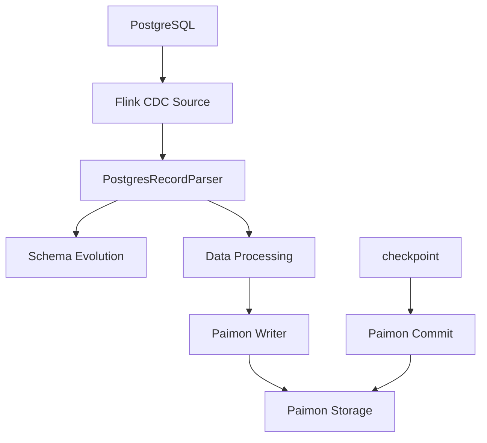

# Flink 1.17 + Paimon CDC 源码深入剖析

## 主流程概览

### 1. Source 阶段 (数据读取)
```
SourceOperatorStreamTask (Flink)
└── SourceOperator.initReader()
    └── PostgresSourceReader (Flink CDC)
        └── IncrementalSourceRecordEmitter.processElement()
            ├── emit DataChangeRecord 
            ├── emit SchemaChangeEvent
            └── emit Watermark
```

**关键步骤**:
- `processElement`: `DataChangeRecord` → `CdcSourceRecord`
- `SourceOutputWithWatermarks` will enrich the record with watermark and timestamp

### 2. Parse 阶段 (数据解析) in SourceOperatorStreamTask
```
StreamFlatMap.processElement() (Flink)
└── PostgresRecordParser.flatMap() → extractRecords() (Paimon)
    └── TimestampedCollector (Flink)
        ├── CdcParsingProcessFunction 
        |     → output SchemaChange by tag
        |     → output CdcRecord
        └── UpdatedDataFieldsProcessFunction → applySchemaChange Schema Evolution
```

### 3. Write 阶段 (数据写入)
```
OneInputStreamTask (Flink)
└── CdcRecordStoreWriteOperator (Paimon)
    └── write(StoreSinkWriteImpl)
        └── 数据写入 Paimon 存储
```

### 4. Commit 阶段 (事务提交)
```
SubtaskCheckpointCoordinator (Flink)
└── checkpointState()
    └── CommitterOperator
        └── SinkWriterOperator
            └── 提交事务和元数据
```

### 流程图



https://paimon.apache.org/docs/master/learn-paimon/understand-files/#flink-stream-write


Changelog Producer:
None: 不查找旧值，不写changelog，适用于批作业，
Input: 不查找旧值, binlog CDC


## References
- [Row tracking Deepdive.md](row-tracking-deepdive.md)
- lucid: Flink/Paimon CDC
- [PIP-34: Introduce Row Lineage for Paimon Append Table](https://cwiki.apache.org/confluence/pages/viewpage.action?pageId=373886618&spaceEditingRestriction=true)
        

