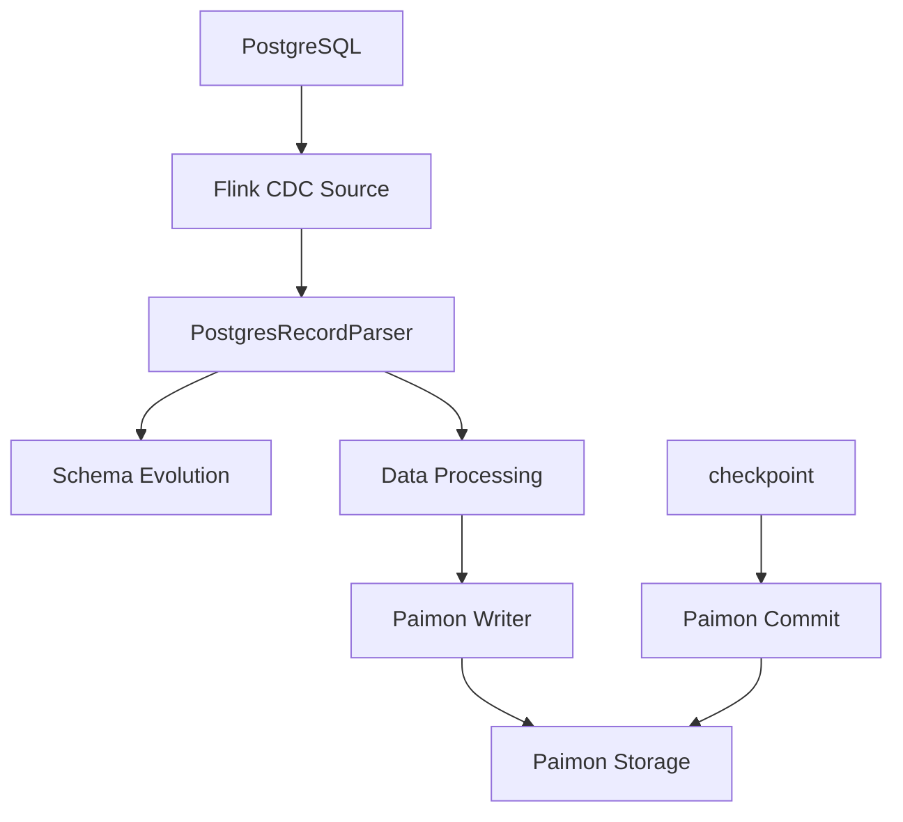

# Flink 1.17 + Paimon CDC 源码深入剖析

## 主流程概览

### 1. Source 阶段 (数据读取)
```
SourceOperatorStreamTask (Flink)
└── SourceOperator.initReader()
    └── PostgresSourceReader (Flink CDC)
        └── IncrementalSourceRecordEmitter.processElement()
            ├── emit DataChangeRecord 
            ├── emit SchemaChangeEvent
            └── emit Watermark
```

**关键步骤**:
- `processElement`: `DataChangeRecord` → `CdcSourceRecord`
- `SourceOutputWithWatermarks` will enrich the record with watermark and timestamp

### 2. Parse 阶段 (数据解析) in SourceOperatorStreamTask
```
StreamFlatMap.processElement() (Flink)
└── PostgresRecordParser.flatMap() → extractRecords() (Paimon)
    └── TimestampedCollector (Flink)
        ├── CdcParsingProcessFunction 
        |     → output SchemaChange by tag
        |     → output CdcRecord
        └── UpdatedDataFieldsProcessFunction → applySchemaChange Schema Evolution
```

### 3. Write 阶段 (数据写入)
```
OneInputStreamTask (Flink)
└── CdcRecordStoreWriteOperator (Paimon)
    └── write(StoreSinkWriteImpl)
        └── 数据写入 Paimon 存储
```

### 4. Commit 阶段 (事务提交)
```
SubtaskCheckpointCoordinator (Flink)
└── checkpointState()
    └── CommitterOperator
        └── SinkWriterOperator
            └── 提交事务和元数据
```

### 流程图



https://paimon.apache.org/docs/master/learn-paimon/understand-files/#flink-stream-write


TODO:

https://paimon.apache.org/docs/master/append-table/streaming/#bucketed-append 中的
'precommit-compact' = 'false'


'sink.rolling-policy.file-size' = '1MB',
'sink.rolling-policy.rollover-interval' = '1 min',
'sink.rolling-policy.check-interval' = '10 s'


Changelog Producer:
None: 不查找旧值，不写changelog，适用于批作业，
Input: 不查找旧值, binlog CDC


## Row tracking Deepdive

```sql
CREATE TABLE t (id INT, data STRING) WITH ('bucket' = '-1', 'row-tracking.enabled' = 'true');
INSERT INTO t VALUES (1, 'a'), (2, 'b');
INSERT INTO t VALUES (3, 'c');
INSERT INTO t VALUES (4, 'd');
INSERT INTO t VALUES (5, 'e');
INSERT INTO t VALUES (6, 'f'), (7, 'g');

SELECT * FROM t$row_lineage;
SELECT * FROM t$files;
```

sparksql
[Spark Paimon](spark3.5.5/README.md)

batch:
```text
SinkTransformation{id=5, name='end', outputType=CommittableTypeInfo, parallelism=1}
    sink=DiscardingSink
    input=OneInputTransformation{id=4, name='Global Committer : xxx', outputType=CommittableTypeInfo, parallelism=1}
            operatorFactory=CommitterOperatorFactory[operator=CommitterOperator, committerFactory=FlinkWriteSink.createCommitterFactory] 
            input=OneInputTransformation{id=3, name='Writer : xxx', outputType=CommittableTypeInfo, parallelism=1}
                    operatorFactory=RowAppendTableSink.createWriteOperatorFactory[operator=RowDataStoreWriteOperator]
                    input=OneInputTransformation{id=2, name='Map', parallelism=1}
                            operatorFactory=SimpleUdfStreamOperatorFactory[operator=StreamMap]
                            input=LegacySourceTransformation{id=1, name='Values[1]', outputType=ROW<`EXPR$0` INT NOT NULL, `EXPR$1` CHAR(3) NOT NULL>(org.apache.flink.table.data.RowData, org.apache.flink.table.runtime.typeutils.RowDataSerializer), parallelism=1}
                                    operatorFactory=SimpleInputFormatOperatorFactory[operator=StreamSource]

TableEnvironmentImpl.executeSql
    ->ParserImpl.parse
        ->FlinkCatalog.getTable
            ->FileStoreTableFactory.create
                ->FileStoreTableFactory.createWithoutFallbackBranch
                    ->AppendOnlyFileStoreTable
```


stream, row-tracking.enabled=true
[FlinkRowTrackingExample.java](flink1.17-paimon1.3-example/src/main/java/com/example/paimon/FlinkRowTrackingExample.java)


```text
SinkTransformation{id=9, name='end', outputType=CommittableTypeInfo, parallelism=1}
    operatorFactory=CommitterOperatorFactory[operator=CommitterOperator, committerFactory=FlinkWriteSink.createCommitterFactory]
    OneInputTransformation{id=8, name='Global Committer : my_order', outputType=CommittableTypeInfo, parallelism=1}
        operatorFactory=AppendBypassCompactWorkerOperator.Factory[table=AppendOnlyFileStoreTable, chainingStrategy=HEAD]
        OneInputTransformation{id=7, name='Compact Worker: my_order', outputType=CommittableTypeInfo, parallelism=2}
            operatorFactory=AppendBypassCoordinateOperatorFactory[table=AppendOnlyFileStoreTable]
            OneInputTransformation{id=6, name='Compact Coordinator: my_order', outputType=Either <CommittableTypeInfo, CompactionTask>, parallelism=1}
                operatorFactory=RowAppendTableSink.createWriteOperatorFactory[operator=RowDataStoreWriteOperator, chainingStrategy=HEAD]
                OneInputTransformation{id=5, name='Writer : my_order', outputType=CommittableTypeInfo, parallelism=2}
                    operatorFactory=SimpleUdfStreamOperatorFactory[operator=StreamMap]
                    OneInputTransformation{id=4, name='Map', outputType=InternalTypeInfo{serializer=org.apache.paimon.flink.utils.InternalRowTypeSerializer@2e96ebf9}, parallelism=2}
                        operatorFactory=SimpleOperatorFactory[operator=StreamRecordTimestampInserter]
                        OneInputTransformation{id=3, name='StreamRecordTimestampInserter[3]', outputType=ROW<`order_id` BIGINT, `price` DECIMAL(32, 2), `ts` TIMESTAMP(3) *ROWTIME*>(org.apache.flink.table.data.RowData, org.apache.flink.table.runtime.typeutils.RowDataSerializer), parallelism=2}
                            OneInputTransformation{id=2, name='WatermarkAssigner[2]', outputType=ROW<`order_id` BIGINT, `price` DECIMAL(32, 2), `ts` TIMESTAMP(3) *ROWTIME*>(org.apache.flink.table.data.RowData, org.apache.flink.table.runtime.typeutils.RowDataSerializer), parallelism=2}
                                operatorFactory=WatermarkAssignerOperatorFactory
                                LegacySourceTransformation{id=1, name='src_order[1]', outputType=ROW<`order_id` BIGINT, `price` DECIMAL(32, 2), `ts` TIMESTAMP(3)>(org.apache.flink.table.data.RowData, org.apache.flink.table.runtime.typeutils.RowDataSerializer), parallelism=2}
                                    operatorFactory=SimpleUdfStreamOperatorFactory[operator=StreamSource[userFunction=DataGeneratorSource[generator=RowDataGenrator]], chainingStrategy=HEAD]


StreamPlanner.translate
    ->translateToRel->getTableSink: org.apache.paimon.flink.FlinkTableFactory
        ->createDynamicTableSink->createDynamicTableSink->FlinkTableSink 
    ->StreamExecSink.translateToPlan -> translateToPlanInternal -> createSinkTransformation
        ->FlinkTableSink.getSinkRuntimeProvider
        ->CommonExecSink.applySinkProvider
            ->PaimonDataStreamSinkProvider.consumeDataStream(producer=FlinkTableSinkBase.getSinkRuntimeProvider#consumeDataStream)
                ->FlinkSinkBuilder.buildUnawareBucketSink
                    ->RowAppendTableSink: AppendTableSink -> sinkFrom
                        ->doWrite 
                            ->create AppendBypassCoordinateOperatorFactory --> AppendBypassCoordinateOperator
                            ->create AppendBypassCompactWorkerOperator.Factory --> AppendBypassCompactWorkerOperator
                        ->doCommit ->create DataStreamSink
                        

Write data:
    RowDataStoreWriteOperator
        StoreSinkWriteImpl.write
            AppendFileStoreWrite.write
                RowDataRollingFileWriter.write

flush to new file when checkpoint:
SubtaskCheckpointCoordinatorImpl.checkpointState(1/2)
    ->RegularOperatorChain.prepareSnapshotPreBarrier
        ->RowDataStoreWriteOperator.prepareSnapshotPreBarrier
        ->RowDataStoreWriteOperator.emitCommittables
            ->prepareCommit
                ->StoreSinkWriteImpl.prepareCommit
                    ->TableWriteImpl.prepareCommit
                        ->AppendFileStoreWrite.prepareCommit
                            ->AppendOnlyWriter.prepareCommit->flush
        ->collect Committable==>AppendBypassCoordinateOperator(left event)==>AppendBypassCompactWorkerOperator==>CommitterOperator

生成AppendCompactTask
AppendBypassCoordinateOperator(1/1) 
    ->AppendCompactCoordinator

运行AppendCompactTask
AppendBypassCompactWorkerOperator(1/2)
    ->processElement
        ->AppendTableCompactor
            ->AppendCompactTask.doCompact
       
CommitterOperator(1/1)
    ->processElement(just add to input list)
        ->snapshotState->pollInputs(precommit add manifest)
        
```


## References
- lucid: Flink/Paimon CDC
        

