# Deployment

## Mode

| 特性            | Session Mode | ~~Per-Job Mode~~ (deprecated) | Application Mode        |
|---------------|--------------|-------------------------------|-------------------------|
| 集群生命周期        | 独立于作业        | 绑定到单个作业                       | 绑定到单个应用程序               |
| 资源隔离          | 弱（共享）        | 强（独占）                         | 强（独占）                   |
| `main()` 执行位置 | 客户端          | 客户端                           | 集群（JobManager）          |
| YARN 支持       | ✅            | ✅                             | ✅                       |
| Kubernetes 支持 | ✅            | ❌                             | ✅                       |
| 适用场景          | 开发/测试、多作业共享  | 生产环境、强隔离需求                    | 生产环境、强隔离 + main() 在集群执行 |

* Application Mode： 当整个 Application 的 main() 方法执行完毕（所有 Job 完成或因异常结束）时，YARN Application 才会被销毁。
    * `main()` 执行位置: 在集群上执行（在 JobManager 上），减少了客户端压力，是生产环境推荐的模式。
* Session Mode：先启动一个长期运行的 Flink 集群（Session Cluster），然后将多个作业提交到这个共享集群
    * 多个作业共享同一套 TaskManager 资源，彼此之间可能存在资源竞争。如果一个作业导致 TaskManager 崩溃，可能会影响其他在该
      TaskManager 上运行的作业。
* ~~Per-Job Mode~~ (deprecated)：当单个 Job 执行完毕（成功、失败或被取消）时，整个 YARN Application (包括 JobManager 和
  TaskManagers) 会被销毁。
    * 客户端负责解析 JobGraph，然后提交到集群执行，增加了客户端压力。

### Job vs Application

* Job：一个 Job 代表一个具体的、正在运行的 Flink 程序实例。它是由用户定义的 Flink 代码（如
  StreamExecutionEnvironment.execute() 生成的可执行数据流图（JobGraph）。
    * 一个 Job 由多个 Operator（算子，如 Source, Map, Sink）和它们之间的数据流（Edges）组成，这些 Operator 会被分配到
      TaskManager 的 Task Slots 中执行。
* Application ：可能包含多个 Job，或者 main() 方法中需要执行一些必须在集群端进行的初始化操作。

# Application Mode

1. Client 执行 `bin/flink run-application` 命令，启动 JVM 进程
2. CliFrontend 进程启动之后，通过向 kubernetes 提交 Job Manager 的 Deployment（申请 pod）
3. 申请到 pod 之后 通过脚本（`kubernetes-jobmanager.sh`） 启动 JobManager
4. 创建 ResourceManager：负责资源的分配与释放，以及资源状态的管理 
5. 创建 Dispatcher，调用 PackagedProgram 加载用户 JAR 和主类，生成 JobGraph
6. 创建并启动 JobMaster、持久化作业元数据
7. JobMaster 通过 DefaultScheduler 调度 JobGraph 作业，需要的 slots 提交 ResourceManager。
8. ResourceManager 接收到 Slot 申请后，如果资源不足 创建新的 TaskExecutor pod（`kubernetes-taskmanager.sh`）
9. TaskExecutor 启动后向 ResourceManager 注册自己
10. TaskExecutor 向 ResourceManager 详细报告其当前所有 Slot 的状态和资源详情
11. ResourceManager 基于 SlotReport 感知到空闲 Slot 后，通知 JobMaster（`allocateSlot` -> `TaskExecutor.requestSlot` -> `JobMaster.offerSlots`）
12. JobMaster 的 DefaultScheduler 申请到 slot 之后，继续 `deployAll`，进而 submitTask 到 TaskExecutor
13. TaskExecutor 接收到 Task 后，启动 Task 执行逻辑，作业正式开始运行；

## Client

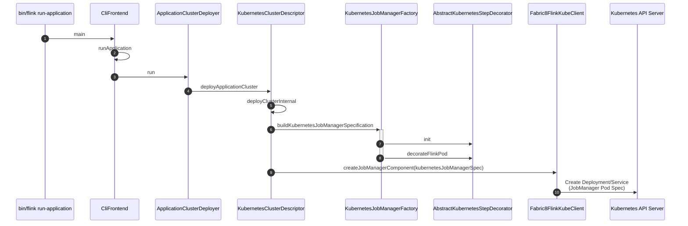
```mermaid
sequenceDiagram
    autonumber
    participant shell as bin/flink run-application
    participant CliFrontend
    shell ->> CliFrontend: main
    CliFrontend ->> CliFrontend: runApplication
    CliFrontend ->> ApplicationClusterDeployer: run
    ApplicationClusterDeployer ->> KubernetesClusterDescriptor: deployApplicationCluster
    KubernetesClusterDescriptor ->> KubernetesClusterDescriptor: deployClusterInternal
    KubernetesClusterDescriptor ->> + KubernetesJobManagerFactory: buildKubernetesJobManagerSpecification
    KubernetesJobManagerFactory ->> AbstractKubernetesStepDecorator: init
    KubernetesJobManagerFactory ->> AbstractKubernetesStepDecorator: decorateFlinkPod
    deactivate KubernetesJobManagerFactory
    KubernetesClusterDescriptor ->> Fabric8FlinkKubeClient: createJobManagerComponent(kubernetesJobManagerSpec)
    Fabric8FlinkKubeClient ->> Kubernetes API Server: Create Deployment/Service <br/>(JobManager Pod Spec)
```

### CliFrontend

Flink 命令行客户端 (flink 命令) 的核心入口点，负责解析用户输入的命令和参数，
将用户请求转换为向 Kubernetes API Server 发送创建资源的请求：创建 JobManager 的 Deployment。

### AbstractKubernetesStepDecorator

Flink Kubernetes 集成中用于装饰和修改 Kubernetes 资源定义（如 Pod、Deployment、Service、Secret等）的抽象基类

- InitJobManagerDecorator
- EnvSecretsDecorator
- MountSecretsDecorator
- CmdJobManagerDecorator: CMD kubernetes-jobmanager.sh -> flink-console.sh KubernetesApplicationClusterEntrypoint
- InternalServiceDecorator：headless service
- ExternalServiceDecorator：expose the rest port of the Flink JobManager

## JobManager

负责协调和管理整个集群的资源、接收作业提交、调度和监控具体作业的执行。

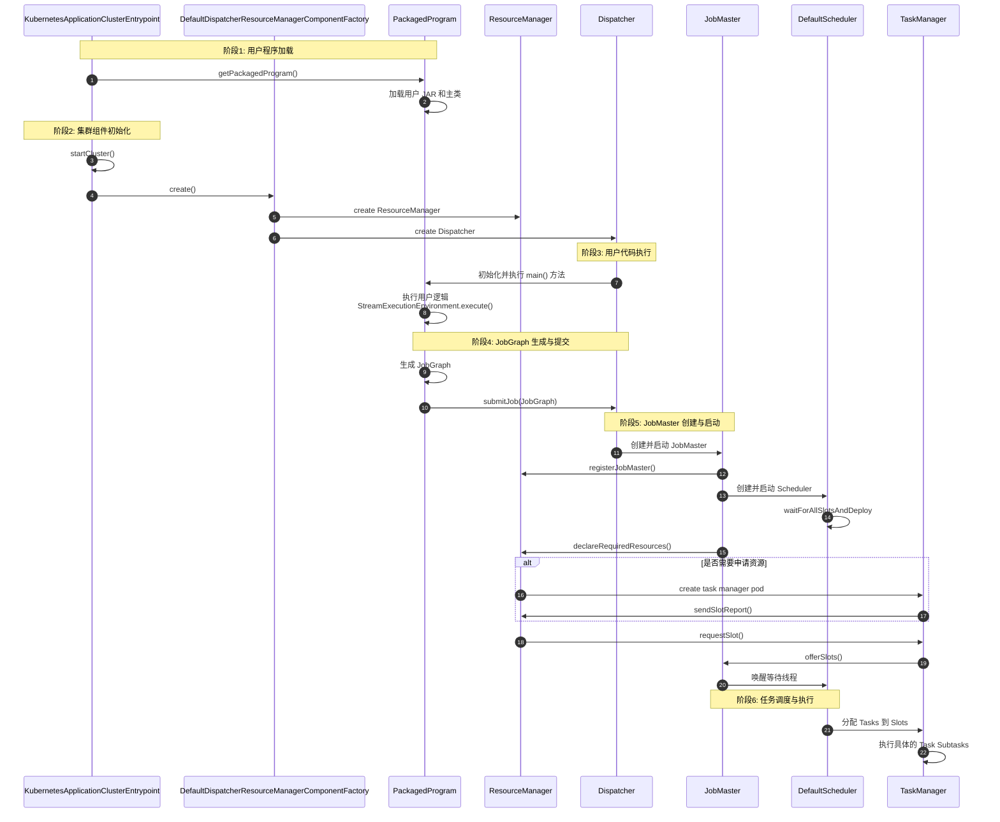
```mermaid
 sequenceDiagram
    autonumber
    participant ClusterEntrypoint as KubernetesApplicationClusterEntrypoint
    participant DefaultDispatcherResourceManagerComponentFactory
    participant PackagedProgram
    participant ResourceManager
    participant Dispatcher
    participant JobMaster
    participant DefaultScheduler
    participant TaskManager
    Note over ClusterEntrypoint, PackagedProgram: 阶段1: 用户程序加载
    ClusterEntrypoint ->> PackagedProgram: getPackagedProgram()
    PackagedProgram ->> PackagedProgram: 加载用户 JAR 和主类
    Note over ClusterEntrypoint, ClusterEntrypoint: 阶段2: 集群组件初始化
    ClusterEntrypoint ->> ClusterEntrypoint: startCluster()
    ClusterEntrypoint ->> DefaultDispatcherResourceManagerComponentFactory: create()
    DefaultDispatcherResourceManagerComponentFactory ->> ResourceManager: create ResourceManager
    DefaultDispatcherResourceManagerComponentFactory ->> Dispatcher: create Dispatcher
    Note over Dispatcher, Dispatcher: 阶段3: 用户代码执行
    Dispatcher ->> PackagedProgram: 初始化并执行 main() 方法
    PackagedProgram ->> PackagedProgram: 执行用户逻辑<br/>StreamExecutionEnvironment.execute()
    Note over PackagedProgram, Dispatcher: 阶段4: JobGraph 生成与提交
    PackagedProgram ->> PackagedProgram: 生成 JobGraph
    PackagedProgram ->> Dispatcher: submitJob(JobGraph)
    Note over Dispatcher, JobMaster: 阶段5: JobMaster 创建与启动
    Dispatcher ->> JobMaster: 创建并启动 JobMaster
    JobMaster ->> ResourceManager: registerJobMaster()
    JobMaster ->> DefaultScheduler: 创建并启动 Scheduler
    DefaultScheduler ->> DefaultScheduler: waitForAllSlotsAndDeploy
    JobMaster ->> ResourceManager: declareRequiredResources()
    alt 是否需要申请资源
        ResourceManager ->> TaskManager: create task manager pod
        TaskManager ->> ResourceManager: sendSlotReport()
    end
    ResourceManager ->> TaskManager: requestSlot()
    TaskManager ->> JobMaster: offerSlots()
    JobMaster ->> DefaultScheduler: 唤醒等待线程
    Note over JobMaster, DefaultScheduler: 阶段6: 任务调度与执行
    DefaultScheduler ->> TaskManager: 分配 Tasks 到 Slots
    TaskManager ->> TaskManager: 执行具体的 Task Subtasks
```

### KubernetesApplicationClusterEntrypoint

Application Mode 下 JobManager Pod 启动时执行的主类入口点，它负责初始化 Flink 运行时环境，并在集群环境中执行用户应用程序的
main() 方法。

### ResourceManager

全局资源管理者，负责注册和管理所有 TaskExecutor，维护 Slot 池，为 JobMaster 分配计算资源。

- registerJobMaster
    - Register a JobMaster at the resource manager.
- heartbeatFromJobManager
    - ResourceManager 和 JobMaster 运行在同一个 JVM 进程内，RPC 框架提供了异步、非阻塞的通信能力，即使在同一进程内，也能更好地处理并发请求和解耦组件
- registerTaskExecutor
    - 加入到 ResourceManager 的管理列表中，后续 TaskExecutor 会定期向 ResourceManager 发送心跳
- heartbeatFromTaskManager
- sendSlotReport
    - TaskExecutor 在向 ResourceManager 注册成功后，会发送一个初始的 SlotReport，让 ResourceManager
      知道它有哪些资源。（主要逻辑见 [FineGrainedSlotManager.registertaskmanager](deployment.md#registertaskmanager)）
- declareRequiredResources: Declares the absolute resource requirements for a job.
    - will call [FineGrainedSlotManager.processResourceRequirements](deployment.md#processresourcerequirements) 处理 Job
      的资源需求声明

#### TaskManagerTracker

Tracks TaskManager's resource and slot status.

#### DefaultResourceTracker

Tracks for each job how many resource are required/acquired.

#### FineGrainedSlotManager

ResourceManager 中负责管理所有 TaskExecutor 的 Slot 生命周期、跟踪 Job 的资源需求并执行细粒度资源分配与调度。

- ##### registerTaskManager
  Registers a new task manager at the slot manager. This will make the task managers slots available for
  allocation.（使其被纳入集群的资源管理和任务调度范围）
    ```mermaid
    sequenceDiagram
        autonumber
        participant JobMaster
        participant TE as TaskExecutor
        participant RM as ResourceManager
        participant SM as FineGrainedSlotManager
        participant SS as SlotStatusSyncer
        participant TM as TaskManagerTracker
        Note over TE, TM: TaskExecutor 注册并发送 SlotReport
        TE ->> RM: [中间步骤略] sendSlotReport()
        Note right of TE: RPC 调用，发送所有 Slot 状态
        Note over RM, SM: ResourceManager 处理 SlotReport
        RM ->> SM: ⭐ registerTaskManager()
        Note over SM, SM: SlotManager 注册 TaskManager
        SM ->> SM: 检查 TaskManager 是否已注册
        alt 已注册
            SM ->> SM: reportSlotStatus(instanceId, slotReport)
            SM -->> RM: RegistrationResult.IGNORED
        else 首次注册
            SM ->> TM: addTaskManager(slotReport)
            TM ->> TM: 创建 TaskManagerInfo
            TM ->> TM: 解析 SlotReport，记录所有 Slot 状态
            Note over SM, SS: 分配 Slot
            SM ->> + SM: checkResourceRequirementsWithDelay()
            SM ->> + SM: checkResourceRequirements()
            SM ->> + SM: allocateSlotsAccordingTo()
            loop allocate slot for Job
                SM ->> SS: slotStatusSyncer.allocateSlot(resourceProfile)
                Note over SS, SS: 阶段6: SlotStatusSyncer 准备分配
                SS ->> SS: 生成新的 AllocationID
                SS ->> TM: notifySlotStatus(PENDING)
                SS ->> SS: pendingSlotAllocations.add(allocationID)
                Note over SS, TE: 调用 TaskExecutor.requestSlot
                SS ->>+ TE: gateway.requestSlot()
                Note right of SS: RPC 调用，请求分配 Slot
                TE ->> TE: allocateSlotForJob()
                TE ->> TE: allocateSlot(slotID, jobID, allocationID)
                TE ->> TE: taskSlotTable.allocateSlot()<br/>标记 Slot 为 ALLOCATED
                TE ->>- TE: offerSlotsToJobManager()
                TE ->> JobMaster: gateway.offerSlots()
                TE -->> SS: CompletableFuture<Acknowledge>
                SS ->> SS: pendingSlotAllocations.remove(allocationID)
                SS ->> TM: notifySlotStatus(ALLOCATED)
                SS -->> SM: CompletableFuture<Void>.complete(null)
            end
            deactivate SM
            deactivate SM
            deactivate SM
            SM -->> RM: RegistrationResult.SUCCESS
        end
    ```
- ##### processResourceRequirements
  处理 Job 的资源需求声明，根据 ResourceRequirement 查找可用的 Slot，`requestSlot` requests a slot from the TaskManager.
    ```mermaid
    sequenceDiagram
      autonumber
      participant JobMaster as JobMaster
      participant ResourceManager as ResourceManager
      participant SlotManager as FineGrainedSlotManager
      participant KubernetesResourceManagerDriver
      participant KubernetesTaskManagerFactory
      participant Fabric8FlinkKubeClient
      participant TaskExecutor as TaskExecutor
      Note over JobMaster, SlotManager: 阶段1: 声明资源需求
      JobMaster ->> ResourceManager: declareRequiredResources()<br/>[中间过程略]
      ResourceManager ->> SlotManager: processResourceRequirements(resourceRequirements)
      Note over SlotManager, SlotManager: 阶段2: 分析资源需求
      SlotManager ->> SlotManager: checkResourceRequirementsWithDelay()
      SlotManager ->> SlotManager: checkResourceRequirements()
      SlotManager ->> SlotManager: declareNeededResourcesWithDelay()
      SlotManager ->> SlotManager: declareNeededResources()
      SlotManager ->> ResourceManager: declareResourceNeeded(resourceDeclarations)
      Note over ResourceManager, KubernetesResourceManagerDriver: 阶段3: 决定需要多少个 Worker
      ResourceManager ->> ResourceManager: checkResourceDeclarations()
      loop for requestWorkerNumber
          ResourceManager ->>+ ResourceManager: requestNewWorker()
          ResourceManager ->>- KubernetesResourceManagerDriver: Creating new TaskManager pod<br/>requestResource(taskExecutorProcessSpec)
      end
    
      Note over KubernetesResourceManagerDriver, TaskExecutor: 阶段4: 创建 TaskManager Pod
      KubernetesResourceManagerDriver ->> KubernetesTaskManagerFactory: buildTaskManagerKubernetesPod(parameters)
      KubernetesResourceManagerDriver ->> Fabric8FlinkKubeClient: createTaskManagerPod(taskManagerPod)
      Fabric8FlinkKubeClient ->> TaskExecutor: 调用 Kubernetes API<br/>创建 TaskManager Pod
      Note over ResourceManager: 阶段5: TaskExecutor 注册
      TaskExecutor ->> ResourceManager: sendSlotReport()
      TaskExecutor ->> ResourceManager: registerTaskExecutor()
      ResourceManager ->> SlotManager: registerTaskManager()
      ResourceManager ->> JobMaster: 通知有新的 Slot 可用
      JobMaster ->> ResourceManager: 请求分配 Slot
      ResourceManager ->> SlotManager: 分配 Slot
    
    ``` 

### PackagedProgram

#### ApplicationDispatcherBootstrap

A DispatcherBootstrap used for running the user's main() in Application Mode.

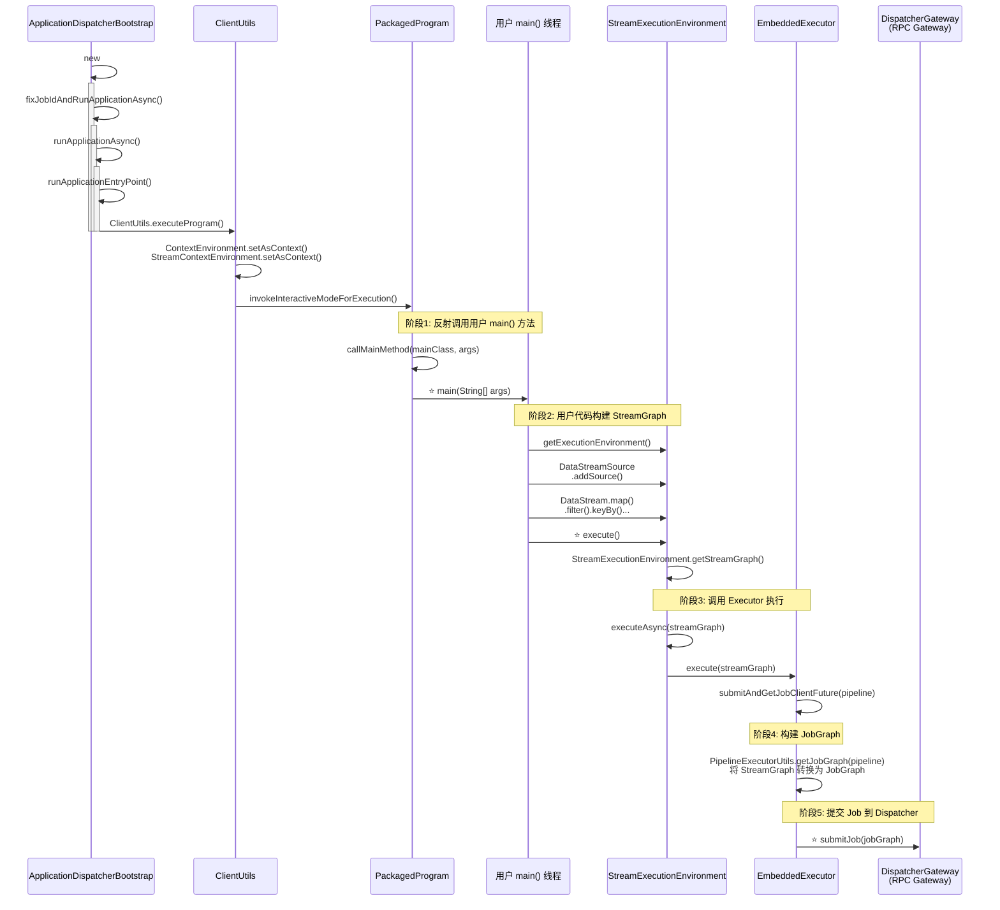
```mermaid
  sequenceDiagram
    participant ADB as ApplicationDispatcherBootstrap
    participant CU as ClientUtils
    participant PP as PackagedProgram
    participant User as 用户 main() 线程
    participant SEE as StreamExecutionEnvironment
    participant EE as EmbeddedExecutor
    participant DG as DispatcherGateway<br/>(RPC Gateway)
    ADB ->> + ADB: new
    ADB ->> ADB: fixJobIdAndRunApplicationAsync()
    activate ADB
    ADB ->> + ADB: runApplicationAsync()
    ADB ->> ADB: runApplicationEntryPoint()
    ADB ->> CU: ClientUtils.executeProgram()
    deactivate ADB
    deactivate ADB
    deactivate ADB
    CU ->> CU: ContextEnvironment.setAsContext()<br/>StreamContextEnvironment.setAsContext()
    CU ->> PP: invokeInteractiveModeForExecution()
    Note over PP, User: 阶段1: 反射调用用户 main() 方法
    PP ->> PP: callMainMethod(mainClass, args)
    PP ->> User: ⭐ main(String[] args)
    Note over User, SEE: 阶段2: 用户代码构建 StreamGraph
    User ->> SEE: getExecutionEnvironment()
    User ->> SEE: DataStreamSource<br/>.addSource()
    User ->> SEE: DataStream.map()<br/>.filter().keyBy()...
    User ->> SEE: ⭐ execute()
    SEE ->> SEE: StreamExecutionEnvironment.getStreamGraph()
    Note over SEE, EE: 阶段3: 调用 Executor 执行
    SEE ->> SEE: executeAsync(streamGraph)
    SEE ->> EE: execute(streamGraph)
    EE ->> EE: submitAndGetJobClientFuture(pipeline)
    Note over EE: 阶段4: 构建 JobGraph
    EE ->> EE: PipelineExecutorUtils.getJobGraph(pipeline)<br/>将 StreamGraph 转换为 JobGraph
    Note over EE, DG: 阶段5: 提交 Job 到 Dispatcher
    EE ->> DG: ⭐ submitJob(jobGraph)
```

### User Operator to ExecutionGraph
用户编写的 Operator（例如 map、flatMap、keyBy、sum 等）通过 DataStream API 被封装为 Transformation，而 StreamGraph 是由这些 Transformation 转换而来的逻辑执行图。

```java
env.setParallelism(2);
env.socketTextStream("localhost", 19999, "\n", 1000)
    .flatMap(new FlatMapFunction<String, Word>() {
        @Override
        public void flatMap(String value, Collector<Word> out) {
            for (String k : value.split("\\s")) {
                if (StringUtils.isNotBlank(k)) {
                    out.collect(new Word(k, 1));
                }
            }
        }
    }).setParallelism(1)
    .keyBy(Word::getKey)
    .sum("cnt")
    .print();
```


#### Transformation
* 用户编写的 Flink operator 时构造 Transformation 注册到 env, 这个过程会形成 Transformation DAG
```text
Transformation DAG:
├── Transformation-1: SourceTransformation [parallelism=1]
│   ↓
├── Transformation-2: OneInputTransformation ('Flat Map') [parallelism=1]
│   ↓   └── Transformation-3: PartitionTransformation ('Partition') [parallelism=1]
├── Transformation-4: ReduceTransformation ('Keyed Aggregation') [parallelism=2]
│   ↓
└── Transformation-5: SinkTransformation ('Print to Std. Out') [parallelism=2]
```
ReduceTransformationTranslator


#### StreamGraph
- 经过 `env.getStreamGraph()` `Transformation` 转换成 `StreamGraph`
- 逻辑计划, 每个 API 算子一个节点，StreamGraph（由 StreamNode + StreamEdge 构成）
```text
StreamGraph:
├── StreamNode-1: SourceFunction
│    └── parallelism = 1
│
├── StreamNode-2: MapFunction
│    └── parallelism = 1
│    └── chained with source
│
├── StreamNode-3: Sum (ReduceFunction)
│    └── parallelism = 2
│    └── 分区器 = HashPartitioner（keyBy 触发）
│
└── StreamNode-4: Sink (PrintSinkFunction)
     └── parallelism = 2
     └── 分区器 = ForwardPartitioner

```

#### JobGraph
- StreamGraph 根据 `PipelineExecutorUtils.getJobGraph(pipeline)` 转换为 JobGraph，优化后的逻辑计划
- operator chain 优化，Flink 会将多个连续的、并行度一致的算子合并成一个 Task：
    - 并行度相同的 Source 与 Map 共享一个slot，即在一个task中运行，sum 和 print 也被放到同一个 slot 中运行
```text
JobGraph:
├── JobVertex-1: Source → Map
│    ├── parallelism = 1
│    ├── operatorIDs: [sourceOp, mapOp]
│    └── output: pipelined, HASH → JobVertex-2
│
└── JobVertex-2: Sum → Print
     ├── parallelism = 2
     ├── operatorIDs: [reduceOp, printSinkOp]
     └── input edge: pipelined, FORWARD
```


#### ExecutionGraph
`SchedulerBase.createAndRestoreExecutionGraph` 会根据 JobGraph 构建 ExecutionGraph，物理执行计划
- 每个 JobVertex 对应一个 ExecutionJobVertex
- 每个 ExecutionJobVertex 包含多个 ExecutionVertex(由 parallelism 决定)
- 每个 ExecutionVertex 对应一个 subtask
```text
DefaultExecutionGraph:
├── ExecutionJobVertex-1: Source + Map
│    └── ExecutionVertex[0]  ← parallelism = 1
│
└── ExecutionJobVertex-2: Sum + Print
     ├── ExecutionVertex[0]  ← subtask-0
     └── ExecutionVertex[1]  ← subtask-1
```

- Slot Sharing Group：这是 Flink 中默认开启的一种资源优化机制，同一个 Slot Sharing Group 的不同任务（Task）共享同一个 Slot，比如
    - JobVertex-1 的 task 与 JobVertex-2 的 task 共享同一个 Slot，所以此任务 tasks 数量为 3，但是 slot 开销为 2
执行计划：每个 subtask 为一节点
  - 不同 Slot Sharing Group 的算子（Operator）根本不会被考虑进行 chain 优化 
  - 如果 JobVertex-1 与 JobVertex-2 设置不同的 group 如下代码，tasks 数量还是 3，slot 开销也变为 3
      ```java
      env.setParallelism(2);
      env.socketTextStream("localhost", 19999, "\n", 1000)
              .slotSharingGroup("g1")
              .flatMap(new FlatMapFunction<String, Word>() {
                  @Override
                  public void flatMap(String value, Collector<Word> out) {
                      String cleanValue = value
                              .replaceAll("[^a-zA-Z0-9\\s]", "")
                              .toLowerCase();
                      for (String k : cleanValue.split("\\s")) {
                          if (StringUtils.isNotBlank(k)) {
                              out.collect(new Word(k, 1));
                          }
                      }
                  }
              }).setParallelism(1)
              .keyBy(Word::getKey)
              .sum("cnt").slotSharingGroup("g2")
              .print();
      ```
- CoLocation 优化：没有改变 Task 的数量和内部逻辑，它只是利用了 Slot Sharing 机制，强制改变了 Task 的物理部署位置
  - 让原本可能分散的 Task “贡献”出 Slot 资源，挤在同一个 Slot 里，从而实现了数据传输的本地化（TODO）


### Dispatcher

作业提交入口和生命周期管理者，负责接收 JobGraph、创建并启动 JobMaster、持久化作业元数据，是客户端与集群的桥梁。

#### submitJob

Submit a job to the dispatcher.

- 启动 Leader Election
- 创建/启动 JobMaster

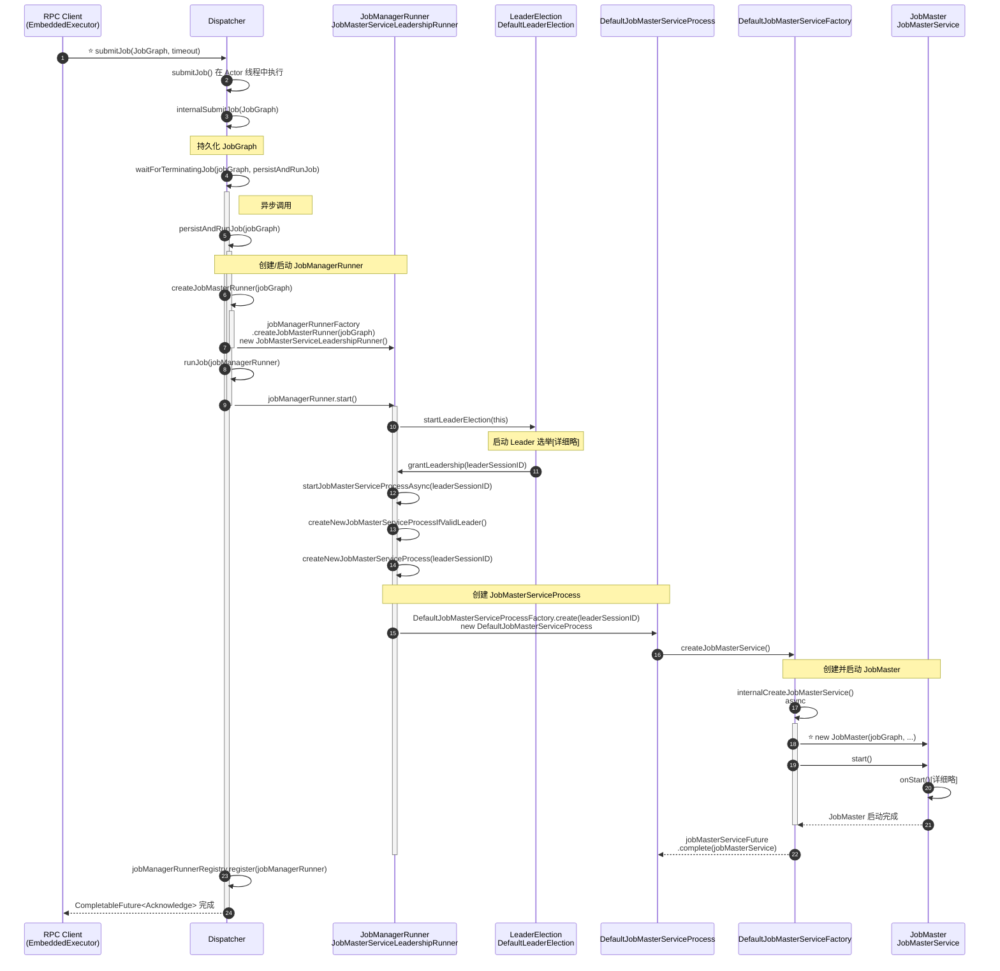
```mermaid
  sequenceDiagram
    autonumber
    participant Client as RPC Client<br/>(EmbeddedExecutor)
    participant Dispatcher as Dispatcher
    participant JMSLR as JobManagerRunner<br/>JobMasterServiceLeadershipRunner
    participant LE as LeaderElection<br/>DefaultLeaderElection
    participant DJMSP as DefaultJobMasterServiceProcess
    participant DJMasterSF as DefaultJobMasterServiceFactory
    participant JM as JobMaster<br/>JobMasterService
    Client ->> Dispatcher: ⭐ submitJob(JobGraph, timeout)
    Dispatcher ->> Dispatcher: submitJob() 在 Actor 线程中执行
    Dispatcher ->> Dispatcher: internalSubmitJob(JobGraph)
    Note over Dispatcher, Dispatcher: 持久化 JobGraph
    Dispatcher ->> + Dispatcher: waitForTerminatingJob(jobGraph, persistAndRunJob)
    Note right of Dispatcher: 异步调用
    Dispatcher ->> + Dispatcher: persistAndRunJob(jobGraph)
    Note over Dispatcher, JMSLR: 创建/启动 JobManagerRunner
    Dispatcher ->> + Dispatcher: createJobMasterRunner(jobGraph)
    Dispatcher ->> - JMSLR: jobManagerRunnerFactory<br/>.createJobMasterRunner(jobGraph)<br/>new JobMasterServiceLeadershipRunner()
    Dispatcher ->> Dispatcher: runJob(jobManagerRunner)
    Dispatcher ->> - JMSLR: jobManagerRunner.start()
    activate JMSLR
    JMSLR ->> LE: startLeaderElection(this)
    Note over LE: 启动 Leader 选举[详细略]
    LE ->> JMSLR: grantLeadership(leaderSessionID)
    JMSLR ->> JMSLR: startJobMasterServiceProcessAsync(leaderSessionID)
    JMSLR ->> JMSLR: createNewJobMasterServiceProcessIfValidLeader()
    JMSLR ->> JMSLR: createNewJobMasterServiceProcess(leaderSessionID)
    Note over JMSLR, DJMSP: 创建 JobMasterServiceProcess
    JMSLR ->> DJMSP: DefaultJobMasterServiceProcessFactory.create(leaderSessionID)<br/> new DefaultJobMasterServiceProcess
    DJMSP ->> DJMasterSF: createJobMasterService()
    Note over DJMasterSF, JM: 创建并启动 JobMaster
    DJMasterSF ->> + DJMasterSF: internalCreateJobMasterService()<br/>async
    DJMasterSF ->> JM: ⭐ new JobMaster(jobGraph, ...)
    DJMasterSF ->> JM: start()
    JM ->> JM: onStart()[详细略]
    JM -->> DJMasterSF: JobMaster 启动完成
    deactivate DJMasterSF
    DJMasterSF -->> DJMSP: jobMasterServiceFuture<br/>.complete(jobMasterService)
    deactivate JMSLR
    Dispatcher ->> Dispatcher: jobManagerRunnerRegistry.register(jobManagerRunner)
    Dispatcher -->> - Client: CompletableFuture<Acknowledge> 完成
```

#### LeaderElectionDriver

Leader
选举详情: [KubernetesLeaderElectorExample.java](../../kubernetes/fabric8-example/src/main/java/KubernetesLeaderElectorExample.java)

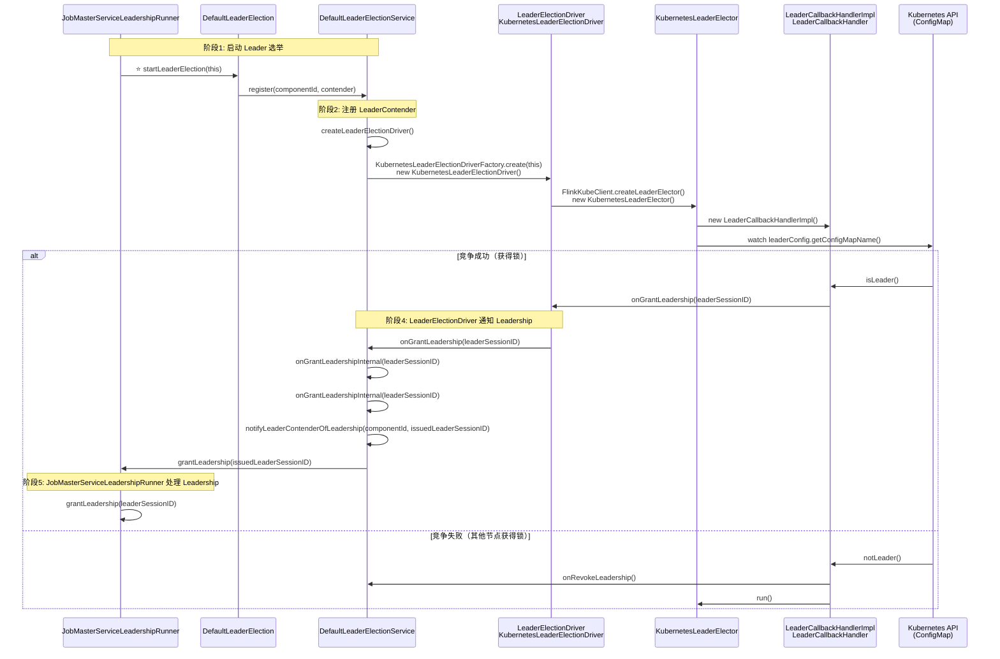
```mermaid
  sequenceDiagram
    participant JMSLR as JobMasterServiceLeadershipRunner
    participant DL as DefaultLeaderElection
    participant DLS as DefaultLeaderElectionService
    participant LED as LeaderElectionDriver<br/>KubernetesLeaderElectionDriver
    participant KubernetesLeaderElector
    participant LeaderCallbackHandlerImpl as LeaderCallbackHandlerImpl<br/>LeaderCallbackHandler
    participant K8s as Kubernetes API<br/>(ConfigMap)
    Note over JMSLR, DLS: 阶段1: 启动 Leader 选举
    JMSLR ->> DL: ⭐ startLeaderElection(this)
    DL ->> DLS: register(componentId, contender)
    Note over DLS, DLS: 阶段2: 注册 LeaderContender
    DLS ->> DLS: createLeaderElectionDriver()
    DLS ->> LED: KubernetesLeaderElectionDriverFactory.create(this)<br/>new KubernetesLeaderElectionDriver()
    LED ->> KubernetesLeaderElector: FlinkKubeClient.createLeaderElector()<br/>new KubernetesLeaderElector()
    KubernetesLeaderElector ->> LeaderCallbackHandlerImpl: new LeaderCallbackHandlerImpl()
    KubernetesLeaderElector ->> K8s: watch leaderConfig.getConfigMapName()
    alt 竞争成功（获得锁）
        K8s ->> LeaderCallbackHandlerImpl: isLeader()
        LeaderCallbackHandlerImpl ->> LED: onGrantLeadership(leaderSessionID)
        Note over LED, DLS: 阶段4: LeaderElectionDriver 通知 Leadership
        LED ->> DLS: onGrantLeadership(leaderSessionID)
        DLS ->> DLS: onGrantLeadershipInternal(leaderSessionID)
        DLS ->> DLS: onGrantLeadershipInternal(leaderSessionID)
        DLS ->> DLS: notifyLeaderContenderOfLeadership(componentId, issuedLeaderSessionID)
        DLS ->> JMSLR: grantLeadership(issuedLeaderSessionID)
        Note over JMSLR, JMSLR: 阶段5: JobMasterServiceLeadershipRunner 处理 Leadership
        JMSLR ->> JMSLR: grantLeadership(leaderSessionID)

    else 竞争失败（其他节点获得锁）
        K8s ->> LeaderCallbackHandlerImpl: notLeader()
        LeaderCallbackHandlerImpl ->> DLS: onRevokeLeadership()
        LeaderCallbackHandlerImpl ->> KubernetesLeaderElector: run()
    end


```

### JobMaster

单个作业 (Job) 的主控节点，负责该作业的调度、协调和执行。
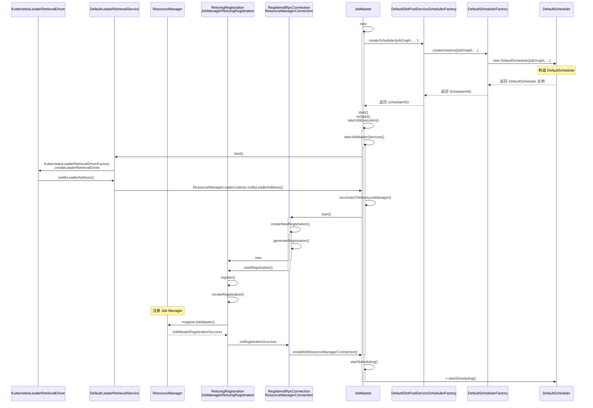
```mermaid
  sequenceDiagram
    participant KubernetesLeaderRetrievalDriver
    participant DefaultLeaderRetrievalService
    participant ResourceManager
    participant RetryingRegistration as RetryingRegistration<br/>JobManagerRetryingRegistration
    participant ResourceManagerConnection as RegisteredRpcConnection<br/>ResourceManagerConnection
    participant JM as JobMaster
    participant SPSF as DefaultSlotPoolServiceSchedulerFactory
    participant DSF as DefaultSchedulerFactory
    participant DS as DefaultScheduler
    JM ->> +JM: new
    JM ->> SPSF: createScheduler(jobGraph, ...`)
    SPSF ->> DSF: createInstance(jobGraph, ...)
    DSF ->> DS: new DefaultScheduler(jobGraph, ...)
    Note over DS, DS: 构造 DefaultScheduler 
    DS -->> DSF: 返回 DefaultScheduler 实例
    DSF -->> SPSF: 返回 SchedulerNG
    SPSF -->> JM: 返回 schedulerNG
    deactivate JM
    JM ->> + JM: start()<br/>onStart()<br/>startJobExecution()
    JM ->> +JM: startJobMasterServices()
    JM ->> DefaultLeaderRetrievalService: start()
    DefaultLeaderRetrievalService ->> KubernetesLeaderRetrievalDriver: KubernetesLeaderRetrievalDriverFactory<br/>.createLeaderRetrievalDriver
    KubernetesLeaderRetrievalDriver ->> DefaultLeaderRetrievalService: notifyLeaderAddress()
    DefaultLeaderRetrievalService ->> JM: ResourceManagerLeaderListener.notifyLeaderAddress()
    JM ->> JM: reconnectToResourceManager()
    JM ->> +ResourceManagerConnection: start()
    ResourceManagerConnection ->> +ResourceManagerConnection: createNewRegistration()
    ResourceManagerConnection ->> ResourceManagerConnection: generateRegistration()
    ResourceManagerConnection ->> -RetryingRegistration: new
    ResourceManagerConnection ->> -RetryingRegistration: startRegistration()
    RetryingRegistration ->> RetryingRegistration: register()
    RetryingRegistration ->> RetryingRegistration: invokeRegistration()
    Note over ResourceManager: 注册 Job Manager
    RetryingRegistration ->> ResourceManager: ⭐registerJobMaster()
    ResourceManager -->> RetryingRegistration: JobMasterRegistrationSuccess
    RetryingRegistration ->> ResourceManagerConnection: onRegistrationSuccess
    ResourceManagerConnection ->> JM: establishResourceManagerConnection()
    
    deactivate JM
    JM ->> + JM: startScheduling()
    JM ->> - DS: ⭐ startScheduling()
    deactivate JM
```
- connect to ResourceManager and `registerJobMaster` to RM
  - after success then monitor RM
- create DefaultScheduler

#### DefaultScheduler

JobMaster 内部的一个组件，负责将作业的子任务 (Tasks) 分配到具体的 TaskManager Slots 上执行。

#### KubernetesLeaderRetrievalDriver

#### DefaultExecutionGraph

Flink Job 在运行时的内部表示，它将逻辑的 `JobGraph` 转换为物理的、可调度和执行的任务图，包含了所有执行所需的详细信息。

- ExecutionJobVertex: The ExecutionJobVertex corresponds to a parallelized operation. It contains an ExecutionVertex for
  each parallel instance of that operation.
- ExecutionVertex: 一个具体的、可执行的任务子任务
- ExecutionEdge: ExecutionVertex 之间的数据传输通道
- Execution: 当一个 ExecutionVertex 需要运行或重启时，就会创建一个新的 Execution 实例

```text
ExecutionGraph:
├── ExecutionJobVertex-1: Source + Map
│    └── ExecutionVertex[0]  ← parallelism = 1
│
└── ExecutionJobVertex-2: Sum + Print
     ├── ExecutionVertex[0]  ← subtask-0
     └── ExecutionVertex[1]  ← subtask-1
```

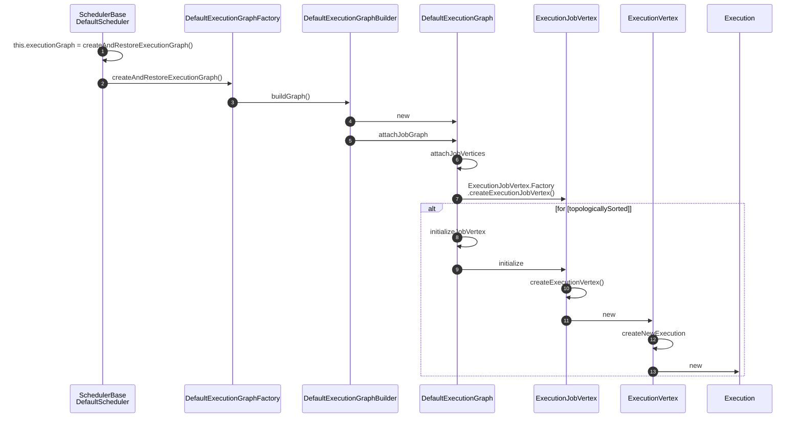
```mermaid
sequenceDiagram
    autonumber
    participant Scheduler as SchedulerBase<br/>DefaultScheduler
    participant ExecutionGraphFactory as DefaultExecutionGraphFactory
    participant DefaultExecutionGraphBuilder
    participant ExecutionGraph as DefaultExecutionGraph
    participant ExecutionJobVertex
    participant ExecutionVertex
    participant Execution
    Scheduler ->> Scheduler: this.executionGraph = createAndRestoreExecutionGraph()
    Scheduler ->> ExecutionGraphFactory: createAndRestoreExecutionGraph()
    ExecutionGraphFactory ->> DefaultExecutionGraphBuilder: buildGraph()
    DefaultExecutionGraphBuilder ->> ExecutionGraph: new
    DefaultExecutionGraphBuilder ->> ExecutionGraph: attachJobGraph
    ExecutionGraph ->> ExecutionGraph: attachJobVertices
    ExecutionGraph ->> ExecutionJobVertex: ExecutionJobVertex.Factory<br/>.createExecutionJobVertex()
    alt for [topologicallySorted]
        ExecutionGraph ->> ExecutionGraph: initializeJobVertex
        ExecutionGraph ->> ExecutionJobVertex: initialize
        ExecutionJobVertex ->> ExecutionJobVertex: createExecutionVertex()
        ExecutionJobVertex ->> ExecutionVertex: new
        ExecutionVertex ->> ExecutionVertex: createNewExecution
        ExecutionVertex ->> Execution: new
    end
```

##### startScheduling

- Each ExecutionVertex will submit a Task to the TaskExecutor.
- `DefaultSchedulerComponents` create `SlotSharingExecutionSlotAllocatorFactory` then create
  `SlotSharingExecutionSlotAllocator`.
- `DefaultSchedulerComponents` create `PipelinedRegionSchedulingStrategy.Factory` then create
  `PipelinedRegionSchedulingStrategy`.

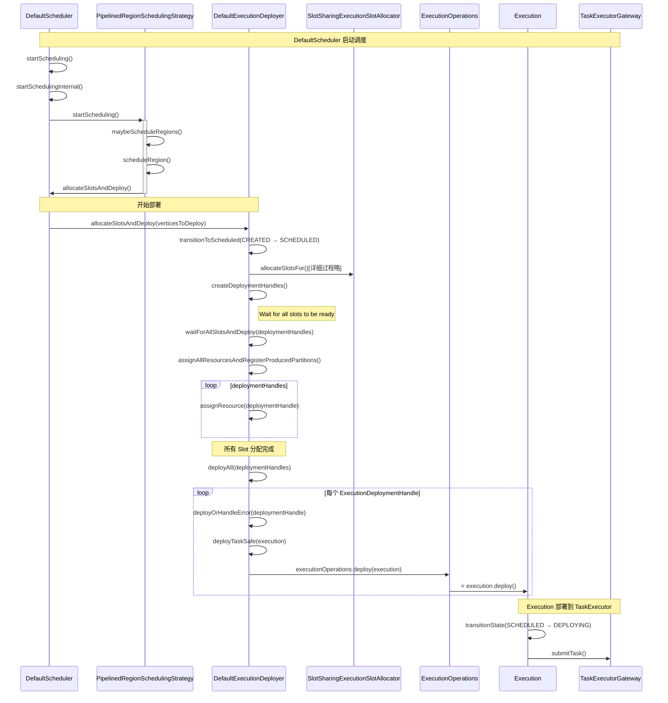
```mermaid
  sequenceDiagram
    participant DS as DefaultScheduler
    participant SchedulingStrategy as PipelinedRegionSchedulingStrategy
    participant ED as DefaultExecutionDeployer
    participant SS as SlotSharingExecutionSlotAllocator
    participant EO as ExecutionOperations
    participant Exec as Execution
    participant TEG as TaskExecutorGateway
    Note over DS, TEG: DefaultScheduler 启动调度
    DS ->> DS: startScheduling()
    DS ->> DS: startSchedulingInternal()
    DS ->> + SchedulingStrategy: startScheduling()
    SchedulingStrategy ->> SchedulingStrategy: maybeScheduleRegions()
    SchedulingStrategy ->> SchedulingStrategy: scheduleRegion()
    SchedulingStrategy ->> - DS: allocateSlotsAndDeploy()
    Note over DS, ED: 开始部署
    DS ->> ED: allocateSlotsAndDeploy(verticesToDeploy)
    ED ->> ED: transitionToScheduled(CREATED → SCHEDULED)
    ED ->> SS: allocateSlotsFor()[详细过程略]
    ED ->> ED: createDeploymentHandles()
    Note right of ED: Wait for all slots to be ready
    ED ->> ED: waitForAllSlotsAndDeploy(deploymentHandles)
    ED ->> ED: assignAllResourcesAndRegisterProducedPartitions()

    loop deploymentHandles
        ED ->> ED: assignResource(deploymentHandle)
    end

    Note over ED, ED: 所有 Slot 分配完成
    ED ->> ED: deployAll(deploymentHandles)

    loop 每个 ExecutionDeploymentHandle
        ED ->> ED: deployOrHandleError(deploymentHandle)
        ED ->> ED: deployTaskSafe(execution)
        ED ->> EO: executionOperations.deploy(execution)
        EO ->> Exec: ⭐ execution.deploy()
    end

    Note over Exec, TEG: Execution 部署到 TaskExecutor
    Exec ->> Exec: transitionState(SCHEDULED → DEPLOYING)
    Exec ->> TEG: submitTask()
```

##### allocateSlotsFor
负责为即将执行的任务分配计算资源（Slot），如果资源不足则触发 ResourceManager 申请新资源。
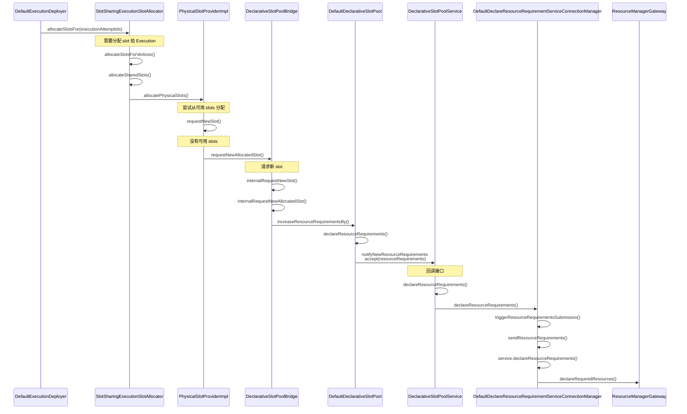
```mermaid
  sequenceDiagram
    participant DefaultExecutionDeployer
    participant SlotSharingExecutionSlotAllocator
    participant PhysicalSlotProviderImpl
    participant DeclarativeSlotPoolBridge
    participant DefaultDeclarativeSlotPool
    participant DeclarativeSlotPoolService
    participant Manager as DefaultDeclareResourceRequirementServiceConnectionManager
    participant ResourceManagerGateway
    DefaultExecutionDeployer ->> SlotSharingExecutionSlotAllocator: allocateSlotsFor(executionAttemptIds)
    Note over SlotSharingExecutionSlotAllocator: 需要分配 slot 给 Execution
    SlotSharingExecutionSlotAllocator ->> SlotSharingExecutionSlotAllocator: allocateSlotsForVertices()
    SlotSharingExecutionSlotAllocator ->> SlotSharingExecutionSlotAllocator: allocateSharedSlots()
    SlotSharingExecutionSlotAllocator ->> PhysicalSlotProviderImpl: allocatePhysicalSlots()
    Note over PhysicalSlotProviderImpl: 尝试从可用 slots 分配
    PhysicalSlotProviderImpl ->> PhysicalSlotProviderImpl: requestNewSlot()
    Note over PhysicalSlotProviderImpl: 没有可用 slots
    PhysicalSlotProviderImpl ->> DeclarativeSlotPoolBridge: requestNewAllocatedSlot()
    Note over DeclarativeSlotPoolBridge: 请求新 slot
    DeclarativeSlotPoolBridge ->> DeclarativeSlotPoolBridge: internalRequestNewSlot()
    DeclarativeSlotPoolBridge ->> DeclarativeSlotPoolBridge: internalRequestNewAllocatedSlot()
    DeclarativeSlotPoolBridge ->> DefaultDeclarativeSlotPool: increaseResourceRequirementsBy()
    DefaultDeclarativeSlotPool ->> DefaultDeclarativeSlotPool: declareResourceRequirements()
    DefaultDeclarativeSlotPool ->> DeclarativeSlotPoolService: notifyNewResourceRequirements<br/>.accept(resourceRequirements)
    Note over DeclarativeSlotPoolService: 回调接口
    DeclarativeSlotPoolService ->> DeclarativeSlotPoolService: declareResourceRequirements()
    DeclarativeSlotPoolService ->> Manager: declareResourceRequirements()
    Manager ->> Manager: triggerResourceRequirementsSubmission()
    Manager ->> Manager: sendResourceRequirements()
    Manager ->> Manager: service.declareResourceRequirements()
    Manager ->> ResourceManagerGateway: declareRequiredResources()
```

#### offerSlots
- [DefaultScheduler startScheduling](deployment.md#startscheduling): 启动调度时，会尝试为所有待执行的 ExecutionVertex 申请所需的 Slots。
- 如果当前集群中没有足够的可用 Slots 满足所有 ExecutionVertex 的资源请求，调度过程会阻塞，直到 ResourceManager 从K8s 那里成功申请到新的 TaskManager 并注册进来，提供了足够的资源。
- 触发新 TM：Slot 申请不足会触发 ResourceManager 向外部资源提供者请求新资源，创建新的 TaskManager 进程。
- `sendSlotReport`： 新的 TaskManager 启动后，会向 ResourceManager 发送 SlotReport，报告其拥有的 Slots，使这些 Slots 变为 ResourceManager 可管理的空闲资源。
- 当有 TaskManager 的 Slot 变为空闲时，ResourceManager 的 SlotManager 会调用 allocateSlot 为 JobMaster 的请求分配 Slot，然后通过 offerSlot 将这个分配好的 Slot 提供给 JobMaster。
- JobMaster will complete slotFuture, so `DefaultExecutionDeployer.waitForAllSlotsAndDeploy` can continue to deploy slot.

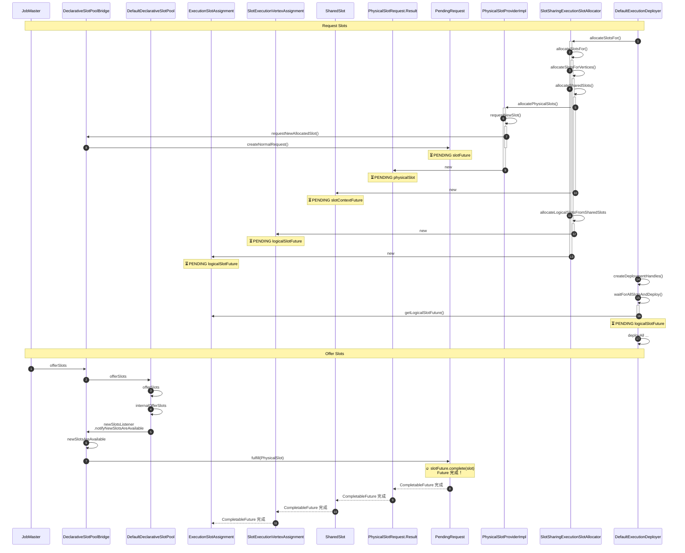
```mermaid
  sequenceDiagram
    autonumber
    participant JobMaster
    participant DeclarativeSlotPoolBridge
    participant DefaultDeclarativeSlotPool
    participant DeclarativeSlotPoolBridge
    participant ExecutionSlotAssignment
    participant SlotExecutionVertexAssignment
    participant SharedSlot
    participant PhysicalSlotRequest.Result
    participant PendingRequest
    participant PhysicalSlotProviderImpl
    participant SlotSharingExecutionSlotAllocator
    participant DefaultExecutionDeployer
    Note over JobMaster, DefaultExecutionDeployer: Request Slots
    DefaultExecutionDeployer ->>+ SlotSharingExecutionSlotAllocator: allocateSlotsFor()
    SlotSharingExecutionSlotAllocator ->>+ SlotSharingExecutionSlotAllocator: allocateSlotsFor()
    SlotSharingExecutionSlotAllocator ->>+ SlotSharingExecutionSlotAllocator: allocateSlotsForVertices()
    SlotSharingExecutionSlotAllocator ->>+ SlotSharingExecutionSlotAllocator: allocateSharedSlots()
    SlotSharingExecutionSlotAllocator ->> + PhysicalSlotProviderImpl: allocatePhysicalSlots()
    PhysicalSlotProviderImpl ->> + PhysicalSlotProviderImpl: requestNewSlot()
    PhysicalSlotProviderImpl ->> DeclarativeSlotPoolBridge: requestNewAllocatedSlot()
    DeclarativeSlotPoolBridge ->> PendingRequest: createNormalRequest()
    deactivate PhysicalSlotProviderImpl
    Note over PendingRequest: ⏳ PENDING slotFuture
    PhysicalSlotProviderImpl ->> - PhysicalSlotRequest.Result: new
    Note over PhysicalSlotRequest.Result: ⏳ PENDING physicalSlot
    SlotSharingExecutionSlotAllocator ->> SharedSlot: new
    deactivate SlotSharingExecutionSlotAllocator
    deactivate SlotSharingExecutionSlotAllocator
    Note over SharedSlot: ⏳ PENDING slotContextFuture
    SlotSharingExecutionSlotAllocator ->> + SlotSharingExecutionSlotAllocator: allocateLogicalSlotsFromSharedSlots
    SlotSharingExecutionSlotAllocator ->> - SlotExecutionVertexAssignment: new
    deactivate SlotSharingExecutionSlotAllocator
    Note over SlotExecutionVertexAssignment: ⏳ PENDING logicalSlotFuture
    SlotSharingExecutionSlotAllocator ->> ExecutionSlotAssignment: new
    deactivate SlotSharingExecutionSlotAllocator
    Note over ExecutionSlotAssignment: ⏳ PENDING logicalSlotFuture
    DefaultExecutionDeployer ->> DefaultExecutionDeployer: createDeploymentHandles()
    DefaultExecutionDeployer ->> + DefaultExecutionDeployer: waitForAllSlotsAndDeploy()
    DefaultExecutionDeployer ->> - ExecutionSlotAssignment: getLogicalSlotFuture()
    Note over DefaultExecutionDeployer: ⏳ PENDING logicalSlotFuture
    DefaultExecutionDeployer ->> DefaultExecutionDeployer: deployAll ...

    autonumber 1
    Note over JobMaster, DefaultExecutionDeployer: Offer Slots
    JobMaster ->> DeclarativeSlotPoolBridge: offerSlots
    DeclarativeSlotPoolBridge ->> DefaultDeclarativeSlotPool: offerSlots
    DefaultDeclarativeSlotPool ->> DefaultDeclarativeSlotPool: offerSlots
    DefaultDeclarativeSlotPool ->> DefaultDeclarativeSlotPool: internalOfferSlots
    DefaultDeclarativeSlotPool ->> DeclarativeSlotPoolBridge: newSlotsListener<br/>.notifyNewSlotsAreAvailable
    DeclarativeSlotPoolBridge ->> DeclarativeSlotPoolBridge: newSlotsAreAvailable
    DeclarativeSlotPoolBridge ->> PendingRequest: fulfill(PhysicalSlot)
    Note over PendingRequest: 🔥 slotFuture.complete(slot)<br/>Future 完成！
    PendingRequest-->>PhysicalSlotRequest.Result: CompletableFuture 完成
    PhysicalSlotRequest.Result-->>SharedSlot: CompletableFuture 完成
    SharedSlot-->>SlotExecutionVertexAssignment: CompletableFuture 完成
    SlotExecutionVertexAssignment-->>ExecutionSlotAssignment: CompletableFuture 完成
```


## TaskExecutor

- Kubernetes 创建 TaskManager Pod
- 通过 SharedIndexInformer 监听 Active ResourceManager
    - ConfigMapCallbackHandlerImpl 是如果被触发的？
      见 [KubernetesLeaderRetrievalDriver.ConfigMapCallbackHandlerImpl](deployment.md#kubernetesleaderretrievaldriverconfigmapcallbackhandlerimpl)

### KubernetesTaskExecutorRunner
该类是运行 TaskExecutor 在 Kubernetes Pod 中的可执行入口点。

#### KubernetesTaskManagerFactory
Construct the TaskManager Pod on the JobManager
* InitTaskManagerDecorator
* EnvSecretsDecorator
* MountSecretsDecorator
* CmdTaskManagerDecorator: kubernetes-taskmanager.sh -> flink-console.sh KubernetesTaskExecutorRunner

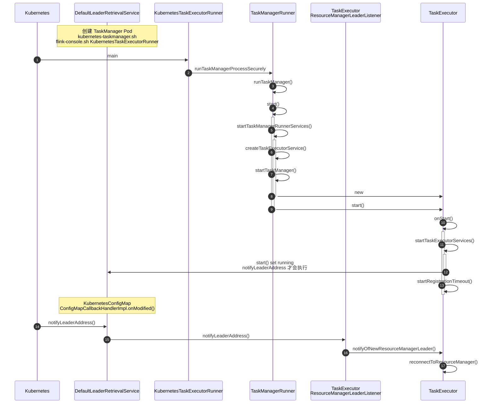
```mermaid
sequenceDiagram
    autonumber
    participant Kubernetes
    participant DefaultLeaderRetrievalService
    participant KubernetesTaskExecutorRunner
    participant TaskManagerRunner
    participant ResourceManagerLeaderListener as TaskExecutor<br/>ResourceManagerLeaderListener
    participant TaskExecutor
    Note over DefaultLeaderRetrievalService: 创建 TaskManager Pod<br/>kubernetes-taskmanager.sh<br/>flink-console.sh KubernetesTaskExecutorRunner
    Kubernetes ->> KubernetesTaskExecutorRunner: main
    KubernetesTaskExecutorRunner ->> TaskManagerRunner: runTaskManagerProcessSecurely
    TaskManagerRunner ->> TaskManagerRunner: runTaskManager()
    TaskManagerRunner ->>+ TaskManagerRunner: start()
    TaskManagerRunner ->>+ TaskManagerRunner: startTaskManagerRunnerServices()
    TaskManagerRunner ->> TaskManagerRunner: createTaskExecutorService()
    TaskManagerRunner ->> TaskManagerRunner: startTaskManager()
    TaskManagerRunner ->>- TaskExecutor: new
    TaskManagerRunner ->>- TaskExecutor: start()
    TaskExecutor ->> + TaskExecutor: onStart()
    TaskExecutor ->> + TaskExecutor: startTaskExecutorServices()
    TaskExecutor ->> - DefaultLeaderRetrievalService: start() set running<br/> notifyLeaderAddress 才会执行
    TaskExecutor ->> - TaskExecutor: startRegistrationTimeout()
    Note over DefaultLeaderRetrievalService: KubernetesConfigMap<br/>ConfigMapCallbackHandlerImpl.onModified()
    Kubernetes ->> DefaultLeaderRetrievalService: notifyLeaderAddress()
    DefaultLeaderRetrievalService ->> ResourceManagerLeaderListener: notifyLeaderAddress()
    ResourceManagerLeaderListener ->> TaskExecutor: notifyOfNewResourceManagerLeader()
    TaskExecutor ->> TaskExecutor: reconnectToResourceManager()
```

### KubernetesLeaderRetrievalDriver.ConfigMapCallbackHandlerImpl

TaskManager 如何通过 Kubernetes ConfigMap 监听 ResourceManager (JobManager) Leader 变化的流程。

- KubernetesConfigMapSharedInformer 初始化 注册监听事件
- KubernetesConfigMapSharedInformer watch 机制触发 `ConfigMapCallbackHandlerImpl.onAdded`
- SharedIndexInformer
  是如何工作的：[ConfigMapInformerExample](../../kubernetes/fabric8-example/src/main/java/ConfigMapInformerExample.java)

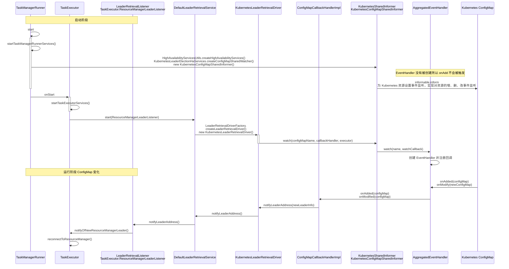
```mermaid
  sequenceDiagram
    participant TaskManagerRunner
    participant TaskExecutor as TaskExecutor
    participant Listener as LeaderRetrievalListener<br/>TaskExecutor.ResourceManagerLeaderListener
    participant Service as DefaultLeaderRetrievalService
    participant Driver as KubernetesLeaderRetrievalDriver
    participant Callback as ConfigMapCallbackHandlerImpl
    participant SharedWatcher as KubernetesSharedInformer<br/>KubernetesConfigMapSharedInformer
    participant EventHandler as AggregatedEventHandler
    participant ConfigMap as Kubernetes ConfigMap
    Note over TaskManagerRunner, Listener: 启动阶段
    TaskManagerRunner ->> + TaskManagerRunner: start
    TaskManagerRunner ->> TaskManagerRunner: startTaskManagerRunnerServices()
    TaskManagerRunner ->> SharedWatcher: HighAvailabilityServicesUtils.createHighAvailabilityServices()<br/>KubernetesLeaderElectionHaServices.createConfigMapSharedWatcher()<br/>new KubernetesConfigMapSharedInformer()
    Note over EventHandler: EventHandler 没有被创建所以 onAdd 不会被触发
    SharedWatcher ->> ConfigMap: informable.inform<br/>为 Kubernetes 资源设置事件监听，实现对资源的增、删、改事件监听
    deactivate TaskManagerRunner
    TaskManagerRunner ->> + TaskExecutor: onStart
    TaskExecutor ->> - TaskExecutor: startTaskExecutorServices()
    TaskExecutor ->> Service: start(ResourceManagerLeaderListener)
    Service ->> + Driver: LeaderRetrievalDriverFactory.<br/>createLeaderRetrievalDriver()<br/>new KubernetesLeaderRetrievalDriver()
    Driver ->> - SharedWatcher: watch(configMapName, callbackHandler, executor)
    SharedWatcher ->> EventHandler: watch(name, watchCallback)
    EventHandler ->> EventHandler: 创建 EventHandler 并注册回调
    Note over TaskManagerRunner, Listener: 运行阶段 ConfigMap 变化
    ConfigMap ->> EventHandler: onAdded(configMap)<br/>onModify(newConfigMap)
    EventHandler ->> Callback: onAdded(configMap)<br/>onModified(configMap)
    Callback ->> Driver: notifyLeaderAddress(newLeaderInfo)
    Driver ->> Service: notifyLeaderAddress()
    Service ->> Listener: notifyLeaderAddress()
    Listener ->> TaskExecutor: notifyOfNewResourceManagerLeader()
    TaskExecutor ->> TaskExecutor: reconnectToResourceManager()
```

### task executor connect to ResourceManager
- registerTaskExecutor: TaskExecutor 会重新向 ResourceManager 注册自己，提供其标识和初始资源信息
- sendSlotReport: 注册成功后，TaskExecutor 会发送 SlotReport，向 ResourceManager 详细报告其当前所有 Slot 的状态和资源详情。
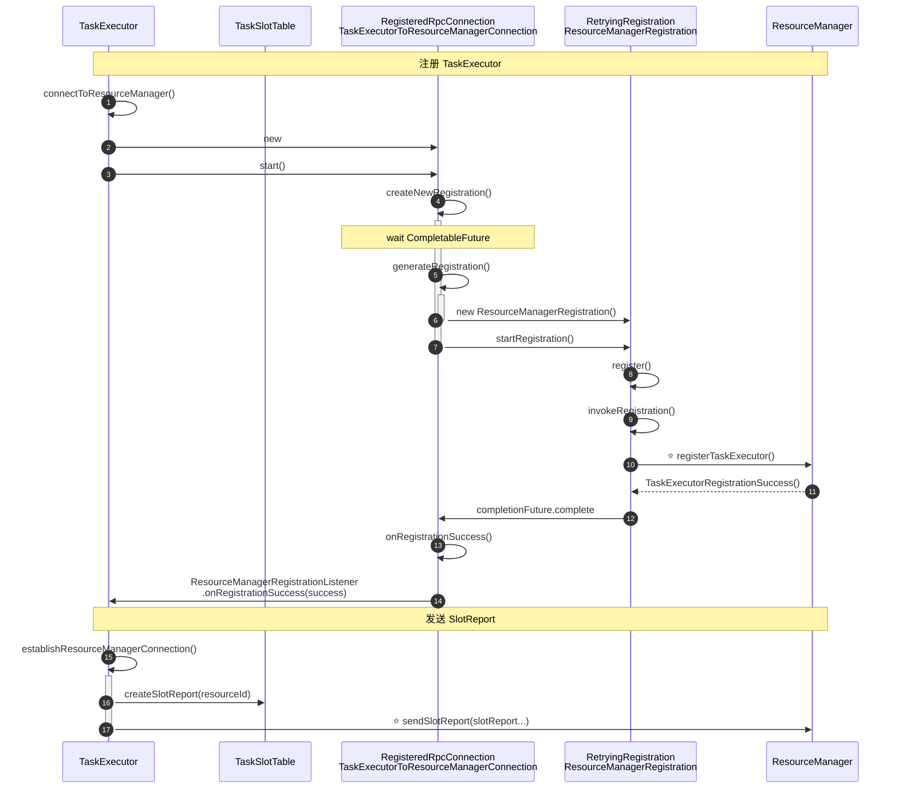
```mermaid
   sequenceDiagram
    autonumber
    participant TE as TaskExecutor
    participant TST as TaskSlotTable
    participant Conn as RegisteredRpcConnection<br/>TaskExecutorToResourceManagerConnection
    participant ResourceManagerRegistration as RetryingRegistration<br/>ResourceManagerRegistration
    participant RM as ResourceManager
    Note over TE, RM: 注册 TaskExecutor
    TE ->> TE: connectToResourceManager()
    TE ->> Conn: new
    TE ->> Conn: start()
    Conn ->>+ Conn: createNewRegistration()
    Note over Conn: wait CompletableFuture
    Conn ->>+ Conn: generateRegistration()
    Conn ->>- ResourceManagerRegistration: new ResourceManagerRegistration()
    Conn ->>- ResourceManagerRegistration: startRegistration()
    ResourceManagerRegistration ->> ResourceManagerRegistration: register()
    ResourceManagerRegistration ->> ResourceManagerRegistration: invokeRegistration()
    ResourceManagerRegistration ->> RM: ⭐ registerTaskExecutor()
    RM -->> ResourceManagerRegistration: TaskExecutorRegistrationSuccess()
    ResourceManagerRegistration ->> Conn: completionFuture.complete
    Conn ->> Conn: onRegistrationSuccess()
    Conn ->> TE: ResourceManagerRegistrationListener<br/>.onRegistrationSuccess(success)
    Note over TE, RM: 发送 SlotReport
    TE ->> +TE: establishResourceManagerConnection()
    TE ->> TST: createSlotReport(resourceId)
    TE ->> -RM: ⭐ sendSlotReport(slotReport...)
```

### requestSlot
- 接收 ResourceManager 的requestSlot申请
- 有空闲 Slot 时主动向 JobMaster 推送 Slot → `offerSlot`
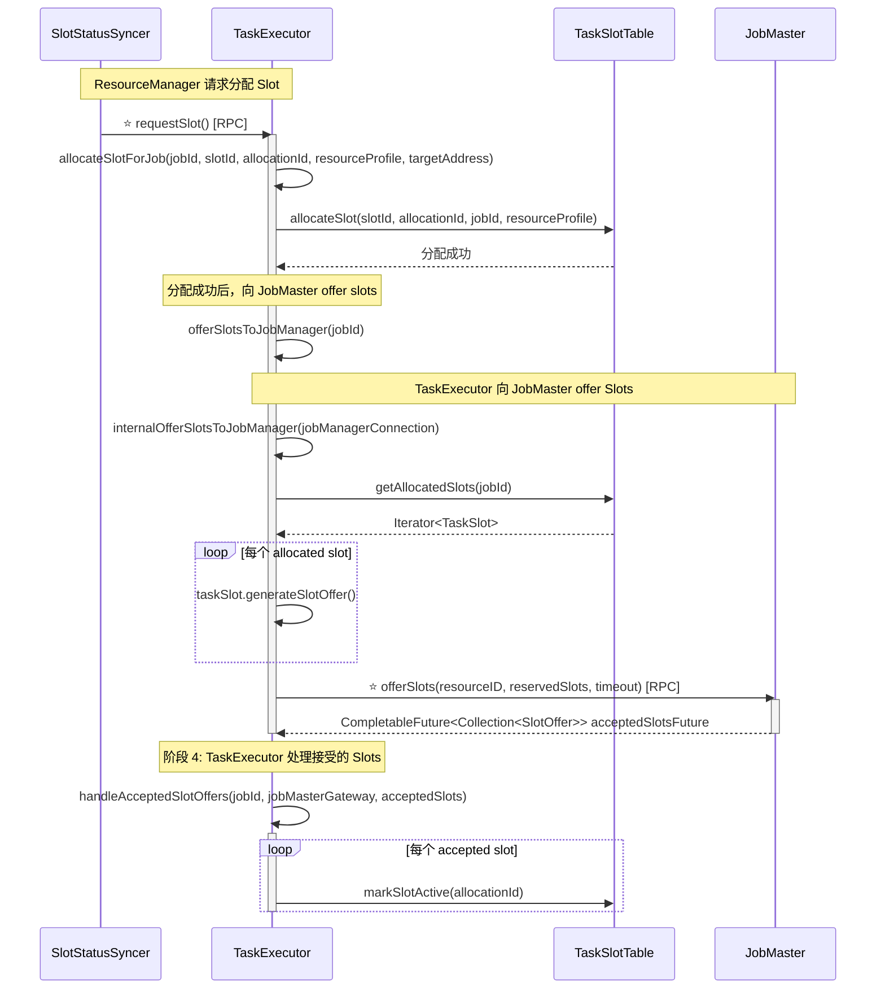
```mermaid
  sequenceDiagram
    participant SS as SlotStatusSyncer
    participant TE as TaskExecutor
    participant TST as TaskSlotTable
    participant JM as JobMaster
    Note over SS, TE: ResourceManager 请求分配 Slot
    SS ->> TE: ⭐ requestSlot() [RPC]
    activate TE
    TE ->> TE: allocateSlotForJob(jobId, slotId, allocationId, resourceProfile, targetAddress)
    TE ->> TST: allocateSlot(slotId, allocationId, jobId, resourceProfile)
    TST -->> TE: 分配成功
    Note over TE: 分配成功后，向 JobMaster offer slots
    TE ->> TE: offerSlotsToJobManager(jobId)
    Note over TE, JM: TaskExecutor 向 JobMaster offer Slots
    TE ->> TE: internalOfferSlotsToJobManager(jobManagerConnection)
    TE ->> TST: getAllocatedSlots(jobId)
    TST -->> TE: Iterator<TaskSlot>

    loop 每个 allocated slot
        TE ->> TE: taskSlot.generateSlotOffer()
    end

    TE ->> JM: ⭐ offerSlots(resourceID, reservedSlots, timeout) [RPC]
    activate JM
    JM -->> TE: CompletableFuture<Collection<SlotOffer>> acceptedSlotsFuture
    deactivate JM
    deactivate TE
    
    Note over TE: 阶段 4: TaskExecutor 处理接受的 Slots
    TE ->> TE: handleAcceptedSlotOffers(jobId, jobMasterGateway, acceptedSlots)
    activate TE
    loop 每个 accepted slot
        TE ->> TST: markSlotActive(allocationId)
    end
    deactivate TE
```

### submitTask
接收 JobMaster 下发的任务部署信息，在已分配好的专属物理 Slot中，完成 Task 的实例化、资源绑定、启动执行，并完成任务状态注册，是Flink 任务真正落地执行的最后一步核心动作。
* restore 是恢复状态，为任务执行做准备。
* invoke 是执行业务逻辑，处理数据。

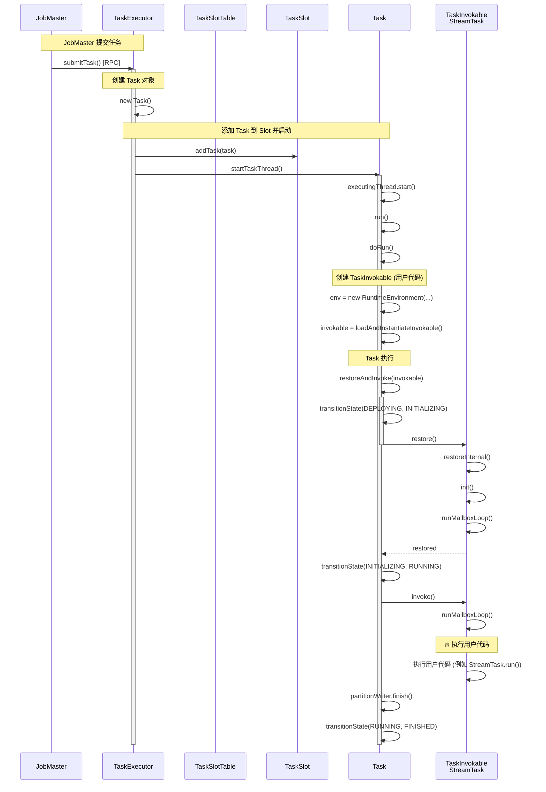
```mermaid
  sequenceDiagram
    participant JM as JobMaster
    participant TE as TaskExecutor
    participant TST as TaskSlotTable
    participant TaskSlot
    participant Task as Task
    participant TI as TaskInvokable<br/>StreamTask
    Note over JM, TE: JobMaster 提交任务
    JM ->> TE: submitTask() [RPC]
    activate TE
    Note over TE: 创建 Task 对象
    TE ->> TE: new Task()
    Note over TE, Task: 添加 Task 到 Slot 并启动
    TE ->> TaskSlot: addTask(task)
    TE ->> Task: startTaskThread()
    activate Task
    Task ->> Task: executingThread.start()
    Task ->> Task: run()
    Task ->> Task: doRun()
    Note over Task: 创建 TaskInvokable (用户代码)
    Task ->> Task: env = new RuntimeEnvironment(...)
    Task ->> Task: invokable = loadAndInstantiateInvokable()
    Note over Task: Task 执行
    Task ->>+ Task: restoreAndInvoke(invokable)
    Task ->> Task: transitionState(DEPLOYING, INITIALIZING)
    Task ->>- TI: restore()
    TI ->> TI: restoreInternal()
    TI ->> TI: init()
    TI ->> TI: runMailboxLoop();
    TI -->> Task: restored
    Task ->> Task: transitionState(INITIALIZING, RUNNING)
    Task ->> TI: invoke()
    TI ->> TI: runMailboxLoop()
    Note over TI: 🔥 执行用户代码
    TI ->> TI: 执行用户代码 (例如 StreamTask.run())
    Task ->> Task: partitionWriter.finish()
    Task ->> Task: transitionState(RUNNING, FINISHED)
    deactivate Task
    deactivate TE
```

## Run flink example

```bash
./bin/flink run-application \
    --target kubernetes-application \
    -Dkubernetes.cluster-id=wordcount \
    -Dkubernetes.container.image=flink:1.20.3-scala_2.12 \
    -Dkubernetes.service-account=flink-service-account \
    local:///opt/flink/examples/streaming/WordCount.jar
```

# Reference

- https://nightlies.apache.org/flink/flink-docs-release-1.20/docs/deployment/overview/#application-mode
- https://nightlies.apache.org/flink/flink-docs-release-1.20/docs/deployment/resource-providers/yarn/