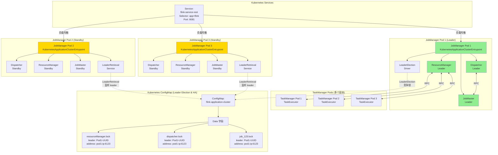
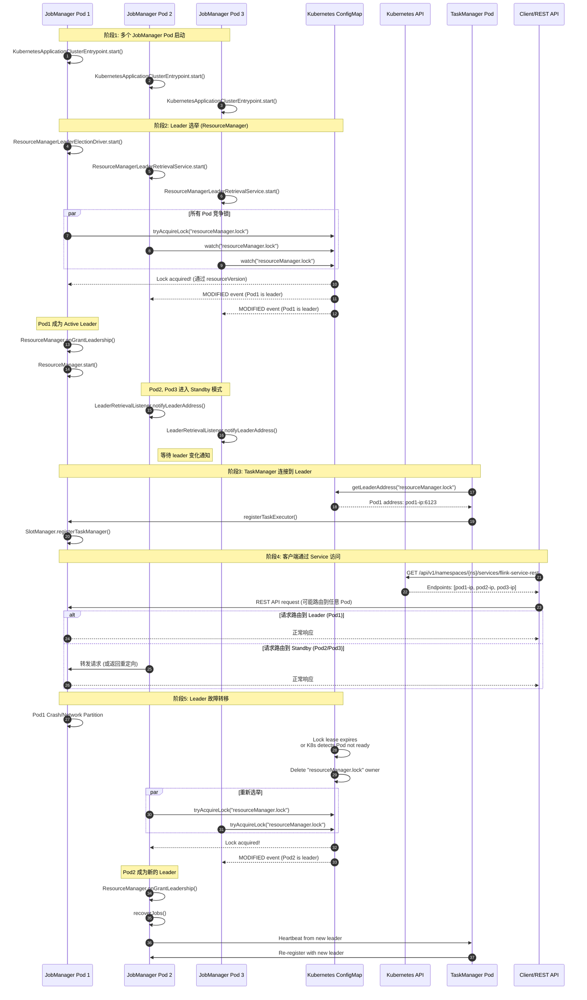

# JobManager Election in Kubernetes

## Architecture

## JobManger leader 选举工作机制
[KubernetesLeaderElectorExample](../../kubernetes/fabric8-example/src/main/java/KubernetesLeaderElectorExample.java) 展示了如何通过 k8s configMap 做主节点选举。

