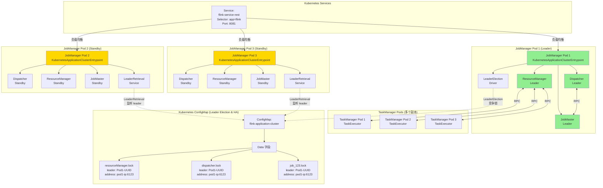
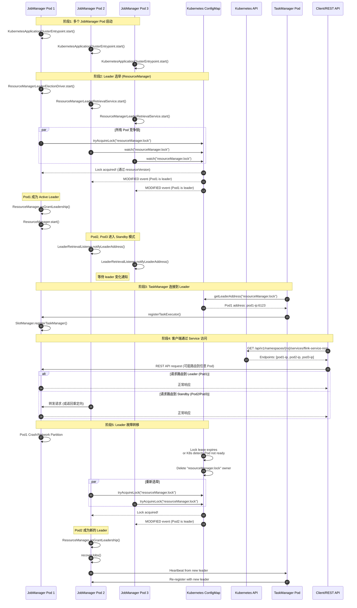

# JobManager Election in Kubernetes
1. **多Pod启动阶段**：
   多个JobManager Pod同时启动，各自初始化并准备参与Leader选举。

2. **Leader竞争阶段**：
    - 所有Pod同时尝试向Kubernetes ConfigMap写入Leader锁信息
    - 利用Kubernetes ConfigMap的原子性更新特性，确保只有一个Pod能够成功获取锁
    - 成功获取锁的Pod成为**Active Leader**，其余Pod进入**Standby模式**

3. **Standby状态维护**：
    - Standby Pod持续监听ConfigMap中Leader锁的变化
    - Leader Pod定期更新锁的租约，维持Leader身份

4. **Leader故障检测**：
    - 当Leader Pod发生故障（崩溃或网络分区）时，其持有的锁租约过期
    - Kubernetes 自动检测到故障并清理 ConfigMap 中的 Leader 信息

5. **故障转移阶段**：
    - 所有Standby Pod立即感知到Leader锁的释放
    - 重新发起ConfigMap锁的竞争，最快获取锁的 Pod 成为新的 Leader

6. **作业恢复阶段**：
    - 新 Leader 从外部存储（如HDFS/S3）加载最近的 checkpoint 或 savepoint
    - 恢复作业执行状态和元数据
    - 通知所有 TaskManager 连接新的 Leader 并继续执行作业

## Architecture

## JobManger leader 选举工作机制
[KubernetesLeaderElectorExample](../../kubernetes/fabric8-example/src/main/java/KubernetesLeaderElectorExample.java) 展示了如何通过 k8s configMap 做主节点选举。

# Q & A
## 为什么不用 StatefulSet 而用deployment 实现主备选举？

StatefulSet 的核心特性
- 为 Pod 提供 稳定的网络标识（如 pod-name-0, pod-name-1）
- 固定的存储卷。
- 各个实例不会自动调度服务角色（谁是主、谁是备）

Flink 不需要 StatefulSet 提供的核心特性：
- 无状态的，每个实例都是平等的，不依赖于固定的网络标识。
- 状态不存储在本地
- Flink 依赖协调服务的 Leader 选举，而 StatefulSet 本身不提供选举能力

### 为什么mysql 等 DB 却依赖 StatefulSet？
* 稳定的网络标识
  * 为每个 Pod 分配 唯一且稳定的主机名（如 mysql-0, mysql-1, mysql-2）
  * 每个 Pod 有固定的 DNS 记录（如 mysql-0.mysql.default.svc.cluster.local）
  * 无论 Pod 重启或迁移到哪个节点，网络标识保持不变
* 固定的存储卷
  - 每个 Pod 有独立的存储卷，用于存储数据库数据
  - PVC 与 Pod 的序号绑定（如 mysql-data-mysql-0 对应 mysql-0）
  - Pod 故障或重启时，新 Pod 会挂载原来的 PVC，确保数据不丢失
  - 存储卷的生命周期独立于 Pod，即使删除 StatefulSet，PVC 也会保留
- 有序的部署和扩展
  - 当 StatefulSet 扩展时，新的 Pod 会按照序号顺序部署（如 mysql-3）
  - 当 StatefulSet 缩减时，Pod 会按照序号顺序删除（如 mysql-2 先于 mysql-1）
- MySQL 主从复制是典型的“依赖节点身份”的主备架构
  - 主节点（mysql-0）负责写入，从节点（mysql-1, mysql-2）负责读取
  - 「主 / 从身份是固定的、预设的、强绑定节点」，不会自动切换
  - 主节点将写入操作记录到二进制日志（binlog）
  - 从节点通过读取 binlog 来复制主节点的写入操作
  - 即使 mysql-0 Pod 故障重启，也会重新挂载原存储卷，保持主节点身份
