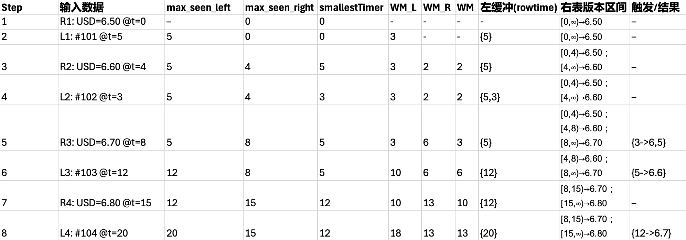

# Join

## [Window Join](https://nightlies.apache.org/flink/flink-docs-release-1.20/docs/dev/datastream/operators/joining/#window-join)


将两个数据流（Stream）基于时间窗口和键（Key）进行 Join：

| 窗口类型 | 特点 | 适用场景 |
| :--- | :--- | :--- |
| 滚动窗口 (Tumbling) | 时间段固定，且不重叠（如每1分钟统计一次）。 | 周期性统计，比如“每分钟订单数与支付数的关联”。 |
| 滑动窗口 (Sliding) | 时间段固定，但有重叠（如每30秒滑动一次，窗口大小1分钟）。 | 需要平滑统计，比如“过去1分钟内，每半分钟计算一次活跃用户”。 |
| 会话窗口 (Session) | 没有固定时间，根据间隔划分（如两次数据间隔超过5分钟则算新窗口）。 | 用户行为分析，比如“关联用户在同一次会话中的浏览和购买行为”。 |

- Window Join 只支持 Inner Join （如果要支持left join or right join 使用 coGroup）
- Window Join 是窗口触发时才进行计算的

### WindowOperator
- left stream 每个元素经过 Input1Tagger 生成 TaggedUnion(one, null)
- right stream 每个元素经过 Input2Tagger 生成 TaggedUnion(null, two)
- StatusWatermarkValve 管理 watermark，两个watermark 对齐 才会触发 `WindowOperator.processWatermark`
- WindowOperator 同时处理 TaggedUnion Record，单流处理逻辑
  - 只有1个 key state

## Interval Join
问题：
- 假设用户下单（流 A）后，会在 1 到 5 秒内填写收货地址（流 B）。
- Window Join：假设设置 1 分钟的滚动窗口，但订单数据在 00:59 到达，收货数据在 01:05 到达，它们会被分到两个不同的窗口，导致 Join 失败。

- 对于流 A 中的每一条数据 a，去寻找流 B 中满足特定时间范围条件的数据 b

  
  ```java
  orangeStream
      .keyBy(<KeySelector>)
      .intervalJoin(greenStream.keyBy(<KeySelector>))
      .between(Time.milliseconds(-2), Time.milliseconds(1))
  ```

- [WindowJoinExample](https://github.com/juntaozhang/flink/tree/release-1.20-study/flink-examples/flink-examples-streaming/src/main/java/org/apache/flink/streaming/examples/my/join/WindowJoinExample.java)

### IntervalJoinOperator
- [IntervalJoinExample](https://github.com/juntaozhang/flink/tree/release-1.20-study/flink-examples/flink-examples-streaming/src/main/java/org/apache/flink/streaming/examples/my/join/IntervalJoinExample.java)
- 双流
- 非 window 窗口，数据来了只要能匹配上，就会立即输出
- 内部维护了 2 个 key state
- leftBuffer 会根据 当前 watermark - upperBound 来清理过期数据
- rightBuffer 会根据 当前 watermark + lowerBound 来清理过期数据


## Lookup Join
- left stream与维表的最新版本做关联
- 对于流中的每条记录，Lookup Join 会 实时查询外部表的最新数据（即查询时外部表中该主键的最新值）
  - 注意 user_dim FOR SYSTEM_TIME AS OF `PROCTIME() u`
    ```sql
      SELECT 
          o.order_id,
          u.user_name,
          u.level,
          o.amount
      FROM 
          orders o
      JOIN 
          user_dim FOR SYSTEM_TIME AS OF PROCTIME() u
      ON 
          o.user_id = u.user_id;
    ```
原理

### ProcessOperator
### LookupFunction TODO
JDBC Lookup 的默认行为:
- 是同步的：每条左表（事实流）的记录到来时，Flink 会直接调用 JDBC 驱动去数据库查询。
- 一次一条：默认就是一条事实记录 → 一次 SQL 查询。
- 阻塞 IO：执行查询时，算子线程会阻塞等待数据库返回结果，才继续处理下一条。

## Temporal Table Function Join
- [TemporalJoinExample](https://github.com/juntaozhang/flink/tree/release-1.20-study/flink-examples/flink-examples-streaming/src/main/java/org/apache/flink/streaming/examples/my/join/TemporalJoinExample.java)

- left stream在其事件时间点，与维表在该时间点的历史版本做关联
- 假设有两个表，一个是order，一个是汇率rate
- 随着时间rate是不断改变的，我需要计算order 发生时间的最近的人民币金额
  - currency_rates FOR SYSTEM_TIME AS OF `o.order_time cr` 使用的是事件时间
    ```text
    SELECT
        o.order_id,
        o.price,
        o.currency,
        cr.conversion_rate,
        o.order_time
    FROM
        Orders o
    LEFT JOIN
        currency_rates FOR SYSTEM_TIME AS OF o.order_time cr
    ON
        o.currency = cr.currency;
    
    order_id	price	currency	order_time
    1	         100	USD	         10:05
    2	         200	EUR	         10:07
    
    currency	conversion_rate	update_time
    USD	         6.5	                  10:00
    USD	         6.6	                  10:06
    EUR	         7.5	                  10:00
    
    查询逻辑：
    订单 1（USD, 10:05） → 汇率表中最新的 ≤10:05 的记录是 USD=6.5
    订单 2（EUR, 10:07） → 汇率表中最新的 ≤10:07 的记录是 EUR=7.5
    ```
- Temporal Table Join (FOR SYSTEM_TIME AS OF)：右表必须是版本化 changelog 表

### TemporalRowTimeJoinOperator TODO

- 内部怎么存
  - 左边来的订单，先存在左缓冲。
  - 右边的汇率更新，会被整理成一个“历史版本链”，每条记录都有生效时间区间（右版本状态）。
  - 算子里还维护一个 smallestTimer，表示“下一次最早要处理的时间点”。
- 左边来消息（processElement1）
  - 把订单存进左缓冲。
  - 根据订单时间更新一下 smallestTimer。
  - 也不马上算结果，要等水位线到来。
- 右边来消息（processElement2）
  - 根据输入流生成版本链
- 水位线来了（onEventTime）
  - 当 WM ≥ smallestTimer：
  - 把所有“时间 ≤ WM 的订单”拿出来。
  - 在右边的版本链里找对应时间段的汇率，匹配成功就输出结果。
  - 然后把这些订单从清单里删掉，把右边过期的老版本也清理掉。
  - 最后再算出下一个要触发的最早时间点。