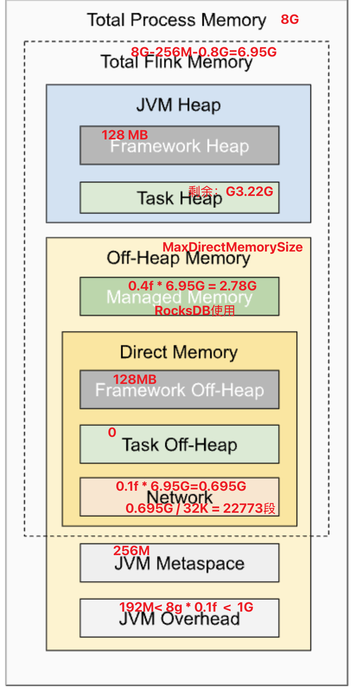

# Memory

- Framework Heap: 固定保留（默认 128 MB），Flink 框架自身运行时开销（日志、metrics、RPC）。
- Framework Off-Heap: 固定保留（默认 128 MB），框架自身需要的少量 direct memory。

- JVM Metaspace / CodeCache : JVM 层开销：类元数据、JIT 编译缓存。
- JVM Overhead: JVM 运行额外保留：GC 元数据、线程栈、内部缓冲区。

## Network Memory (Off-Heap)
- 由 NetworkBufferPool 管理，用于 Shuffle、数据传输（ResultPartition / InputGate 的 Buffer）。
- NetworkBufferPool = TM 级的固定总量全局池，负责创建与再分配；
- 池化内存：通过LocalBufferPool动态分配和回收
- 非池化内存：直接分配给特定组件（如RemoteInputChannel）

| 组件 | 与 LocalBufferPool 的关系 |
|------|--------------------------|
| **NetworkBufferPool** | LocalBufferPool 的唯一创建者和管理者 |
| **ResultPartition** | 每个实例拥有一个 LocalBufferPool，用于管理输出缓冲区 |
| **SingleInputGate** | 每个实例拥有一个 LocalBufferPool，用于管理输入缓冲区 |

### MemorySegment
MemorySegment 是 Flink 内存管理的基本单元
- NetworkBufferPool 创建和管理关于 network（Off-heap memory） 相关的：
  - NetworkBufferPool 是 MemorySegment 的"总管家"，负责 MemorySegment 的创建、分配、回收和监控。
  - MemorySegment 则是 NetworkBufferPool 管理的"士兵"，被分配到各个 LocalBufferPool 中执行具体的网络数据传输任务。这种分层管理架构是 Flink 高性能网络通信的重要基础。
- MemoryManager 管理计算操作的内存（Heap/Off-Heap memory）

### Buffer
Buffer：主要在网络传输层（如Shuffle过程）中使用，作为数据传输的基本单元。
- ReadOnlySlicedNetworkBuffer：Netty Buffer
- NetworkBuffer： 内存使用的是 memorySegment（TODO copy几次？ 是零拷贝吗？）
- FileRegionBuffer：Java NIO ByteBuffer
- CompositeBuffer：多个 Buffer 组合成一个逻辑 Buffer，用于在 Shuffle 过程中合并多个 Buffer。

## Managed Memory
托管内存是Flink中由内存管理器（MemoryManager）统一分配和管理的堆外内存（off-heap memory）

### MemoryManager
- 为计算操作提供内存支持
- 排序、哈希表、缓存中间结果、RocksDB 状态后端
- 默认页大小为32KB，内存划分为等大小的MemorySegment

## Task Memory
- Task Heap: 存放算子逻辑对象、运行时数据结构（普通 Java 对象）
- Task Off-Heap: 默认不用，仅当用户 UDF 或外部库直接分配 DirectBuffer / JNI 内存时才需要配置（例如 Arrow、Parquet、原生 RocksDB）