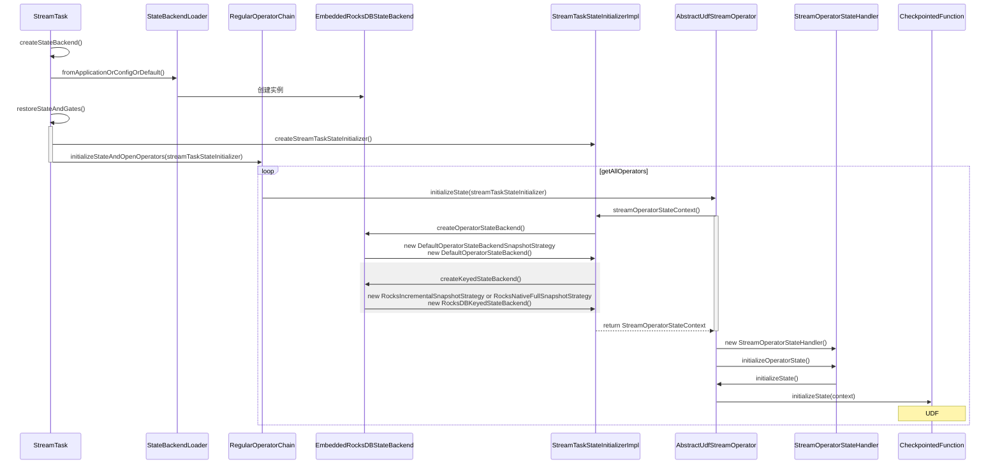
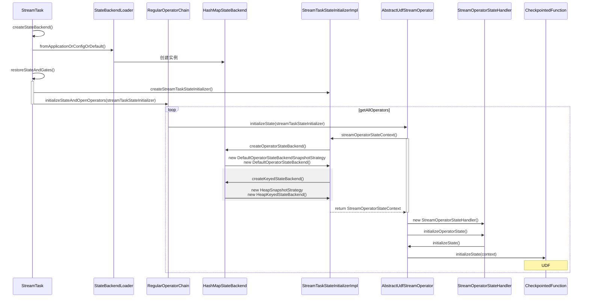

# State
## 什么是state？
- 无状态计算：如果一个任务只看当前这一条数据就直接输出结果（比如 map filter 算子），它不需要 State
- 有状态计算：如果一个任务需要记住之前的状态，才能处理当前这一条数据（比如 sum 算子），它需要 State

## State 用来存什么？
- KeyedState：每个 Key 有一个状态
  - sum 算子的状态就是每个 Key 的累加值
- OperatorState：每个 Subtask 有一个状态
  - Kafka Consumer 会使用 Operator State 来记录当前 Subtask 消费到 Kafka 哪个分区的哪个 Offset 了

## KeyedStateBackend / OperatorStateBackend
为了实现有状态计算，Flink 提供了两类 State Backend：
- OperatorStateBackend：只能存在 内存
- KeyedStateBackend：可以存在 内存 或 RocksDB


`conf.set(StateBackendOptions.STATE_BACKEND, "rocksdb")`，创建 DefaultOperatorStateBackend 与 RocksDBKeyedStateBackend


`conf.set(StateBackendOptions.STATE_BACKEND, "hashmap")`，创建 DefaultOperatorStateBackend 与 HeapKeyedStateBackend


## checkpoint 重构
旧版本的 MemoryStateBackend 和 FsStateBackend 混合了本地状态存储和容错存储的功能
新版本将其分离为两个独立的组件：
本地状态存储：由 HashMapStateBackend 或 RocksDBStateBackend 负责
容错存储：由 JobManagerCheckpointStorage 或 FileSystemCheckpointStorage 负责

```text
// 旧方式
env.setStateBackend(new FsStateBackend("file:///tmp/checkpoints/CheckpointExample"));
// KeyedStateBackend => HeapKeyedStateBackend
// OperatorStateBackend => DefaultOperatorStateBackend
env.setStateBackend(new RocksDBStateBackend("file:///tmp/checkpoints/CheckpointExample"));
// EmbeddedRocksDBStateBackend
// KeyedStateBackend => RocksDBKeyedStateBackend
// OperatorStateBackend => DefaultOperatorStateBackend

// 新方式
conf.set(StateBackendOptions.STATE_BACKEND, "rocksdb");
        conf.set(CheckpointingOptions.CHECKPOINT_STORAGE, "filesystem");
        conf.set(CheckpointingOptions.CHECKPOINTS_DIRECTORY, "file:///tmp/checkpoints/CheckpointExample");
```
## OperatorStateBackend

- [OperatorStateExample](https://github.com/juntaozhang/flink/tree/release-1.20-study/flink-examples/flink-examples-streaming/src/main/java/org/apache/flink/streaming/examples/my/state/OperatorStateExample.java), [OperatorStateUnionExample](https://github.com/juntaozhang/flink/tree/release-1.20-study/flink-examples/flink-examples-streaming/src/main/java/org/apache/flink/streaming/examples/my/state/OperatorStateUnionExample.java)
- OperatorStateBackend 管理的状态粒度是 Task Level（确切地说是 Subtask Level），即一个算子为每个subtask 维护了一个状态命名空间
- 需要实现 CheckpointedFunction 接口，`initializeState` 和 `snapshotState`
- 该例子展示了 task/subpartition 的状态
    * 假设 `PARALLELISM` 为 3，则ListState 有 3 个 State，每个 task 的 ListState 有 1 个 State
    * 假设 `PARALLELISM` 从 3 变成 2，则有一个 task 如果从 savepoint 恢复的时候，其中会有一个 ListState为 2 个 State，另一个 task ListState 有 1 个 State
- Mode 决定 Operator 在恢复过程中如何分配给任务的模式：

    | 特性       | SPLIT_DISTRIBUTE | UNION      | BROADCAST |
    |----------|------|------------|--------|
    | 状态分配方式   | 拆分分配 | 合并后全量分配    | 完全相同副本分配 |
    | 任务间状态重叠  | 无重叠  | 完全重叠       | 完全相同   |
    | Function | getListState() | getUnionListState() | getBroadcastState() |
    | 适用状态类型   | ListState | ListState  | BroadcastState |
    | 典型应用场景   | Kafka偏移量管理 | 全局去重       | 动态规则配置 |
    | 扩缩容影响    | 状态重新均匀分配 | 所有任务仍获得完整状态| 所有新任务获得相同状态 |

## KeyedStateBackend
- [ReducingStateExample](https://github.com/juntaozhang/flink/tree/release-1.20-study/flink-examples/flink-examples-streaming/src/main/java/org/apache/flink/streaming/examples/my/state/ReducingStateExample.java)
- Keyed State 可以理解成一个算子为每个子任务中的每个 key 维护了一个状态的命名空间
- 对于 Keyed State（即通过 getRuntimeContext().getState(...) 获取的状态），通常不需要手动实现 initializeState 和 snapshotState 方法
- 各状态类型的说明：

  | 状态类型 | 数据结构 | 聚合方式 | 状态大小 | 典型用途 |
  | :--- | :--- | :--- | :--- | :--- |
  | ValueState | 单值 | 无 (手动读写) | 小 | 最新值、简单计数 |
  | ListState | 列表 | 无 (存储所有元素) | 大 (存全量) | 缓存元素、会话窗口 |
  | ReducingState| 单值 | 增量聚合 (Reduce) | 小 (存结果) | 求和、最大值 |
  | AggregatingState| 单值 | 增量聚合 (Reduce) | 小 (存结果) | 求和、最大值 |
  | MapState | 键值对 | 无 (结构化存储) | 中/大 | 维表关联、复杂对象 |


### State Backend Type

| 维度 | RocksDB (State Backend) | ForSt (State Backend) |
| :--- | :--- | :--- |
| 架构模式 | 存算一体 (本地磁盘) | 存算分离 (远程存储) |
| 存储位置 | TaskManager 的本地 SSD 磁盘 | 远程分布式文件系统 (DFS) |
| 状态访问 | 同步阻塞 (Sync) | 异步非阻塞 (Async) |
| 扩容方式 | 垂直扩展 (加磁盘/内存) | 水平扩展 (计算与存储独立伸缩) |
| 恢复速度 | 慢 (需下载 PB 级数据) | 极快 (直接引用远程文件) |
| 适用场景 | 超低延迟、大状态、本地化部署 | 云原生、K8s、弹性伸缩、冷热混合 |


RocksDB Compaction
基于云函数（FaaS, Function as a Service）
基于云函数的即时扩容，峰值来了横向扩很多 worker，峰过即退；但要承担网络传输与平台冷启动等现实成本

TerarkDB Compaction
- RocksDB 的增强版存储引擎
- 无需解压即可检索

