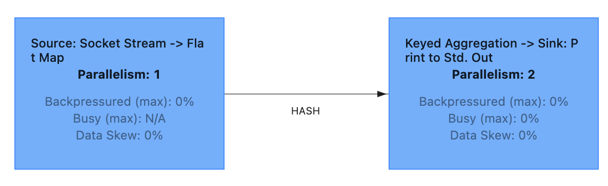
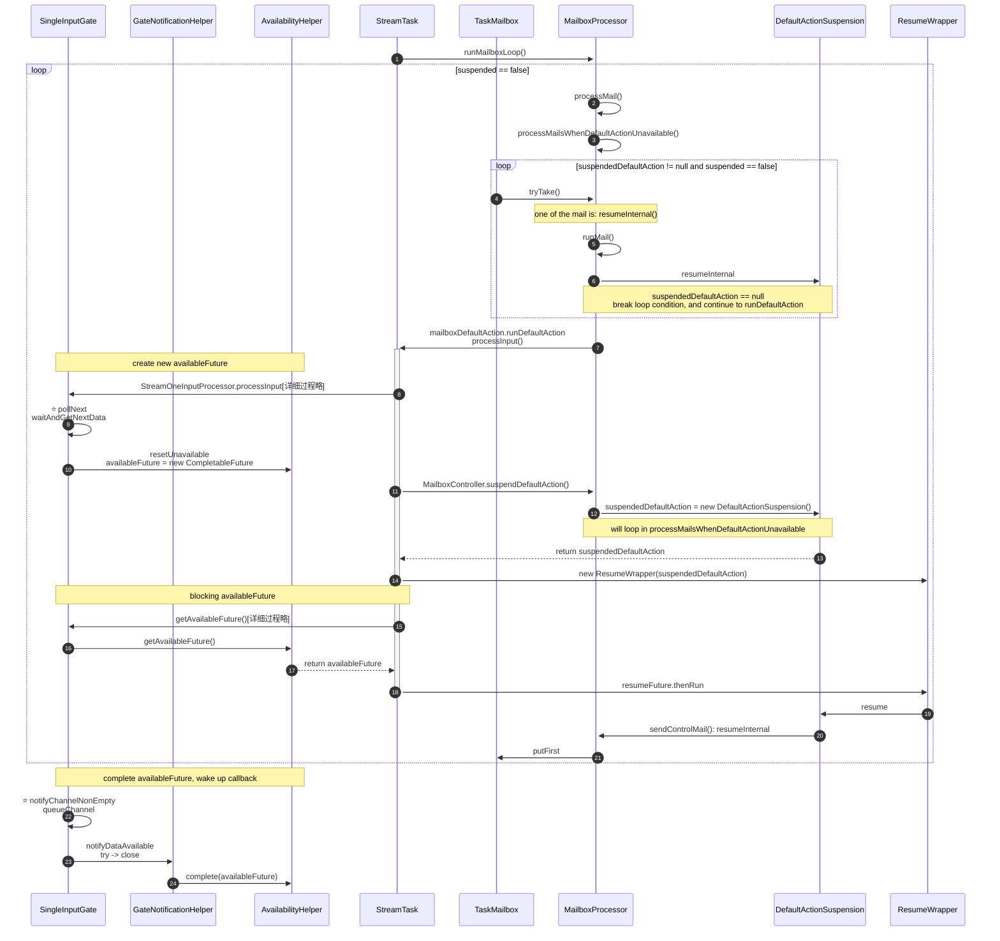
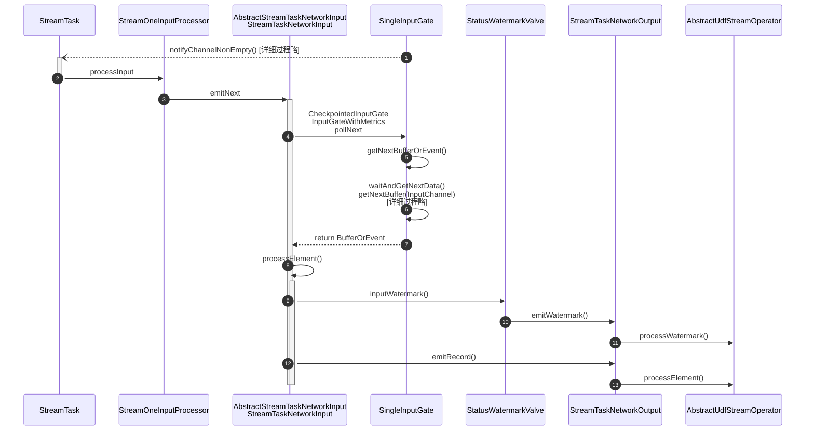
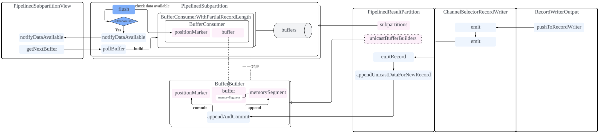
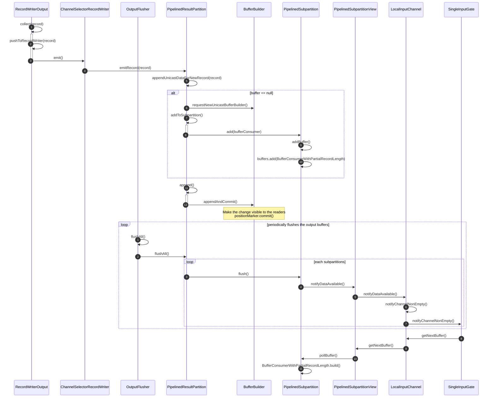
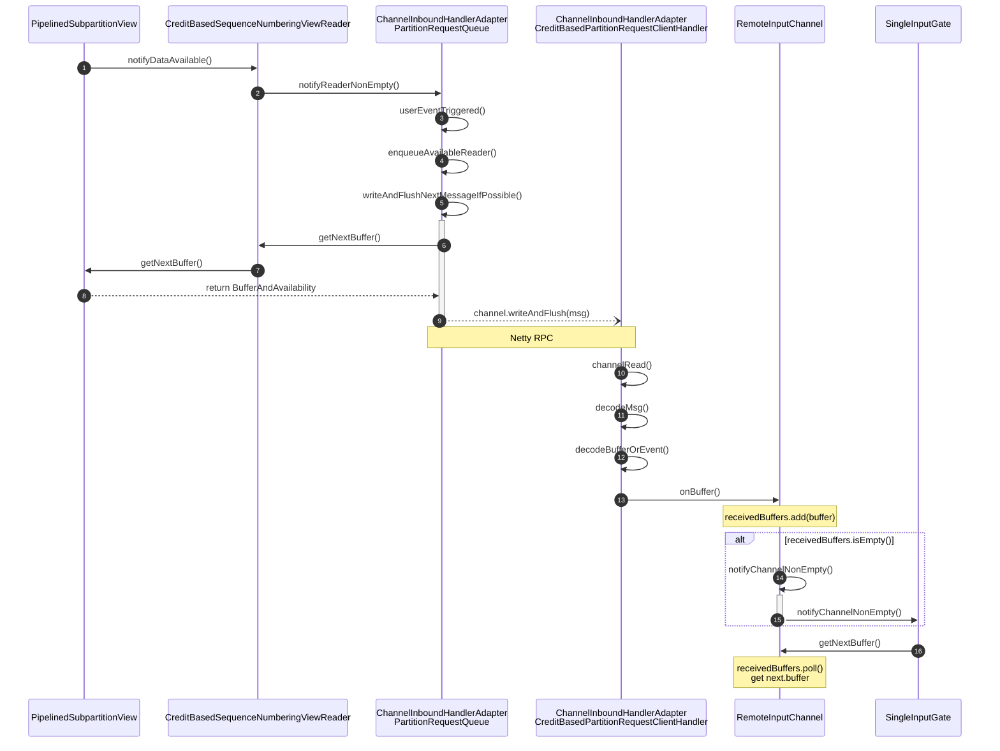

# StreamTask


1.该图展示了 [WordCountExample](https://github.com/juntaozhang/flink/tree/release-1.20-study/flink-examples/flink-examples-streaming/src/main/java/org/apache/flink/streaming/examples/my/WordCountExample.java) 的任务执行流程，包括 Source、Map、KeyBy、Sum 等算子。
- SourceStreamTask 中包括：Source、Map，涉及到operator：
  - StreamSource
  - StreamFlatMap
- OneInputStreamTask 中包括：KeyBy、Sum、print，涉及到operator：
  * StreamGroupedReduceOperator
  * StreamSink

2.我们先定义 OneInputStreamTask 是 Downstream， SourceStreamTask 是 Upstream:
- Upstream 中经过 operators 处理之后 通过 `RecordWriterOutput.collect` 方法发送到 `PipelinedSubpartitionView`
- 然后通过 `PipelinedSubpartitionView` 发送到 Downstream
  - 如果是本地，通过 [LocalInputChannel](task.md#pipelinedsubpartitionview) 发送数据到 Downstream 的 `SingleInputGate`
    - 通过 `OutputFlusher` notifyDataAvailable 通知 Downstream 的 `SingleInputGate` 数据就绪
  - 如果是远程，通过 [RemoteInputChannel](task.md#remoteinputchannel) 发送数据到 Downstream 的 `SingleInputGate`
    - 通过 RPC Netty handler 中处理的（`onBuffer`），然后notifyChannelNonEmpty 通知 Downstream 的 `SingleInputGate` 数据就绪
- Downstream 的 `SingleInputGate` 接收到 `notifyChannelNonEmpty`，通过 [MailboxProcessor](task.md#mailboxprocessor) 中复杂的消息处理，通知 `OneInputStreamTask.processInput`，进而获取数据(`pollNext`)
- [StreamTaskNetworkInput.processElement](task.md#pollnext) 处理 record 或者 watermark，经过 `StreamTaskNetworkOutput` 发送到 `StreamGroupedReduceOperator` 和 `StreamSink` 处理

## MailboxProcessor
优先执行 Task 的核心数据处理逻辑runDefaultAction(processInput)，无数据时处理邮箱中的控制消息，数据就绪后立即切回业务处理，通过状态标记完成无缝切换，保障 Task 线程的高效串行调度
- 主循环 (`runMailboxLoop`): MailboxProcessor 维护一个主循环，只要未被挂起 (suspended == false)，该循环就会持续运行。
- 默认动作与邮件处理:
    * 当存在默认动作（`runDefaultAction`，通常对应处理输入数据流 `processInput`）且该动作就绪时，循环会优先执行默认动作。
    * 当默认动作不就绪时（例如，输入网关 `SingleInputGate` 没有可读的数据，`suspendedDefaultAction` 不为空），`processMailsWhenDefaultActionUnavailable` 会被调用，开始处理 Mailbox
      队列中的邮件（如控制消息）。
- 就绪状态管理:
    * 默认动作的就绪状态由 `suspendedDefaultAction` 是否为 null 来判断。
    * 当 SingleInputGate 等组件有新数据可用时（例如，通过 notifyChannelNonEmpty），会触发 availableFuture，进而执行 resumeInternal 逻辑。
    * resumeInternal 会将 suspendedDefaultAction 设置为 null，表示默认动作现在就绪。



## SingleInputGate

在例子中，两个映射子任务并行产生中间结果，形成两个分区（分区1和分区2）。每个分区进一步划分为两个子分区——每个并行简化子任务。
- SingleInputGate 是按逻辑输入源划分的，而不是按物理分区划分的
- 一个上游 JobVertex (即使有多个并行度) -> 一个 `SingleInputGate`
- SingleInputGate 内部的 InputChannel 可以是 Local+Remote 混合
```text
                           Intermediate result
              +-----------------------------------------+
              |                      +----------------+ |              +-----------------------+
+-------+     | +-------------+  +=> | Subpartition 1 | | <=======+=== | Input Gate | Reduce 1 |
| Map 1 | ==> | | Partition 1 | =|   +----------------+ |         |    +-----------------------+
+-------+     | +-------------+  +=> | Subpartition 2 | | <==+    |
              |                      +----------------+ |    |    | Subpartition request
              |                                         |    |    |
              |                      +----------------+ |    |    |
+-------+     | +-------------+  +=> | Subpartition 1 | | <==+====+
| Map 2 | ==> | | Partition 2 | =|   +----------------+ |    |         +-----------------------+
+-------+     | +-------------+  +=> | Subpartition 2 | | <==+======== | Input Gate | Reduce 2 |
              |                      +----------------+ |              +-----------------------+
              +-----------------------------------------+
```

### notifyChannelNonEmpty

InputChannel 通知 InputGate 数据可用，InputGate 会将数据加入到队列中。 详细过程见 [MailboxProcessor](task.md#mailboxprocessor):
- 通过 `notifyDataAvailable` complete `availableFuture`, 唤醒 `getAvailableFuture` 阻塞的线程
- `getAvailableFuture` 回调 把 `resumeInternal`加入到主线程的 Mailbox 中，唤醒 `runDefaultAction`
- `runDefaultAction` 为 `processInput` 处理数据，进而调用 `pollNext` 获取具体数据
- `pollNext` 后续从 `InputChannel.getNextBuffer` 获取具体数据

### pollNext
NonBlocking call for next BufferOrEvent.
`getNext`:Blocking call waiting for next BufferOrEvent.

`SingleInputGate.pollNext` 在 `StreamTask` 中，负责从 `InputChannel` 中获取数据。具体流程如下：



## PipelinedSubpartitionView
PipelinedSubpartition 的对外视图接口，主要涉及以下两个方法：
- notifyDataAvailable: 通知 SingleInputGate 数据可用
- getNextBuffer: 提供 SingleInputGate `getNextBuffer`

`notifyDataAvailable` 通知 SingleInputGate 数据可用，SingleInputGate 会调用 `getNextBuffer` 来获取数据。

LocalInputChannel 调用 getNextBuffer 时，会从 PipelinedSubpartitionView 中获取 Buffer

- Upstream `collect` 输出数据
- OutputFlusher 循环 `flush` and `notifyDataAvailable` Downstream




## RemoteInputChannel
- onBuffer：
    - 为什么 wasEmpty 才 notifyChannelNonEmpty 后续消费？
      - 因为 SingleInputGate.getNextBuffer 正在消费数据，nextDataType 不为 None
      - processInput 还会继续调用 getNextBuffer，直到 nextDataType 为 None
- getNextBuffer: 从 receivedBuffers 中获取 Buffer


