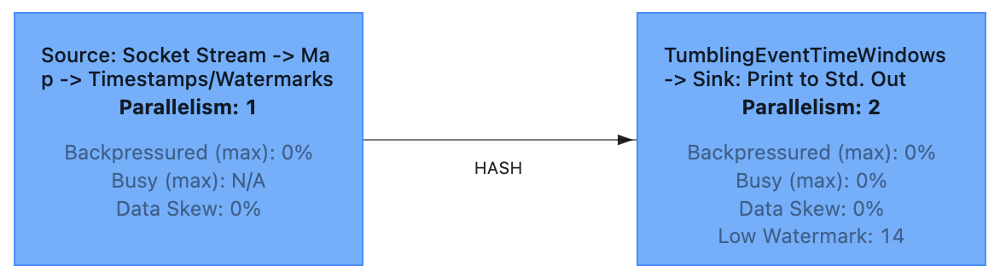
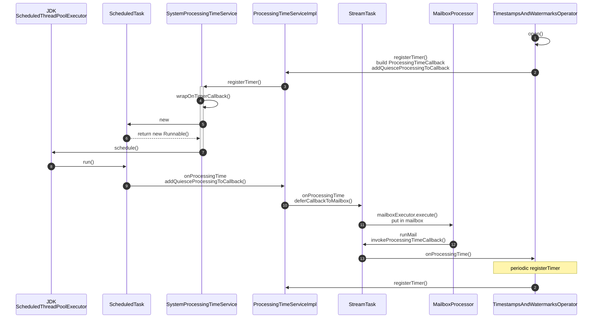
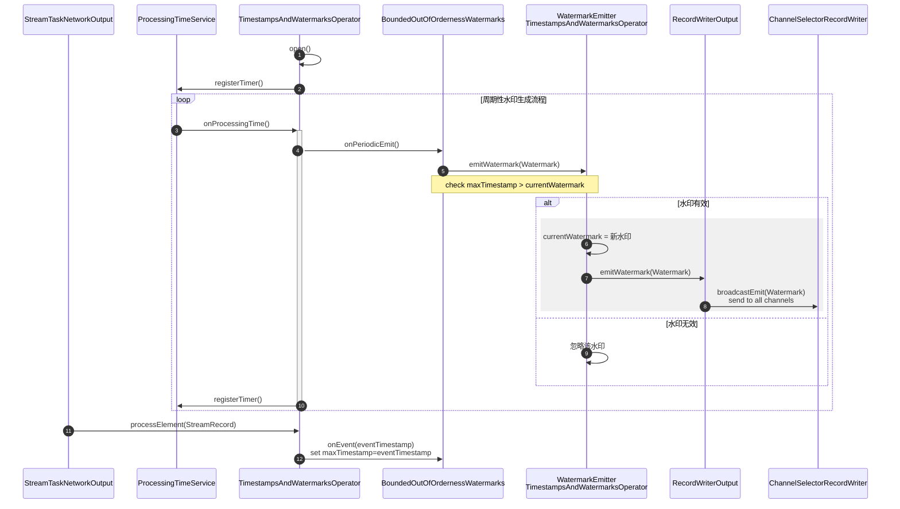
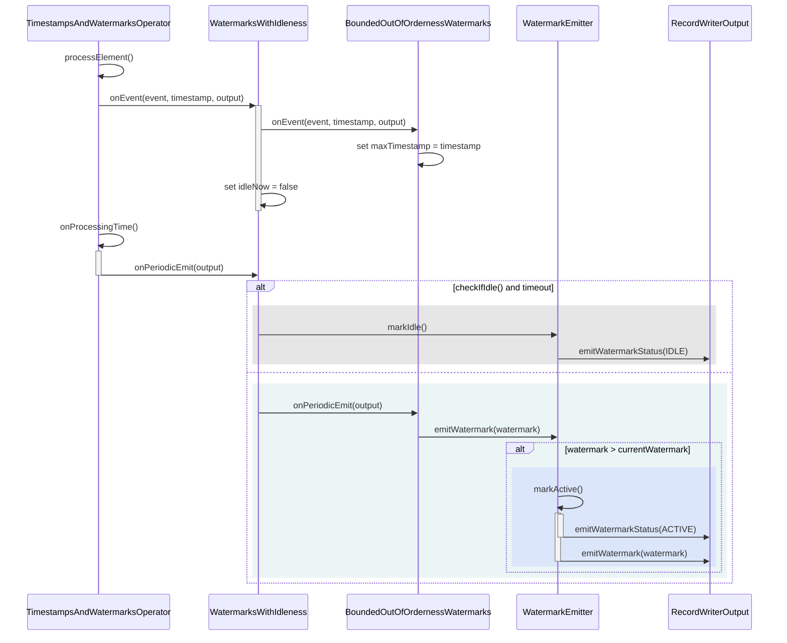
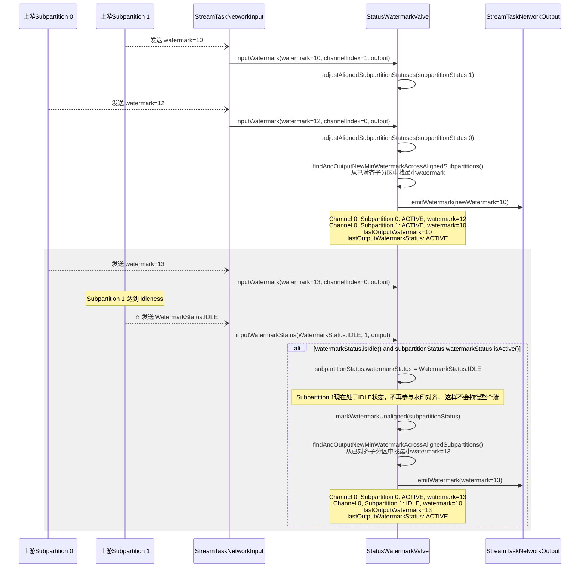

# Watermark

- 原因：一批数据在传输 / 消费过程中，到达 Flink 的顺序，和数据自身「事件时间的先后顺序不一致」，这种数据就是乱序数据。
- 引入 Watermark 机制解决事件时间下的乱序 / 迟到问题：
  -Watermark 是数据流的时间戳标记，本质是 Long 类型毫秒值；
    - Watermark 的核心特性：单调递增、仅作用于 Event Time、随数据流流动；
    - 乱序场景计算公式：Watermark = 最大事件时间 - 允许延迟时间；
- Watermark 核心作用：告知 Flink「某个事件时间前的所有数据已到齐」，用于判定事件时间进度、触发窗口计算

该图展示了 [WindowWatermarkExample](https://github.com/juntaozhang/flink/tree/release-1.20-study/flink-examples/flink-examples-streaming/src/main/java/org/apache/flink/streaming/examples/my/WindowWatermarkExample.java)
的任务执行流程，包括 Source、Map、assignWatermark、KeyBy、window、aggregate、print 等算子。

- SourceStreamTask 中包括：Source、Map、assignWatermark，涉及到 operator：
    - StreamSource
    - StreamFlatMap
    - TimestampsAndWatermarksOperator
- OneInputStreamTask 中包括：KeyBy、window、aggregate、print，涉及到 operator：
    - WindowOperator
    - StreamSink

## outOfOrderness

- 配置：outOfOrderness = 2 (允许2个时间单位的乱序)
- Watermark = max(已处理事件时间) - outOfOrderness
- 窗口触发示例 (滚动窗口，窗口大小=5)
- allowedLateness = 1

| Data Arrival Time | 1   | 2     | 3       | 4               | 5                 | 6                   | 7                     | 8                       | 9                                  | 10             | 11                 |
|-------------------|-----|-------|---------|-----------------|-------------------|---------------------|-----------------------|-------------------------|------------------------------------|----------------|--------------------|
| Event Time        | 1   | 3     | 2       | 6               | 4                 | 5                   | 7                     | 3                       | 9                                  | 3              | 12                 |
| watermark         | -   | 1     | 1       | 4               | 4                 | 4                   | 5                     | 5                       | 7                                  | 7              | 10                 |
| window            | [1] | [1,3] | [1,3,2] | [1,3,2] [6] | [1,3,2,4] [6] | [1,3,2,4] [6,5] | [1,3,2,4] [6,5,7] | [1,3,2,4,3] [6,5,7] | [6,5,7,9]                          | [6,5,7,9]      | [6,5,7,9] [10] |
| print             | -   | -     | -       | -               | -                 | -                   | [1,3,2,4]             | [1,3,2,4,3]             | -                                  | -              | [6,5,7,9]          |
| note              | -   | -     | -       | -               | -                 | -                   | -                     | -                       | 7>5+1, which will drop window[0,5) | drop late data | -                  |

- OutOfOrderness 是给【乱序数据】留缓冲，阻止窗口过早关闭，上述例子中：
    - 第3条数据：乱序数据到达时间为 2，虽然有数据到达的事件时间为 3，但是允许延迟时间为 2，所以Watermark 为
      1，该数据被接收，窗口[0,5) 数据为 [1,3,2]
    - 第4条数据：事件时间为 6，但是允许延迟时间为 2，所以Watermark 为 4 = 6 - 2，window [0,5)不会被触发

## allowedLateness
- 作用在 WindowOperator 上（WindowedStream API的方法）
- allowedLateness 是给【迟到数据】留缓冲，允许窗口关闭后补收数据
    - 第8条数据：事件时间为 3，虽然上条数据事件时间为 7，Watermark 为 5 < 5 + 1，已经触发了窗口[0,5)数据处理，但是允许延迟时间为
      1，该数据被接收，窗口[0,5) 数据为 [1,3,2,4,3]
    - 第9条数据：事件时间为 9，允许延迟时间为 1，Watermark 为 7 > 5 + 1，导致窗口[0,5) 已关闭；下一条数据到达时间为
      3，窗口已经被关闭，所以该数据被接收。

## TimestampsAndWatermarksOperator

### ProcessingTimeService

Periodic watermark generation:
- 主要依据JDK ScheduledThreadPoolExecutor 实现周期性触发，周期为200ms
- 为保证在主线程执行该逻辑，需要通过 `deferCallbackToMailbox` 提交 `MailboxProcessor`执行
- `onProcessingTime` 会根据 maxTimestamp 生成 watermark 发送到下游算子

### WatermarkEmitter
水印发送流程:
- `TimestampsAndWatermarksOperator.processElement` 处理事件时，会根据 record 最新的事件时间更新 `BoundedOutOfOrdernessWatermarks.maxTimestamp`
- `BoundedOutOfOrdernessWatermarks` 会在 `onPeriodicEmit` 中根据 `maxTimestamp` 生成 watermark

## idleness
- [TwoWindowWatermarkExample](https://github.com/juntaozhang/flink/tree/release-1.20-study/flink-examples/flink-examples-streaming/src/main/java/org/apache/flink/streaming/examples/my/TwoWindowWatermarkExample.java)
- 该机制解决了部分上游数据源空闲时拖慢整个流处理水印进度的问题，确保水印基于活跃数据源正常推进，避免处理停滞。
- 基于系统时钟判断的，当流在指定时间内没有收到新事件时，被认为是空闲状态。

### WatermarksWithIdleness
当 `WatermarkStrategy.withIdleness` 配置了空闲超时时间时，`WatermarksWithIdleness` 会根据流的活动状态来执行以下方法：
- `markIdle` 方法通过系统时间来检测流的空闲状态，避免单个空闲流阻塞整个应用的 Watermark 进展
- `markActive` 方法在流收到新事件时被调用，将流标记为活动状态

### StatusWatermarkValve

- 正常流程
  - StatusWatermarkValve 类内部维护了一个名为 `alignedSubpartitionStatuses` 的优先队列（最小堆），用于存储所有已对齐的子分区状态
  - 这个优先队列按照子分区的 watermark 值进行排序，最小的watermark值排在队列顶部，这样可以高效地找到当前所有已对齐子分区中的最小watermark。
  - 取所有输入流的最小watermark作为全局 lastOutputWatermark
  - `adjustAlignedSubpartitionStatuses(SubpartitionStatus)`: 在子分区watermark值更新时，优先队列能够保持正确的排序状态
  - `findAndOutputNewMinWatermarkAcrossAlignedSubpartitions()`: lastOutputWatermark != 最小watermark，说明watermark 上涨了，需要更新 lastOutputWatermark，并发送新的watermark到下游算子

- 灰色部分：
  - Subpartition 1 为了不拖慢整个流，当它达到 Idleness 时，会将其 watermarkStatus 标记为 IDLE
  - StatusWatermarkValve 会从 `alignedSubpartitionStatuses` 中移除 Subpartition 1，因为它的 watermarkStatus 变成了 IDLE
  - `findAndOutputNewMinWatermarkAcrossAlignedSubpartitions()` 从已对齐子分区中找最小watermark=13

