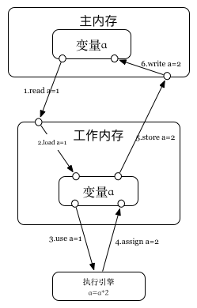
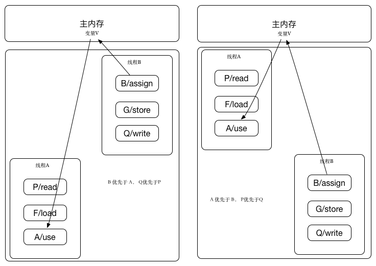
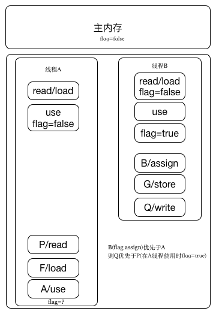

## 内存间交互操作
* lock: 作用主内存
* unlock: 作用主内存
* read/load：这两个操作顺序执行,不能单独出现;主内存的变量=>工作内存的变量
* use: 作用工作内存,把工作内存变量传给执行引擎
* assign: 作用工作内存,把执行引擎收到的值赋给工作内存变量
* store/write: 这两个操作顺序执行;不能单独出现;工作内存的变量=>主内存的变量

通过主内存与工作内存交互来理解这些操作:

**注意:**
* 不允许`工作内存`直接使用未初始化的变量

## 内存模型的3个特征
* 原子性
* 顺序性
* 可见性

## happens-before（先行发生）
actionA先行发生actionB，就是说A对B可见（B执行时可以看到A的执行结果）
* 线程启动/终结规则
* volatile规则
* lock规则
* Order规则,线程内书写前面的操作先行发生书写后面的操作
* 中断规则 

## volatile禁止重排序原理
如下图，1、2保证可见性，3禁止重排序

* 1.A动作之前必关联P、F动作
* 2.B动作自后必然伴随G、Q动作
* 3.A优先于B，则P优先于Q（这个比较显然）；B优先于A，则Q优先于P

例如：线程B对变量flag=true同步优先于A线程使用

