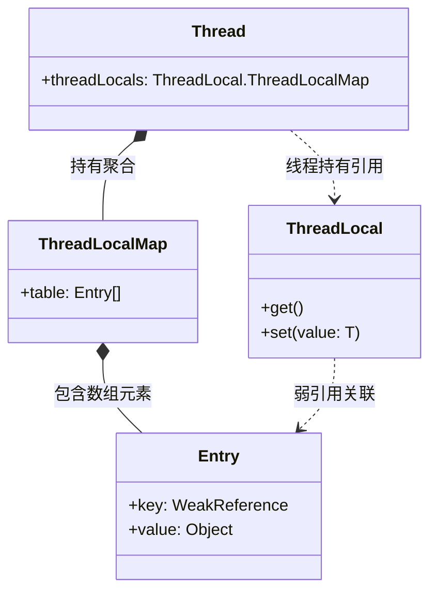
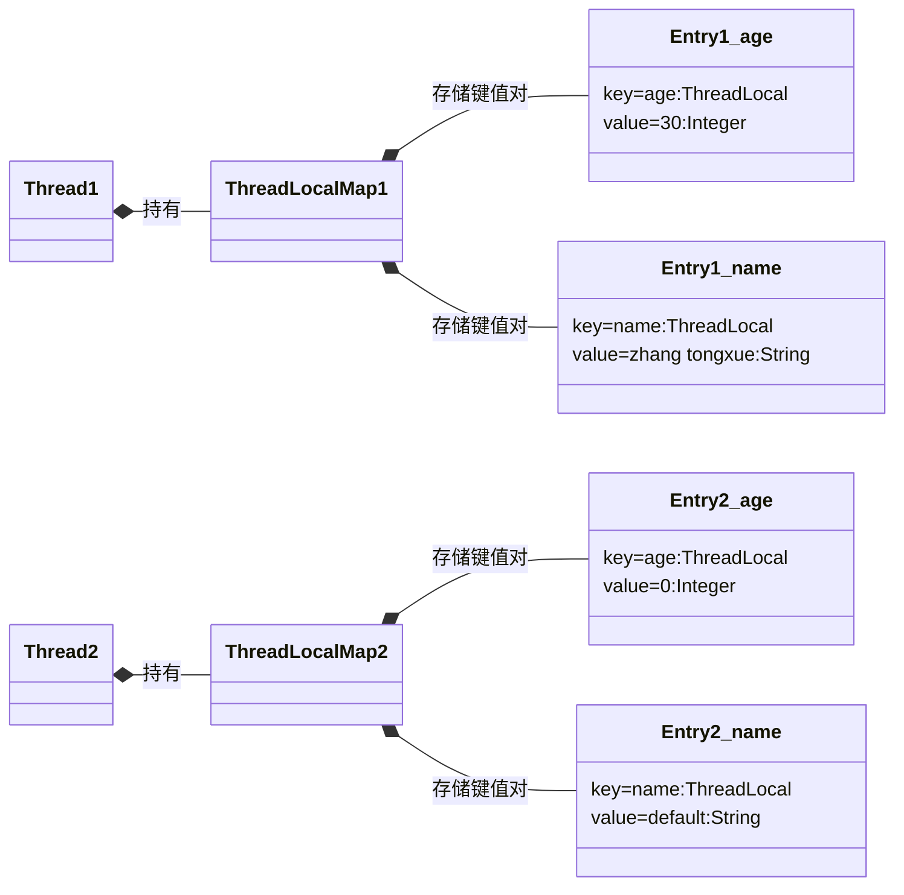

# Java ThreadLocal源码分析

## 1.举例
```java
public static class MyExample {

    private static ThreadLocal<Integer> age = ThreadLocal.withInitial(() -> 0);
    private static ThreadLocal<String> name = new ThreadLocal<String>() {
      public String initialValue() {
        return "default";
      }
    };

    public static void main(String[] args) {
      new Thread(() -> {
        age.set(30);
        name.set("zhang tongxue");
        System.out.println(Thread.currentThread() + " " + age.get());
        System.out.println(Thread.currentThread() + " " + name.get());
      }).start();
      new Thread(() -> {
        try {
          Thread.sleep(200);
        } catch (InterruptedException ignore) {
        }
        System.out.println(Thread.currentThread() + " " + age.get());
        System.out.println(Thread.currentThread() + " " + name.get());
      }).start();
    }
  }
```

执行结果:
```log
Thread[Thread-0,5,main] 30
Thread[Thread-0,5,main] zhang tongxue
Thread[Thread-1,5,main] 0
Thread[Thread-1,5,main] default
```

## 2.分析
### 类结构


### 实际存储结构


### 源码
set方法
```java
    public void set(T value) {
        Thread t = Thread.currentThread();//获取当前线程
        ThreadLocalMap map = getMap(t);//t.threadLocals 获取线程中的Map
        if (map != null)
            map.set(this, value);//Map常规散列表
        else
            createMap(t, value);
    }
```

get方法
```java
    public T get() {
        Thread t = Thread.currentThread();
        ThreadLocalMap map = getMap(t);
        if (map != null) {
            ThreadLocalMap.Entry e = map.getEntry(this);//散列表,先求hashcode
            if (e != null) {
                @SuppressWarnings("unchecked")
                T result = (T)e.value;
                return result;
            }
        }
        return setInitialValue();
    }

```

### ThreadLocalMap 的 Entry 为什么要把 key（） 设计为 WeakReference？

```java
static class Entry extends WeakReference<ThreadLocal<?>> {
    /** The value associated with this ThreadLocal. */
    Object value;

    Entry(ThreadLocal<?> k, Object v) {
        super(k); // 这里！Entry 继承了 WeakReference，并将 key (k) 传给了父类
        value = v;
    }
}
```

`ThreadLocal` 强引用一旦被释放；按理说这个 `ThreadLocal` 应该在用完后被 GC；但它作为 `ThreadLocalMap` 中 entry 的 key，如果是强引用：

- 会被 `ThreadLocalMap` 强引用
- `ThreadLocalMap` 又被线程引用
- 线程又可能长时间活着（如线程池）

### 即便key是弱引用为什么还是会内存泄露？
如果一个 ThreadLocal 对象被设置了值（set），随后外部强引用断开，但该 ThreadLocal 再也没有被任何代码访问过（没有 get、set 或 remove），那么这个 Entry 对应的 Value 将会一直存在于内存中，直到线程死亡。

JDK21 使用 `ScopedValue` 替代，不可变变量
```java
private static final ScopedValue<Integer> COUNT = ScopedValue.newInstance();

public void testModify() {
    // 第一层作用域：绑定值为 1
    ScopedValue.where(COUNT, 1).run(() -> {
        System.out.println("外层: " + COUNT.get()); // 输出 1

        // --- 假装要“修改” ---
        // 第二层作用域：绑定值为 2 (遮蔽了外层的 1)
        ScopedValue.where(COUNT, 2).run(() -> {
            System.out.println("内层(修改后): " + COUNT.get()); // 输出 2
            // 在这里，COUNT 变成了 2
        });
        // --- “修改”结束 ---

        // 回到外层，值依然是 1，没有受影响
        System.out.println("外层(恢复): " + COUNT.get()); // 输出 1
    });
}
```

## 总结
- 每个线程私有一份拷贝的变量，这里实现非常巧妙，也容易会被面试官问你如何设计Threadlocal（假如你不知道实现的话）
- ThreadLocal只是对需要存储的对象的管理，而存储实际是由当前Thread负责。
- 使用ThreadLocal可以使对象达到线程隔离的目的。同一个ThreadLocal操作不同的Thread，实质是各个Thread对自己的变量操作。

### 使用场景
- 为什么要使用 ThreadLocal，个人感觉有两个原因:
	- 1.是与其它线程的隔离
	- 2.是可以在一个线程的生命周期中使用同一个对象
	
在一些业务处理中，组件之间处理同一个业务，需要处理很多上下文信息（输入，调用参数，中间结果），往往通过 ThreadLocal 方式比较优雅。