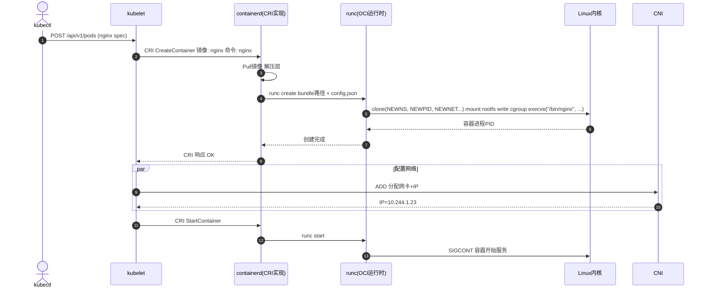
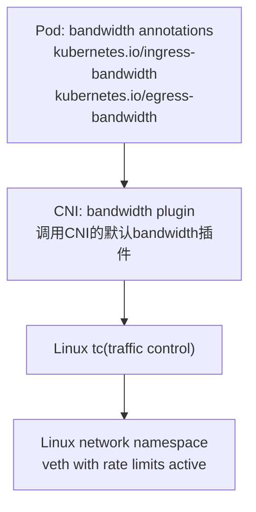
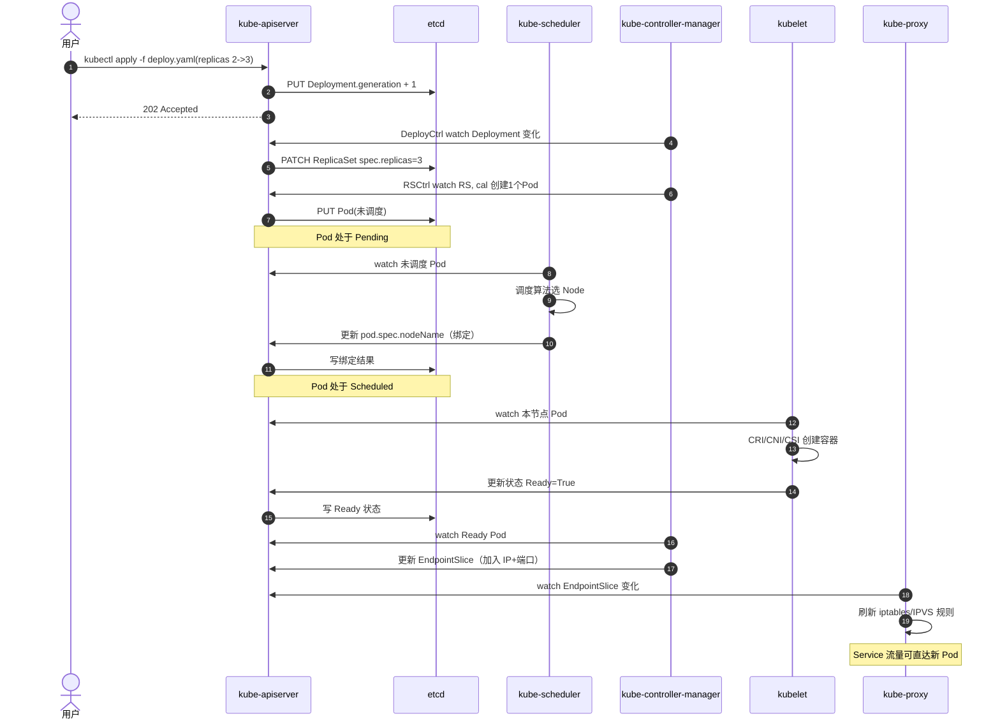

## 容器技术概述
<details>
<summary>Container与VM对比？</summary>

| Dimension | Container (容器) | VM (虚拟机)                                   |
|-----------|----------------|--------------------------------------------|
| Startup Speed | Seconds (秒或毫秒) | Minutes (分钟级)                              |
| Resource Usage | Lower (shared kernel) 较低（共享内核） | Higher (full OS) 较高（需完整操作系统）               |
| Isolation | Process level, shared kernel 进程级隔离，共享内核 | Full isolation, own kernel 完全隔离，每个 VM 独立内核 |
| Performance Overhead | Very low 极低（进程级开销） | Higher 较高（虚拟化整个操作系统）                       |
| Deployment Flexibility | 非常灵活，易迁移 | 一般，但镜像较大                                    |
| Security | Lower isolation (shared kernel) 隔离度较低（共享内核） | Higher isolation (own kernel) 隔离度较高（独立内核）  
</details>
<details>
<summary>容器依赖Linux 哪些技术？</summary>

Namespace 保证容器内部进程和外部环境互不影响，创造独立的运行空间。
Linux 内核中的Namespace 技术实现了进程级别的资源隔离。常见的Namespace 类型包括：
- PID Namespace：进程ID 隔离，容器进程间互不可见；
- Network Namespace：提供独立的网络栈、虚拟网络接口；
- Mount Namespace：文件系统挂载点隔离，容器拥有独立的文件系统；
- IPC Namespace：进程间通信（IPC）隔离；
- UTS Namespace：主机名、域名隔离；
- User Namespace：用户和用户组隔离。

Cgroups 是Linux 内核的一种特性，用于实现容器资源管理，包括： 
- 限制进程对CPU、内存、磁盘I/O 和网络带宽等资源的使用；
- 确保容器之间的资源隔离，避免资源竞争导致系统性能下降；
- 提高系统稳定性与资源利用效率，实现资源公平分配。


</details>
<details>
<summary>docker 与 kubernates 关系？</summary>

| 维度 | Docker | Kubernetes |
|------|--------|------------|
| 核心定位 | 本地\/单机容器构建与运行引擎 | 集群级容器编排平台 |
| 关注点 | 镜像构建 \`docker build\`、镜像分发、单机生命周期管理 | 调度、伸缩、滚动更新、服务发现、故障自愈 |
| 接口演进 | 早期直接对接 dockershim | 采用统一 CRI 接口 |
| 运行时关系 | 内部依赖 containerd 作为核心运行时 | 通过 CRI 调用 containerd、CRI-O 等 |
| 镜像兼容 | 生成 OCI\/兼容镜像格式 | 拉取并运行 OCI 镜像 |
| 误区澄清 | “必须与 Kubernetes 绑定”是误解 | 可使用多种容器运行时 |
| 开发与生产 | 本地开发体验友好 | 生产集群治理能力强 |
| 总结一句 | 提供镜像与容器构建运行工具 | 编排与管理大规模容器工作负载 |
</details>
<details>
<summary>容器进程管理工具？</summary>

**容器的进程管理工具**用于管理容器生命周期，包括容器的创建、运行、监控与终止，常见工具包括：
- Docker Engine：提供基础的容器运行、创建、销毁功能；
- containerd：符合OCI 标准的运行时，轻量、高效，Kubernetes 默认支持的容器运行时；
- CRI-O：专为Kubernetes 设计的容器运行时，精简高效，更易于Kubernetes 集成；
- Docker shim（已弃用）

**底层运行时**，Docker 和CRI-O 等工具使用的底层运行时，负责实际进程创建与管理：
- runc：符合OCI 规范的容器运行时，负责实际启动和管理容器进程；
- crun：更快更小c版本。
- kata-containers：VM-based 容器运行时，提供更强的隔离性和安全性。
- youki：用 Rust 编写的 OCI 容器运行时，注重安全性和性能。
</details>
<details>
<summary>OCI 是什么？</summary>

OCI（Open Container Initiative）是由Docker 和其他容器厂商共同制定的开源容器技术标准，
旨在定义容器镜像与运行时环境的统一规范。

- OCI Runtime Specification（运行时规范）：
  - 描述容器运行时必须提供的标准接口和环境；
  - 规范了容器的生命周期（创建、启动、停止、删除等）；
  - 定义了容器状态与操作接口（如创建、启动、停止、删除容器的API 标准）。
- OCI Image Specification（镜像规范）：
  - 定义了容器镜像的标准结构；
  - 镜像的元数据（Manifest、配置文件）以及层（Layers）的定义；
  - 镜像存储、分发和管理的统一规范。
</details>
<details>
<summary>CRI 是什么？</summary>

（Container Runtime Interface，简称 CRI）是 Kubernetes 定义的一套标准化接口，用于规范 Kubernetes（具体是 kubelet 组件）与底层容器运行时（如 Docker、containerd、CRI-O 等）之间的通信方式。它的核心作用是解耦 Kubernetes 与具体的容器技术实现。

在大型服务器环境中，尤其是在 Kubernetes 集群场景下，containerd 和 CRI-O 更为常用。

Containerd and CRI-O are first-class CRI runtimes;
Docker required shim.
</details>
<details>
<summary>OCI 与CRI 的对比与关系？</summary>

CRI 是 Kubernetes 上层调用容器运行时的接口标准；OCI 是底层镜像与运行时的行业标准，CRI 实现借助 OCI 保证跨生态一致性：

| 维度   | OCI | CRI |
|------|-----|-----|
| 定义性质 | 开放行业标准（镜像规范 + 运行时规范） | Kubernetes 为 kubelet 制定的 gRPC 接口规范 |
| 作用范围 | 规范镜像结构与按 config.json 启动容器生命周期 | 规范 kubelet 请求拉镜像、创建/启动/停止 Pod/容器 |
| 所在层级 | 底层：OCI Runtime 按规范执行（runc / crun / kata / youki 等） | kubelet → CRI → 实现（containerd / CRI\-O）→ OCI Runtime |
| 可替换性 | 多种 Runtime 实现可互换；镜像格式统一 | 多种实现（containerd / CRI\-O）；自身是接口不直接运行 |



</details>
<details>
<summary>CNI 网络插件原理与作用？</summary>

Kubernetes 网络接口规范为CNI（Container Network Interface），作用如下：
- 在Pod 创建与销毁时，为Pod **提供和释放网络资源**；
- 定义标准接口，允许第三方插件实现网络功能；
- **提供IP** **地址分配**、路由管理、网络隔离等功能。

典型CNI 插件包括：
- Flannel：简单易用，基于Overlay 网络；
- Calico：高性能，BGP 路由实现，支持网络策略；
- Cilium：eBPF 驱动的高效插件，支持微服务网络安全与观测

**Border Gateway Protocol**边界网关协议：
BGP是每个自治系统把自己的IP段和可达性通告给其他自治系统的协议。

**Overlay 网络**是在现有底层物理或三层 IP 网络（Underlay）之上，
通过封装隧道技术（如 VXLAN, GRE, Geneve）构建的逻辑虚拟网络。
它让不同节点上的端点（容器/虚拟机）像处于同一个二层或同一逻辑网段内通信，
而无需在物理网络中逐一配置复杂的路由或 VLAN。
</details>
<details>
<summary>什么是K8s immutable infrastructure？</summary>

> 不直接登录节点或容器内做手工修改；每次变更（代码、配置、依赖、基础镜像、二进制）都通过构建新镜像 + 更新声明式 YAML（Deployment/StatefulSet/ConfigMap/Secret 等）发布，由控制器用新实例替换旧实例，实现“替换而非原地修改”，所有状态源自 Git/镜像仓库的版本化工件。

即：
- any change (code, runtime deps, base OS libs) produces a new image and Kubernetes replaces Pods; 
you do not ssh in and edit live containers or nodes.
- config or cert updates can be versioned via new ConfigMap/Secret objects; rolling restart then pulls the new mounted data while the image stays the same.
</details>
<details>
<summary>镜像优化注意事项</summary>

- 使用多阶段构建（Multi-stage Build）：仅保留运行时必需的文件，删除构建工具、源码等冗余内容。
<pre>
# 第一阶段：构建（包含编译工具）
FROM golang:1.20 AS builder
WORKDIR /app
COPY . .
RUN go build -o myapp .
# 第二阶段：运行（仅包含二进制文件）
FROM alpine:3.18
COPY --from=builder /app/myapp /usr/bin/
CMD ["myapp"]
</pre>
- 使用精简基础镜像：优先选择 alpine、distroless（仅包含运行时依赖）等精简镜像，替代 ubuntu（数百 MB）、centos 等厚重基础镜像。
- 合并镜像层（减少层数）：Docker 镜像每层都会占用额外空间，通过 && 合并命令，减少层数
<pre>
# 不好的方式（多层）
RUN apt-get update
RUN apt-get install -y curl
RUN rm -rf /var/lib/apt/lists/*
# 优化方式（合并为一层）
RUN apt-get update && \
    apt-get install -y curl && \
    rm -rf /var/lib/apt/lists/*  # 清理缓存，进一步减小体积
</pre>
- 复用镜像层（提升存储效率）
    - 团队内部约定使用相同的基础镜像（如统一的 alpine:3.18 或自定义基础镜像），确保基础层被所有应用复用。
      示例：所有 Java 应用统一使用 openjdk:17-jre-alpine，而非各自使用不同版本的 JDK 镜像。
    - 镜像层是 “写时复制” 的，底层层（如基础镜像层）被修改会导致整个上层层失效。构建镜像时，将 不常变化的内容（如依赖库）放在底层，频繁变化的内容（如业务代码）放在上层
- 明确拉取策略
  - imagePullPolicy: IfNotPresent（默认）：节点本地有镜像时直接使用，不重复拉取（推荐）。
  - imagePullPolicy: Always：每次启动 Pod 都重新拉取镜像（仅用于开发环境或 latest 标签镜像）。
  - 最佳实践：生产环境镜像使用 固定版本标签（如 v1.2.3），并设置 imagePullPolicy: IfNotPresent，避免因 latest 标签导致的频繁拉取。
- 定时清理：删除未使用的镜像和层: 每次构建完成后，清理构建机上的临时镜像等
- 镜像仓库清理：删除过时版本
</details>
<details>
<summary>什么是etcd？</summary>

etcd 是CF的开源项目，是一个管理配置信息和服务发现（service discovery）的项目，
它的目标是构建一个高可用的分布式键值（key-value）数据库，
基于 Go 语言实现。
特点：
- 简单：支持 REST 风格的 HTTP+JSON API
- 可靠：支持分布式结构，基于 Raft 的一致性算法，Raft 是一套通过选举master来实现分布式一致性的算法。

kubernetes 使用 etcd 作为唯一持久化存储后端，
保存集群的所有状态数据（pod、service、configmap 等）的JSON定义和历史版本。

</details>


## Kubernetes 内部原理
<details>
<summary>kubernetes Master组件？</summary>

- etcd：Kubernetes集群的所有状态信息都需要持久存储于存储系统etcd中。
  > etcd不仅能够提供键值数据存储，而且还为其提供了监听（watch）机制，用于监听和推送变更。
  Kubernetes集群系统中，etcd中的键值发生变化时会通知到API Server，
  并由其通过watch API向客户端输出。基于watch机制，Kubernetes集群的各组件实现了高效协同。
- kube-API-Server：API Server负责输出RESTful风格的Kubernetes API，
  它是发往集群的所有REST操作命令的接入点，并负责接收、校验并响应所有的REST请求，
  结果状态被持久存储于etcd中。因此，API Server是整个集群的网关。
- kube-controller-mangager：负责确保集群实际状态始终与用户声明的期望状态保持一致。
    - 包含多个控制器（Controller），如 Node Controller、ReplicaSet Controller、Deployment Controller、Service Controller 等。
    - 定期对比集群实际状态和期望状态，进行自动修正。
- kube-scheduler：负责决定新创建的Pod 应部署到哪个节点。
    - 根据节点资源利用情况、Pod 对资源的需求做出决策；
    - 调度策略包括负载均衡、资源分配公平性、亲和性（Affinity）等；
</details>
<details>
<summary>Kubernetes Node组件？</summary>

- Node 节点是实际运行容器负载的机器，包括以下核心组件：
    - **Kubelet** 是节点上的主要代理，负责管理Pod 和容器的生命周期：
        - 监听API Server 的Pod 定义，确保容器按定义运行；
        - 监控容器状态，并定期向API Server 上报节点和Pod 状态；
        - 与容器运行时（如containerd、CRI-O）交互，拉取镜像、启动/停止容器。
    - **Kube-Proxy** 实现节点级别的网络代理与负载均衡：
        - 管理网络规则，实现Service 的虚拟IP 和负载均衡功能；
        - 支持IPtables、IPVS 等多种负载均衡模式；转发流量到后端Pod，支持多种负载均衡算法（如轮询、会话保持等）。
    - **Container Runtime** 容器运行时负责实际运行容器，如：
        - Containerd（最常见，轻量级、兼容OCI 与CRI）；
        - CRI-O（专为Kubernetes 优化的运行时）；
        - Docker（旧版本Kubernetes 默认运行时，已弃用Docker shim）。
        - 容器运行时通过CRI 接口与Kubelet 通信，负责容器的创建、运行、停止与删除。
</details>
<details>
<summary>Kubernetes 组件交互流程？</summary>

Kubernetes 各组件之间的典型交互流程如下：
- 用户通过kubectl 命令发送请求到API Server；
- API Server 验证请求并更新etcd 中的期望状态；
- Scheduler 从API Server 获取Pod 调度请求，进行节点选择并更新Pod 状态；
- Kubelet 定期访问API Server 获取节点分配任务，并调用容器运行时（如Containerd）启动容器；
- Controller Manager 定期对比集群实际状态和期望状态，进行自动修正；
- Pod 启动后，Kube-proxy 根据服务定义设置网络规则，实现服务发现和负载均衡。
</details>
<details>
<summary>Kubernetes 基本概念？</summary>

- Namespace：逻辑隔离多个资源与环境的命名空间，实现资源的隔离管理。
- Service：提供Pod 的负载均衡、服务发现机制。
- Deployment：定义Pod 的期望状态，控制Pod 的创建、更新与扩容缩容过程。
- ReplicaSet：Deployment 的副本控制器，确保指定数量的Pod 实例运行。
- Pod：Kubernetes 最小的可调度单元，由一个或多个容器组成，共享存储和网络。
</details>
<details>
<summary>ReplicaSet 和Deployment 的区别？</summary>

- ReplicaSet 负责确保指定数量的 Pod 副本在任何时间点都在运行。它直接管理 Pod 的生命周期。
- Deployment 是一种更高级别的抽象，管理 ReplicaSet。它提供了声明式更新、回滚等功能，简化了应用的发布和管理。
</details>
<details>
<summary>Kubernetes Workloads 资源类型？</summary>

- Deployment：定义Pod 的期望状态，控制Pod 的创建、更新、回滚与扩容缩容过程。
- StatefulSet：用于管理有状态应用（如数据库），为 Pod 提供稳定的名称、网络标识和存储，确保部署顺序和唯一性
- DaemonSet：确保每个节点上运行一个 Pod 副本，适用于日志收集、监控等守护进程。
- Job：一次性任务，确保指定数量的 Pod 成功完成任务后终止。
- CronJob：定时任务，类似 Linux 的 cron，按计划周期性运行 Job。
</details>
<details>
<summary>如何实现服务发现？</summary>

当你创建一个Deployment时，Kubernetes会自动为其创建一个对应的Service对象。
这个Service会有一个固定的ClusterIP地址和DNS名称，其他Pod可以通过这个DNS名称来访问Deployment中的Pod。
dns规则是：<service-name>.<namespace>.svc.cluster.local

`cluster.local` 可以修改默认域名后缀。

- Kubernetes使用Labels将多个相关的Pod组合成一个逻辑单元，称为Service；
- Service为这些Pod分配一个稳定的IP地址和DNS名称，允许其他Pod通过该地址访问它们；
- Service还实现了负载均衡，将流量分发到后端的Pod实例。

port类型：
- port：Service对外暴露的端口，供客户端访问。
- targetPort：后端Pod监听的端口，可以与port不同。
- nodePort：NodePort类型Service在每个节点上开放的端口，供外部访问。
</details>
<details>
<summary>Service 资源类型？</summary>

- ClusterIP（默认）：为服务分配一个集群内部可访问的虚拟 IP 地址，Pod 内部通过该 IP 访问服务。
- NodePort：在每个节点上开放一个静态端口（30000-32767），外部流量通过节点 IP 和该端口访问服务。
- LoadBalancer：结合云提供商的负载均衡器，自动创建外部负载均衡器，将流量分发到 NodePort。
</details>
<details>
<summary>externalTrafficPolicy: Local是什么意思?</summary>

当访问NodePort或Load Balancer类型Service的流量到底节点时，流量可能会被转发到其他节点上的Pod。这可能需要额外一跳的网络。

如果要避免额外的跃点，则用户可以指定流量必须转到最初接收流量的节点上的Pod。
要指定流量必须转到同一节点上的Pod，可以将serviceSpec.externalTrafficPolicy设置为Local（默认是Cluster）。

将externalTrafficPolicy设置为Local时，负载平衡器仅将流量发送到具有属于服务的正常Pod所在的节点。
每个节点上的Kube-proxy都健康运行，检查服务器对外提供该节点上的Endpoint信息，以便系统确定哪些节点具有适当的Pod。
</details>
<details>
<summary>service中的headless是什么意思</summary>

spec.clusterIp: None 表示 Headless Service，不会分配 ClusterIP。
- 适用于需要直接访问 Pod IP 的场景，如 StatefulSet、数据库集群等。
- DNS 解析返回所有 Pod IP 列表，客户端可自行实现负载均衡。
</details>
<details>
<summary>为什么要发明Pod呢？直接使用Docker容器不好吗？</summary>


Docker容器非常适合部署单个软件单元。但是当你想要一起运行多个软件时，尤其是在**一个容器里管理多个进程时**，这种模式会变得有点麻烦。
Kubernetes非常**不建议"富容器"** 这种方式，认为将这些应用程序部署在部分隔离并且部分共享资源的容器组中更为有用。

为此，Kubernetes为这种使用场景提供了一个称为Pod的抽象。

在Kubernetes中，pause容器被当作Pod中所有容器的“父容器”，并为每个业务容器提供以下功能：
- 在Pod中，它作为共享Linux namespace（Network、UTS等）的基础；
- 启用PID namespace共享，它为每个Pod提供1号进程，并收集Pod内的僵尸进程。
</details>
<details>
<summary>在Kubernetes中使用PID namespace共享/隔离，为什么开放这个禁止PID namespace共享的开关？</summary>

支持共享的人觉得方便了进程间通信，例如可以在容器中给另外一个容器内的进程发送信号，还不用担心僵尸进程回收问题。

而反对共享的人觉得不安全，容器本来是隔离的，PID namespace共享后，一个容器内的进程可以看到另外一个容器内的进程，
从而可能攻击另一个容器内的进程。

例如下面场景：PID namespace共享时，由于pause容器成了PID=1，其他用户容器就没有PID 1了。但像systemd这类镜像要求获得PID 1，否则无法正常启动。
有些容器通过kill -HUP 1命令重启进程，然而在由pause容器托管init进程的Pod里，上面这条命令只会给pause容器发信号。
</details>
<details>
<summary>Pod带宽控制的底层技术栈</summary>

CNI插件在容器网络命名空间中创建veth对，并使用Linux的tc（traffic control）工具来设置带宽限制。

</details>
<details>
<summary>kubernetes LB网络工作原理？</summary>

每个节点上运行 kube-proxy 实例（DaemonSet 管理），负责实现 Service 的网络规则：
在节点上配置 iptables 或 IPVS 规则，将访问 ClusterIP 的流量转发到后端 Pod。
实现 Service 的负载均衡逻辑（如轮询、会话保持等）

客户端 -> 云LB(IP:80) -> 节点A的 NodePort(自动分配,如 31456)
-> kube-proxy 映射到 ClusterIP:80 -> 选中 PodIP(例如 10.244.3.12:80)


客户端 -> 云LB(IP:80) -> Ingress controller所在节点
-> kube-proxy 映射到 ClusterIP:80 -> 选中 PodIP(例如 10.244.3.12:80)

Ingress 选中 Service 后端的那一刻只是进行 L7 到 L4 的后端连接决策
- 直接用 endpoints 列表选一个 PodIP 建立新连接（很多实现绕过 kube-proxy，直接连接 PodIP）；
- 使用 Service ClusterIP 建立连接，内核通过本节点的 kube-proxy 规则做 DNAT 选出一个 PodIP。

Kube-Proxy is a Kubernetes agent installed on every node in the cluster.
It monitors changes to Service objects and their endpoints and translates them
into actual network rules inside the node.

</details>
<details>
<summary>同节点Pod 通信原理</summary>

- 每个Pod 都连接到同一个虚拟网桥（如docker0、cni0）；
- 虚拟网桥维护Pod 间的转发规则；
- Pod 间通信经虚拟网桥（Bridge）快速转发。
  
>PodA → vethA → Node Bridge → vethB → PodB
</details>
<details>
<summary>跨节点Pod 通信原理</summary>

跨节点Pod 通信依靠第三方CNI 插件实现路由和封装，主要包括以下几种：
- Overlay 网络（如Flannel、Weave）通过**隧道封装通信**（如VXLAN），示意流程：
    >PodA → veth → NodeA Bridge → VXLAN → NodeB Bridge → veth → PodB
- BGP 路由网络（如Calico）利用BGP(Border Gateway Protocol边界网关协议) 协议直接在网络中**路由Pod IP 地址**，通信更直接，无封装开销：
    >PodA → veth → NodeA → BGP Routing → NodeB → veth → PodB
</details>
<details>
<summary>外部访问Pod 的方法</summary>

Kubernetes 提供多种外部访问Pod 的方式，包括：
- NodePort Service 通过节点IP 和指定端口暴露服务：
    >Client → NodeIP:NodePort → Service → Pod
    
    简单易用，适合开发测试。
- LoadBalancer Service 云环境中自动创建负载均衡器，转发到Pod：
    >Client → LoadBalancer → Service → Pod

    生产环境广泛采用，但依赖云提供商支持。
- Ingress 资源 基于域名和路径进行流量转发
    >Client → IngressController → Service → Pod

  更灵活，更便于维护与管理。
</details>
<details>
<summary>PV与Volume区别？</summary>

- Volume（卷）：emptyDir（默认） Pod 级别的持久存储，生命周期随Pod 存在；
- PersistentVolume（PV）：集群管理员配置的持久化存储资源；
</details>
<details>
<summary>Kubernetes 常见的Volume类型？</summary>

- emptyDir：临时存储卷，Pod 生命周期内有效；
- hostPath：宿主机目录挂载到容器中；
- configMap, secret：配置和秘钥管理；
- PersistentVolume（PV）：提供持久化数据存储。
</details>
<details>
<summary>持久化卷（Persistent Volume, PV）与PVC？</summary>

- Persistent Volume（PV）PV 是集群管理员预先提供的一种持久化存储资源，生命周期独立于Pod
- Persistent Volume Claim（PVC）PVC 代表应用对存储资源的需求，由用户创建
    >Pod → PVC → PV (由管理员提供或动态创建)

Admin create creates PV
```yaml
apiVersion: storage.k8s.io/v1
kind: StorageClass
metadata:
  name: sc-ssd
provisioner: kubernetes.io/aws-ebs  # 存储后端（如 AWS EBS 云盘）
parameters:
  type: gp2  # SSD 类型

---
apiVersion: v1
kind: PersistentVolume
metadata:
  name: pv-ssd-10gi
spec:
  capacity: { storage: 10Gi }
  accessModes: [ReadWriteOnce]
  storageClassName: sc-ssd  # 关联 StorageClass sc-ssd
  # 存储后端配置（如 AWS EBS）
  awsElasticBlockStore:
    volumeID: aws://us-west-2a/vol-xxxxxxx
    fsType: ext4
```

User request from PV, and creates PVC and Deployment
```yaml
---
apiVersion: v1
kind: PersistentVolumeClaim
metadata:
  name: pvc-ssd
spec:
  accessModes: [ReadWriteOnce]
  resources: { requests: { storage: 2Gi } }
  storageClassName: sc-ssd  # 只匹配 sc-ssd 组的 PV

---
apiVersion: apps/v1
kind: Deployment
metadata:
  name: nginx-pvc
spec:
  replicas: 1
  selector:
    matchLabels:
      app: nginx-pvc
  template:
    metadata:
      labels:
        app: nginx-pvc
    spec:
      containers:
        - name: nginx
          image: nginx:1.25
          ports:
            - containerPort: 80
          volumeMounts:
            - name: webdata
              mountPath: /usr/share/nginx/html
          readinessProbe:
            httpGet:
              path: /
              port: 80
            initialDelaySeconds: 5
            periodSeconds: 10
          livenessProbe:
            httpGet:
              path: /
              port: 80
            initialDelaySeconds: 15
            periodSeconds: 20
      volumes:
        - name: webdata
          persistentVolumeClaim:
            claimName: pvc-ssd
```
</details>
<details>
<summary>存储访问模式（Access Modes）</summary>

Kubernetes 存储卷支持多种访问模式，主要包括：
- ReadWriteOnce（RWO）：可被单个节点读写；
- ReadOnlyMany（ROX）：可被多个节点只读访问；
- ReadWriteMany（RWX）：可被多个节点同时读写。
</details>
<details>
<summary>存储流程与实现原理</summary>

Kubernetes 存储流程具体如下：
1. 用户定义PVC 申请存储； 
2. Controller Manager 根据StorageClass 动态创建PV；
3. PVC 与PV 自动绑定；
4. Pod 引用PVC 实现存储卷挂载，容器启动时挂载卷到容器内部；
5. 存储卷被Pod 使用，数据在容器生命周期结束后仍保持持久化。
</details>
<details>
<summary>K8s 如何从当前状态变更到目标状态？</summary>

Kubernetes 通过持续的调谴(reconciliation loop)实现从当前状态到目标状态的收敛：
- 用户提交 YAML 声明的目标 `spec` 到 API Server，写入 `etcd`。
- 控制器循环 `list/watch` 资源，比较期望的 `spec` 与实际的 `status`。
- 发现偏差时发起动作：创建/更新/删除 Pod、调整 ReplicaSet 等。
- Scheduler 为未绑定的 Pod 选择节点。
- Kubelet 在节点上拉取镜像、启动/停止容器，并上报状态。
- 重复循环，直到实际状态与目标状态收敛（事件驱动但水平式，具幂等性）


一个实际例子（Deployment 从 2 副本扩到 3 副本）说明 K8s 如何从当前状态到目标状态：
- 初始实际状态：已有 2 个 Pod 运行。
- 你更新 Deployment 的 `spec.replicas` 从 2 到 3。新期望写入 API Server（存 etcd）。
- Deployment Controller 发现期望数量 3 与当前数量 2 不一致。
- 控制器创建 1 个新的 ReplicaSet Pod（或在同一 ReplicaSet 中补充 Pod）。
- Scheduler 为待调度的 Pods 选择合适节点。
- 每个节点上的 Kubelet 拉取镜像、启动容器，上报 Pod 状态。
- 当 3 个 Pod 都变为 Running，`status` 与 `spec` 收敛，循环继续监控。
- 若其中一个 Pod 崩溃，控制器再次检测偏差并补建，保持 3 个副本的目标。

具体流程如下：

</details>


## Kubernetes 使用
<details>
<summary>如何精细控制状态变更？</summary>

- **Rolling Upgrade**：逐步替换Pod，确保无缝更新，避免服务中断。
- **探针机制（LivenessProbe、ReadinessProbe）**：
    - **LivenessProbe**：检查容器是否存活，失败则重启。
    - **ReadinessProbe**：检查服务是否准备就绪，未就绪的Pod 不会接受流量。
</details>
<details>
<summary>kubernetes中的Node Pool是什么？</summary>

节点池（Node Pool） 是一组具有相似配置（如实例类型、标签、污点等）的节点集合，便于集群的管理和扩展。
通过节点池，可以根据不同的工作负载需求，灵活地分配资源。

举例：
- 2core4GB 的节点池，3个节点 为general
- 4core16GB 的节点池，2个节点 为memory-intensive
- 8core32GB 的节点池，1个节点 为compute-intensive
- gpu节点池，2个节点 为machine-learning
</details>
<details>
<summary>为什么不建议手动修改ReplicaSet？</summary>

Deployment 负责声明应用的期望状态。
如果修改了ReplicaSet的副本数，Deployment会在下一个调谴循环中覆盖这些更改，导致不一致。
</details>
<details>
<summary>pod升级策略</summary>

- 默认滚动升级，RollingUpdate
- 蓝绿部署（Blue-Green Deployment）：同时运行新旧版本，切换流量
- 金丝雀发布（Canary Deployment）：先升级部分Pod，观察后再全面更新。
</details>
<details>
<summary>ConfigMap 和本地配置文件的关系？</summary>

configmap 把配置从代码中分离出来，存储在 k8s 集群中。这样修改配置时，不需要重新构建镜像，只需更新 configmap 并重启 Pod 即可。
</details>
