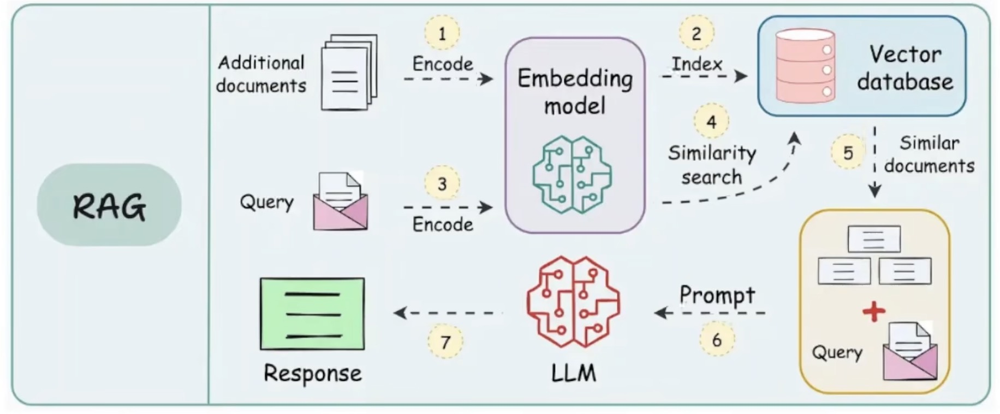

[ai coding](ai-coding.md)

## RAG

检索增强生成（Retrieval-Augmented Generation）

- 不只是让大模型靠自身训练知识回答问题
- 是先从私有知识库 / 文档 / 数据库里检索相关真实资料
- 把检索到的内容拼进提示词，再交给大模型基于真实文档来生成答案

### RAG 为什么会出现幻觉问题？

#### 数据准备阶段

garbage in garbage out：
切分文本太粗暴，导致语义信息丢失，比如500个token，导致语义信息丢失。

按段落/章节切分，而不是按句子切分，可以保留更多的语义信息。

元数据增强：在切分文本时，保留文档的元数据，比如文档标题、文档作者、文档日期等，这些信息可以被大模型利用，提高生成答案的质量。

#### 查询优化

用户描述的问题与数据库的内容不匹配，导致查询结果不准确。

- 比如：用户说的白话，数据库是专业的术语。
- 那个错误怎么修？ （那个是什么？需要用户补充完整）

使用LLM 改写问题，将用户的问题转换为数据库中存储的术语，提高查询结果的准确性。

HyDE（Hypothetical Document Embedding，假想文档嵌入）：用模型假设性答案去数据库检索。

#### 检索优化

专业名词在向量数据库的搜索的虽然相似，但与内容无关。

比如：Flink 如何做**增量同步**到数仓？

无关内容：《Git 代码增量同步与版本管理策略》

向量数据库 + 关键词搜索：可以先命名实体识别，根据关键词过滤。

#### 重排序

top50检索结果中大量无关结果，需要对召回结果打分，取最相关的top5

context 压缩：去除无用片段

#### 生成数据

模型训练本质：它不是在 “查真理”，是按概率往下猜字、凑通顺句子。

内在的训练知识干扰最终数据的知识：比如最近 gpt小精灵问题（prompt 加入“不容许谈论小精灵，不容许谈论小精灵，不容许谈论小精灵”）。

在这里就要给prompt加入规则：

* 不知道就说没找到相关内容
* CoT + 引用：让模型先引用原文回答
* Supervised Fine-Tuning

### GraphRAG

传统RAG痛点：

- 多跳推理困难
- 关系信息确实
- 上下文冗余：检索回来的文本块里大量无关内容

#### Build Graph

#### 命名实体抽取

Prompt 设计：枚举实体类型， 枚举实体之间关系

根据用户问题 抽出关系和实体

#### 查询分析

全局搜索：总结归纳性的

本地搜索：根据特定实体和关系的搜索，路径遍历和子图搜索

#### 结构转文本格式化

把检索到的结构化图谱信息，转成通顺纯文本

#### 大模型生成

用户问题 + 格式化后的图谱上下文，送入大模型输出最终回答。

例如：我想知道关于 saling 的 gmv 报表中依赖 DWS 层的表？

- 查询分析：识别问题是**业务实体 + 分层 + 指标**检索，判定走 **全局 + 本地混合搜索**。
- 图谱检索
  - 全局搜索：匹配「销售 saling、GMV、DWS 层」对应的社区摘要
  - 本地搜索：在知识图谱里以「销售、GMV、DWS」为实体，销售 GMV 报表 → 依赖 → 哪些 DWS 层表
- 结构化转文本：销售 GMV 报表数据加工依赖以下 DWS 层宽表，分别为 xxx、xxx；报表指标口径均基于这些 DWS 表聚合计算而来
- LLM 生成
  - 销售 GMV 报表依赖的全部 DWS 层表名
  - 每张 DWS 表在报表中的作用、口径依赖
  - 表和报表之间的血缘链路

### Agentic RAG

* 传统 RAG：被动执行。给什么查什么，查到什么答什么。
* Agentic RAG：主动决策。它拥有规划（Planning）、工具调用（Tool Use）和反思（Reflection）的能力。

具体步骤

- 重写 Query，问题重新写清晰专业的问题
- 是否直接回答问题？不知道直接返回询问
- 对于重写后的问题，plan拆解问题
- 是否需要检索内部知识

agents：

- rewrte query agent
- enity naming agent
- RAG enities agent
- scoring retrival data agent
- to api params [self evaluation agent]
- 多条路径同时搜索，evaluation agent 打分

注意：

- 对话历史压缩，提取对话中系统要求
- 精简reponse json，防止系统对话中带着这些冗余的修饰信息

## 向量库

做语义相似度检索的数据库，

适合查含义、查描述、查说明，比如：

- 模糊业务含义查询: 销售 GMV 是怎么统计的？ =>营收交易额每日口径计算规则
- 查指标口径、字段含义: Saling 业务的 GMV 包含退款吗？ => 向量库能匹配到所有和「销售、交易额、退款口径」相关的文档片段。
- 查表功能、表用途: DWS 层销售宽表是干嘛的？ => 不需要文档有一模一样句子，语义相近就能检索出来。
- 同义不同表述的问题: 直播带货销售额怎么算 => 直播电商 GMV 统计规则
- 代码、SQL、接口文档模糊查找: 怎么查每日销售汇总数据 => 向量库能匹配到相关的 SQL 脚本、接口说明。

不适合：查关系、查血缘、查依赖、多跳推理

## Context Learning

信息噪音：losting in middle

### [CL-bench family: A series of benchmarks for Context Learning](https://hy.tencent.com/research/100025?langVersion=zh)

https://github.com/Tencent-Hunyuan/CL-bench

- 上下文学习是大模型致命短板：当前顶尖模型无法有效从上下文内化新知识并稳定应用，“长上下文” 不等于 “会用上下文”
- 上下文越长（32K+），性能显著下降；增强推理仅带来有限提升。

| 指标                    | CL-bench（专业） | CL-bench Life（生活） |
| ----------------------- | ---------------- | --------------------- |
| **平均解决率**          | 17.2%            | 14.5%                 |
| **最佳模型（2026.05）** | GPT-5.1（23.7%） | GPT-5.5（22.2%）      |

只有当模型能快速内化陌生上下文、精确稳定应用新知识完成任务，AI 才能成为真正可用的推理型 Agent。

如果上下文学习显著提升，人类在 AI 系统中的角色将发生变化：我们不再是主要的数据提供者（**training data provider**），而变成了 context 提供者（**context provider**）。

竞争的焦点将从“谁能把模型训练得更好”，转向“谁能为任务提供最丰富、最相关的 context ”

## Fine-Tuning

SFT Supervised Fine-Tuning 有监督微调

### LoRA

低秩矩阵分解 ：一个大矩阵，可以特征分解后，取出top k 个特征值，对应的特征向量，就是低秩矩阵。

冻结模型参数，只训练LoRA参数， LoRA 参数远小于模型参数。

### qLoRA

量化低秩矩阵分解 ：将LoRA参数精度减少，比如float32/bft16=>int8/int4。
内存占用减少，训练更快。

## LLM

### KV Cache

KV Cache 应用在推理阶段，只用在 decoding 阶段
目的是为了加速Q@K@V矩阵相乘速度，内存会增加=>用空间换时间

## Reference

- [KV Cache 原理讲解](https://www.bilibili.com/video/BV17CPkeEEzk)
