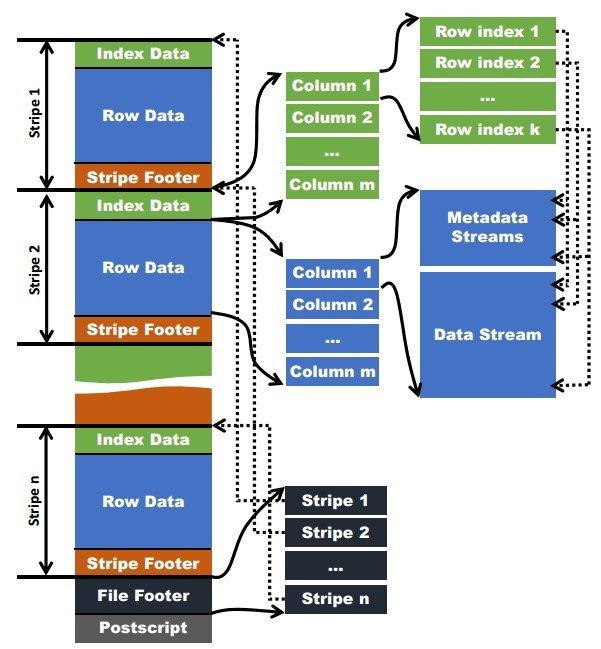

# ORC

## ORCFile

无固定大小，通常按 64MB 切分 Stripe



Index Data/ColumnX/ 是按行切分且 column 对齐的

Row Data/ColumnX/Data Stream 是按压缩 buffer 大小切分的，每个 column 的每个 stream 独立，不对齐。

```text
ReaderImpl init metadata

Read the current stripe into memory： 
main:42, OrcReaderExample (com.example.orc)
└── rows:894, ReaderImpl (org.apache.orc.impl)
    └── <init>:367, RecordReaderImpl (org.apache.orc.impl)
        └── advanceToNextRow:1389, RecordReaderImpl (org.apache.orc.impl)
            └── advanceStripe:1346, RecordReaderImpl (org.apache.orc.impl)


main:42, OrcReaderFilteredExample (com.example.orc)
└── filterByEventIdRange:86, OrcReaderFilteredExample (com.example.orc)
    └── rows:894, ReaderImpl (org.apache.orc.impl)
        └── <init>:367, RecordReaderImpl (org.apache.orc.impl)
            └── advanceToNextRow:1389, RecordReaderImpl (org.apache.orc.impl)
                └── advanceStripe:1346, RecordReaderImpl (org.apache.orc.impl)
                    └── readStripe:1294, RecordReaderImpl (org.apache.orc.impl)
                        └── pickRowGroups:1267, RecordReaderImpl (org.apache.orc.impl)
                            └── readCurrentStripeRowIndex:1599, RecordReaderImpl (org.apache.orc.impl)
                                └── readRowIndex:405, StripePlanner (org.apache.orc.impl.reader)
```

### ORC File Layout

```
   
       [0,3084130]┌─ORC File────────────────────────────────────────────────────┐
             [0,2]│ Magic:ORC                                                   │
       [3,1735301]├─Stripe 1────────────────────────────────────────────────────┤
                  │                                                             │
          [3,1973]│ ┌─Index STREAMS:1971──────────────────────────────────────┐ │
                  │ │   ┌─ Column 0 ???                                       │ │
                  │ │   ├─ Column 1 (id INT)                                  │ │
                  │ │   │    Entry 0 (RG 0): positions=[0,0,0],               │ │---positions TODO: [presentOffset, blockNumber, byteOffset] 
                  │ │   │                    {min:0, max:9999}                │ │
                  │ │   │    Entry 1 (RG 1): positions=[0,97,272],            │ │
                  │ │   │                    {min:10000, max:19999}           │ │
                  │ │   │    Entry 2 (RG 2): positions=[0,217,32],            │ │
                  │ │   │                    {min:20000, max:29999}           │ │
                  │ │   │    ...                                              │ │
                  │ │   ├─ Column 2 (event_type STRING)                       │ │
                  │ │        Entry 0-2: positions + stats                     │ │
                  │ │   ...                                                   │ │
                  │ └─────────────────────────────────────────────────────────┘ │
                  │                                                             │
    [1974,1734951]│ ┌─DATA STREAMS:1,732,978──────────────────────────────────┐ │
       [1974,2421]│ │ DATA                                                    │ │
      [2422,33982]│ │ DATA                                                    │ │
     [33983,33990]│ │ LENGTH                                                  │ │
     [33991,34032]│ │ DICTIONARY_DATA                                         │ │
                  │ │ ...                                                     │ │
                  │ └─────────────────────────────────────────────────────────┘ │
 [1734952,1735301]│ ┌─Stripe Footer:350───────────────────────────────────────┐ │
                  │ │                                                         │ │
                  │ │ Stream List:                                            │ │
                  │ │  ├─ 0: ROW_INDEX, column=0, length=22                   │ │
                  │ │  ├─ 1: ROW_INDEX, column=1, length=164                  │ │
                  │ │  ├─ 2: ROW_INDEX, column=2, length=128                  │ │
                  │ │  ├─ 3: ROW_INDEX, column=3, length=212                  │ │
                  │ │  ├─ 4: ROW_INDEX, column=4, length=137                  │ │
                  │ │  ├─ 5: ROW_INDEX, column=5, length=248                  │ │
                  │ │  ├─ 6: ROW_INDEX, column=6, length=22                   │ │
                  │ │  ├─ 7: ROW_INDEX, column=7, length=94                   │ │
                  │ │  ├─ 8: ROW_INDEX, column=8, length=121                  │ │
                  │ │  ├─ 9: ROW_INDEX, column=9, length=158                  │ │
                  │ │  ├─ 10: ROW_INDEX, column=10, length=97                 │ │
                  │ │  ├─ 11: ROW_INDEX, column=11, length=135                │ │
                  │ │  ├─ 12: ROW_INDEX, column=12, length=267                │ │
                  │ │  ├─ 13: ROW_INDEX, column=13, length=166                │ │
                  │ │  ├─ 14: DATA, column=1, length=448                      │ │
                  │ │  ├─ 15: DATA, column=2, length=31561                    │ │
                  │ │  ├─ 16: LENGTH, column=2, length=65                     │ │
                  │ │  ├─ 17: DICTIONARY_DATA, column=2, length=42            │ │
                  │ │  ├─ 18: DATA, column=3, length=328701                   │ │
                  │ │  ├─ 19: DATA, column=4, length=112881                   │ │
                  │ │  ├─ 20: LENGTH, column=4, length=45                     │ │
                  │ │  ├─ 21: DICTIONARY_DATA, column=4, length=3662          │ │
                  │ │  ├─ 22: DATA, column=5, length=422371                   │ │
                  │ │  ├─ 23: LENGTH, column=5, length=31492                  │ │
                  │ │  ├─ 24: DATA, column=7, length=30324                    │ │
                  │ │  ├─ 25: LENGTH, column=7, length=5                      │ │
                  │ │  ├─ 26: DICTIONARY_DATA, column=7, length=19            │ │
                  │ │  ├─ 27: DATA, column=8, length=30182                    │ │
                  │ │  ├─ 28: LENGTH, column=9, length=8                      │ │
                  │ │  ├─ 29: DICTIONARY_DATA, column=8, length=53            │ │
                  │ │  ├─ 30: PRESENT, column=9, length=7098                  │ │
                  │ │  ├─ 31: DATA, column=9, length=20769                    │ │
                  │ │  ├─ 32: LENGTH, column=9, length=5                      │ │
                  │ │  ├─ 33: DICTIONARY_DATA, column=9, length=53            │ │
                  │ │  ├─ 34: LENGTH, column=10, length=31                    │ │
                  │ │  ├─ 35: DATA, column=11, length=282754                  │ │
                  │ │  ├─ 36: LENGTH, column=11, length=16                    │ │
                  │ │  ├─ 37: DICTIONARY_DATA, column=11, length=378          │ │
                  │ │  ├─ 38: PRESENT, column=12, length=7083                 │ │
                  │ │  ├─ 39: DATA, column=12, length=359818                  │ │
                  │ │  ├─ 40: PRESENT, column=13, length=7098                 │ │
                  │ │  └─ 41: DATA, column=13, length=56072                   │ │
                  │ │                                                         │ │
                  │ │ Column Info:                                            │ │
                  │ │  ├─ column 0 :{kind=DIRECT, dictionarySize=0}           │ │
                  │ │  ├─ column 1 :{kind=DIRECT_V2, dictionarySize=0}        │ │
                  │ │  ├─ column 2 :{kind=DICTIONARY_V2, dictionarySize=6}    │ │
                  │ │  ├─ column 3 :{kind=DIRECT_V2, dictionarySize=0}        │ │
                  │ │  ├─ column 4 :{kind=DICTIONARY_V2, dictionarySize=1000} │ │
                  │ │  ├─ column 5 :{kind=DIRECT_V2, dictionarySize=0}        │ │
                  │ │  ├─ column 6 :{kind=DIRECT, dictionarySize=0}           │ │
                  │ │  ├─ column 7 :{kind=DICTIONARY_V2, dictionarySize=8}    │ │
                  │ │  ├─ column 8 :{kind=DICTIONARY_V2, dictionarySize=8}    │ │
                  │ │  ├─ column 9 :{kind=DICTIONARY_V2, dictionarySize=10}   │ │
                  │ │  ├─ column 10: {kind=DIRECT_V2, dictionarySize=0}       │ │
                  │ │  ├─ column 11: {kind=DICTIONARY_V2, dictionarySize=100} │ │
                  │ │  ├─ column 12: {kind=DIRECT, dictionarySize=0}          │ │
                  │ │  └─ column 13: {kind=DIRECT_V2, dictionarySize=0}       │ │
                  │ │                                                         │ │
                  │ └─────────────────────────────────────────────────────────┘ │
 [1735302,3083504]├─────────────────────Stripe 2────────────────────────────────┤
                  │  ...                                                        │
 [3083505,3084104]├─────────────────────FileFooter──────────────────────────────┤
                  │  - Schema (Types)                                           │
                  │  - Stripes                                                  │
                  │      - Stripe Offset: 3                                     │
                  │        Stripe Index Length: 1971                            │
                  │        Stripe Data Length: 1,732,978                        │
                  │        Stripe Footer Length: 350                            │
                  │        Stripe Rows: 56,320                                  │
                  │      - Stripe Offset: 1,735,302                             │
                  │        Stripe Index Length: 1740                            │
                  │        Stripe Data Length: 1,345,428                        │
                  │        Stripe Footer Length: 335                            │
                  │        Stripe Rows: 43,680                                  │
                  │  - Statistics                                               │
                  │      - column1: min/max/sum                                 │
                  │      - column2: min/max/sum                                 │
                  │        ...                                                  │
 [3084105,3084129]├─────────────────────PostScript──────────────────────────────┤
                  │    FooterLength: 600                                        │
                  │    MetadataLength: 680                                      │
                  │    StripeStatisticsLength: 0                                │
                  │    CompressionKind: 2 (SNAPPY)                              │
                  │     ...                                                     │
                  │    Version: 0 12                                            │
                  │    Magic: ORC (3 Byte)                                      │
 [3084130,3084130]├─────────────────────PostScriptLength────────────────────────┤
                  │       (1 Byte): 25                                          │
                  └─────────────────────────────────────────────────────────────┘
```

```text
ORC 文件
├── File Footer（文件尾：记录所有 Stripe 元数据、文件级统计）
├── Postscript（文件配置：压缩算法、Footer 长度等）
└── Stripe（数据块，默认 ~256MB）→ 点查时先定位到目标 Stripe
    ├── Stripe Footer（Stripe 尾：记录该 Stripe 内所有 Stream 的偏移/长度）
    ├── Index Data（索引数据：RowIndex + 列统计）→ 点查时核心依赖
    │   └── RowIndex（每行组的 min/max 统计 + 偏移）
    └── Stripe Data（实际列数据）→ 由多个 Stream 组成
        ├── Preset Stream（元数据流：如 NULL 位图、字典编码映射表）
        └── Data Stream（实际列值流：如 id/name 的编码数据）
            └── 按 Row Group 拆分（默认每 1000 行一个 Row Group）→ 点查时定位到目标 Row Group
```

- PostScript: 固定大小 < 256B
  - footerLength
  - 压缩算法
  - 校验和
    ```text
    message PostScript {
      uint64 footerLength = 1;      // File Footer的字节长度
      CompressionKind compression = 2; // 压缩算法(ZLIB, SNAPPY等)
      uint64 compressionBlockSize = 3; // 压缩块大小
      uint32 versionMajor = 4;      // 主版本号
      uint32 versionMinor = 5;      // 次版本号
      bytes metadataKey = 6;        // 可选元数据键
      bytes metadataValue = 7;      // 可选元数据值
      uint64 checksum = 8;          // 校验和
    }
    ```
- File Footer:
  - 每个 Stripe metadata
  - 总行数
  - 每个列的统计信息
    ```text
    message Footer {
      repeated StripeInformation stripes = 1; // 所有条带信息
      repeated Type types = 2;                // 文件schema
      repeated ColumnStatistics columnStats = 3; // 列统计
      uint64 numberOfRows = 4;                // 总行数
      string writer = 5;                      // 写入器信息
      uint32 stripeStatisticsOffset = 6;      // 条带统计偏移
      // ... 其他详细元数据
    }

    message ColumnStatistics {
      // 通用统计
      optional uint64 numberOfValues = 1; // 非空值数量
      optional bool hasNull = 2;          // 是否包含空值

      // 数值类型统计（int/bigint/float/double等）
      optional string minimum = 3;        // 最小值（字符串存储，兼容不同类型）
      optional string maximum = 4;        // 最大值
      optional string sum = 5;            // 总和

      // 字符串类型统计
      optional uint64 sumOfLengths = 6;   // 所有字符串长度总和

      // 布尔类型统计
      optional uint64 numberOfTrues = 7;  // true的数量
      optional uint64 numberOfFalses = 8; // false的数量

      // 日期/时间类型统计
      optional uint64 minimumTimestamp = 9;  // 最小时间戳（毫秒级）
      optional uint64 maximumTimestamp = 10; // 最大时间戳

      // 复杂类型统计（数组/Map/结构体）
      optional uint64 numElements = 11;   // 元素总数
      optional uint64 nulls = 12;         // 空元素数量
      optional uint64 distinctCount = 13; // 去重后数量（近似）
    }

    message StripeInformation {
      optional uint64 offset = 1;          // Stripe在文件中的起始偏移量（字节）
      optional uint64 indexLength = 2;     // Stripe Index部分的长度
      optional uint64 dataLength = 3;      // Stripe 数据部分的长度
      optional uint64 footerLength = 4;    // Stripe Footer的长度
      optional uint64 numberOfRows = 5;    // 该Stripe包含的行数
      optional uint64 stripeId = 6;        // Stripe唯一ID（可选）
    }

    ```

## Stripe

- [Stripe Index] -> [Row Data] -> [Stripe Footer]

### 索引数据（Index Data）

- Stripe Index 是该 Stripe 的索引元数据，用于谓词下推（Predicate Pushdown） 和快速定位数据，避免全量扫描。
- 它包含 RowIndex 和 Bloom Filter（可选）两部分：

  - RowIndex 是 Row Group 的索引，每个 RowIndexEntry 对应一个 Row Group
  - Bloom Filter 是可选的，用于快速判断是否包含某个值（不保证 100% 准确）

  ```text
  message RowIndex {
  repeated RowIndexEntry entries = 1; // 每个Entry对应一个Row Group
  optional uint32 column = 2;         // 所属列的ID
  }

  message RowIndexEntry {
  // 该Row Group的列统计（与Footer的ColumnStatistics结构完全一致）
  repeated ColumnStatistics statistics = 1;

  // 该Row Group在Row Data中的偏移量（压缩后）
  repeated uint64 positions = 2;  
  }

  message BloomFilterIndex {
    optional uint32 column = 1;                // 所属列ID
    repeated BloomFilter bloomFilters = 2;     // 每个Row Group对应一个布隆过滤器
  }

  message BloomFilter {
    optional uint32 numHashFunctions = 1;      // 哈希函数数量
    optional uint64 numBits = 2;               // 位图总位数
    optional bytes bits = 3;                   // 位图数据（压缩存储）
  }
  ```

  ```text
    RowIndex 结构示意：

    Stripe 1:
    ├── Column 0 (id) 的 RowIndex:
    │   ├── Entry 0 (行 0-9,999):
    │   │   ├── positions: [100, 250]           # PRESENT 流位置, DATA 流位置
    │   │   └── statistics: {min: 1, max: 10000}
    │   ├── Entry 1 (行 10,000-19,999):
    │   │   ├── positions: [400, 600]
    │   │   └── statistics: {min: 10001, max: 20000}
    │   └── Entry 2 (行 20,000-29,999):
    │       ├── positions: [700, 900]
    │       └── statistics: {min: 20001, max: 30000}
    │
    ├── Column 1 (name) 的 RowIndex:
    │   ├── Entry 0:
    │   │   ├── positions: [...]
    │   │   └── statistics: {min: "Alice", max: "Zoe"}
    │   ├── Entry 1: ...
    │   └── Entry 2: ...
    │
    └── Column 2 (age) 的 RowIndex:
        ├── Entry 0:
        │   ├── positions: [...]
        │   └── statistics: {min: 18, max: 65}
        ├── Entry 1: ...
        └── Entry 2: ...
    对于 INT 类型列，通常有：
    - PRESENT 流：记录哪些值非空
    - DATA 流：记录实际数据
  ```

```text
┌────────────────────────────────┬─────────────────────────────────────────────────────────────────────────────────────────┐
│ 问题                            │ 答案                                                                                    │
├────────────────────────────────┼─────────────────────────────────────────────────────────────────────────────────────────┤
│ Stream 是否按 Row Group 切分？   │ NO。每个 (column, kind) 只有一个 连续 的 Stream                                             │
│ Row Group 是什么？              │ 纯逻辑概念（默认 10,000 行），RowIndexEntry 存的是跳到该 Row Group 起点所需的 positions          │
│ 读第 N 个 Row Group 时怎么做？    │ 用 RowIndexEntry[N].positions 去 seek 到 Stream 的中间位置                                 │
└────────────────────────────────┴─────────────────────────────────────────────────────────────────────────────────────────┘
```

### 行数据（Row Data）

- 元数据流（Metadata Stream）

  ```text
  PRESENT流
  原始数据：[1, NULL, 3, NULL, NULL, 6]
  PRESENT流位图：101001
  RLE编码后：(1,1), (0,1), (1,1), (0,2), (1,1)

  LENGTH流
  原始字符串：["apple", "banana", "cherry"]
  LENGTH流：5, 6, 6
  VLQ编码后：05, 06, 06（实际存储为紧凑二进制）
  ```
- 数据流（Data Stream）

  ```text
  原始字符串：["apple", "banana", "apple", "cherry", "banana"]
  DICTIONARY_DATA流：["apple", "banana", "cherry"]
  DATA流：[0, 1, 0, 2, 1] （字典索引）


  流组合：
  PRESENT流：位图 1011110111 → RLE编码后存储
  LENGTH流：5, 6, 5, 6, 6, 5, 6, 5 → VLQ编码
  DICTIONARY_DATA流："apple", "banana", "cherry" → 字符串序列
  DATA流：0, 1, 0, 2, 1, 0, 2, 0 → 字典索引（RLE编码）
  ```
- Data Stream 是根据 Row Group 拆分的

  - Row Group 的规则是：以整个 Stripe 的行号为基准，**按固定行数（默认 10000 行）拆分**，所有列的 Row Group 都对应相同的行范围。
- **PLAIN 编码**

  - 下面实例：session_id PLAIN 编码
  - ORC 会在解析 session_id 列 Row Group 数据时，先构建一个行位置索引表（内存级，极快）

### Stripe Footer

- 流位置信息
- 列编码信息
- 列统计信息

### Stripe layout

```text
  ════════════════════════════════════════════════════════════
                          STRIPE
  ════════════════════════════════════════════════════════════

  ┌─ 1. INDEX STREAMS (Metadata) ───────────────────────────────────────┐
  │ 【字节 0-120】   Column 0: ROW_INDEX stream (id=0, kind=ROW_INDEX)    │
  │                     Entry 0 (RG 0): positions=[0, 55]                   │
  │                                stats={min:1, max:10000, count:10000} │
  │                     Entry 1 (RG 1): positions=[165, 220]               │
  │                                stats={min:10001, max:20000, count:10000}│
  │                     Entry 2 (RG 2): positions=[330, 385]               │
  │                                stats={min:20001, max:30000, count:10000}│
  │                                                                      │
  │ 【字节 120-270】  Column 1: ROW_INDEX stream (id=1, kind=ROW_INDEX)  │
  │                     Entry 0: positions=[120, 200, 265]              │
  │                                stats={min:"Alice", max:"Zoe", ...}         │
  │                     Entry 1: positions=[..., ..., ...]                  │
  │                     Entry 2: positions=[..., ..., ...]                  │
  │                                                                      │
  │ 【字节 270-420】  Column 2: ROW_INDEX stream (id=2, kind=ROW_INDEX)  │
  │                     Entry 0: positions=[420, 500, 580]              │
  │                                stats={min:"AF", max:"US", ...}            │
  │                     Entry 1: positions=[..., ..., ...]                  │
  │                     Entry 2: positions=[..., ..., ...]                  │
  │                                                                      │
  │ 【字节 420-520】  Column 2: BLOOM_FILTER_UTF8 stream (id=2)      │
  │                     Entry 0 (RG 0):                                   │
  │                        numHashFunctions: 3                          │
  │                        bitset: [0x12, 0x34, 0x56, ...]              │
  │                     Entry 1 (RG 1):                                   │
  │                        numHashFunctions: 3                          │
  │                        bitset: [0x9A, 0xBC, 0xDE, ...]                │
  │                     Entry 2 (RG 2):                                   │
  │                        numHashFunctions: 3                          │
  │                        bitset: [0xEF, 0x01, 0x23, ...]                │
  │                                                                      │
  │ 【字节 520-570】  Column 3: ROW_INDEX stream (id=3, kind=ROW_INDEX)  │
  │                     Entry 0: positions=[700, 750, 800]               │
  │                                stats={min:50000.0, max:150000.0, ...}    │
  │                     Entry 1: positions=[..., ..., ...]                  │
  │                     Entry 2: positions=[..., ..., ...]                  │
  │                                                                      │
  │ 【字节 570-720】  Column 4: ROW_INDEX stream (id=4, kind=ROW_INDEX)  │
  │                     Entry 0: positions=[850, 950]                    │
  │                                stats={min:"sess_00001_abc123",               │
  │                                       max:"sess_10000_xyz789",              │
  │                                       count:10000, sum:180000}      │
  │                     Entry 1: positions=[..., ...]                     │
  │                                stats={min:"sess_10001_pqr678",               │
  │                                       max:"sess_20000_lkj459",              │
  │                                       count:10000, sum:190000}      │
  │                     Entry 2: positions=[..., ...]                     │
  │                                stats={min:"sess_20001_vxt982",               │
  │                                       max:"sess_30000_abc456",              │
  │                                       count:10000, sum:200000}      │
  │                                                                      │
  │ 【字节 720-770】  Column 4: BLOOM_FILTER_UTF8 stream (id=4)      │
  │                     Entry 0 (RG 0):                                   │
  │                        numHashFunctions: 3                          │
  │                        bitset: [0x12, 0x34, 0x56, ..., 0xAB]       │
  │                        ↑ 包含所有10000个唯一sessionId           │
  │                     Entry 1 (RG 1):                                   │
  │                        numHashFunctions: 3                          │
  │                        bitset: [0xCD, 0xEF, 0x01, ..., 0x89]       │
  │                        ↑ 包含所有10000个唯一sessionId           │
  │                     Entry 2 (RG 2):                                   │
  │                        numHashFunctions: 3                          │
  │                        bitset: [0x23, 0x45, 0x67, ..., 0xBC]       │
  │                        ↑ 包含所有10000个唯一sessionId           │
  ├──────────────────────────────────────────────────────────────────────────┤

  ┌─ 2. DATA STREAMS ───────────────────────────────────────────────────────────┐
  │ 【字节 770-790】  Column 0: PRESENT stream (id=0, kind=PRESENT)    │
  │                     [1,1,1,...,1] (10000个1，RLE编码)           │
  │                                                                      │
  │ 【字节 790-990】  Column 0: DATA stream (id=0, kind=DATA)          │
  │                     [1, 2, 3, ..., 30000]  ← RLE v2 DELTA编码  │
  │                                                                      │
  │ 【字节 990-1010】 Column 1: PRESENT stream (id=1, kind=PRESENT) │
  │                     [1,1,1,0,1,...] (第3行为NULL)              │
  │                                                                      │
  │ 【字节 1010-1070】 Column 1: DATA stream (id=1, kind=DATA)          │
  │                     [0,2,0,1,2,...]  ← 字典索引，RLE v2         │
  │                                                                      │
  │ 【字节 1070-1110】 Column 1: LENGTH stream (id=1, kind=LENGTH)   │
  │                     [5,3,0,6,3,5,...]  ← 字典项长度，RLE v2      │
  │                                                                      │
  │ 【字节 1110-1170】 Column 1: DICTIONARY_DATA stream (id=1)        │
  │                     "AliceCharlieBobDave...Zoe"  ← 排序后的字典    │
  │                     (假设100个唯一值，平均长度6字节 = 600字节)   │
  │                                                                      │
  │ 【字节 1170-1190】 Column 2: PRESENT stream (id=2, kind=PRESENT) │
  │                     [1,1,1,1,...]                                 │
  │                                                                      │
  │ 【字节 1190-1450】 Column 2: DATA stream (id=2, kind=DATA)       │
  │                     直接编码！"CN"(2B)+"US"(2B)+...        │
  │                     总计: 10000×平均2.5B = 25000字节           │
  │                                                                      │
  │ 【字节 1450-1490】 Column 2: LENGTH stream (id=2, kind=LENGTH)  │
  │                     [2,2,2,3,2,2,...]  ← 每个字符串长度        │
  │                                                                      │
  │ 【字节 1490-1530】 Column 3: PRESENT stream (id=3, kind=PRESENT) │
  │                     [1,1,1,1,...]                                 │
  │                                                                      │
  │ 【字节 1530-1850】 Column 3: DATA stream (id=3, kind=DATA)       │
  │                     [50000.0, 60000.0, ...]  ← IEEE 754双精度       │
  │                     总计: 10000×8B = 80000字节                    │
  │                                                                      │
  │ 【字节 1850-1870】 Column 4: PRESENT stream (id=4, kind=PRESENT) │
  │                     [1,1,1,1,...]  ← 全部非空                    │
  │                     大小: ~20字节 (RLE SHORT_REPEAT)            │
  │                                                                      │
  │ 【字节 1870-3170】 Column 4: DATA stream (id=4, kind=DATA)       │
  │                     直接编码！UTF-8字节                         │
  │                     "sess_00001_abc123sess_00002_def456...sess_10000_xyz789"│
  │                     10000个值，平均18字节 × 10000 = 180000字节  │
  │                     RLE v2 PATCHED_BASE编码                        │
  │                     大小: ~1300字节 (高基数压缩)               │
  │                                                                      │
  │ 【字节 3170-3210】 Column 4: LENGTH stream (id=4, kind=LENGTH)  │
  │                     [17,17,18,17,18,...]  ← 每个字符串长度      │
  │                     平均17字节，10000个                       │
  │                     RLE v2 PATCHED_BASE编码                        │
  │                     大小: ~40字节                                │
  ├──────────────────────────────────────────────────────────────────────────┤

  ┌─ 3. STRIPE FOOTER ──────────────────────────────────────────────────┐
  │ 【字节 3210-3250】  Stream列表                                 │
  │                     Stream 1:  column=0, kind=ROW_INDEX, offset=0, length=120│
  │                     Stream 2:  column=0, kind=PRESENT, offset=770, length=20│
  │                     Stream 3:  column=0, kind=DATA, offset=790, length=200 │
  │                     Stream 4:  column=1, kind=ROW_INDEX, offset=120, length=150│
  │                     Stream 5:  column=1, kind=PRESENT, offset=990, length=20│
  │                     Stream 6:  column=1, kind=DATA, offset=1010, length=60 │
  │                     Stream 7:  column=1, kind=LENGTH, offset=1070, length=40 │
  │                     Stream 8:  column=1, kind=DICTIONARY_DATA, offset=1110... │
  │                     Stream 9:  column=2, kind=ROW_INDEX, offset=270, length=150│
  │                     Stream 10: column=2, kind=BLOOM_FILTER_UTF8, offset=420...│
  │                     Stream 11: column=2, kind=PRESENT, offset=1170, length=20│
  │                     Stream 12: column=2, kind=DATA, offset=1190, length=260 │
  │                     Stream 13: column=2, kind=LENGTH, offset=1450, length=40 │
  │                     Stream 14: column=3, kind=ROW_INDEX, offset=520, length=50 │
  │                     Stream 15: column=3, kind=PRESENT, offset=1490, length=40│
  │                     Stream 16: column=3, kind=DATA, offset=1530, length=320│
  │                     Stream 17: column=4, kind=ROW_INDEX, offset=570, length=150│
  │                     Stream 18: column=4, kind=BLOOM_FILTER_UTF8, offset=720... │
  │                     Stream 19: column=4, kind=PRESENT, offset=1850, length=40│
  │                     Stream 20: column=4, kind=DATA, offset=1870, length=1300│
  │                     Stream 21: column=4, kind=LENGTH, offset=3170, length=40 │
  │                                                                      │
  │ 【字节 3250-3290】  Column编码信息                             │
  │                     Column 0: kind=DIRECT_V2                             │
  │                     Column 1: kind=DICTIONARY_V2, dictionarySize=100       │
  │                     Column 2: kind=DIRECT_V2                             │
  │                     Column 3: kind=DIRECT_V2                             │
  │                     Column 4: kind=DIRECT_V2  ← 直接编码，无字典   │
  │                                                                      │
  │ 【字节 3290-3330】  Stripe时间戳、时区等（可选）          │
  └──────────────────────────────────────────────────────────────────────────┘
```

## Reference

- https://github.com/apache/orc/blob/main/site/specification/ORCv2.md
