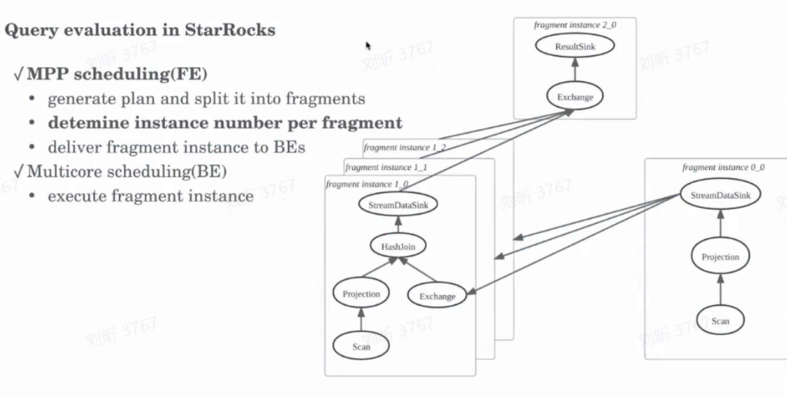

## Join

```
   策略                  触发条件
  ━━━━━━━━━━━━━━━━━━━━━━━━━━━━━━━━━━━━━━━━━━━━━━━━━━━━━━━━━━━━━━━━━━━━━━━━━
   Broadcast Hash Join   右表较小（默认 < 100MB，可配置）
   Shuffle Hash Join     两边都大
   Colocate Join         表属于同一 Colocate Group，Join Key 是 Bucket Key
   Bucket Shuffle Join   左表有本地 Hash 分布，右表需 Shuffle
```

### Colocate Join vs Bucket Shuffle Join

```
  Colocate Join
  Table A (Colocate Group: g1)          Table B (Colocate Group: g1)
  Bucket 1 @ BE1  ─────────────────────  Bucket 1 @ BE1
  Bucket 2 @ BE2  ─────────────────────  Bucket 2 @ BE2
  Bucket 3 @ BE3  ─────────────────────  Bucket 3 @ BE3

  Join(A, B) on A.id = B.id
  → 每个 BE 本地 Join，无数据移动
  Bucket Shuffle Join
  Table A (已按 id 分桶分布)              Table B (任意分布)
  Bucket 1 @ BE1
  Bucket 2 @ BE2
  Bucket 3 @ BE3

  Join(A, B) on A.id = B.id
  → Table B 按 A 的分桶方式 Shuffle 到对应 BE
  → 然后每个 BE 本地 Join
```

> StarRocks 目前没有在 BE 端实现 Sort Merge Join 的执行算子。
> FE 优化器中有 Merge Join 的物理算子和代价模型，但仅存在于计划层面，无法实际执行。
> 所有等值 Join 实际都由 Hash Join 执行。

```
              Colocate Join             Bucket Shuffle Join
  ━━━━━━━━━━━━━━━━━━━━━━━━━━━━━━━━━━━━━━━━━━━━━━━━━━━━━━━━━━━
   左表       本地预分布                本地预分布
   右表       本地预分布（同 Group）    需要 Shuffle
   数据移动   无                        仅右表移动
   前提条件   两表同属 Colocate Group   左表有 Hash 分布即可

                  Shuffle Hash Join        Bucket Shuffle Join
  ━━━━━━━━━━━━━━━━━━━━━━━━━━━━━━━━━━━━━━━━━━━━━━━━━━━━━━━━━━━━━━
   左表           需要 Shuffle             不动
   右表           需要 Shuffle             需要 Shuffle
   Shuffle 方式   两边都按 Join Key hash   右表按左表已有分桶规则 hash
   数据移动量     两边都移动               仅右表移动
```

StarRocks 数据无移动的前提是 Tablet 级别的预分布管理。

```
  底层存储结构
  Table
  └── Partition（分区，按时间/范围）
      └── Tablet（分桶，按 Hash/Random）
          └── Replica（副本，默认3份）
              └── Segment（实际数据文件）
  Tablet 是数据分布和管理的物理单位。
```

### 数据湖

> 理论上 Paimon Fixed Bucket 表具备支持 Colocate/Bucket Shuffle Join 的基础，
> 但当前 StarRocks 实现未利用 Paimon 的 bucket 分布信息，仍按无预分布处理，需要 Shuffle。
> 需要 StarRocks 连接器层和优化器层增强才能支持。

数据湖 Bucket Join 性能不如 spark，是否先利用spark 准备好数据。

## pipeline vs DAG



https://www.bilibili.com/video/BV1ES4y137fY

## AI + CBO

### Join

#### 优化成宽表

#### 不合理的join bucket size

#### reorder

现状：DP/Greedy/Left-Deep 算法，基于统计估算代价。 NP hard

Join 顺序：AI 直接寻找最优 Join 顺序

传统：ANALYZE TABLE t SAMPLE 1000000 rows;  -- 慢
AI：   基于过去7天统计变化趋势，预测今天分布，误差 < 5%

### mv 优化

#### 根据用户查询频次，创建mv

#### 基于用户使用丰富 mv

```
源码实现了 avg(c) = sum(c)/count(c)
  MV: SELECT a, b, sum(c), count(c) FROM t GROUP BY a, b
  Query: SELECT a, avg(c) FROM t GROUP BY a


variance(c) = avg(c*c) - avg(c)*avg(c):
  MV: SELECT a, b, avg(c) FROM t GROUP BY a, b
  Query: SELECT a, variance(c) FROM t GROUP BY a
```

#### 语义理解

month(dt) 可以从 dt 推导

```
  MV: SELECT user_id, dt, sum(amount) FROM orders GROUP BY user_id, dt
  Query: SELECT user_id, month(dt), sum(amount) FROM orders GROUP BY user_id, month(dt)
```

#### 预测性补偿

传统：MV(1-8) UNION 源表(9-10)
AI 预测：用户经常查最近3天，建议提前刷新 01-09

```sql
  查询：SELECT * FROM t WHERE dt BETWEEN '2024-01-01' AND '2024-01-10'
  MV 刷新到：2024-01-08
```

### 参数优化

- 并行度调整：如 bucket size
- 自动全量收集表的统计信息

  条件           配置                                默认
  ━━━━━━━━━━━━━━━━━━━━━━━━━━━━━━━━━━━━━━━━━━━━━━━━━━━━━━━━━━━━━━━
  总开关         enable_statistic_collect            true
  自动收集开关   enable_auto_collect_statistics      true
  时间窗口开始   statistic_auto_analyze_start_time   "00:00:00"
  时间窗口结束   statistic_auto_analyze_end_time     "23:59:59"
  轮询间隔       statistic_collect_interval_sec      300
  收集类型       enable_collect_full_statistic       false

  场景           行为
  ━━━━━━━━━━━━━━━━━━━━━━━━━━━━━━━━━━━━━━━━━━━━━━━━━
  数据变化 1%    不触发，等下次轮询
  数据变化 50%   下次轮询时触发
  刚建的新表     首次查询可能无统计，后台异步收集

#### 识别场景使用 Bloom Filter

场景 1：存储层 Bloom Filter
查询日志分析:

- "SELECT * FROM user_events WHERE user_id = ?" 占 80%
- user_id 是高基数列（1000万 distinct）
- 如果没有根据 user_id 排序，min/max 无法过滤文件

AI 推荐:
ALTER TABLE user_events SET ("bloom_filter_columns" = "user_id");

场景 2：运行时 Bloom Filter（Global Runtime Filter）
查询模式:

- 大表 JOIN 小表，但大表很多行不匹配
- 如: 订单表 JOIN 今日促销表，只有 1% 订单匹配

传统: 大表每行都探测 Hash Table
AI:   自动启用 Global Runtime Filter

- 小表建 BloomFilter
- 广播到大表 Scan 节点
- 大表 99% 行被 BloomFilter 过滤，不进入 Join

### 数据质量

检测异常数据分布，预警潜在问题
自定义指标
