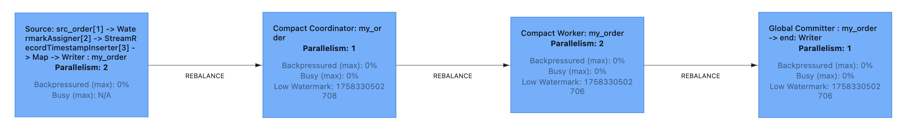
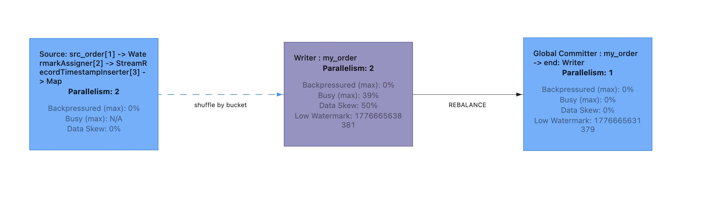
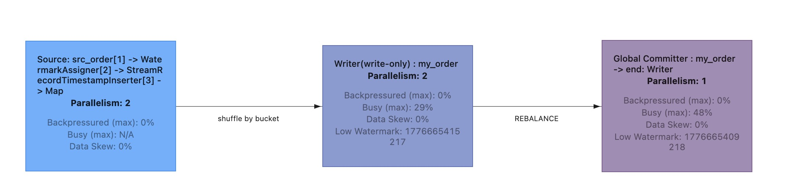

- bucket mode
  - bucket = 0: BUCKET_UNAWARE
  - bucket > 0: HASH_FIXED
- example: [MyITCase.test_append_table](../paimon-flink/paimon-flink-common/src/test/java/org/apache/paimon/flink/MyITCase.java)
- [related data-evolution.md](../docs/content/append-table/data-evolution.md) 
  - https://paimon.apache.org/docs/master/append-table/overview/


## AppendOnly 架构
- AppendOnlyFileStoreTable
- AppendOnlyFileStore
- AppendOnlyFileStoreScan
- RawFileSplitRead
- AppendFileStoreWrite

```text
FileStoreTable： Paimon 表（Table） 的存储层实现，基于 FileStore 构建，并封装表的业务逻辑。
  └── AppendOnlyFileStoreTable
        ├── newRead()  → AppendTableRead (SplitReadProvider)
        ├── newWrite() → TableWriteImpl<InternalRow>
        └── store()    → AppendOnlyFileStore

FileStore<InternalRow>：是存储引擎的核心抽象，负责创建 Scan、Read、Write、Commit 等组件。
  └── AppendOnlyFileStore
        ├── bucketMode() → BUCKET_UNAWARE | HASH_FIXED
        ├── newScan()    → AppendOnlyFileStoreScan | DataEvolutionFileStoreScan
        ├── newRead()    → RawFileSplitRead | DataEvolutionSplitRead
        └── newWrite()   → AppendFileStoreWrite | BucketedAppendFileStoreWrite

FileStoreScan：负责从 snapshot → manifest → 过滤 → 产出 DataSplit（文件列表）。
  └── AbstractFileStoreScan
        └── AppendOnlyFileStoreScan (stats + fileIndex + limit)

SplitRead<InternalRow>
  └── RawFileSplitRead：AppendOnly 无主键、无 merge、无 LSM Tree，不需要像 PK 表那样做 MergeTree 的多层文件合并读取。直接读原始文件是最轻量的方式。

FileStoreWrite<InternalRow>：Write 负责接收记录、缓冲、刷盘、compaction、生成 commit message。
  └── MemoryFileStoreWrite
        └── BaseAppendFileStoreWrite
              ├── AppendFileStoreWrite (BUCKET_UNAWARE)
              └── BucketedAppendFileStoreWrite (HASH_FIXED)
```

## bucket=-1
在 append table 中是 `BucketMode.BUCKET_UNAWARE`
在 primary key table 中是 `BucketMode.HASH_DYNAMIC`

1. Writer 内无Compaction
2. 独立的operator: Compaction Coordinator


3.RowAppendTableSink
   - FlinkTableSink -> getSinkRuntimeProvider -> FlinkSinkBuilder -> buildUnawareBucketSink->RowAppendTableSink
   - sinkFrom: Compact Coordinator： 全局分配, Compact Worker：独立处理Coordinator分配的task
       - doWrite: Compact Coordinator -> Compact Worker
       - doCommit: generate a new snapshot(APPEND/COMPACT)


## bucket (N > 0)
在 append table 中是 `BucketMode.HASH_FIXED`



## write-only


## compaction for BUCKET_UNAWARE

AppendCompactCoordinator：

Normal append-only 表没有多级 LSM，compaction
就是按文件数量和总大小挑选候选文件，然后把多个小文件顺序合并成更大的文件。大文件（超过
compactionFileSize）会被跳过，不参与合并。

| 条件       | 含义     |
|----------|--------|
| fileNum >= minFileNum | 文件数量达到阈值（默认来自 num-sorted-run.compaction-trigger） |
| totalFileSize >= targetFileSize * 2 | 总大小超过目标文件大小的 2 倍时，去掉最老的文件，避免一次合并太多|

大文件被跳过是正常且正确的行为。Unaware-bucket append 表的 compact 目标就是合并小文件，跳过大文件避免了无意义的
IO，对性能没有负面影响。

什么时候需要关注大文件？
- Deletion Vector 模式下，大文件如果删除比例高（默认阈值 0.2），会被 tooHighDeleteRatio 捕获，强制 compact
  来清理无效数据
- 手动 full compact 时（比如 CALL compact('t', '', '', '', '', '', '', 'full')），会走不同的代码路径，可能涉及大文件

## 三种更新模式
```text
   维度         Normal Append   Row Tracking         Data Evolution
  ━━━━━━━━━━━━━━━━━━━━━━━━━━━━━━━━━━━━━━━━━━━━━━━━━━━━━━━━━━━━━━━━━━━━━━━━━━━━━━━
   行级更新     ❌ 不支持       ✅ COW               ✅ 部分列写入
   重写范围     整个分区/表     impacted files       impacted firstRowId 范围
   重写内容     所有列          所有列               仅变更列
   I/O 成本     最高            高（与列数成正比）   低（与变更列数成正比）
   读时开销     无              无                   多文件合并
   存储膨胀     无（覆盖写）    中（新旧文件替换）   高（原始 + 多个部分列文件）
   Compaction   普通合并        普通合并             列合并（多文件→完整文件）
   适用场景     批量写入        少量行更新           大量行、少量列更新
```

### 普通模式
不支持行级更新。只能 INSERT OVERWRITE 整个分区或全表。要改几行数据，必须重写整个分区。

### Row Tracking
支持行级 UPDATE/DELETE，但是全文件重写（COW），比整表和分区性能好一点。
```text
UPDATE t SET b = 11 WHERE id = 1
│
├── 1. 找到 id=1 所在的文件（可能 1 个或多个文件）
├── 2. 读取这些文件的完整行（所有 100 列）
├── 3. 修改匹配的行，其他行不变
├── 4. 写回新文件（所有 100 列）
└── 5. 旧文件标记删除，新文件提交
```
特点：
- 只重写 impacted files，不是整个分区
- 但重写的文件包含所有列，I/O 与列数成正比
- 适合：更新行数少、列数少的场景


### data evolution
支持部分列全表或整个分区内数据重写（MOR 列合并）。
```text
MERGE INTO t USING s ON t.id = s.id
WHEN MATCHED THEN UPDATE SET t.b = s.b
│
├── 1. 找到匹配行所在的 firstRowId 范围
├── 2. 只写 [b, _ROW_ID, _FIRST_ROW_ID] 到新文件
├── 3. 原文件保留不动
└── 4. 读时从原文件取 99 列，从新文件取 b 列
```
特点：
- 只写变更的列，I/O 与变更列数成正比，与总列数无关
- 原始文件 + N 个部分列文件共存
- 读时 DataEvolutionFileReader 多文件合并
- 需要 Compaction 定期合并，避免文件过多
- 当前只支持 MERGE INTO，不支持 UPDATE/DELETE（工程限制）

> AppendOnlyFileStoreTable.newRead->AppendOnlyFileStore.newDataEvolutionRead->DataEvolutionSplitRead

## Q&A
<details>
<summary>BUCKET_UNAWARE 为什么不像 HASH_DYNAMIC 一样在writer中实现compaction呢？</summary>

| BucketMode            | 文件隔离方式      | Compaction 位置 | 原因 |
|-----------------------|-------------|---------------|-------------------|
| HASH_FIXED / HASH_DYNAMIC | 按 bucket 切分 | Writer 内      | 每个 writer 只持有自己 bucket 的文件，可以独立 compact |
| BUCKET_UNAWARE    | 无隔离，全局混排    | 外部独立 job      | 需要全局视角做文件分组，避免多 writer 竞争同一文件   |

无文件隔离边界:
- BUCKET_UNAWARE 虽然底层写到 bucket-0，但写入并行度不受 bucket 数限制
- 多个 writer 可能同时向同一个 partition 追加数据，产生大量零散小文件
- 这些文件在逻辑上都属于同一空间，没有 bucket 把它们切分给不同 writer

并发冲突难以处理:
- 如果多个 writer 各自尝试 compact 同一 partition 下的文件，会产生严重的写冲突
- 两个 writer 同时读取文件 A、B，各自合并后尝试提交，commit 时必然失败
- 这需要外部锁或复杂的事务重试，而在 writer 内引入这种全局协调会严重拖慢写入链路

Writer 只能看到局部文件：
- 每个 writer 的 restoreFiles 只包含自己之前写入的文件（或为空）
- 但 compaction 的最优决策需要全局视角：哪些文件太小、哪些文件 delete ratio 高、哪些应该合并到一起
- 单个 writer 如果只做局部 compact，既可能漏掉真正需要合并的文件，也可能重复合并同一组文件
</details>