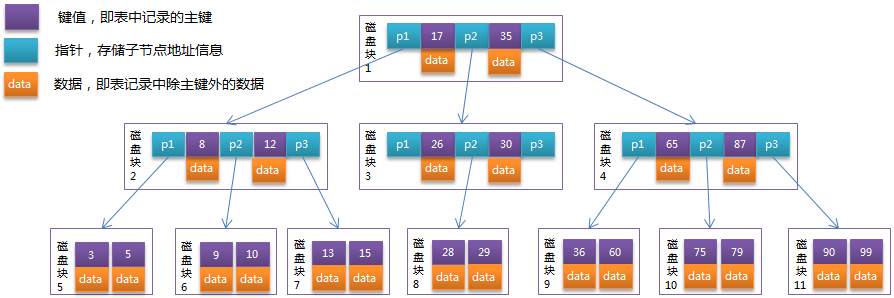
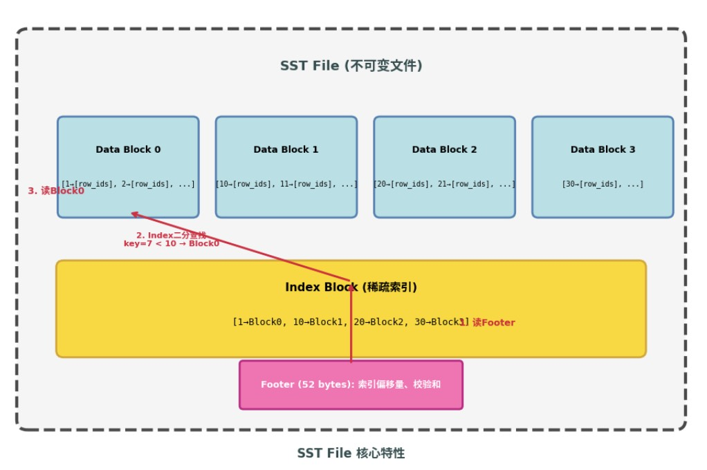

# Spark SQL 查询流程中 BTree Global Index 的作用

Global Index 是 Paimon 为 Data Evolution (Append) 表 设计的全局索引机制，用于高效行级查找和过滤，避免全表扫描。

LocalTest =>
`test("Append Table: Global Index")`

## BTree 索引文件结构
- 文件名：`btree-global-index-<uuid>.index`
- 位置：`<table-path>/index/`

### SST structure

```
┌─────────────────────────────────────────────────────────────┐
│  Data Block 0     │  Data Block 1     │ ... │  Data Block N │
│  (sorted KV pairs)│  (sorted KV pairs)│     │  (sorted KV)  │
├─────────────────────────────────────────────────────────────┤
│  Index Block                                                │
│  Key="user_050" → BlockHandle(offset=0, size=4096)          │
│  Key="user_100" → BlockHandle(offset=4096, size=4096)       │
│  Key="user_150" → BlockHandle(offset=8192, size=4096)       │
├─────────────────────────────────────────────────────────────┤
│  Bloom Filter [Optional]                                    │
├─────────────────────────────────────────────────────────────┤
│  Footer (52 bytes)                                          │
│  - Index Block offset & size                                │
│  - Bloom Filter offset & size                               │
│  - firstKey, lastKey                                        │
└─────────────────────────────────────────────────────────────┘
```

### Key-Value 语义

| 字段 | 说明 |
|------|------|
| **Key** | 索引字段的序列化值（如 `"user_001"`） |
| **Value** | `int(数量) + varint(RowId1) + varint(RowId2) + ...` |

**注意**：相同 Key 的多个 Row ID 合并存储，不是每行一个 KV。


## 问题：BTree SST 与 LookupLevels SST 的区别

[lookup SST structure](../lookup.md#sst-file-layout)

| 特性 | BTree Global Index | LookupLevels SST |
|-----|-------------------|------------------|
| 用途 | Append 表二级索引 | 主键表点查加速 |
| Key | 索引字段值 | 主键 |
| Value | **Row ID 列表** | **完整 Value 行** / 文件位置 |
| 查询类型 | 点查 + 范围查 | 仅点查 |
| 文件位置 | 对象存储 | 本地磁盘缓存 |

---

## 问题：Paimon BTree 与传统的 BTree 区别？

### 名称来源

Paimon 的 BTree Index 底层使用 **SST (Sorted String Table) File** 格式。之所以称为 "BTree"，是因为查询时采用两次二分查找的层级结构：

1. **Index Block 二分查找**：先定位到包含目标 Key 的 Data Block
2. **Data Block 二分查找**：再在 Data Block 内定位到具体的 Key

这与传统 B+Tree "利用有序性 + 分层索引实现高效查找"的核心思想一致。

### 与传统数据库 B+Tree 的区别

| 特性 | 传统 B+Tree (InnoDB) | Paimon BTree Global Index |
|------|---------------------|--------------------------|
| **存储结构** | 页式存储（Page），节点分散在磁盘各处 | SST File，连续块存储 |
| **更新方式** | 原地更新（in-place update），支持增删改 | 不可变（immutable），只能重建 |
| **节点组织** | 根节点 → 内部节点 → 叶子节点，指针连接 | Index Block → Data Block，无指针 |
| **叶子节点数据** | 存储实际数据行或行指针 | 存储 Key → Row ID 列表 |
| **并发控制** | 需要 latch/锁保护树结构 | 只读文件，无并发问题 |
| **构建方式** | 随数据写入动态分裂、合并 | 批量构建：外部排序 → 顺序写入 |
| **磁盘 IO 模式** | 随机写（更新时） | 顺序写（构建时） |


### 查询流程对比
#### B-Tree（Mongo）
- 节点里既存键也存值
- 单次查询可能会在不同层级读数据
  


#### 传统 B+Tree 查询（MySQL InnoDB）

- 数据只在叶子节点
- 所有叶子节点通过指针串成有序链表（key 全局有序）
- 每个节点（页）大小通常和磁盘/SSD 块对齐（例如 8KB、16KB），一读一页，I/O 次数稳定

```
查询 user_id='user_001'：

1. 根节点（内存中）
   [user_100, user_200, user_300]
   "user_001" < "user_100" → 走第一个子指针

2. 内部节点（磁盘 Page）
   [user_010, user_050, user_080]
   "user_001" < "user_010" → 走第一个子指针

3. 叶子节点（磁盘 Page）
   [user_001, user_002, user_003, ...]
   二分查找 → 找到 user_001 → 读取对应数据行
```

#### Paimon BTree（SST）
- 数据只在叶子节点
- 叶子节点（index key无序），与传统的 b-tree/b+tree 不一样
- index 作用只是用来减少扫描的文件数
  

```
查询 user_id='user_001'：

1. 读 Footer（文件末尾 52 bytes）
   → 获取 Index Block 位置

2. Index Block 二分查找
   [user_050, user_100, user_150, ...]
   "user_001" < "user_050" → Data Block 0

3. 读 Data Block 0（offset=0, size=4096）
   [user_001→[0,2,5], user_002→[1,3,6], user_003→[4,7,10], ...]
   二分查找 → 找到 user_001 → Value=[0, 2, 5]（Row ID 列表）
```

### 关键差异

1. **不可变性**：SST File 一旦写入不可修改。新数据写入后，旧索引不会自动更新，必须重建。
2. **无锁读取**：SST File 是只读的，多个查询可以并发读取，无需锁保护。
3. **批量构建**：通过外部排序批量构建，顺序写磁盘，避免了 B+Tree 的随机写放大问题。
4. **Value 存储**：Paimon 的 Value 是 Row ID 列表（varint 编码），不是实际数据行。

## 问题 1：Spark SQL 怎么知道可以用 BTree Index？

并不是在`PaimonBaseScanBuilder.pushFilters`(spark3.2)，而是在 DataEvolutionBatchScan.plan() 里面:

Spark 的 Filter 下推确实通过 `PaimonBaseScanBuilder.pushPredicates()`(spark3.3+) 完成，
但这只是把 `user_id IN ('user_001', 'user_002')` 这个 filter 记录下来（放到 `pushedDataFilters` 里）。

真正触发 BTree Index 查询的时机是在 **生成 Splits 的时候**，也就是 `PaimonBaseScan.getInputSplits()` 调用链中：

```
PaimonBaseScan.getInputSplits()
  └── readBuilder.newScan()                    // 返回 DataEvolutionBatchScan
      └── .withGlobalIndexResult(...)           // 传入 Vector/FullText 索引结果（BTree 不走这里！）
      └── .plan()                               // 调用 DataEvolutionBatchScan.plan()
```

注意：**BTree Index 不是通过 `withGlobalIndexResult()` 传入的！** 它是在 `DataEvolutionBatchScan.plan()` 内部自己评估的：

```java
// DataEvolutionBatchScan.java
@Override
public Plan plan() {
    RowRangeIndex rowRangeIndex = this.pushedRowRangeIndex;

    // 关键：如果没有外部传入的 RowRangeIndex，就评估 Global Index
    if (rowRangeIndex == null) {
        Optional<GlobalIndexResult> indexResult = evalGlobalIndex();  // ← 在这里触发 BTree 查询！
        if (indexResult.isPresent()) {
            rowRangeIndex = RowRangeIndex.create(result.results().toRangeList());
        }
    }

    if (rowRangeIndex == null) {
        return batchScan.plan();  // 无索引，全表扫描
    }

    // 有索引，用 RowRangeIndex 过滤 splits
    List<Split> splits = batchScan.withRowRangeIndex(rowRangeIndex).plan().splits();
    return wrapToIndexSplits(splits, rowRangeIndex, scoreGetter);
}
```

### evalGlobalIndex() 的内部逻辑

```java
private Optional<GlobalIndexResult> evalGlobalIndex() {
    // 1. 如果已经有外部传入的 globalIndexResult，直接返回
    if (this.globalIndexResult != null) {
        return Optional.of(globalIndexResult);
    }

    // 2. 没有 filter？无法使用索引
    if (filter == null) {
        return Optional.empty();
    }

    // 3. 检查表是否启用了 global index
    CoreOptions options = table.coreOptions();
    if (!options.globalIndexEnabled()) {
        return Optional.empty();
    }

    // 4. 获取分区过滤条件（用于减少索引扫描范围）
    PartitionPredicate partitionFilter =
            batchScan.snapshotReader().manifestsReader().partitionFilter();

    // 5. 创建 GlobalIndexScanner（这里会检查 filter 是否包含索引列）
    Optional<GlobalIndexScanner> optionalScanner =
            GlobalIndexScanner.create(table, partitionFilter, filter);
    if (!optionalScanner.isPresent()) {
        return Optional.empty();  // filter 不包含索引列，无法使用索引
    }

    // 6. 执行索引扫描！
    try (GlobalIndexScanner scanner = optionalScanner.get()) {
        return scanner.scan(filter);
    }
}
```

### 完整的调用链

```
Spark SQL: SELECT * FROM t WHERE user_id IN ('A', 'B')
                    │
                    ▼
┌─────────────────────────────────────────────────────────────────┐
│  1. Spark Catalyst Optimizer                                     │
│     - 解析 SQL → Logical Plan                                    │
│     - Filter 下推 → PaimonScanBuilder.pushPredicates()          │
│     - 记录 pushedDataFilters = [user_id IN ('A', 'B')]          │
└─────────────────────────────────────────────────────────────────┘
                    │
                    ▼
┌─────────────────────────────────────────────────────────────────┐
│  2. PaimonScanBuilder.build() → PaimonScan                     │
│     - 创建 PaimonScan，携带 pushedDataFilters                   │
│     - 此时还没有触发索引查询！                                    │
└─────────────────────────────────────────────────────────────────┘
                    │
                    ▼
┌─────────────────────────────────────────────────────────────────┐
│  3. Spark 请求 Splits（PaimonBaseScan.getInputSplits()）         │
│     - readBuilder.newScan() → DataEvolutionBatchScan            │
│     - .withFilter(predicate) 把 pushedDataFilters 传进去        │
│     - .plan() → 触发 evalGlobalIndex()                           │
└─────────────────────────────────────────────────────────────────┘
                    │
                    ▼
┌─────────────────────────────────────────────────────────────────┐
│  4. DataEvolutionBatchScan.evalGlobalIndex()                     │
│     - GlobalIndexScanner.create(table, partitionFilter, filter) │
│     - 检查 filter 是否包含索引列（user_id）                       │
│     - 是 → 创建 BTreeIndexReader                                 │
│     - scanner.scan(filter) → 执行 BTree 查询                     │
└─────────────────────────────────────────────────────────────────┘
```

**关键点**：
- `pushPredicates()` 只是**记录** filter，不触发索引
- `withGlobalIndexResult()` 只用于 **Vector Search / FullText Search**（外部预计算好结果传入）
- **BTree Index 是在 `plan()` 时内部评估的**，通过 `evalGlobalIndex()` 动态查询

---

## 问题 2：BTree Index 具体怎么过滤数据？

### 步骤 1：GlobalIndexScanner 创建与匹配检查

```java
// GlobalIndexScanner.create()
public static Optional<GlobalIndexScanner> create(
        FileStoreTable table,
        PartitionPredicate partitionFilter,
        Predicate filter) {

    // 1. 检查表是否有全局索引
    if (!table.coreOptions().globalIndexEnabled()) {
        return Optional.empty();
    }

    // 2. 获取索引列信息
    List<String> indexColumns = table.globalIndexColumns();  // ["user_id"]

    // 3. 检查 filter 是否包含索引列
    // 遍历 filter 的叶子节点，看是否有字段名匹配索引列
    boolean containsIndexColumn = filter.visit(new PredicateVisitor<Boolean>() {
        @Override
        public Boolean visit(LeafPredicate predicate) {
            return indexColumns.contains(predicate.fieldName());
        }
        // ... 其他 visit 方法
    });

    if (!containsIndexColumn) {
        return Optional.empty();  // filter 不包含索引列，无法使用索引
    }

    // 4. 创建对应的 IndexReader（BTree / Bitmap）
    GlobalIndexReader reader = createIndexReader(table, partitionFilter);

    // 5. 创建 GlobalIndexScanner
    return Optional.of(new GlobalIndexScanner(reader, filter));
}
```

### 步骤 2：BTree 索引文件查找

```
索引文件：btree-global-index-xxx.index

内部结构：
Footer (52 bytes, 文件末尾)
  → Index Block offset = 1024, size = 256
  → Null Bitmap offset = 2048, size = 128

查找 user_id='user_001'：

1. 读 Footer → 定位 Index Block
2. Index Block 二分查找：
   
   Index Block 内容：
   Key="user_050" → (offset=0, size=4096)      // Data Block 1
   Key="user_100" → (offset=4096, size=4096)   // Data Block 2
   Key="user_150" → (offset=8192, size=4096)   // Data Block 3
   ...
   
   二分查找 user_id='user_001'：
   - "user_001" < "user_050" → 在 Data Block 1

3. 读 Data Block 1（offset=0, size=4096）
   
   Data Block 1 内容：
   Key="user_001" → Value=[0, 2, 5, 8, 12]     // 5 个 Row ID
   Key="user_002" → Value=[1, 3, 6, 9, 13]     // 5 个 Row ID
   Key="user_003" → Value=[4, 7, 10, 14]       // 4 个 Row ID
   ...
   
   Data Block 内二分查找：
   - 找到 Key="user_001"
   - 反序列化 Value：int(5) + varint(0) + varint(2) + varint(5) + varint(8) + varint(12)

4. 返回 Row ID 集合：{0, 2, 5, 8, 12}
```

### 步骤 3：合并多个 user_id 的结果

```java
// BTreeIndexReader.visitIn()
public Optional<GlobalIndexResult> visitIn(FieldRef fieldRef, List<Object> literals) {
    RoaringNavigableMap64 result = new RoaringNavigableMap64();

    for (Object literal : literals) {
        // 1. 在 BTree 索引文件中查找 user_id = literal
        RoaringNavigableMap64 rowIds = rangeQuery(literal, literal, true, true);

        // 2. 合并多个 literal 的结果（OR 操作）
        result.or(rowIds);
    }

    return Optional.of(GlobalIndexResult.create(() -> result));
}
```

```
user_id='user_001' → Row IDs: {0, 2, 5, 8, 12}
user_id='user_002' → Row IDs: {1, 3, 6, 9, 13}

合并结果：{0, 1, 2, 3, 5, 6, 8, 9, 12, 13}  (10 个 Row ID)
```

**回答**：BTree Index 通过两次二分查找（Index Block + Data Block）定位 Key，反序列化 Value 获取 Row ID 列表。多个条件（IN）的结果用 RoaringBitmap 的 OR 操作合并。

---

## 问题 3：拿到 Row ID 后怎么读取数据？

### Row ID → RowRangeIndex → 文件过滤

```
GlobalIndexResult: RoaringBitmap64 {0, 1, 2, 3, 5, 6, 8, 9, 12, 13}

DataEvolutionBatchScan.plan() 内部：

1. RoaringBitmap → RowRangeIndex（合并连续区间）
   
   RowRangeIndex: [0-3], [5-6], [8-9], [12-13]

2. batchScan.withRowRangeIndex(rowRangeIndex).plan()
   
   用 RowRangeIndex 过滤 Manifest 文件：
   
   Manifest-1: minRowId=0, maxRowId=1000
     → 与 [0-3], [5-6], [8-9], [12-13] 相交 ✅ 保留
     
   Manifest-2: minRowId=2000, maxRowId=3000
     → 不相交 ❌ 跳过

3. 读取 Manifest-1，获取 DataFileMeta 列表：
   
   File-A: firstRowId=0, rowCount=50 → range [0-49]
     → 与 [0-3], [5-6], [8-9], [12-13] 相交 ✅ 保留
     
   File-B: firstRowId=50, rowCount=50 → range [50-99]
     → 不相交 ❌ 跳过

   File-C: firstRowId=100, rowCount=100 → range [100-199]
     → 不相交 ❌ 跳过

   结果：只需要读取 File-A
```

### 生成 IndexedSplit

```java
// DataEvolutionBatchScan.wrapToIndexSplits()
private static IndexedSplit wrap(
        DataSplit dataSplit, final RowRangeIndex rowRangeIndex, ScoreGetter scoreGetter) {

    List<DataFileMeta> files = dataSplit.dataFiles();

    // 计算这个 Split 的 Row ID 范围
    long min = files.get(0).nonNullFirstRowId();
    long max = files.get(files.size() - 1).nonNullFirstRowId()
            + files.get(files.size() - 1).rowCount() - 1;

    // 与索引结果求交集
    List<Range> expected = rowRangeIndex.intersectedRanges(min, max);
    // expected = [0-3], [5-6], [8-9], [12-13]（在这个 Split 范围内的部分）

    return new IndexedSplit(dataSplit, expected, scores);
}
```

### Spark Task 读取数据

```
Spark Task 读取 IndexedSplit：

1. 打开 File-A（Parquet/ORC 格式）
2. 读取所有行
3. 用 expected RowRanges 过滤：
   
   File-A 的行：
   Row 0: user_id='user_001', event_time='2023-12-01', ...  // Row ID=0 ✅ 在 [0-3]
   Row 1: user_id='user_002', event_time='2024-02-01', ...  // Row ID=1 ✅ 在 [0-3]
   Row 2: user_id='user_001', event_time='2024-03-01', ...  // Row ID=2 ✅ 在 [0-3]
   Row 3: user_id='user_002', event_time='2023-11-01', ...  // Row ID=3 ✅ 在 [0-3]
   Row 4: user_id='user_003', event_time='2024-01-01', ...  // Row ID=4 ❌ 不在 expected
   Row 5: user_id='user_001', event_time='2024-04-01', ...  // Row ID=5 ✅ 在 [5-6]
   ...

4. 再用剩余 filter（event_time > '2024-01-01'）过滤：
   
   Row 0: event_time='2023-12-01' ❌
   Row 1: event_time='2024-02-01' ✅
   Row 2: event_time='2024-03-01' ✅
   Row 3: event_time='2023-11-01' ❌
   Row 5: event_time='2024-04-01' ✅
   ...
```

**回答**：Row ID 先过滤到 Manifest 级别，再过滤到 DataFile 级别，生成 IndexedSplit 携带 expected RowRanges。最后读取文件时用 RowRanges 做行级过滤。剩余的 filter（非索引列）在内存中再次过滤。

---

## 问题 4：如果没有 BTree Index，查询会怎样？

### 无索引时的查询流程

```
SELECT * FROM T WHERE user_id = 'user_001'

1. Spark 下推 Filter 到 Paimon
   pushedDataFilters = [user_id = 'user_001']

2. DataEvolutionBatchScan.plan() 调用 evalGlobalIndex()
   
   private Optional<GlobalIndexResult> evalGlobalIndex() {
       // a. 检查是否有外部传入的 globalIndexResult
       if (this.globalIndexResult != null) {
           return Optional.of(globalIndexResult);  // 没有
       }
       
       // b. 检查是否有 filter
       if (filter == null) {
           return Optional.empty();  // 有 filter，继续
       }
       
       // c. 检查 global-index.enabled
       CoreOptions options = table.coreOptions();
       if (!options.globalIndexEnabled()) {
           return Optional.empty();  // enabled = true，继续
       }
       
       // d. 获取分区过滤条件
       PartitionPredicate partitionFilter = ...
       
       // e. 创建 GlobalIndexScanner（关键！）
       Optional<GlobalIndexScanner> optionalScanner =
               GlobalIndexScanner.create(table, partitionFilter, filter);
       
       // ========== 这里发生了什么？ ==========
       // GlobalIndexScanner.create() 内部：
       //   1. 从 snapshot 读取 indexManifest
       //   2. 检查 filter 中的字段是否有对应的索引文件
       //   3. 如果没有索引文件 → 返回 Optional.empty()
       // =====================================
       
       if (!optionalScanner.isPresent()) {
           return Optional.empty();  // ← 没有索引文件，走这里！
       }
       
       try (GlobalIndexScanner scanner = optionalScanner.get()) {
           return scanner.scan(filter);  // 执行索引查询
       }
   }

3. evalGlobalIndex() 返回 Optional.empty()

4. plan() 走全表扫描分支：
   
   if (rowRangeIndex == null) {
       return batchScan.plan();  // 全表扫描！
   }
   
   // batchScan.plan() 会：
   // - 读取所有 Manifest 文件
   // - 读取所有 DataFile
   // - 生成包含所有文件的 DataSplit

5. Spark Task 读取数据：
   - 打开所有 DataFile
   - 读取所有行
   - 在内存中过滤 user_id = 'user_001'
   - 返回匹配的行
```

### 为什么 GlobalIndexScanner.create() 会返回 empty？

```java
// GlobalIndexScanner.create() 的完整逻辑
public static Optional<GlobalIndexScanner> create(
        FileStoreTable table, PartitionPredicate partitionFilter, Predicate filter) {

    // 1. 收集 filter 中的字段 ID
    Set<Integer> filterFieldIds =
            collectFieldNames(filter).stream()
                    .filter(name -> table.rowType().containsField(name))
                    .map(name -> table.rowType().getField(name).id())
                    .collect(Collectors.toSet());

    // 2. 定义索引文件过滤条件
    Filter<IndexManifestEntry> indexFileFilter = entry -> {
        // a. 分区过滤
        if (partitionFilter != null && !partitionFilter.test(entry.partition())) {
            return false;
        }
        // b. 检查是否是 Global Index（有 globalIndexMeta）
        GlobalIndexMeta globalIndex = entry.indexFile().globalIndexMeta();
        if (globalIndex == null) {
            return false;  // 不是 Global Index，跳过
        }
        // c. 检查索引字段是否在 filter 中
        return filterFieldIds.contains(globalIndex.indexFieldId());
    };

    // 3. 从 snapshot 的 indexManifest 中扫描索引文件
    //    如果 snapshot.indexManifest == null（还没有创建过索引）
    //    或者 indexManifest 中没有匹配 user_id 的索引文件
    //    则返回空列表
    List<IndexFileMeta> indexFiles =
            table.store().newIndexFileHandler().scan(tryTravelOrLatest(table), indexFileFilter)
                    .stream()
                    .map(IndexManifestEntry::indexFile)
                    .collect(Collectors.toList());

    // 4. 如果没有索引文件，返回 Optional.empty()
    if (indexFiles.isEmpty()) {
        return Optional.empty();  // ← 没有索引文件！
    }

    // 5. 有索引文件，创建 GlobalIndexScanner
    return create(table, indexFiles);
}
```

### Snapshot 的 indexManifest 机制

```
每个 Snapshot 包含一个 indexManifest 字段：

Snapshot-1 (INSERT 后):
  - dataManifestList: "manifest-list-1"
  - indexManifest: null                    ← 还没有索引！
  
Snapshot-2 (INSERT 后):
  - dataManifestList: "manifest-list-2"
  - indexManifest: null                    ← 还没有索引！

Snapshot-3 (CREATE INDEX 后):
  - dataManifestList: "manifest-list-2"    ← 数据没变
  - indexManifest: "index-manifest-1"      ← 新创建了索引！
    内容：[IndexManifestEntry]
      - indexFile: "btree-global-index-xxx.index"
      - indexType: "btree"
      - globalIndexMeta: {indexFieldId: 1, rowRangeStart: 0, rowRangeEnd: 5}

Snapshot-4 (INSERT 新数据后):
  - dataManifestList: "manifest-list-3"    ← 新数据
  - indexManifest: "index-manifest-1"      ← 索引没变！
    // 注意：索引只覆盖了 Row ID [0-5]，新数据的 Row ID 是 6，不在索引范围内！
```

### 关键：`IndexManifestFile.writeIndexFiles()` 的行为

```java
public String writeIndexFiles(
        @Nullable String previousIndexManifest,
        List<IndexManifestEntry> newIndexFiles,
        BucketMode bucketMode) {
    // 关键：如果新的 commit 没有索引文件变化，继承上一个 snapshot 的 indexManifest！
    if (newIndexFiles.isEmpty()) {
        return previousIndexManifest;  // ← 继承旧索引！
    }
    // 有新的索引文件，合并写入
    IndexManifestFileHandler handler = new IndexManifestFileHandler(this, bucketMode);
    return handler.write(previousIndexManifest, newIndexFiles);
}
```

这意味着：

```
Snapshot-1 (INSERT 后): indexManifest = null
Snapshot-2 (INSERT 后): indexManifest = null  
Snapshot-3 (CREATE INDEX 后): indexManifest = "index-manifest-1"  ← 有索引了！
Snapshot-4 (INSERT 新数据后): indexManifest = "index-manifest-1"  ← 继承旧索引！
```

**但是！** 旧索引的 `GlobalIndexMeta.rowRangeEnd` 只覆盖到创建索引时的最大 Row ID。新数据的 Row ID 超出了这个范围。

注意：**这里没有检查 Row ID 范围是否覆盖当前查询！** 索引文件会被返回，但其中的 Row ID 范围可能不包含新数据。

### 核心结论

| 场景 | 索引状态 | 查询方式 | 读取文件数 | 结果正确性 |
|------|---------|---------|-----------|-----------|
| 写入后、建索引前 | 无索引 | 全表扫描 | 所有文件 | ✅ 正确 |
| 建索引后、新写入前 | 有索引 | BTree Index | 少量文件 | ✅ 正确 |
| **新写入后、未重建索引** | **索引覆盖范围不足** | **BTree Index** | **少量文件** | **❌ 漏数据！** |
---

## 问题 5：Clustering 与 Data Evolution 的关系

**使用 Global Index 必须开启 Data Evolution**，所以 Clustering 的问题本质上是：**Data Evolution 表能否用 Clustering？**


### Global Index 的前提条件

```sql
TBLPROPERTIES (
    'bucket' = '-1',              -- unaware-bucket mode（必须）
    'row-tracking.enabled' = 'true',   -- 必须
    'data-evolution.enabled' = 'true'  -- 必须
);
```

### Clustering

```sql
TBLPROPERTIES (
    'data-evolution.enabled' = 'false',
    'clustering.incremental' = 'true',
    'clustering.columns' = 'user_id'
);
```

---

## 完整流程图

```
Spark SQL: SELECT * FROM t WHERE user_id IN ('A', 'B') AND event_time > '2024-01-01'
                    │
                    ▼
┌─────────────────────────────────────────────────────────────────┐
│  1. Spark Catalyst Optimizer                                     │
│     - 解析 SQL → Logical Plan                                    │
│     - Filter 下推 → PaimonScanBuilder.pushPredicates()          │
│     - 记录 pushedDataFilters = [user_id IN ('A', 'B')]          │
│     - 记录 postScanFilters = [event_time > '2024-01-01']        │
└─────────────────────────────────────────────────────────────────┘
                    │
                    ▼
┌─────────────────────────────────────────────────────────────────┐
│  2. PaimonScanBuilder.build() → PaimonScan                     │
│     - 创建 PaimonScan，携带 pushedDataFilters                   │
│     - 此时还没有触发索引查询！                                    │
└─────────────────────────────────────────────────────────────────┘
                    │
                    ▼
┌─────────────────────────────────────────────────────────────────┐
│  3. Spark 请求 Splits（PaimonBaseScan.getInputSplits()）         │
│     - readBuilder.newScan()                                     │
│     - 如果是 Data Evolution 表 → 返回 DataEvolutionBatchScan    │
│     - .withFilter(predicate) 传入 pushedDataFilters             │
│     - .plan() → 触发索引评估                                     │
└─────────────────────────────────────────────────────────────────┘
                    │
                    ▼
┌─────────────────────────────────────────────────────────────────┐
│  4. DataEvolutionBatchScan.plan()                                │
│     - evalGlobalIndex()                                         │
│       * GlobalIndexScanner.create(table, partitionFilter, filter)│
│       * 检查 filter 是否包含索引列（user_id）                     │
│       * 是 → 创建 BTreeIndexReader                               │
│       * scanner.scan(filter) → 执行 BTree 查询                   │
│     - 返回 GlobalIndexResult（RoaringBitmap64）                  │
│     - RowRangeIndex.create(result.toRangeList())                │
└─────────────────────────────────────────────────────────────────┘
                    │
                    ▼
┌─────────────────────────────────────────────────────────────────┐
│  5. 用 RowRangeIndex 过滤文件                                    │
│     - batchScan.withRowRangeIndex(rowRangeIndex).plan()         │
│     - Manifest 级别过滤（minRowId/maxRowId）                     │
│     - DataFile 级别过滤（firstRowId + rowCount）                 │
│     - 生成 DataSplit（只包含需要的文件）                          │
│     - wrapToIndexSplits() → IndexedSplit（携带 expected ranges）│
└─────────────────────────────────────────────────────────────────┘
                    │
                    ▼
┌─────────────────────────────────────────────────────────────────┐
│  6. Spark Task 读取数据                                          │
│     - 打开 IndexedSplit 中的文件                                 │
│     - 读取所有行                                                 │
│     - 用 expected RowRanges 过滤行                               │
│     - 用剩余 filter（event_time）过滤                            │
│     - 返回结果                                                   │
└─────────────────────────────────────────────────────────────────┘
```