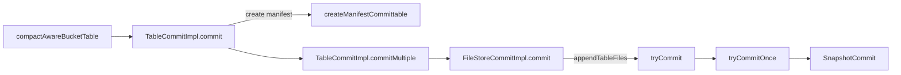

# Concurrency Control

[official concurrency control](../docs/content/concepts/concurrency-control.md)


| 操作 A | 操作 B | 兼容性 | 源码依据                                                                                                                      |
|---|---|---|---------------------------------------------------------------------------------------------------------------------------|
| Append | Append | ✅ 兼容，乐观重试 | `tryCommit` while 循环重读最新 snapshot 后重试；只新增 ADD 文件，`checkDeleteInEntries` 不触发  |
| Append | Delete (DV / compact 删旧文件) | ✅ 兼容 | Append 只新增 ADD entry，与 base 中被 DELETE 的旧文件无交集  |
| Delete | Delete | ⚠️ 不重叠才兼容 | `checkDeleteInEntries` 第 422 行：若要删的文件已不在 base 中（被对方先删了），抛 "Trying to delete file ... which is not previously added"       |
| Delete | Compact / Append | ✅ 通常兼容 | 只要被删文件还存在；DV 场景额外走 `buildBaseEntriesWithDV` 校验  |
| Overwrite | 任何 | ❌ 后提交方失败 | `checkBucketKeepSame` 第 283 行 OVERWRITE 直接 return，但 OVERWRITE 把分区现存所有文件标 DELETE，并发的 Append/Compact 重试时会发现自己引用的 base 文件已被删 → `checkDeleteInEntries` 失败 |
| Compact (改同一 bucket) | Compact (改同一 bucket) | ❌ 冲突 | 二者都把同一批 base 文件标 DELETE + 写新文件；后提交方在 `checkDeleteInEntries` 失败。LSM level≥1 时还会再被 `checkKeyRange` 第 380 行的 key range 重叠检查拦截 |
| Compact 不同 bucket | Compact 不同 bucket | ✅ 兼容 | 操作的文件集合不相交   |

## commit manifest
`compactAwareBucketTable` commit manifest


- [Concurrency Control](https://paimon.apache.org/docs/master/concepts/concurrency-control/)
  `tryCommit` will wait for a while if `tryCommitOnce` failed, then retry again, until success or exceed max retry times.
  `tryCommitOnce` will base on the lastest snapshot as base `baseManifestList`, then create new `deltaManifestList`, then generates a new snapshot based on the current snapshot,
  if commit failed due to other client already committed, try again by lastest snapshot.

## Files conflict

```text
  T0: snapshot-2 存在文件：level0[F1, F2, F3, F4]

  Job-1                                    Job-2
  ─────────────────────────────────────────────────────────────────
  写入 F5 (level 0)                        写入 F6 (level 0)

  prepareCommit (checkpoint-10):
    DataIncrement: [ADD F5]                DataIncrement: [ADD F6]
    CompactIncrement: [                    CompactIncrement: [
      compactBefore: F1,F2,F3,F4,F5          compactBefore: F1,F2,F3,F4,F6
      compactAfter: F8                       compactAfter: F7
    ]                                      ]

  T1: Job-1 commit APPEND → snapshot-3     T2: Job-2 commit APPEND → snapshot-4
      changes: [ADD F5] ✓                      changes: [ADD F6] ✓
      commitUser=job1, identifier=10           commitUser=job2, identifier=10

  T3: Job-1 commit COMPACT → snapshot-5    T4: Job-2 commit COMPACT → ???
      changes: [DELETE F1-F5, ADD F8]          changes: [DELETE F1-F4,F6, ADD F7]
      commitUser=job1, identifier=10           commitUser=job2, identifier=10
      latestSnapshot=snapshot-4                latestSnapshot=snapshot-5
      baseDataFiles=[F1-F6]                    baseDataFiles=[F6, F8]
      ✓ 成功！                                   ❌ 失败！F1-F4 已被删
```
Job-2 的 APPEND (snapshot-4) 成功，但 COMPACT 失败，此次 checkpoint 成功一半。

但是 failover 后 filterCommitted 按 identifier 过滤，
可能把整个 ManifestCommittable（包括未提交的 COMPACT）都过滤掉，导致**COMPACT
操作永久丢失**。

这是 Paimon 同一个 identifier 分两次提交（APPEND + COMPACT）的设计隐患。

一旦某个 checkpoint（如 11）的 Committer state 中保存了包含无效删除操作的 `ManifestCommittable`，
比如 job2 T4 中的 COMPACT commit。

作业从该 checkpoint 恢复时，`initializeState` → `recover` → `commitMultiple` 会直接失败，
导致 **Task初始化失败 → 立即 failover → 再次从同一 checkpoint 恢复 → 再次初始化失败**，形成**无法逃逸的死循环**。
作业永远无法正常启动，只能人工干预（如丢弃该 checkpoint、回退到更早 checkpoint、或改为 write-only 模式重启）。


**FileStoreCommitImpl.tryCommitOnce -> tryToRollback 作用是什么？**\
tryToRollback 的作用是：当 commit 检测到冲突时，如果最新 snapshot 是 COMPACT 类型，自动回滚这个 compaction snapshot，然后重试当前 commit。\
只有 RESTCatalog 支持 rollback, 以及 `conflictDetection.shouldBeOverwriteCommit`（TODO 这个条件什么意思？）。


### CommitMessageImpl

**DataIncrement.deletedFiles 源头？**\
DataIncrement.deletedFiles 在当前 Paimon 代码中几乎没有实际用途。
它是一个历史遗留字段，唯一被填充的场景是 RemoveUnexistingFilesAction 清理孤儿文件。
正常的写入、compaction、DELETE SQL 都不通过 deletedFiles 删除文件——文件
替换走 CompactIncrement，逻辑删除走 Deletion Vector 或 Delete Record。

```text
  DataIncrement: 本次写入直接产生的文件
  ├── newFiles: 写入的新数据文件（如 INSERT 产生的 level 0 文件）
  ├── deletedFiles: 直接删除（几乎不用）
  └── changelogFiles: 变更日志文件

  CompactIncrement: Compaction 产生的文件替换
  ├── compactBefore: 被 compaction 合并掉的旧文件 → DELETE
  ├── compactAfter: compaction 生成的新文件 → ADD
  └── changelogFiles: compaction 产生的 changelog

              DataIncrement              CompactIncrement
  ━━━━━━━━━━━━━━━━━━━━━━━━━━━━━━━━━━━━━━━━━━━━━━━━━━━━━━━━━━━━━━
   产生时机   正常写入（flush buffer）   Compaction（后台合并）
   文件来源   新写入的数据               旧文件合并后的结果
   提交类型   APPEND snapshot            COMPACT snapshot
```

## Snapshot conflict
<summary>object storage such as OSS and S3, their 'RENAME' does not have atomic semantic?</summary>
<details>

- `FileStoreCommitImpl.commitSnapshotImpl` : commit snapshot file to file store.
- `CatalogEnvironment.snapshotCommit`: create `SnapshotCommit` instance to commit snapshot.
    - `CatalogSnapshotCommit`: used when catalog supports version management (`supportsVersionManagement == true`). Currently only `RESTCatalog` returns
      `true` by default; other catalogs inherit `AbstractCatalog` which returns `false`.
    - `RenamingSnapshotCommit`: used when catalog does not support version management, relies on external lock for concurrency control.
        - `HiveCatalog`: does not support version management; uses `HiveCatalogLock` based on Hive `IMetaStoreClient`.
        - `JdbcCatalog`: does not support version management; uses `JdbcCatalogLock` based on JDBC row-level locking.
        - `FileSystemCatalog`: does not support version management; no built-in lock by default (`Lock.empty()`), but external `CatalogLockFactory` can be
          configured.

- `FileIO.tryToWriteAtomic` 中 为什么会使用 `rename` 操作？
    - HDFS / Local FS 的写入不是原子可见的：直接写目标路径时若进程崩溃，会留下不完整文件。
    - `rename` 在这些文件系统上是原子操作：仅修改元数据指针，零数据移动。
    - `tryToWriteAtomic` 先写临时文件，再 `rename` 到目标路径，保证读取者要么看到完整旧文件，要么看到完整新文件，不会出现半写状态。
    - 同时 `rename` 还承担了并发冲突检测：两个进程同时写同一文件时，仅一个 `rename` 成功，另一个返回 `false`。

- 对象存储（S3/OSS）上的差异
    - S3/OSS 的 **单对象 PUT** 本身是原子可见的：对象在写入完成前对其他读取者不可见，成功后即刻完整可见。
    - 但 Hadoop FileSystem 对 S3/OSS 的 `rename` 实现为 **Copy + Delete**，既非原子，又产生额外 API 调用和数据复制开销。
    - 在对象存储上，`tryToWriteAtomic` 的临时文件 + `rename` 模式不仅没必要，还带来了性能和成本损耗。
    - Paimon 在 `RenamingSnapshotCommit` 中已通过外部 Lock + `exists` 前置检查来防止并发冲突，因此对象存储理论上可直接写入目标路径。

| 存储系统 | Put (写入) | Rename (重命名) | 核心原理 |
  | :--- | :--- | :--- | :--- |
| HDFS | ❌ 非原子可见 | ✅ 原子 | 写入过程中崩溃会残留不完整文件；`rename` 仅修改 NameNode 元数据指针，零数据移动。 |
| 本地文件 | ❌ 非原子可见 | ✅ 原子 | 同 HDFS，依赖 OS 文件系统的原子 `rename`。 |
| S3/OSS | ✅ 原子可见 | ❌ 非原子 | 单对象 PUT 原子可见；`rename` 底层为 Copy + Delete，耗时且非原子。 |

</details>

### JDBC lock
使用数据库表做lock防止并发 example：[MetastoreJdbcTest](../paimon-spark/paimon-spark-ut/src/test/scala/org/apache/paimon/spark/sql/my/MetastoreJdbcTest.scala) 
