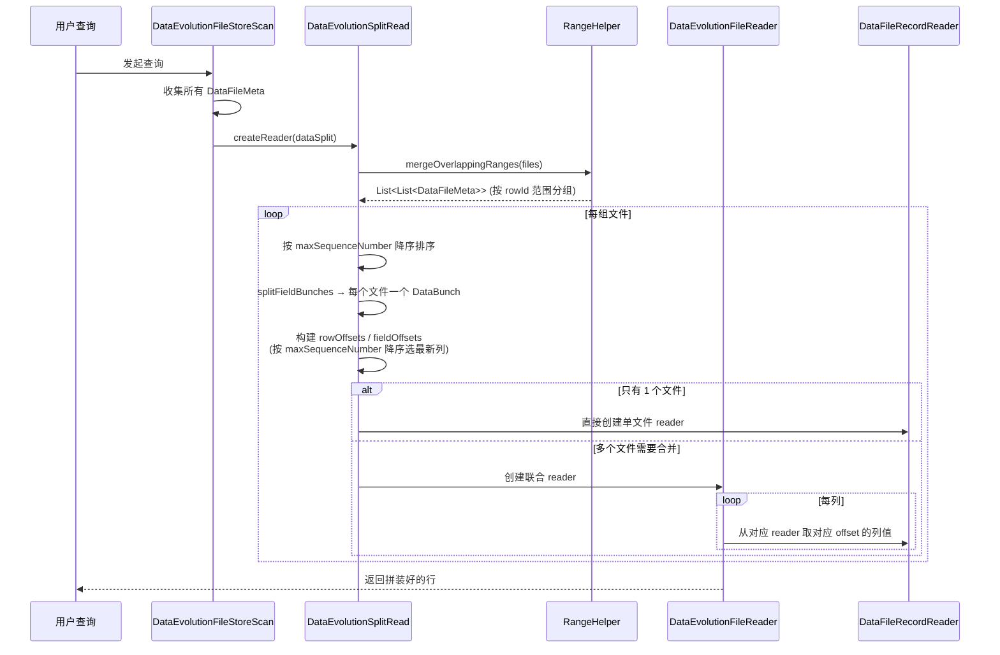
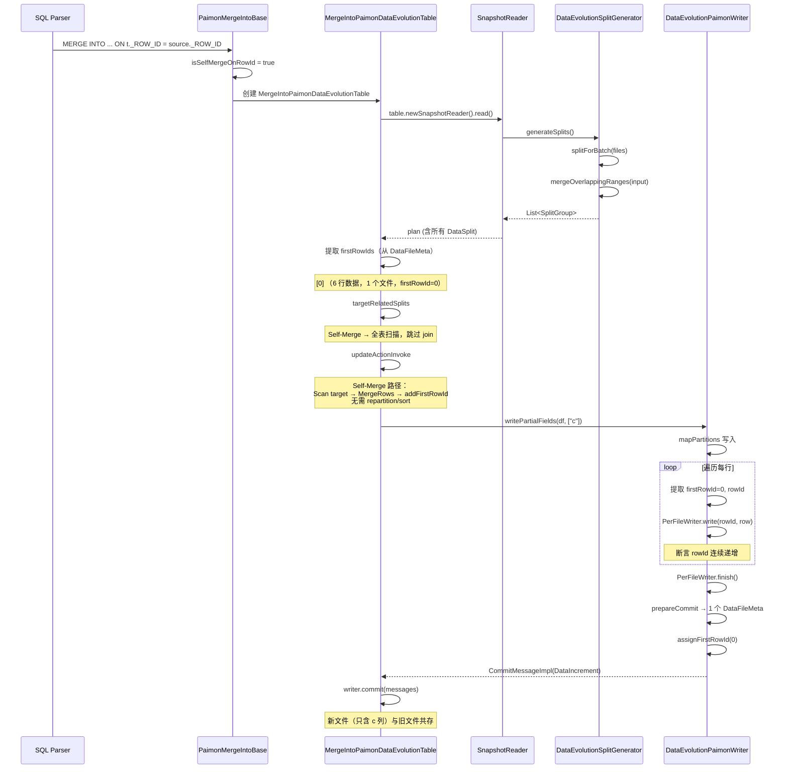

# Data Evolution
Data Evolution 的设计目标：100 列的表，每次更新几列、更新大量行时，避免重写全部 100 列。

- 每次只写更新的列 → I/O 接近理论最小
- 存储：原始文件 + N 个部分列文件（delta 文件）
- 读时：从多个文件组装完整行（有轻微 overhead）

代价：
- 读时需要打开多个文件（同一 firstRowId 范围的文件）
- 需要 Compaction 定期合并，避免文件过多
- 不支持 predicate pushdown 到单个文件（因为列分散在多个文件）
- 从源码结构看，Data Evolution 不支持 UPDATE/DELETE 是**工程实现限制**，不是架构限制

## Data Evolution 的 Merge-on-Read 机制分析

### 示例

假设表有 3 列 (a, b, c)，初始写入文件 F0（seq=1）：

| rowId | a | b | c |
|-------|---|---|---|
| 0     | 1 | 1 | 1 |
| 1     | 2 | 2 | 2 |
| 2     | 3 | 3 | 3 |
| 3     | 4 | 4 | 4 |

然后更新 c 列，写入文件 F1（seq=2, writeCols=[c]）：

| rowId | c  |
|-------|----|
| 0     | 1  |
| 1     | 20 |
| 2     | 30 |
| 3     | 40 |

再更新 c 列，写入文件 F2（seq=3, writeCols=[c]）：

| rowId | b  |
|-------|----|
| 0     | 1  |
| 1     | 21 |
| 2     | 31 |
| 3     | 40 |

读取时：
1. `mergeRangesAndSort`：F0/F1/F2 的 firstRowId 都是 0，rowCount 都是 4 → **同一组**
2. 组内按 maxSequenceNumber 降序：F2(seq=3) → F1(seq=2) → F0(seq=1)
3. `splitFieldBunches`：每个 Normal 文件包装为一个 `DataBunch`，得到 `fieldsFiles`：

   | index | 文件 | 包含列 | seq |
       |-------|------|--------|-----|
   | 0     | F2   | c      | 3   |
   | 1     | F1   | c      | 2   |
   | 2     | F0   | a, b, c| 1   |

4. 构建 rowOffsets / fieldOffsets（遍历 fieldsFiles，每列只取第一个遇到的）：

   | 列 | 从哪个 reader 取 (rowOffsets) | 在该 reader 中的偏移 (fieldOffsets) |
       |----|----------|------|
   | c  | 0 (F2)   | 0    |
   | a  | 2 (F0)   | 0    |
   | b  | 2 (F0)   | 1    |

    - F1 的 c 列已被 F2 覆盖，不再使用
    - F0 的 c 列也已被 F2 覆盖，不再使用

5. 最终读取结果：

   | rowId | a | b | c  |
       |-------|---|---|----|
   | 0     | 1 | 1 | 1  |
   | 1     | 2 | 2 | 21 |
   | 2     | 3 | 3 | 31 |
   | 3     | 4 | 4 | 41 |


### Data Evolution 存储

- **Data File**：完整行（所有列），或部分列（`writeCols` 指定写入的列）
- 每个文件元数据包含：
    - `firstRowId`：该文件第一行的 rowId
    - `rowCount`：行数
    - `maxSequenceNumber`：文件写入时的版本号
    - `writeCols`：该文件实际包含的列名列表


### 问题：怎么知道哪一列该从哪个文件取？

读的时候需要把同一行数据从多个文件里「拼」出来，\
按 firstRowId 分组 + 按 maxSequenceNumber 排序

#### 1. 按 firstRowId 分组（`mergeRangesAndSort`）

```java
// DataEvolutionSplitRead.java L582-586
RangeHelper<DataFileMeta> rangeHelper = new RangeHelper<>(DataFileMeta::nonNullRowIdRange);
List<List<DataFileMeta>> result = rangeHelper.mergeOverlappingRanges(files);
```

`RangeHelper.mergeOverlappingRanges` 把文件按 rowId 范围（`[firstRowId, firstRowId + rowCount - 1]`）做区间合并：
- **区间重叠的文件分到同一组** → 这些文件覆盖同一批 rowId
- 区间不重叠的文件分到不同组 → 可以串行读取，互不干扰

**为什么必须分组？** 因为不同 firstRowId 范围的文件，行数不一样，无法对齐做列拼接。

#### 2. 组内按 maxSequenceNumber 降序排序

```java
// DataEvolutionSplitRead.java L604-605
dataFiles.sort(comparingLong(maxSeqF).reversed());
```

**为什么按 maxSequenceNumber 降序？**

`maxSequenceNumber` 代表文件写入时的「版本号」，越大越新。Data Evolution 的更新策略是：
- 每次更新某列时，写一个**新文件**（只含更新的列）
- 新文件的 `maxSequenceNumber` 比旧文件大
- 读的时候，**取最新版本的数据**

所以排序后，遍历文件时**先遇到的就是最新版本**，一旦某列被「填满」就停止查找。

#### 3. 列选择逻辑（`createUnionReader`）

```java
// DataEvolutionSplitRead.java L221-222
List<FieldBunch> fieldsFiles = splitFieldBunches(needMergeFiles, fileToRowType);
```

对于 Normal 文件，`splitFieldBunches` 中每个文件直接包装为一个 `DataBunch`：

```java
// DataEvolutionSplitRead.java L455-458
} else {
    // Normal file, just add it to the current merge split
    fieldsFiles.add(new DataBunch(file));
    rowCount = file.rowCount();
}
```

然后遍历每个 `DataBunch` 构建 `rowOffsets` / `fieldOffsets`：

```java
// DataEvolutionSplitRead.java L257-286
for (int i = 0; i < fieldsFiles.size(); i++) {
    FieldBunch bunch = fieldsFiles(i);
    // 获取该 bunch 包含的 fieldIds
    for (int j = 0; j < readFieldIndex.length; j++) {
        for (int fieldId : fieldIds) {
            if (readFieldIndex[j] == fieldId) {
                if (rowOffsets[j] == -1) {   // 该列还没被填充
                    rowOffsets[j] = i;        // 从第 i 个 reader 取
                    fieldOffsets[j] = readFields.size();  // 在该 reader 中的偏移
                    readFields.add(allReadFields.get(j));
                }
                break;
            }
        }
    }
}
```

`rowOffsets` 和 `fieldOffsets` 的构建逻辑：
- `fieldsFiles` 已经按 maxSequenceNumber 降序排列
- 遍历每个 bunch（即每个文件），检查它包含哪些列
- 如果某列还没被分配（`rowOffsets[j] == -1`），就从这个 bunch 取
- **先分配的就是最新的，后面旧版本不会再覆盖**

#### 4. 读取时行组装（`DataEvolutionFileReader`）

```java
// DataEvolutionFileReader.java
public RecordIterator<InternalRow> readBatch() throws IOException {
    DataEvolutionRow row = new DataEvolutionRow(readers.length, rowOffsets, fieldOffsets);
    // 从每个 reader 读一批数据
    for (int i = 0; i < readers.length; i++) {
        if (reader != null) {
            iterators[i] = reader.readBatch();
        }
    }
    return new DataEvolutionIterator(row, iterators);
}
```

`DataEvolutionRow` 是一个「虚拟行」：
- 不实际存储数据
- `getField(j)` 时，根据 `rowOffsets[j]` 找到对应的 reader，再根据 `fieldOffsets[j]` 找到该 reader 中的列位置
- 所有 reader 按 batch 对齐读取，同一行的各列从不同的 reader 中「现场拼装」

### 流程图



> **按 firstRowId 分组**是为了把覆盖同一批 rowId 的文件放在一起对齐读取；**按 maxSequenceNumber 降序排序**是为了优先取最新版本的数据，实现「新文件覆盖旧文件」的语义。

## Data Evolution 的 MERGE INTO 流程

### Self-Merge 场景示例

```sql
CREATE TABLE t (id INT, b INT, c STRING) TBLPROPERTIES (
    'row-tracking.enabled' = 'true',
    'data-evolution.enabled' = 'true'
);

INSERT INTO t VALUES (1,1,'1'), (2,2,'2'), (3,3,'3'), (4,4,'4'), (5,5,'5'), (6,6,'6');

MERGE INTO t USING t AS source
ON t._ROW_ID = source._ROW_ID
WHEN MATCHED AND t.id % 2 = 0 THEN UPDATE SET c = concat(t.c, '-1');
```



**写入后的文件状态**

| 文件 | seq | writeCols | firstRowId | rowCount | 内容 |
|------|-----|-----------|------------|----------|------|
| F0   | 1   | id,b,c    | 0          | 6        | 原始完整数据 |
| F1   | 2   | c         | 0          | 6        | c 列更新值 |

**读取时 Merge-on-Read**

```
fieldsFiles = [F1(seq=2, c), F0(seq=1, id,b,c)]
rowOffsets:  c→F1, id→F0, b→F0

结果：id,b 从 F0 取，c 从 F1 取（最新版本）
```

## Troubleshooting

[~~Disable compaction for data evolution table~~](https://github.com/apache/paimon/pull/6342)
```text
CALL sys.compact(table => 't');
select *, _ROW_ID, _SEQUENCE_NUMBER from t order by _ROW_ID asc;
+--------+----+--------+---------+------------------+
|     id |  b |      c | _ROW_ID | _SEQUENCE_NUMBER |
+--------+----+--------+---------+------------------+
| <NULL> | 22 | <NULL> |       0 |                2 |
| <NULL> |  3 | <NULL> |       1 |                2 |
|      2 |  2 |      2 |       0 |                1 |
|      3 |  3 |      3 |       1 |                1 |
|      1 | 11 |      0 |       2 |                2 |
+--------+----+--------+---------+------------------+
```
