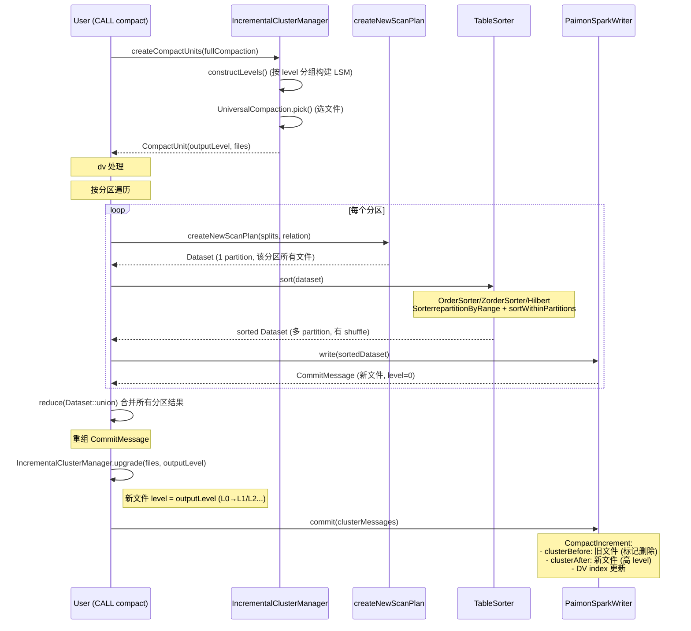
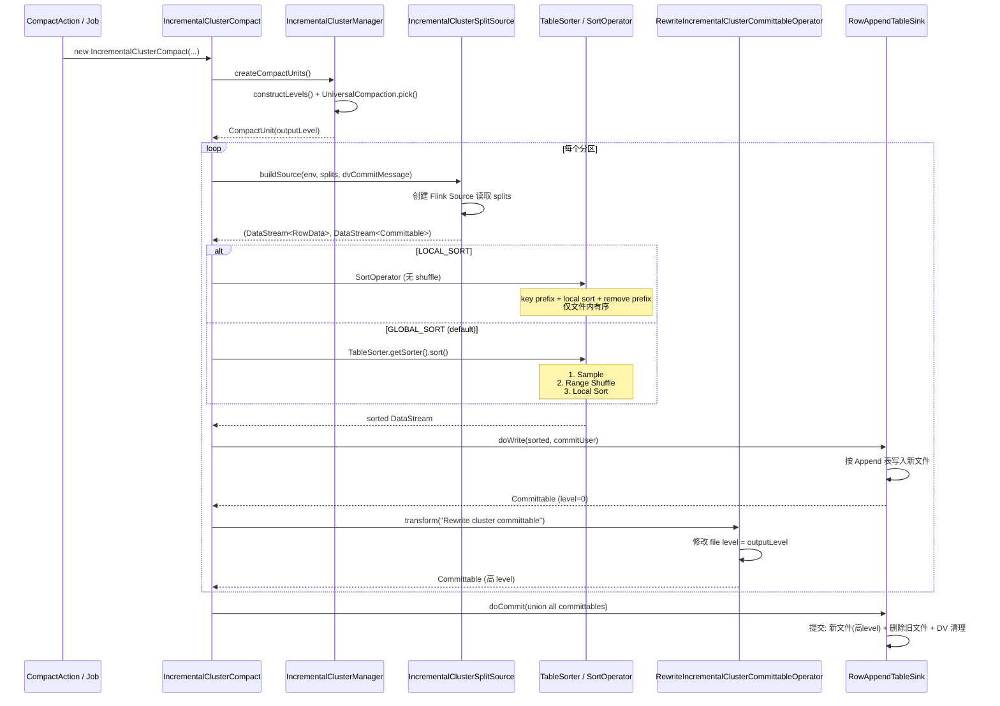

# Incremental Clustering
本质：SortCompact(全是L0) + 加入LSM 之后，有了level 划分，不需要每次都全量数据排序，\
每次取部分文件(L0 + L1+) 重排序

- 只支持 bucket=-1 (BUCKET_UNAWARE)
- 目前只支持 batch 模式（CALL compact 手动触发） 
- AppendTable 默认 没有level 的概念，都是level0
- Incremental Clustering AppendTable
  - L0: 每个文件一个 SortedRun
    - Incremental Clustering L0 是无序的
    - 与传统的PK table 还不一样，传统是多个SortedRuns，但是每个SortedRun 都有序
  - L1+: 同 level 文件组成一个 SortedRun
    - L0 跃迁到 L1 的时候排序
- 引入 Auto-Clustering For Historical Partition

## Compact
### Spark Compact


### Flink Compact



## SortCompact
SortCompactAction 本质上是一个特殊的写入操作，它读取现有数据，排序后重新写入(CommitKind.OVERWRITE)\
将所有新生成的文件都视为 "新写入"，统一放入 level 0

只支持 bucket=-1 (BUCKET_UNAWARE)
```text
写入方式：直接写入文件，无 bucket 概念  
LSM 结构：每个分区一个 LSM 树       
SortCompact 流程：读取→排序→覆盖写回         
覆盖写问题：直接 overwrite 整个表/分区  
```

最终目标（根据manifest 可以过滤更多文件）：
```text
  未聚类：
  SELECT * FROM T WHERE user_id = 123 AND product_id = 456
    扫描文件：100 个
    耗时：10 秒

  Z-Order 聚类后：
  SELECT * FROM T WHERE user_id = 123 AND product_id = 456
    扫描文件：5 个
    耗时：1 秒
```
### SortCompact vs Incremental Clustering
```text
                SortCompact             Incremental Clustering
  ━━━━━━━━━━━━━━━━━━━━━━━━━━━━━━━━━━━━━━━━━━━━━━━━━━━━━━━━━━━━━━━━━━━━━━━━━━━━━━━━━
   数据范围     全量（整个分区/表）     增量（只选部分文件）
   排序范围     全局排序                增量排序（新数据 + 部分旧数据 merge）
   输出         Overwrite（全量替换）   增量追加（新文件高 level，旧文件标记删除）
   level 变化   全部 L0                 L0 → L1/L2...
   触发         手动 CALL               手动 CALL
   分区选择     支持                    支持


  SortCompact:
    输入: 分区所有文件（1TB）
    处理: 全量读取 → 全量排序 → 全量写入
    输出: 1TB 新文件
    成本: O(全量)

  Incremental Clustering:
    输入: 新增 L0 文件（10GB）+ 部分需要 merge 的 L1 文件（10GB）
    处理: 20GB 读取 → 20GB 排序 → 20GB 写入
    输出: 20GB 新文件（L1/L2）
    成本: O(增量)
```


## IncrementalClusterManager

传统 Full Compaction, Incremental Clustering 每次只选择部分文件进行排序


活跃分区的增量 clustering 不一定是只处理 L0，full compaction 时会全部处理。

什么是活跃分区呢？
clustering.history-partition.idle-to-full-sort 的数据吗？
假设分区表 dt 有 4 个分区：

> CALL sys.compact(`table` => 'db.t', `where` => 'dt>=20240105')

分区状态：

| 分区 | 最近写入时间 | level 分布 | 状态 |
|---|---|----------|---|
| 20240106 | 10 分钟前 | L0~L2    | 活跃 |
| 20240105 | 30 分钟前 | L0~L5    | 活跃 |
| 20240104 | 1 天前 | L5       | 历史候选 |
| 20240103 | 2 天前 | L5       | 历史候选 |
| 20240102 | 3 天前 | L5       | 历史候选 |
| 20240101 | 5 天前 | L5       | 历史候选 |
```text
  'clustering.history-partition.idle-to-full-sort' = '1d'
  'clustering.history-partition.limit' = '2'
  'num-levels' = '6'  -- maxLevel = 5
```

由 HistoryPartitionCluster 处理，仅在以下条件下启用：

- 表有分区键
- 调用 compact 时指定了 specifiedPartitions
- 配置了 clustering.history-partition.idle-to-full-sort

**活跃分区处理（dt>=20240105）：**
- 20240106, 20240105
- 增量 clustering，只处理新增/需要合并的文件, 可能 L2+ 数据不会动

**历史分区处理（dt<20240105）：**

1. `withLevelMinMaxFilter((min, max) -> min < maxLevel)`：筛选有文件在 < L5 的分区
2. `filter(entry -> entry.lastFileCreationTime < now-1d)`：筛选 idle > 1d 的分区
   - 结果：20240104, 20240103, 20240102, 20240101
3. `specifiedPartitions.test(part)`：20240104 < 20240105？是 → 不是活跃分区
4. `historyPartitionLimit=2`：取最早的 2 个
   - 结果：20240101, 20240102

**20240101/20240102 full compaction：**
- 之前：所有文件在 L5（maxLevel）
- `min=5, max=5`，不满足 `min < 5` → **被过滤，不处理！**

**场景变化：20240102 新 append 1 条数据**

| 分区 | 最近写入时间 | level 分布 | 状态 |
|---|---|---|---|
| 20240102 | 刚刚 | L0(新) + L5(旧) | 历史候选 |

下次 CALL compact('db.t', where => 'dt>=20240105')：

1. `min < maxLevel`：min=0, max=5，满足 0 < 5 ✓
2. `filter(entry -> entry.lastFileCreationTime < now-1d)`：筛选 idle < 1d ✗
3. `lastFileCreationTime < now-1d`：旧文件时间 3 天前，满足 ✓
3. `specifiedPartitions.test(20240102)`：20240102 < 20240105 ✓
4. 历史分区候选，取最早 2 个：20240102

20240102 既不是活跃分区（不满足 where），也不是历史分区（不满足 idle 条件），所以不会被处理！

**20240102 full compaction：**

| 分区 | 最近写入时间 | level 分布 | 状态 |
|---|--------|---|---|
| 20240102 | 1天前    | L0(新) + L5(旧) | 历史候选 |

- 输入：L0(1条新数据) + L5(全量旧数据)
- 全局排序 → 输出 L5

**结果：即使只 append 1 条数据，也会触发该分区全量重新排序！**


## sort strategy
解决多维度排序存储，假设有两个维度 a, b
- ORDER：先按照a排序，再按照b排序
- ZORDER：牺牲单一维度的极致性能，换取多维度的均衡性能
  - 优点是'Z-Value'计算方便，单点查询性能下降，缺点是两个相邻的点可能在二维空间相隔比较远（长距离跳跃）
- HILBERT
  - 解决 Z-Order 的长距离跳跃
  - Hilbert 编码涉及到递归或查表，计算开销要大得多

## Q & A
### flink local-sort vs global-sort 区别？
<details>

Task 数相同，本质区别是数据分发方式：local-sort 轮询（文件间范围重叠），global-sort range shuffle（文件间范围不重叠）。
```text
  local-sort（Rebalance 轮询）
  输入数据: [5, 1, 0, 3, 2, 7, 6]

  Rebalance 分发:
    Task-0: [5, 0, 2, 6]  → 排序 → file-0: [0, 2, 5, 6]
    Task-1: [1, 3, 7]     → 排序 → file-1: [1, 3, 7]

  结果:
    file-0: [0, 2, 5, 6]  (min=0, max=6)
    file-1: [1, 3, 7]     (min=1, max=7)

    ❌ 范围重叠: file-0 [0~6] 和 file-1 [1~7] 重叠
  查询 a=2：两个文件都可能包含 → 扫描 2 个文件
  ──────────────────────────────────────────────────────────────────────
  global-sort（Range Shuffle）
  输入数据: [5, 1, 0, 3, 2, 7, 6]

  采样确定边界: [0~3], [4~7]

  Range Shuffle:
    Task-0: [1, 0, 2, 3]  → 排序 → file-0: [0, 1, 2, 3]
    Task-1: [5, 7, 6]     → 排序 → file-1: [5, 6, 7]

  结果:
    file-0: [0, 1, 2, 3]  (min=0, max=3)
    file-1: [5, 6, 7]     (min=5, max=7)

    ✅ 范围不重叠: file-0 [0~3] < file-1 [5~7]
  查询 a=2：只扫描 file-0 → 扫描 1 个文件
```
</details>

### 为什么 Incremental Clustering 不能像普通 Append 表那样内置到 streaming sink 中？
<details>

**普通 Append 表 compaction（streaming 支持）：**
- 不排序，只是简单合并小文件
- 可以实时进行：写入一批 → 合并一批
- 无状态，不需要知道全局数据分布

**Incremental Clustering（仅 batch）：**
- 需要排序，必须知道全局数据分布才能 range partition
- 需要采样 → 确定边界 → shuffle → 排序
- 这是 batch 操作，无法流式增量完成

| | 普通 compaction | Incremental Clustering |
|---|---|---|
| **算法复杂度** | O(N)，无状态合并 | O(N log N)，需要全局采样 |
| **shuffle** | 无 | 需要 range shuffle |
| **触发方式** | streaming 自动 / batch 手动 | 仅 batch 手动 |
| **资源开销** | 低（简单合并） | 高（全局排序）|

clustering.incremental 只是在显式触发
compaction 时，采用增量方式（只处理新增的 L0 文件 + L1+ 已有的有序文件），而不是内置在streaming中。

Incremental Clustering 不支持 streaming 的本质原因是：排序需要全局数据分布信息（采样 + range shuffle），这是 batch 操作，无法像简单合并那样实时增量完成。\
这个排序资源开销与正常 append 任务也有很大差别

目前不支持 flink streaming Incremental Clustering（IncrementalClusterSplitSource source 是 bounded，不支持 streaming 模式）。

在BUCKET_UNAWARE compaction 非常特殊：见 [BUCKET_UNAWARE 为什么不像 HASH_DYNAMIC 一样在writer中实现compaction呢？](append-table.md)
</details>


### 为什么不改成 L0 排序 然后再和 L1+ 归并呢？ 这样不是性能更好吗？
<details>

L0 排序后必须和 L1 归并才能保证全局有序，而归并需要知道全局边界 → 需要 global sort 的采样 + range shuffle。
不如直接 L0 + L1 一起 global sort，一步到位。

```text
  第一步：L0 排序
  • L0 数据量小，可以一个 task 排序
  • 但输出到哪个 level？L1？
  • 如果 L1 已有数据，L0 排序后的文件和 L1 范围重叠
  第二步：L1 + L0_sorted 归并
  • 需要知道 L1 和 L0_sorted 的边界
  • 但 L0 是乱序写入的，范围不确定
  • 需要 全局采样 才能确定 range 边界做 shuffle
```
</details>

### flink local-sort 只是task 内部排序，不会经过shuffle，这样 L1+ 的 SortedRun 不能保证有序性了？
<details>

```text
Task-0: [1, 3, 6]  → local sort → file-0: [1, 3, 6]  (min=1, max=6) 
Task-1: [5, 2, 4]  → local sort → file-1: [2, 4, 5]  (min=2, max=5)

输出到 L1（假设 outputLevel=1）：
file-0 (L1): [1, 3, 6]  min=1, max=6 
file-1 (L1): [2, 4, 5]  min=2, max=5
文件间重叠：file-0 [1~6] 和 file-1 [2~5] ❌
```

local-sort 输出到 L1+ 是有问题的，因为 local-sort 文件间重叠，不满足 L1+ 全局有序的要求。这可能是 Paimon 的设计缺陷或文档未明确说明的限制(TODO)。
</details>

## Reference
- [zorder](../../misc/geohash.md#zorder)
- test("Compaction: clustering.incremental") - SortCompact
- [offical doc incremental-clustering](../docs/content/append-table/incremental-clustering.md)
