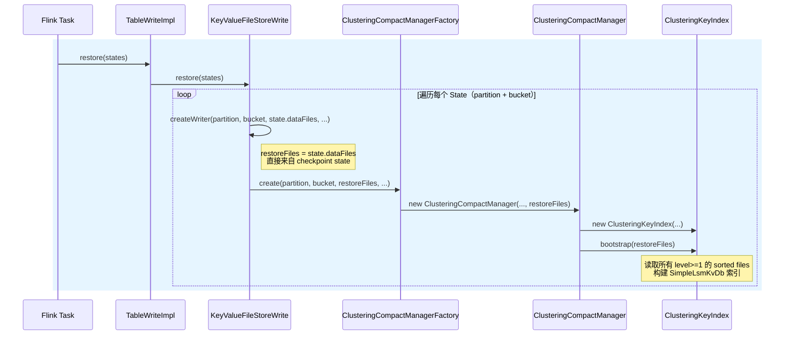
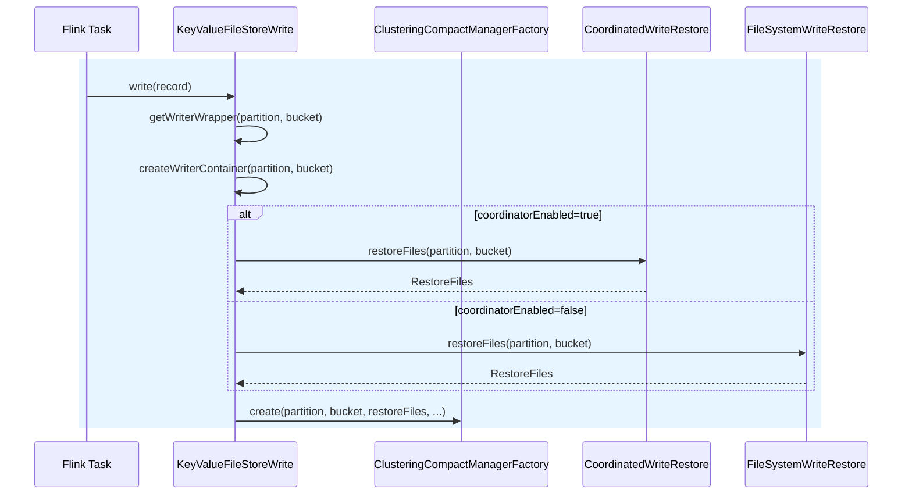

# [PK Clustering Override](../docs/content/primary-key-table/pk-clustering-override.md)

PK Clustering Override 是主键表的高级 compaction 模式，通过配置 clustering.columns 指定排序方式，覆盖默认的主键排序。

每次插入生成两个 snapshot：第一个正常插入，第二个 compact 负责重新排序写文件。

ClusteringCompactManager.compact：

**Phase 1: Sort and rewrite unsorted files**
1. 获取所有 Level-0 文件（未排序）
2. 对每个文件：读取记录 → 按聚类列排序 → 检查主键重复 → 写入 Level-1
   - FIRST_ROW: 跳过重复
   - DEDUPLICATE: 标记旧记录删除（DV），写入新记录
3. 更新 keyIndex

**Phase 2: Universal Compaction on sorted files**
1. 获取 Phase 1 之前已存在的 Level-1+ 文件
2. 选择合并组：fullCompaction（所有文件）或 minor（按重叠范围和大小）
3. 对每个合并组（≥2 个文件）：删除 keyIndex → 读取（自动过滤 DV）→ 多路合并 → 重建 keyIndex → 移除旧文件 DV

| 阶段 | 输入 | 输出 | DV 处理 |
|------|------|------|---------|
| Phase 1 | Level-0 文件 | Level-1 文件 | 标记旧记录为删除 |
| Phase 2 | Level-1+ 文件 | 合并文件 | Reader 自动过滤被标记的行 |


<summary> Flink restore 流程 </summary>
<details>

see [primary-key-table flink restore 流程](primary-key-table.md#tablewriteoperator)


Checkpoint 恢复路径（state 中包含 writer）\
Paimon 在 Flink streaming 中**不保证一个 slot 一个 bucket**。
数据通过 `ChannelComputer.select(partition, bucket, parallelism)` 哈希路由到 subtask，
同一个 task 内部通过 `Map<partition, Map<bucket, writer>>` 管理多个writer。
一对多关系在 `AbstractFileStoreWrite` 的 `writers` map 中维护，初始化时通过 `restore(states)` 批量重建。


writer 被清理后重新创建流程

</details>
<br/>

<summary> PK Clustering Override 对于 compaction 的 merge 性能有影响吗？ </summary>
<details>

因文件不按 PK 排序，需构建 PK 索引来处理旧数据。

1. **初始化构建索引**：ClusteringCompactManager 构造时调用 keyIndex.bootstrap(restoreFiles)，将所有 level ≥ 1 文件的主键 → (fileId, position) 灌入 SimpleLsmKvDb
2. **后续 merge**：调用 keyIndex.checkKey() 检查主键是否存在

| Merge Engine | 主键已存在时|
|--------------|------------------------------------------------------------|
| FIRST_ROW    | 返回 false → 跳过不写，保留已有文件中的旧记录                                |
| DEDUPLICATE  | 通过 dvMaintainer.notifyNewDeletion(oldFile, oldPosition) 标记旧记录删除，返回 true → 写新记录 |


与 Incremental Clustering 相比，PK Clustering Override 主要性能消耗在于额外构建索引。

| 开销项 | Incremental Clustering | PK Clustering Override |
|--------|----------------------|------------------------|
| 排序 | ✅ 外部排序，纯 IO | ✅ 外部排序，纯 IO |
| 去重索引 | ❌ 无 | ✅ 需要构建/查询 LSM KV DB |
| 逐条 key 检查 | ❌ 无 | ✅ 每条记录都要反序列化 + 查索引 |
| Deletion Vector | 可选（仅删过期文件） | 必须（DEDUPLICATE 模式） |
| 写放大 | 较低（可增量选择文件） | 较高（需维护全局索引 + DV） |

Incremental Clustering 是无主键 append 表，compaction 只是"排序+合并文件"，性能好、实现轻量。

PK Clustering Override 需保留主键去重语义（FIRST_ROW / DEDUPLICATE），但文件不按 PK 排序，被迫用 ClusteringKeyIndex 做全局去重索引，每条记录都查索引、维护 DV，compaction 开销明显更大。
</details>
<br/>

<summary> PK Clustering Override `DEDUPLICATE` merge engine 为什么一定要PV呢？ </summary>
<details>

cluster column 可能被改变，无法像 PK 那样用 merge sort（败者树、小根堆）直接过滤旧数据，所以源码用 2 个阶段处理。
```text
文件按 city 排序：
[id=2, city=Beijing, amount=100]  ← 旧版本，位置 0
[id=4, city=Beijing, amount=400]
[id=1, city=Shanghai, amount=200]

更新 id=2，但 city 改为 Shanghai：
[id=2, city=Shanghai, amount=200]  ← 新版本

如果直接替换位置 0：
[id=2, city=Shanghai, amount=200]  ❌ city=Shanghai，应该在后面
[id=4, city=Beijing, amount=400]
[id=1, city=Shanghai, amount=200]

破坏了按 city 排序的顺序！
```
</details>
<br/>

<summary> PK Clustering Override 更适合持续写入、writer 不被频繁清理的场景, 为什么？ </summary>
<details>
restoreFiles 是作业恢复时该 partition/bucket 下所有已有的 level ≥ 1 的 sorted 文件。bootstrap 需要：

1. 全量读取文件记录
2. 外部排序所有 (PK, fileId+position) 对
3. Bulk load 进 SimpleLsmKvDb（构建 LSM Tree）

如果历史数据量大（如几亿条），这一步耗时且吃资源，是启动期主要瓶颈。

rebuildIndex 只是顺序读新文件，逐条 put 进 LSM DB，开销很小。

**Writer 清理时机**：如果一个 partition + bucket 一段时间无新数据写入且 compaction 完成，writer 会被关闭、释放内存。

```text
场景 A：持续密集写入（适合）

  每秒都有数据流入 partition=20240101, bucket=0
  → 每轮 checkpoint 都有 committable
  → writer 永远不会被清理
  → keyIndex 一直存活，只有增量的 rebuildIndex
  
场景 B：稀疏/间歇写入（不适合）

  每 10 分钟才一条数据流入 partition=20240101, bucket=0
  → 很多轮 checkpoint 没有新数据，committable.isEmpty()
  → writer 被关闭清理
  → 下一条数据来时，重新创建 writer，重新 bootstrap
  → 反复支付 bootstrap 的高昂代价

场景 C：批处理任务（很多批任务）
- 每次任务创建新的 Writer
- 任务结束 Writer 被清理
- ClusteringKeyIndex 频繁重建
```
"Writer 不被频繁清理" = 同一个 partition + bucket 持续有数据流入，writer 对象一直存活内存中，不需要反复重建
ClusteringKeyIndex。 

PK Clustering Override 因为启动/重建时有 bootstrap
开销，所以更适合写入密集、持续的场景；如果写入稀疏或 partition 特别多，会频繁触发 writer 重建和 bootstrap，性能会很差。
</details>
<br/>

