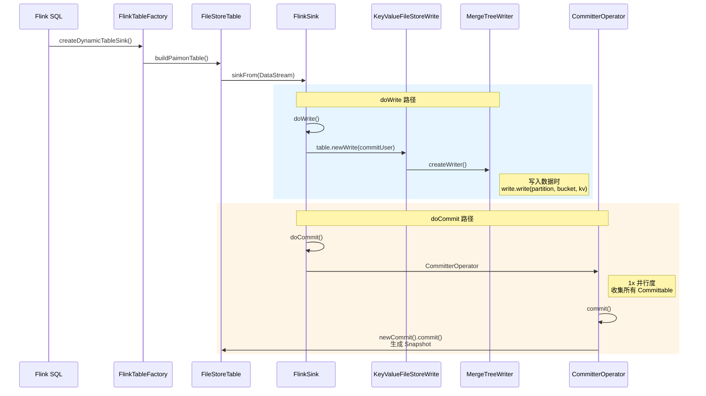
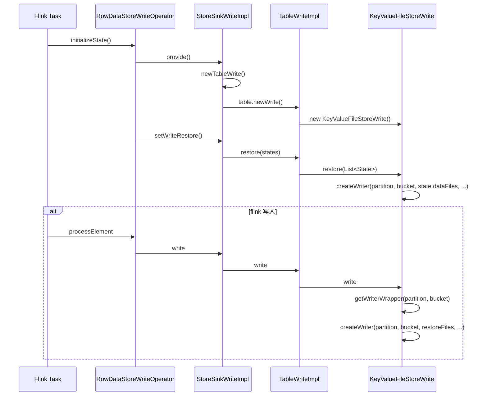

## PrimaryKeyTable Architecture

## Paimon Core
```text
  FileStoreTable：Paimon 表的存储层实现
    └── PrimaryKeyFileStoreTable
          ├── newRead()  → KeyValueTableRead (SplitReadProvider)
          ├── newWrite() → TableWriteImpl<KeyValue>
          └── store()    → KeyValueFileStore

  FileStore<KeyValue>：存储引擎核心抽象
    └── KeyValueFileStore
          ├── bucketMode() → KEY_DYNAMIC | HASH_DYNAMIC | HASH_FIXED | POSTPONE_MODE
          ├── newScan()    → KeyValueFileStoreScan (key/value filter, stats)
          ├── newRead()    → MergeFileSplitRead (多路归并读取)
          └── newWrite()   → KeyValueFileStoreWrite → MergeTreeWriter

  FileStoreScan：snapshot → manifest → 过滤 → DataSplit
    └── KeyValueFileStoreScan
          ├── withKeyFilter()   - 主键过滤下推
          ├── withValueFilter() - Value 过滤下推 (bucket 级别)
          └── filterByStats()   - 文件统计信息过滤

  SplitRead<KeyValue>：MergeTree 多层文件归并读取
    └── MergeFileSplitRead
          └── MergeTreeReaders
                ├── readerForMergeTree() - 多 section 归并
                ├── readerForSection()   - 单 section 归并 + MergeSorter
                └── readerForRun()       - 多文件合并

  FileStoreWrite<KeyValue>：接收记录、缓冲、刷盘、compaction、commit
    └── KeyValueFileStoreWrite
          └── MergeTreeWriter
                ├── WriteBuffer        - 写缓冲
                ├── CompactManager      - Compaction 管理
                └── KeyValueFileWriter - 文件写入

  ---
```
- AbstractFileStoreWrite
    - KeyValueFileStoreWrite
    - PostponeBucketFileStoreWrite

### Core Write
```text
  PrimaryKeyFileStoreTable.newWrite()           ← 创建 TableWriteImpl
      │                                          (paimon-core/.../table/)
      ▼
  TableWriteImpl                                  ← 表层封装: 类型转换/默认值/RowKind
      │                                          (paimon-core/.../table/sink/)
      ▼
  KeyValueFileStoreWrite(FileStoreWrite)          ← Store层写: 创建writer/管理compaction
      │                                          (paimon-core/.../operation/)
      ▼
  MergeTreeWriter                                 ← 底层写: 缓冲/刷盘/LSM归并
      │                                          (paimon-core/.../mergetree/)
      ├── WriteBuffer (缓冲)
      ├── CompactManager (compaction)
      └── KeyValueFileWriter (文件写入)
      │
      ▼
  Levels                                          ← 文件管理层
                                                  (paimon-core/.../mergetree/)
```


### Core read
```text
  PrimaryKeyFileStoreTable.newRead()            ← 创建 KeyValueTableRead
      │                                          (paimon-core/.../table/)
      ▼
  KeyValueTableRead                                ← 表层读: 适配多种读法
      │                                          (paimon-core/.../table/source/)
      ├── MergeFileSplitReadProvider              ← 批量归并读
      ├── PrimaryKeyTableRawFileSplitReadProvider ← 原始文件读
      └── IncrementalDiff/ChangelogReadProvider   ← 增量读
      │
      ▼
  MergeFileSplitRead.createReader()               ← LSM归并读
      │                                          (paimon-core/.../operation/)
      ├── IntervalPartition.partition()          ← 文件分区
      └── MergeFunctionWrapper                   ← 多版本合并
      │
      ▼
  MergeTreeReaders.readerForSection()             ← 多路归并
      │                                          (paimon-core/.../mergetree/)
      ▼
  MergeSorter.mergeSort()                        ← 排序归并
      │                                          (paimon-core/.../mergetree/)
      ├── SortMergeReader (k-way)                ← 归并排序
```
## FLink Connector

Flink 使用 DynamicTableFactory SPI：

```
META-INF/services/org.apache.flink.table.factories.Factory
└── org.apache.paimon.flink.FlinkTableFactory
```

### Flink Read
```text
  Flink SQL SELECT
      │
      ▼
  FlinkTableFactory.createDynamicTableSource()
      │
      ▼
  AbstractFlinkTableFactory.getPaimonTable() → FileStoreTable
      │
      ▼
  DataTableSource / FlinkSourceBuilder.build()
      │
      ▼
  FlinkSourceBuilder.createReadBuilder()
      │
      ▼
  table.newReadBuilder()               ← PrimaryKeyFileStoreTable.newReadBuilder()
      │
      ▼
  ReadBuilder.withFilter() / withProjection()
      │
      ▼
  FlinkSourceBuilder.toDataStream()
      │
      ├── StaticFileStoreSource / ContinuousFileStoreSource
      │
      ▼
      env.fromSource(source, ...)
          │
          ▼
      Flink DataStream
```

 

### Flink Write

<summary>Flink write 流程</summary>
<details>


</details>

#### CommitterOperator
CommitterOperator 缓存这些committables，在 notifyCheckpointComplete() 时才真正写入 manifest、生成 snapshot。

<summary>如果notifyCheckpointComplete失败怎么办？会影响后续paimon manifest 生成吗？</summary>
<details>


`notifyCheckpointComplete` 是**异步副作用通知**，丢失不触发 failover。
Pending committables 保留在 Committer 的 `committablesPerCheckpoint`（已持久化到 Flink state），
下次 notifyCheckpointComplete` 通过 `headMap(checkpointId, true)` 一次性全部提交。

| 时间点 | Flink 状态 | Paimon 状态 |
  |--------|-----------|------------|
| Checkpoint 100 成功 | State backend 有 cp-100 | 无 snapshot-100 |
| Checkpoint 101 成功 | State backend 有 cp-101 | 无 snapshot-101 |
| notifyCheckpointComplete(101) 到达 | — | 生成 snapshot-100、snapshot-101 |

`committablesPerCheckpoint` 的 key 是 checkpointId，虽然 `headMap` 一次性取出多个，但底层 `commitMultiple` 是**顺序遍历逐个提交**，checkpoint 100 和 101 各自生成独立的 snapshot-100 和 snapshot-101，不会合并成一个。
</details>

##### RestoreCommittableStateManager
- snapshotState: 会保存未提交的 manifests
- initializeState
  - 从 ListState 恢复未提交的，manifests
  - recover 提交未提交的的manifests
    ```text
      CommitterOperator.initializeState()
        └── committableStateManager.initializeState(context, committer)
              └── RestoreCommittableStateManager.initializeState()
                    ├── 从 ListState 读取未提交的 ManifestCommittable
                    └── recover(restored, committer)
                          └── committer.filterAndCommit(committables, ...)
                                └── TableCommitImpl.filterAndCommitMultiple()
                                      ├── commit.filterCommitted(sortedCommittables) ← 过滤已提交的
                                      └── commitMultiple(retryCommittables)          ← 提交未提交的
    ```


#### StoreCompactOperator
StoreCompactOperator 是专用 compaction 作业的 Flink operator，与写入路径解耦，只负责执行 compaction。

flink中接收由 CompactorSourceBuilder 生成的 compaction 任务，对指定 partition + bucket 执行 compaction，然后提交结果。


#### TableWriteOperator::PrepareCommitOperator
repareSnapshotPreBarrier 中 prepareCommit() 会强制 flush 并关闭当前正在写的数据文件，把生成的 CommitMessage 包装成 Committable 通过 output.collect() 推给下游 CommitterOperator。

- DynamicBucketRowWriteOperator: dynamic bucket
  - RowDynamicBucketSink -> FlinkSink.doWrite
- RowDataStoreWriteOperator: fix bucket
  - FixedBucketSink -> FlinkSink.doWrite

<summary>flink prepareSnapshotPreBarrier 作用是什么？</summary>
<details>

`performCheckpoint` -> `prepareSnapshotPreBarrier`, 在执行 `snapshotState` 和发送 CheckpointBarrier 事件之前，先执行 `prepareSnapshotPreBarrier`

prepareSnapshotPreBarrier 是在 mailbox 线程同步执行 的，而且在 barrier 注入流之前。这意味着 Paimon 可以确保 manifest 生成这个manifests一定发生在下游收到 barrier 之前，从逻辑上保证了下游在 commit
时能看到完整的上游状态。

见 flink checkpoint.md
</details>
<br/>

<summary>flink restore 流程</summary>
<details>

flink initializeState() → restoreFiles

</details>

#### FlinkSinkBuilder.build
- buildForFixedBucket -> FixedBucketSink
- buildDynamicBucketSink -> RowDynamicBucketSink


#### CoordinatedFactory vs Factory
CoordinatedOperatorFactory 是 Flink 中用于创建需要与 JobManager 侧协调器通信的 Operator 的工厂接口。

它建立在 Operator Coordinator 机制之上：
- OperatorCoordinator：运行在 JobManager 上，负责全局协调
- StreamOperator 子任务：运行在 TaskManager 上，执行实际计算
- 两者通过 OperatorEvent 进行双向通信


<summary>CoordinatedFactory，假设 Flink 作业并行度为 10，写入一个有 100 个 bucket 的 Paimon 表。 </summary>
<details>

作业从 checkpoint 恢复时，每个 subtask 都要知道自己负责的 bucket 当前有哪些已有文件：
- coordinatorEnabled=false（默认 Factory）：
  - 每个 subtask 独立读取底层的 manifest 文件
  - 10 个 subtask 可能读取同一批 manifest，重复 IO
  - 没有额外的网络通信
  ```text
     Subtask-0: 读 manifest → 扫描 → 得到 bucket-0, bucket-10 的文件列表
     Subtask-1: 读 manifest → 扫描 → 得到 bucket-1, bucket-11 的文件列表
     ...
     Subtask-9: 读 manifest → 扫描 → 得到 bucket-9, bucket-19 的文件列表
  ```

- coordinatorEnabled=true（CoordinatedFactory）：
  - coordinator 在 JM 端统一维护 manifest 缓存
  - 第一个 subtask 请求时 coordinator 实际扫描 manifest，后续请求直接命中缓存
  - 避免 10 次重复扫描，但多了 JM-TM 之间的 RPC
   ```text
     JobManager 启动 WriteOperatorCoordinator
       └── TableWriteCoordinator（内部维护 FileStoreScan + SegmentsCache）
   
     Subtask-0: RPC → Coordinator → 返回 bucket-0 文件列表（coordinator 从缓存或扫描得到）
     Subtask-1: RPC → Coordinator → 返回 bucket-1 文件列表（直接从缓存命中）
     ...
   ```
</details>
<br/>


<summary>flink JM是如何缓存 manifest 文件？</summary>
<details>

两层缓存的分工

1. WriteOperatorCoordinator -> SegmentsCache<Path>（manifest 文件内容缓存）\
这是块级文件缓存，缓存在 JM 内存中。TableWriteCoordinator 里的 FileStoreScan 读取 manifest 文件时，实际的数据块会进这个缓存。


2. pagedCoordination（分页响应缓存）:\
这只是为了拆分超大 RPC 响应。当一个 bucket 的文件列表太大，一次 RPC 传不完时，分多页传输，后续页从这里取。30分钟过期是为了避免 coordinator 内存堆积。
   - UUID + pagedCoordination：只管一个请求内部的分页传输，跨请求不共享
    ```text
      Task-0 请求 bucket-0:
        → Coordinator 调用 scan.plan().files()
        → 读 manifest-1.orc (未命中 SegmentsCache) → 从磁盘读 → 入缓存
        → 读 manifest-2.orc (未命中 SegmentsCache) → 从磁盘读 → 入缓存
        → 返回 bucket-0 的文件列表
    
      Task-1 请求 bucket-1:
        → Coordinator 调用 scan.plan().files()
        → 读 manifest-1.orc (命中 SegmentsCache!) → 直接内存取
        → 读 manifest-2.orc (命中 SegmentsCache!) → 直接内存取
        → 返回 bucket-1 的文件列表
    ```


Coordinator 在每次 checkpoint 和每次重启后都会 `refresh()` 到最新 snapshot；task 恢复时向 coordinator 发实时 RPC
获取当前最新文件列表。Paimon 通过写入幂等性（sequence number + commit 去重）来保证即使读取更新状态也不会破坏一致性。
</details>

<br/>
<summary>flink savepoint state 与 Paimon snapshot 不一致问题？怎么办？</summary>
<details>

**人为从旧 savepoint/checkpoint 启动**（比如 `--fromSavepoint /old/savepoint`），才会出现 Flink state 回退但 Paimon 数据已存在的情况。这是靠 Paimon 的写入幂等性保证的，正常自动恢复不会触发。
```text
  Paimon 的 snapshot 是增量链式的：

  snapshot-5  ← Flink savepoint-100
    └── manifest-list-5
         └── 引用 data files [A, B, C]

  snapshot-6  ← Flink checkpoint-200（之后的数据）
    └── manifest-list-6
         └── 引用 data files [A, B, C] + [D, E]  （继承 5 + 新增）

  snapshot-7  ← Flink checkpoint-300
    └── manifest-list-7
         └── 引用 data files [A, B, C, D, E] + [F]  （继承 6 + 新增）
  1. Writer 从 snapshot-7 重建索引（包含 A, B, C, D, E, F）
  2. Flink Kafka offset 回退到 savepoint-100 的位置
  3. 重新消费 checkpoint-100 到 checkpoint-300 之间的数据
  4. `checkKey()` 命中索引，**D, E, F 对应的数据全部跳过不写**
  5. 只有 checkpoint-300 之后的**真正新数据**（假设为 G）被写入
  6. Committer 生成 **snapshot-8**

  snapshot-8
    └── manifest-list-8
         └── 引用 data files [A, B, C, D, E, F] + [G]
         
如果是first-row engine，从旧 savepoint 恢复，Paimon 保证的是"不重复写入"，而不是"重新处理/修正已有数据"。
如果 checkpoint-100 到 checkpoint-300 之间写入了异常数据，从 savepoint-100 恢复后，这些数据会一直保留在 Paimon
  中，不会被自动修复。这是流式存储系统 immutability 的固有特性，修正数据需要人工干预（overwrite 或重新导入）。

```
可以通过 `CALL sys.rollback(table => 'default.T', snapshot => 2)`，然后再启动flink 作业。
</details>
<br/>


## Spark Connector
Spark 通过 SPI (Service Provider Interface) 机制注入。

```text
META-INF/services/org.apache.spark.sql.sources.DataSourceRegister
└── org.apache.paimon.spark.SparkSource
```

### Spark Read
```text
  Spark SQL/DataFrame
      │
      ▼
  SparkSource.getTable() → SparkTable / FileStoreTable
      │
      ▼
  PaimonSparkTableBase.newScanBuilder()
      │
      ▼
  PaimonScanBuilder.build() → PaimonScan
      │
      ▼
  PaimonBaseScan.getInputSplits() → load readBuilder
      │
      ▼
  table.newReadBuilder()                 ← Core: PrimaryKeyFileStoreTable.newReadBuilder()
      │
      ▼
  ReadBuilder.newScan().plan().splits()  ← DataTableBatchScan → PlanImpl
      │
      ▼
  PaimonBatch(PaimonInputPartition[], readBuilder)
      │
      ▼
  PaimonPartitionReaderFactory
      │
      ▼
  Spark RDD / DataFrame
```

### Spark Write
```text
  Spark SQL INSERT / DataFrame.write()
      │
      ▼
  SparkSource.createRelation() | PaimonWrite.toInsertableRelation(V1 Write)
      │
      ▼
  WriteIntoPaimonTable(SparkTable, FileStoreTable)
      │
      ▼
  WriteIntoPaimonTable.run()
      │
      ▼
  PaimonSparkWriter(table)  ← Core: PrimaryKeyFileStoreTable
      │
      ▼[lookup.md](../lookup.md)
  PaimonSparkWriter.write(data) → CommitMessage[]
      ├── bucketMode = BUCKET_UNAWARE → writeWithoutBucket()
      ├── bucketMode = HASH_FIXED → writeWithBucket()
      └── bucketMode = KEY_DYNAMIC → bootstrap + repartition + writeWithBucket()
      │
      ▼
  PaimonDataWrite.write(row) / write(row, bucket)
      │
      ▼
  table.newBatchWriteBuilder().newCommit()  ← Core: BatchWriteBuilder
      │
      ▼
  CommitHandler.commit(commitMessages)
      │
      ▼
  Snapshot / Manifest
```