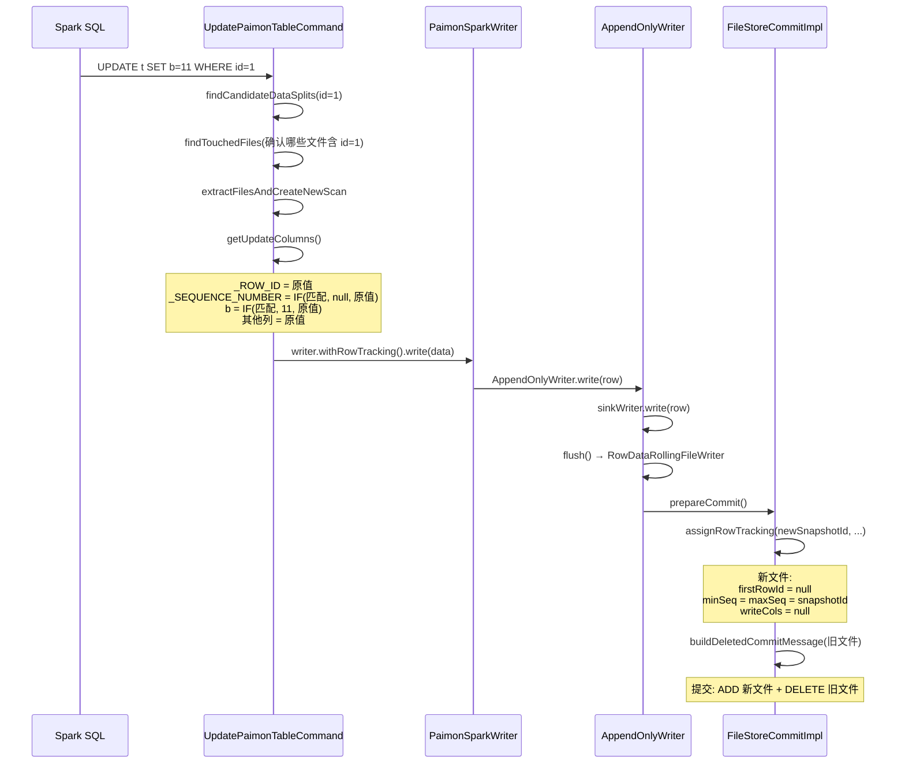

# Row Tracking
Row Tracking 让 unaware append tables 从无序的追加数据变成了可追踪、可定位、可关联的结构化数据，这是 Data Evolution 等高级功能的前提，但本身也有独立的行级操作价值。

- Copy-on-Write, only CoW for the impacted files
- Add `_ROW_ID` and `_SEQUENCE_NUMBER` system columns for BUCKET_UNAWARE append tables
- 其他功能的依赖：
    ```text
    Row Tracking = 行级标识基础设施
    ├── Data Evolution（部分列更新）
    ├── BLOB 类型列支持
    ├── Vector Store（向量存储）
    ├── Global Index（索引存的是 _ROW_ID 列表）
    └── 行级 UPDATE/DELETE/MERGE INTO
    ```

## Basic Operations
```sparksql
SELECT id, data, _ROW_ID, _SEQUENCE_NUMBER FROM t order by _ROW_ID asc;
UPDATE t SET data = 'a1' WHERE id = 1;
DELETE FROM t WHERE id = 2;
```

## Write 流程


纯 Row Tracking 的 UPDATE/DELETE 是**全文件重写（Copy-on-Write）**，不是 MOR。



```
UPDATE t SET b = 11 WHERE id = 1
  │
  ▼
1. 扫描候选 DataSplit（通过 predicate 过滤）
2. 找到 touched files（id=1 实际存在的文件）
3. 读取这些文件的完整行 [id, b, c, _ROW_ID, _SEQUENCE_NUMBER]
4. 对匹配条件的行应用更新表达式（b→11），不匹配的行保持不变
5. 写回新文件（包含所有列）
6. 旧文件标记为删除，新文件提交
```

**_SEQUENCE_NUMBER 在纯 Row Tracking 下不参与任何合并逻辑**，只是作为元数据列暴露。\
[[core] Fix incorrect sequenceNumber in manifest after row-tracking compaction](https://github.com/apache/paimon/pull/7409) 没有被merge 估计也就是没啥实质性影响吧。

---

### 1. UPDATE 流程：UpdatePaimonTableCommand

```scala
// UpdatePaimonTableCommand.performUpdateForNonPkTable()
private def performUpdateForNonPkTable(sparkSession: SparkSession): Seq[CommitMessage] = {
    val readSnapshot = table.snapshotManager().latestSnapshot()
    
    // Step 1: 通过 predicate pushdown 找到候选 DataSplit
    val candidateDataSplits = findCandidateDataSplits(condition, relation.output)
    val dataFilePathToMeta = candidateFileMap(candidateDataSplits)

    if (deletionVectorsEnabled) {
        // DV 路径：标记删除 + 写更新数据（略）
    } else {
        // Step 2: 找到真正包含匹配行的文件（touched files）
        val touchedFilePaths =
            findTouchedFiles(candidateDataSplits, condition, relation, sparkSession)

        // Step 3: 用 touched files 创建新的 scan plan
        val (touchedFiles, touchedFileRelation) =
            extractFilesAndCreateNewScan(touchedFilePaths, dataFilePathToMeta, relation)

        // Step 4: 读取完整文件，应用更新表达式，写新文件
        val addCommitMessage = writeUpdatedAndUnchangedData(sparkSession, touchedFileRelation)

        // Step 5: 旧文件标记删除
        val deletedCommitMessage = buildDeletedCommitMessage(touchedFiles)

        addCommitMessage ++ deletedCommitMessage
    }
}
```

#### 1.1 关键：writeUpdatedAndUnchangedData

```scala
private def writeUpdatedAndUnchangedData(
    sparkSession: SparkSession,
    toUpdateScanRelation: LogicalPlan): Seq[CommitMessage] = {
    val updateColumns = getUpdateColumns(sparkSession)
    val data = createDataset(sparkSession, toUpdateScanRelation).select(updateColumns: _*)
    writer.withRowTracking().write(data)
}
```

```scala
private def getUpdateColumns(sparkSession: SparkSession): Seq[Column] = {
    var updateColumns = updateExpressions.zip(relation.output).map {
        // _ROW_ID 保持原值
        case (_, origin) if origin.name == ROW_ID_COLUMN => rowIdCol
        // _SEQUENCE_NUMBER：匹配的行设为 null（写时会分配新的），不匹配保持原值
        case (_, origin) if origin.name == SEQUENCE_NUMBER_COLUMN => sequenceNumberCol(sparkSession)
        // 普通列：匹配条件 → 更新表达式，不匹配 → 原值
        case (update, origin) =>
            val updated = optimizedIf(condition, update, origin)
            toColumn(updated).as(origin.name, origin.metadata)
    }

    if (coreOptions.rowTrackingEnabled()) {
        // 确保输出包含 _ROW_ID 和 _SEQUENCE_NUMBER
        if (!outputSet.exists(_.name == ROW_ID_COLUMN)) {
            updateColumns ++= Seq(rowIdCol)
        }
        if (!outputSet.exists(_.name == SEQUENCE_NUMBER_COLUMN)) {
            updateColumns ++= Seq(sequenceNumberCol(sparkSession))
        }
    }
    updateColumns
}
```

**sequenceNumberCol 的逻辑**：

```scala
private def sequenceNumberCol(sparkSession: SparkSession) = toColumn(
    optimizedIf(condition, Literal(null), toExpression(sparkSession, col(SEQUENCE_NUMBER_COLUMN)))
).as(SEQUENCE_NUMBER_COLUMN)
```

- 匹配条件的行：`_SEQUENCE_NUMBER = null`（写文件时由 writer 分配新的 sequence number）
- 不匹配的行：`_SEQUENCE_NUMBER = 原值`

---

### 2. DELETE 流程：DeleteFromPaimonTableCommand

---

### 3. 写入层：AppendOnlyWriter

```java
// AppendOnlyWriter 构造函数
public AppendOnlyWriter(...) {
    // ...
    final LongCounter seqNumCounter = new LongCounter(maxSequenceNumber + 1);
    this.seqNumCounterProvider =
            dataEvolutionEnabled ? () -> new LongCounter(0) : () -> seqNumCounter;
    // 注意：纯 Row Tracking 用 seqNumCounter，Data Evolution 用 0
}
```

```java
// RowDataFileWriter.result()
public DataFileMeta result() throws IOException {
    return DataFileMeta.forAppend(
        path.getName(),
        fileSize,
        recordCount(),
        statsPair.getRight(),
        seqNumCounter.getValue() - super.recordCount(),  // minSequenceNumber
        seqNumCounter.getValue() - 1,                     // maxSequenceNumber
        schemaId,
        ...,
        null,  // firstRowId（纯 Row Tracking 的 UPDATE 不写 firstRowId！）
        writeCols);
}
```

**关键点**：
- 纯 Row Tracking 的 UPDATE/DELETE 写入的新文件，`firstRowId = null`
- `minSequenceNumber = maxSequenceNumber = seqNumCounter`（递增分配）
- 这与 Data Evolution 的部分列写入完全不同

---

### 4. Commit 时的 Row Tracking 分配

```java
// FileStoreCommitImpl.commit 中
if (options.rowTrackingEnabled()) {
    RowTrackingAssigned assigned =
            assignRowTracking(newSnapshotId, firstRowIdStart, deltaFiles);
    nextRowIdStart = assigned.nextRowIdStart;
    deltaFiles = assigned.assignedEntries;
}
```

```java
// RowTrackingCommitUtils.assignRowTracking()
public static RowTrackingAssigned assignRowTracking(
        long newSnapshotId, long firstRowIdStart, List<ManifestEntry> deltaFiles) {
    // 1. 分配 sequence number
    List<ManifestEntry> snapshotAssigned = new ArrayList<>();
    assignSnapshotId(newSnapshotId, deltaFiles, snapshotAssigned);
    
    // 2. 分配 firstRowId
    List<ManifestEntry> rowIdAssigned = new ArrayList<>();
    long nextRowIdStart = assignRowTrackingMeta(firstRowIdStart, snapshotAssigned, rowIdAssigned);
    return new RowTrackingAssigned(nextRowIdStart, rowIdAssigned);
}
```

```java
private static void assignSnapshotId(long snapshotId, List<ManifestEntry> deltaFiles, ...) {
    for (ManifestEntry entry : deltaFiles) {
        if (entry.file().minSequenceNumber() == 0L) {
            // 新文件：sequence number = snapshotId
            snapshotAssigned.add(entry.assignSequenceNumber(snapshotId, snapshotId));
        } else {
            // 已有 sequence number（如 compaction 产出）保持不变
            snapshotAssigned.add(entry);
        }
    }
}
```


## Troubleshooting

<summary>delete by ROW_ID, java.lang.ClassCastException: class java.lang.String cannot be cast to class java.lang.Long</summary>
<details>

> DELETE FROM t WHERE _ROW_ID = 2;

[Support UPDATE/DELETE by _ROW_ID for row tracking](../pr/pr-rowwriter-fields-inconsistent.md)
</details>
<br/>