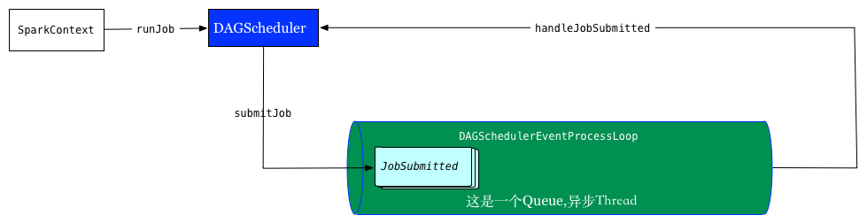
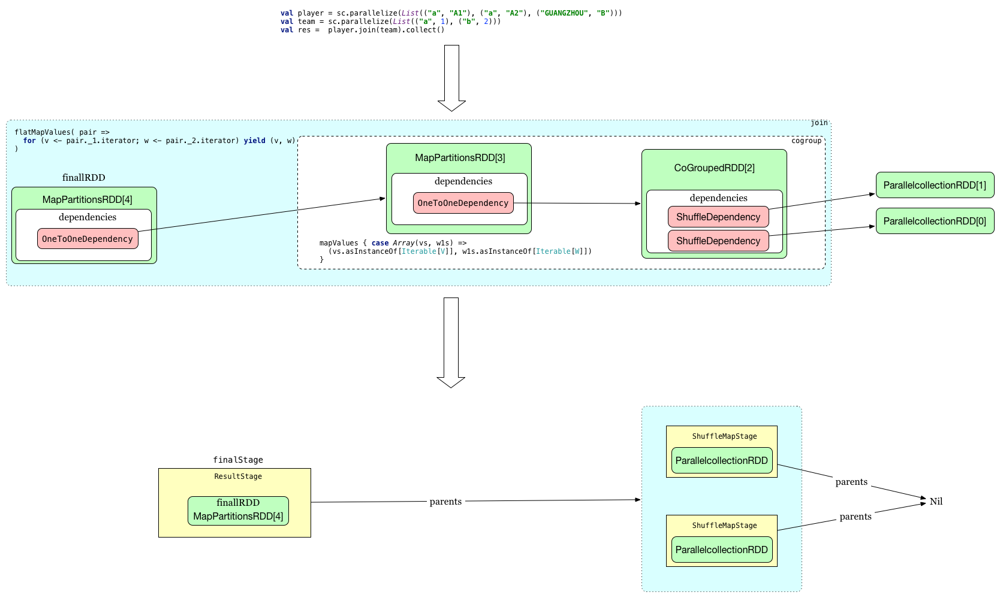
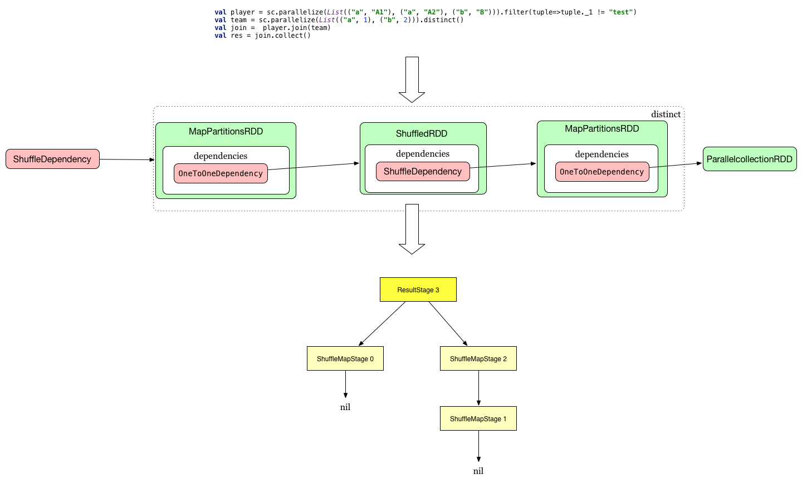

我们之前说过RDD只是抽象概念,RDD会被转换成Stage,进而被转换成Task,在Executor上执行,今天我们跟一下源码看spark是
如何转换的

## Stage
stage是一组并行任务,被作为Spark任务的一部分运行,并且这些任务持有相同的shuffle依赖.每个任务的DAG根据哪边发生
shuffle为边界划stages,并在调度器中执行有序的stages拓扑图,具体分为:

- ResultStage :
Spark RDD中的Actions(会调用sparkContext.runJob的方法)会生成该Stage,它会在`compute`方法中执行Actions中方法,
该类中的`func`会在`partitions`每个分区上执行,并不一定是全部分区如`first`

- ShuffleMapStage
这类stage是中间产物,为shuffle准备好数据,它们发生在每个shuffle操作之前，并可能在之前包含多个流水线操作例如map和filter,
在执行时，它们保存map输出文件,这些文件稍后被reduce tasks拉去使用, `shuffleDep`字段描述了每个阶段所包含的shuffle,
如`outputLocs`和`numAvailableOutputs`这样的变量跟踪了多少个map输出已经准备就绪。
它也是可以被独自提交job `sparkContext.submitMapStage`

### DAGScheduler
driver执行

- high-level面向stage的调度层
  这个类计算了出job中stages的有向无环图,跟踪每个RDD和stage需要持久化,并且找出运行该
Job的最优调度.然后把stages转换成TaskSets提交给底层TaskScheduler.
- stage是通过是否shuffle来划分
  map/filter这些窄依赖,不存在shuffle,被合并成一个stage,这些操作计算在`RDD.compute()`执行.
- 处理map output数据丢失错误
- 根据文件位置优先执行task

### job提交过程

主要逻辑在`handleJobSubmitted`

### RDD与Stage关系

#### RDD转换成Stage方法:`=>newResultStage`

首先看一个小例子:

上面例子看出来,ResultStage包装finalRDD(提交Job的最后一个RDD),ShuffleMapStage包装的是`ParallelcollectionRDD`,
分界线就是上面提到的根据shuffle来划分

#### 异步提交SparkListenerEvents到注册的SparkListeners(TODO 这里不是核心逻辑)
=>listenerBus.post(SparkListenerJobStart)

#### 提交Stage
`=>submitStage`:解释该方法我们对上面例子稍作修改,把`rdd2 team`改成:
`val team = sc.parallelize(List(("a", 1), ("b", 2))).distinct()`,多加一个方法`distinct()`,
上一篇我们说过改方法内部执行逻辑`map(x => (x, null)).reduceByKey((x, y) => x, numPartitions).map(_._1)`,
画出RDD依赖图应该不困难了,结合上面的图,我们发现这个job有2次shuffle,分别发生在CoGroupedRDD与ShuffledRDD,
并且CoGroupedRDD依赖于ShuffledRDD,RDDs被转换成以下stages,他们的依赖关系如下图,`ShuffleMapStage 1`是
ShuffledRDD因为划分的.

通过这个例子我们再结合源码分析`submitStage(finalStage)`,这是一个递归调用,首先`getMissingParentStages`获取所
依赖的stage,如果为空,直接通过`submitMissingTasks`(该方法stage转换taskSet提交TaskScheduler)提交stage,如果发现
还有依赖的stage没有执行,再递归执行`submitStage(stage)`,依次执行下去.

