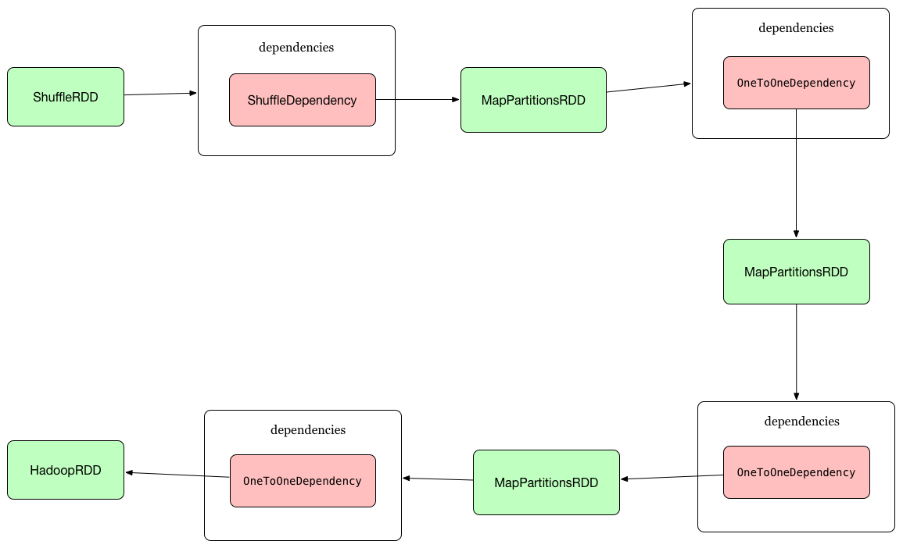
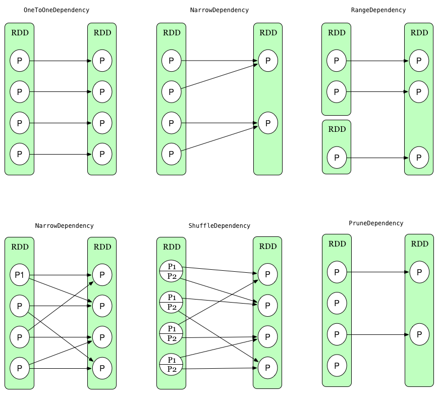
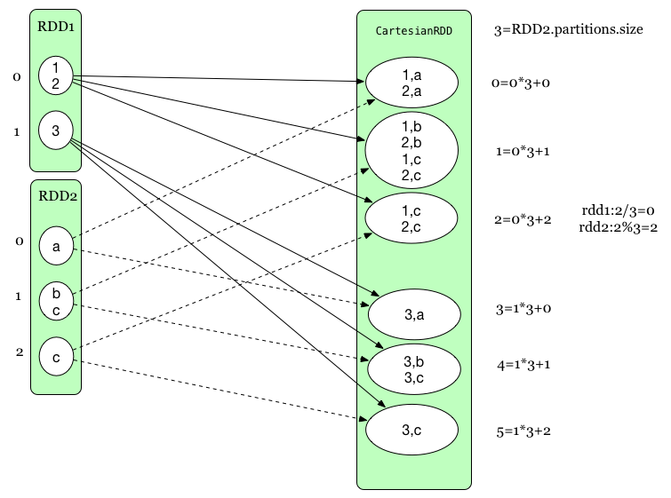
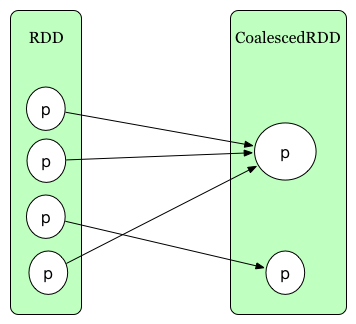

之前对RDD有一个大体概念了解,这一节我们需要深入了解它,了解在源码中到底是什么,
怎么产生的,给个rdd之间怎么依赖的,最后又怎么生成spark job

我们还是先从一个例子下手:
```scala
val sc = new SparkContext(sparkConf)

val res = sc
  .textFile(args(0))
  .flatMap(line => line.split(" "))
  .map(w => (w, 1))
  .reduceByKey(_ + _)
  .collect()

res.foreach(tuple => println(tuple._1 + " => " + tuple._2))
```

##RDD如何生成
SparkContext是spark方法的主要的入口,代表着与spark集群建立连接了,它被用来创建RDDs,accumulators(累加器),
broadcast var(广播变量),每个JVM只容许一个[SPARK-2243](https://issues.apache.org/jira/browse/SPARK-2243),
这里我们只讨论与RDDs相关方法:

方法|功能|生成RDD
---|---|---
textFile|从hadoop所支持的文件系统上读取文件|HadoopRDD
parallelize|把本地的数据集合分发行程RDD,懒加载|ParallelCollectionRDD
range|原理同上,只是做了一些分装|ParallelCollectionRDD => MapPartitionsRDD
makeRDD|同parallelize|生成ParallelCollectionRDD
wholeTextFiles|从hadoop所支持的文件系统上读取文件目录下所有文件|WholeTextFileRDD
binaryFiles|读二进制文件|BinaryFileRDD


通过对SparkContext的部分方法解释,我们能看出最开始的RDD怎么行程的,我先针对HadoopRDD看都有哪些内部成员:

- `getDependencies: 获取依赖RDDs,我们发现是Nil很容易理解,第一个RDD,之前没有依赖

- `sc SparkContext`: spark上下文

- `inputFormatClass<:InputFormat`: hadoop中InputFormat负责生成InputSplit(文件块),实现RecordReader,读数据,
我们也看出spark与hadoop的内在联系了

- `getPartitions`: 通过inputFormat.getSplits得到文件块,然后包装成HadoopPartition,至此得到了该RDD的分区数了

- `compute`: 先通过`inputFormat.getRecordReader`获取RecordReader,分装成自己的`NextIterator`,该迭代器最主要的
方法hasNext,next,细节我们就略掉;最后与SparkContext一起分装成`InterruptibleIterator`

我们大概了解此RDD主要功能,借助hadoop inputFormat的获取文件块/对文件块读取,然后分装成自己的格式比如:
HadoopPartition,InterruptibleIterator

再看一个ParallelCollectionRDD,该RDD主要对本地数据集合分发到集群上执行:
- `getPartitions`: `ParallelCollectionRDD.slice`把数据集根据`numSlices`分片数量切分成一组一组数据,
然后用`ParallelCollectionPartition`分装
- `compute`: 把Seq集合与sparkContext分装到`InterruptibleIterator`

至此我们基本有一个大致的感官,这些初始RDD基本通过getPartitions分好区,再通过`compute` 把
partition包装成`InterruptibleIterator`,需要注意的是此时并没有真实的处理数据,只是做准备工作,但是`next`是
可以直接获取该分区下的下一条数据.

接着上面的例子`rdd.flatMap`生成`MapPartitionsRDD(pre,f)`前一个RDD,compute中使用的函数(spark到处都是函数式编程):
- `getPartitions`: 前一个RDD的partition
- `compute`: 执行成员变量f,上面的例子中`line => line.split(" ")`空格分割返回数组,这是一个表达式,
`iter.flapMap(f)`是这个RDD主要功能,写一个直观的小例子:
```scala
val res = Seq(
    "Return a new RDD by applying",
    "a function to all elements of this RDD"
  ).flatMap(line=>line.split(" "))
  println(res)

//执行结果如下:
//List(Return, a, new, RDD, by, applying, a, function, to, all, elements, of, this, RDD)
```
- `iterator`: 这是RDD内部公用的不可变方法,先从cache中读取,如果没有再去计算,不能被直接调用,用户可以在自定义RDD中调用


`MapPartitionsRDD.map(w => (w, 1))`生成MapPartitionsRDD,`f`是的主要逻辑是`iter.map(cleanF)`,转换成键值对,


`mapPartitionsRDD.reduceByKey(_ + _)`,有同学发现RDD中没有这个方法,而PairRDDFunctions却有,那么就引入一个问题:


###PairRDDFunctions与RDD关系
`PairRDDFunctions`构造函数中接受的是`RDD[(K, V)`这种格式,我们可以推断出`mapPartitionsRDD.reduceByKey(_ + _)`
真实执行逻辑`new PairRDDFunctions(mapPartitionsRDD).reduceByKey(_ + _)`,这其实涉及到了scala中隐式转换,
而我们确实在`object RDD`中发现了`implicit def rddToPairRDDFunctions[K, V](rdd: RDD[(K, V)])`,说白了就是你定义好
隐式转换的方法,编译器在编译过程中帮你自动根据类型与转换转换方法自动转换,这样代码写上去行云流水很顺畅:
我们写一个小例子:
```scala
class MyRDD {
  def map(): Unit = {
    println("this map")
  }

  override def toString = s"MyRDD()"
}

object MyRDD {
  implicit def rddToPairRDDFunctions(rdd: MyRDD): MyPairRDDFunctions = {
    new MyPairRDDFunctions(rdd)
  }
}

class MyShuffledRDD(prev: MyRDD) extends MyRDD {
  override def toString = s"MyShuffledRDD()"
}

class MyPairRDDFunctions(self: MyRDD) {
  def reduceByKey(): MyShuffledRDD = {
    println("this reduceByKey")
    new MyShuffledRDD(self)
  }
}

def main(args: Array[String]): Unit = {
  println(new MyRDD().reduceByKey())
}
```
执行结果为:
```
this reduceByKey
MyShuffledRDD()
```

如果理解了上面这块代码,那么也就清楚了RDD,PairRDDFunctions之间的内在联系,
下面继续往下跟代码`reduceByKey`,最终跟到此方法`combineByKeyWithClassTag`,发现最终返回`ShuffledRDD`,
根据上面对RDD分析我们基本可以确定只要分析以下方法:
- `getPartitions`:  根据`Partitioner.numPartitions`(这里其实就是文件块数量),然后返回Array[ShuffledRDDPartition]
- `getDependencies`: 返回ShuffleDependency(Dependency TODO 需要详谈)
- `compute`: 次方法是在Executor中的执行ShuffleMapTask的时候被执行,主要逻辑是`combineCombinersByKey`,然后落地到内存或者文件
这里说的很笼统,细节我们后面专门写一节详谈(TODO)

这个例子最后`collect`,RDD提交job,实际调用`SparkContext.runJob`=>`DAGScheduler.handleJobSubmitted`,
`newResultStage`转换stage,然后提交`submitStage`

##RDD之间依赖关系
最终的RDD链如下:


###Dependency
依赖可以分为:窄依赖(NarrowDependency),宽依赖(ShuffleDependency)
NarrowDependency(窄依赖),parent RDD中的每个partition最多被child RDD中的一个partition使用，容许管道执行

- OneToOneDependency: parent和child中的partition的序号一样,1:1
- RangeDependency: 只在UnionRDD使用到
- PruneDependency: 被裁减的RDD

ShuffleDependency, 宽依赖需要出发shuffle
两种Dependency区别是:`父RDD partition的数据集有没有被拆分`,
比如RDD1个分区P中的一部分数据p1被RDD1使用,另一部分数据p2被RDD2使用,此时就会是宽依赖



##RDDs
- UnionRDD
两个RDD合并成一个RDD,其实是概念上一种合并

依赖:NarrowDependency(RangeDependency)

getPartitions介绍:把rdds中的所有rdds中的partitions合并成一个数组

```scala
  override def getPartitions: Array[Partition] = {
    val array = new Array[Partition](rdds.map(_.partitions.length).sum)
    var pos = 0
    for ((rdd, rddIndex) <- rdds.zipWithIndex; split <- rdd.partitions) {
      array(pos) = new UnionPartition(pos, rdd, rddIndex, split.index)
      pos += 1
    }
    array
  }
```

- PartitionPruningRDD
一般用在对RDD partitions进行裁减

依赖:NarrowDependency(PruneDependency)

用处:

(1)`OrderedRDDFunctions.filterByRange`,会触发这个RDD,比如下面这个例子,过滤出key在(20,30)之间的数据:

```scala
    val sorted = sc.parallelize(pairArr, 10).sortByKey()
    val range = sorted.filterByRange(20, 40).collect()
```

(2)`RangePartitioner`也会触发这个RDD

- CartesianRDD

该RDD主要对两个RDD做笛卡尔积

依赖:NarrowDependency

在`getPartitions`中对rdd得到笛卡尔积的分区集合,
`getDependencies`中计算rdd直接的依赖关系,partition并没有被部分拆分,也就是说不会发生shuffle

```scala
  override def getDependencies: Seq[Dependency[_]] = List(
    new NarrowDependency(rdd1) {
      def getParents(id: Int): Seq[Int] = List(id / numPartitionsInRdd2)
    },
    new NarrowDependency(rdd2) {
      def getParents(id: Int): Seq[Int] = List(id % numPartitionsInRdd2)
    }
  )
```
从下面的图我们可以清晰的看出来,rdd对parent RDD的依赖是确定的并且是全部依赖


- CoalescedRDD
这个RDD主要是对parent RDD进行合并(TODO PartitionCoalescer,这个类里面合并算法),`getPartitions`中调用该算法,最后生成
`CoalescedRDDPartition`数组,从`CoalescedRDDPartition(i, prev, ids, pg.prefLoc)`我们也能基本看出来`ids=>id`

依赖:NarrowDependency


```scala
  override def getPartitions: Array[Partition] = {
    val pc = new PartitionCoalescer(maxPartitions, prev, balanceSlack)

    pc.run().zipWithIndex.map {
      case (pg, i) =>
        val ids = pg.arr.map(_.index).toArray
        new CoalescedRDDPartition(i, prev, ids, pg.prefLoc)
    }
  }
```




- ShuffledRDD
主要功能是shuffle的一种抽象

依赖:ShuffleDependency

getPartitions:很简单,就是根据`part: Partitioner`中指定的分区数量确定ShuffledRDDPartition数组

```scala
  override def getPartitions: Array[Partition] = {
    Array.tabulate[Partition](part.numPartitions)(i => new ShuffledRDDPartition(i))
  }
```

`compute`:获取`ShuffleReader`,在reduce任务中从mappers获得key-values,这个操作发生在reduce task,ShuffleReader.read方法中,调用
`Aggregator` 聚合类,这里主要`combineValuesByKey`根据key聚合values,`Aggregator.combineValuesByKey`又使用到
`ExternalAppendOnlyMap`,这个类就像名字一样只能append的Map,如果内存不足,有序内容会被溢出到磁盘,
`insertAll`方法把keys和values插入到该Map中

- CoGroupedRDD
合并RDDs,`(K, V) , (K, W) => (K, (Iterable<V>, Iterable<W>))`


结合上图与代码,我们可以看到如何RDDs与CoGroupedRDD Partitioner相同,则窄依赖,不同则为宽依赖,也就是说会出现,宽依赖与
窄依赖并存的问题

```scala
  override def getDependencies: Seq[Dependency[_]] = {
    rdds.map { rdd: RDD[_] =>
      if (rdd.partitioner == Some(part)) {
        logDebug("Adding one-to-one dependency with " + rdd)
        new OneToOneDependency(rdd)
      } else {
        logDebug("Adding shuffle dependency with " + rdd)
        new ShuffleDependency[K, Any, CoGroupCombiner](
          rdd.asInstanceOf[RDD[_ <: Product2[K, _]]], part, serializer)
      }
    }
  }
```

`compute`:由于dependency有两种情况,所以在计算时,也需要分别处理,
窄依赖:`oneToOneDependency.rdd.iterator(dependencyPartition, context)`
宽依赖:与ShuffledRDD中read方法一样

```SparkEnv.get.shuffleManager
     .getReader(shuffleDependency.shuffleHandle, split.index, split.index + 1, context)
     .read()
```
最后把RDDs合并到`ExternalAppendOnlyMap`


- SubtractedRDD
功能我们从一个小例子看出:
```scala
val a = sc.parallelize(Array(1, 2, 3), 2)
val b = sc.parallelize(Array(2, 3, 4), 4)
val c = a.subtract(b)
assert(c.collect().toSet === Set(1))
```

其实我们通过cogroup来实现,这个RDD是CoGroupedRDD特殊情况的一种优化,当rdd1比较小时,可以cache到内存中(JHashMap),
rdd2实质上是流式传输,源码如下:

```scala
  override def compute(p: Partition, context: TaskContext): Iterator[(K, V)] = {
    val partition = p.asInstanceOf[CoGroupPartition]
    val map = new JHashMap[K, ArrayBuffer[V]]
    def getSeq(k: K): ArrayBuffer[V] = {
      val seq = map.get(k)
      if (seq != null) {
        seq
      } else {
        val seq = new ArrayBuffer[V]()
        map.put(k, seq)
        seq
      }
    }
    def integrate(depNum: Int, op: Product2[K, V] => Unit): Unit = {
      dependencies(depNum) match {
        case oneToOneDependency: OneToOneDependency[_] =>
          val dependencyPartition = partition.narrowDeps(depNum).get.split
          oneToOneDependency.rdd.iterator(dependencyPartition, context)
            .asInstanceOf[Iterator[Product2[K, V]]].foreach(op)

        case shuffleDependency: ShuffleDependency[_, _, _] =>
          val iter = SparkEnv.get.shuffleManager
            .getReader(
              shuffleDependency.shuffleHandle, partition.index, partition.index + 1, context)
            .read()
          iter.foreach(op)
      }
    }

    // 第一个依赖全部cache到map中
    integrate(0, t => getSeq(t._1) += t._2)
    // 第二个依赖移除自己在map中存在的keys
    integrate(1, t => map.remove(t._1))
    // List(List(1,2),List(3,4)).flatten 
    // res0: List[Int] = List(1, 2, 3, 4)
    
    // flatMap 即:
    // (1,List(1, 2, 3))
    // (2,List(1, 2, 3))
    // (1,1)
    // (1,2)
    // (1,3)
    // (2,1)
    // (2,2)
    // (2,3)
    // map.asScala.iterator.flatMap(t => t._2.iterator.map((t._1, _)))
    map.asScala.iterator.map(t => t._2.iterator.map((t._1, _))).flatten
  }
```


- ReliableCheckpointRDD
RDD.checkpoint 
  => RDD.doCheckpoint 
    => RDDCheckpointData.checkpoint 
      => ReliableRDDCheckpointData.doCheckpoint
        => ReliableCheckpointRDD.writeRDDToCheckpointDirectory: 主要是通过sparkContext提交写文件job,返回ReliableCheckpointRDD
        
checkpoint其实就是数据落地文件系统,目前为止RDD重复计算(SPARK-8582)还没有merge进来
        
`compute`:ReliableCheckpointRDD.readCheckpointFile,从文件系统读取指定的checkpoint文件


从上面一系列分析我们基本可以了解RDD,有些数据源如HadoopRDD,有些RDD不需要shuffle如MapPartitionsRDD,有些会触发如ShuffledRDD,
还有些可能会可能不会一切取决于dependencies如CoGroupedRDD,我这里只是分析具有代表性的RDD,覆盖了所有情况的Dependency,
还有一些RDD,读者可以自行分析.

有了这些RDD我们就可以相互拼接行程丰富多彩的方法

###RDD方法分析

####Transformations

- `map(func)`
  迭代器对每个元素执行func,返回T
  
  例如:`map(w => (w, 1))`
  
  `new MapPartitionsRDD[U, T](this, (context, pid, iter) => iter.map(cleanF))`
  
  
- `flatMap(func)`

  执行scala中的flatMap函数
  
  `new MapPartitionsRDD[U, T](this, (context, pid, iter) => iter.flatMap(cleanF))`
  
  例如:`flatMap(line => line.split(" "))`
  
- `filter(func)`

  执行scala中的filter函数
  
  例如:`filter(_.name == "zhangsan")`
  
- `mapPartitions(func)` 
  
  与map相似,只是把迭代器暴露出来了
  
  ```
  new MapPartitionsRDD(
    this,
    (context: TaskContext, index: Int, iter: Iterator[T]) => cleanedF(iter),
    preservesPartitioning)
  ```

- `mapPartitionsWithIndex(func)`

  与mapPartitions相似,只是把partition index暴露出来

  ```
    new MapPartitionsRDD(
      this,
      (context: TaskContext, index: Int, iter: Iterator[T]) => cleanedF(index, iter),
      preservesPartitioning)
  ```

- `sample(withReplacement, fraction, seed)`
  取样数据的一小部分,算法如泊松分布(有放回),伯努利实验(无放回)
  
- `union`

  上面说过了  

- `groupByKey(numTasks)`

  (K, V) => (K, Iterable<V>) 
  
  来自PairRDDFunctions,生成ShuffledRDD
  
  例如:
  ```
  val pairs = sc.parallelize(Array((1, 1), (1, 2), (1, 3), (2, 1)))
  val groups = pairs.groupByKey().collect() //[(1,[1,2,3]),(2,[1])]
  ```
- `flatMapValues`

  [("a",[2,3]),("b",[2,1])] => [("a",2),("a",3),("b",2),("b",1)]

  ```
  new MapPartitionsRDD[(K, U), (K, V)](self,
     (context, pid, iter) => iter.flatMap { case (k, v) =>
       cleanF(v).map(x => (k, x))
     },
     preservesPartitioning = true)
  ```
  
- `reduceByKey(func, [numTasks])`
  
  (K, V) => (K, V) 
    
  来自PairRDDFunctions,生成ShuffledRDD
  
  例如:
  ```
  val pairs = sc.parallelize(Array((1, 1), (1, 2), (1, 3), (2, 1)))
  val sums = pairs.reduceByKey().collect() //[(1,6),(2,1)]
  ```
  
- `aggregateByKey(zeroValue)(seqOp, combOp, [numTasks])`
  
  dataset:(K, V) => (K, U)
  
  来自PairRDDFunctions,生成ShuffledRDD
  
  下面这个例子:
  
  ```
  val pairs = sc.parallelize(Array((1, 1), (1, 1), (3, 2), (5, 1), (5, 3)), 2)
  val sets = pairs.aggregateByKey(new HashSet[Int]())(_ += _, _ ++= _).collect()
  //还原部分语法糖
  //val sets = pairs.aggregateByKey(new HashSet[Int]())((set,i)=>set.+=(i), (set1,set2)=> set1.++=(set2)).collect()
  sets: Array[(Int, scala.collection.mutable.HashSet[Int])] = Array((1,Set(1)), (3,Set(2)), (5,Set(1, 3)))
  ```

- `sortByKey([ascending], [numTasks])`

   来自OrderedRDDFunctions,根据key排序,生成ShuffledRDD
   
  ```
  scala> val pairs = sc.parallelize(Array((1, 0), (2, 0), (0, 2), (3, 0), (0, 1)), 2)
  pairs: org.apache.spark.rdd.RDD[(Int, Int)] = ParallelCollectionRDD[19] at parallelize at <console>:28
  
  scala> pairs.sortByKey().collect()
  res12: Array[(Int, Int)] = Array((0,2), (0,1), (1,0), (2,0), (3,0))
  ```
- `cartesian(otherDataset)`
  
  两个RDD求笛卡尔积,生成CartesianRDD


- `cogroup(otherDataset, [numTasks])`

  来自PairRDDFunctions,根据key合并两个RDD,生成CoGroupedRDD
  
  (K, V) and (K, W) => (K, (Iterable<V>, Iterable<W>))
  
  ```
  val rdd1 = sc.parallelize(Array((1, 1), (1, 2), (2, 1), (3, 1)))
  val rdd2 = sc.parallelize(Array((1, 'x'), (2, 'y'), (2, 'z'), (4, 'w')))
  val res = rdd1.cogroup(rdd2, 3).collect()
  res: Array[(Int, (Iterable[Int], Iterable[Char]))] = Array((3,(CompactBuffer(1),CompactBuffer())), (4,(CompactBuffer(),CompactBuffer(w))), (1,(CompactBuffer(1, 2),CompactBuffer(x))), (2,(CompactBuffer(1),CompactBuffer(y, z))))
  ```

- `coalesce(numPartitions)`
  
  partition 合并
  
  生成CoalescedRDD
  
  如果强制shuffle可以MapPartitionsRDD=>ShuffledRDD=>CoalescedRDD,这里提供了一个思路如何需要数据倾斜,
  可以通过这种方式解决
  
- `repartition` => shuffle`coalesce`

  ```
  val data = sc.parallelize(Seq((0, 5), (3, 8), (2, 6), (0, 8), (3, 8), (1, 3)), 2)
  scala> data.repartition(2).glom().collect()
  res16: Array[Array[(Int, Int)]] = Array(Array((0,5), (2,6), (0,8), (1,3)), Array((3,8), (3,8)))
  ```

- `repartitionAndSortWithinPartitions(partitioner)`
  
  `repartition`的基础上每个partition实现排序

  ```
   val data = sc.parallelize(Seq((0, 5), (3, 8), (2, 6), (0, 8), (3, 8), (1, 3)), 2)
   val partitioner = new Partitioner {
     def numPartitions: Int = 2
     def getPartition(key: Any): Int = key.asInstanceOf[Int] % 2
   }
   val repartitioned = data.repartitionAndSortWithinPartitions(partitioner)
   val partitions = repartitioned.glom().collect()
   partitions: Array[Array[(Int, Int)]] = Array(Array((0,5), (0,8), (2,6)), Array((1,3), (3,8), (3,8)))
  ```
  
- `join(otherDataset, [numTasks])`
  
  ```
  this.cogroup(other, partitioner).flatMapValues( pair =>
    for (v <- pair._1.iterator; w <- pair._2.iterator) yield (v, w)
  )
  ```
  从源码可以看出来基础方法的组合

- `distinct(numTasks)`
  
  key去重
  
  ```
   def distinct(numPartitions: Int)(implicit ord: Ordering[T] = null): RDD[T] = withScope {
     map(x => (x, null)).reduceByKey((x, y) => x, numPartitions).map(_._1)
   }
  ```

- `intersection(otherDataset)`

  rdd交集
  
  ```
  this.map(v => (v, null)).cogroup(other.map(v => (v, null)))
      .filter { case (_, (leftGroup, rightGroup)) => leftGroup.nonEmpty && rightGroup.nonEmpty }
      .keys
  ```

####Actions
action之所以会触发job,以下的所有方法都是触发了`sc.runJob`方法

- `reduce`
  ```
    def reduce(f: (T, T) => T): T = withScope {
      val cleanF = sc.clean(f)
      //ResultTask中调用runTask=>func便是这个方法,所有这个方法是被executor执行
      val reducePartition: Iterator[T] => Option[T] = iter => {
        if (iter.hasNext) {
          Some(iter.reduceLeft(cleanF))
        } else {
          None
        }
      }
      var jobResult: Option[T] = None
      //Driver端执行function`f`,所以我们要注意内存溢出
      val mergeResult = (index: Int, taskResult: Option[T]) => {
        if (taskResult.isDefined) {
          jobResult = jobResult match {
            case Some(value) => Some(f(value, taskResult.get))
            case None => taskResult
          }
        }
      }
      //提交Job
      sc.runJob(this, reducePartition, mergeResult)
      ...
    }
  ```
- `collect`

  最终还是调用,ResultTask中调用`func: (TaskContext, Iterator[T]) => U`,resultHandler处理每个partition返回结果
  
  ```
    def collect(): Array[T] = withScope {
      val results = sc.runJob(this, (iter: Iterator[T]) => iter.toArray)
      Array.concat(results: _*)
    }
  ```
- `count`
  `def count(): Long = sc.runJob(this, Utils.getIteratorSize _).sum`

- `countByKey()`
  ```
    def countByKey(): Map[K, Long] = self.withScope {
      self.mapValues(_ => 1L).reduceByKey(_ + _).collect().toMap
    }
  ```
- `foreach(func)`
  ```
    def foreach(f: T => Unit): Unit = withScope {
      val cleanF = sc.clean(f)
      sc.runJob(this, (iter: Iterator[T]) => iter.foreach(cleanF))
    }
  ```
- `take(n)` 
- `takeSample(withReplacement, num, [seed])`
- `takeOrdered(n, [ordering])`
- `saveAsTextFile(path)`
   最终调用`saveAsHadoopDataset`=>sc.runJob,
   
- `saveAsSequenceFile(path) `
- `saveAsObjectFile(path) `


###DAGScheduler


