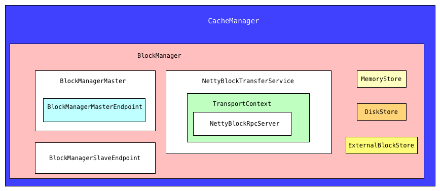
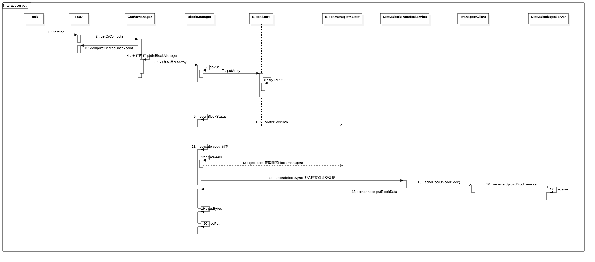
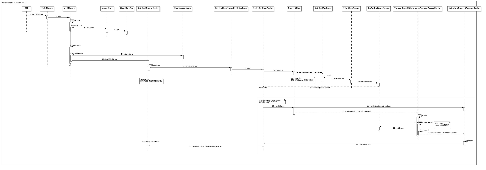

# spark core源码阅读-Storage persist(七)

## 存储级别

每个StorageLevel都会记录是否使用内存或ExternalBlockStore，
如果内存或ExternalBlockStore内存不足，是否将RDD丢弃到磁盘，
是否以串行化格式保存内存中的数据以及是否在多个节点上复制RDD分区。

```scala
class StorageLevel private(
    private var _useDisk: Boolean,//磁盘
    private var _useMemory: Boolean,//内存
    private var _useOffHeap: Boolean,//堆外内存
    private var _deserialized: Boolean,//是否序列化
    private var _replication: Int = 1)//副本数量
```

根据`StorageLevel`类定义以下级别:
NONE,DISK_ONLY,DISK_ONLY_2,MEMORY_ONLY = new Sto
MEMORY_ONLY_2,MEMORY_ONLY_SER,MEMORY_ONLY_SER_2,MEMORY_AND_DISK,
MEMORY_AND_DISK_2,MEMORY_AND_DISK_SER,MEMORY_AND_DISK_SER_2,
OFF_HEAP(与MEMORY_ONLY_SER类似，但将数据存储在堆内存储器中。 这需要启用堆堆内存)


## 主要模块介绍
- `CacheManager`: Spark类负责将RDD分区内容传递给BlockManager，并确保节点不会一次加载RDD的两个副本。
  通过`CacheManager`获取数据,如果不存在,计算结果并保存
- `BlockManager`: driver和executors个节点都会管理该模块,决定数据保存/获取媒介是内存,磁盘,堆外内存
- `MemoryStore`: 负责将数据写入内存或者从内存读出
- `DiskStore`: 负责将数据写入磁盘或者从磁盘读出
- `ExternalBlockStore`: 负责将数据写入堆外或者从堆外读出
- `BlockManagerMasterEndpoint`: BlockManagerMasterEndpoint是Driver端`ThreadSafeRpcEndpoint`，
  用于跟踪所有`BlockManager`的状态。
- `BlockManagerMaster`: 对于driver是一个master RPC服务, 对于executors,是RPC client
- `BlockManagerSlaveEndpoint`: RpcEndpoint从主服务器获取命令以执行选项。 
  例如，这用于从executors的BlockManager中删除块。
- `NettyBlockTransferService`:  BlockTransferService使用Netty一远程获取blocks。
- `NettyBlockRpcServer`: 处理opening和uploading任意的BlockManager块。

### 结构图




### 初始化

SparkEnv.create
CacheManager创建过程

```scala
    val blockTransferService = new NettyBlockTransferService(conf, securityManager, numUsableCores)

    val blockManagerMaster = new BlockManagerMaster(registerOrLookupEndpoint(
      BlockManagerMaster.DRIVER_ENDPOINT_NAME,
      new BlockManagerMasterEndpoint(rpcEnv, isLocal, conf, listenerBus)),
      conf, isDriver)

    // NB: blockManager is not valid until initialize() is called later.
    val blockManager = new BlockManager(executorId, rpcEnv, blockManagerMaster,
      serializer, conf, memoryManager, mapOutputTracker, shuffleManager,
      blockTransferService, securityManager, numUsableCores)

    val broadcastManager = new BroadcastManager(isDriver, conf, securityManager)

    val cacheManager = new CacheManager(blockManager)
```

在Driver创建RPC server,executor创建RPC client
```scala
    def registerOrLookupEndpoint(
        name: String, endpointCreator: => RpcEndpoint):
      RpcEndpointRef = {
      if (isDriver) {
        logInfo("Registering " + name)
        rpcEnv.setupEndpoint(name, endpointCreator)
      } else {
        RpcUtils.makeDriverRef(name, conf, rpcEnv)
      }
    }
```

driver:
SparkContext: `_env.blockManager.initialize(_applicationId)`

executor:
Executor: `env.blockManager.initialize(conf.getAppId)`


### 数据写入过程分析



上面分析了内存充足情况下,副本>1的情况
  
  - RDD.iterator为入口,[spark core源码阅读-Task介绍(六)]详细说过ShuffleMapTask/ResultTask, task调用`runTask`,
    该方法会调用`iterator`
  - `storageLevel != StorageLevel.NONE`调用`SparkEnv.get.cacheManager.getOrCompute`,当`blockManager`
    没有缓存该数据集,`RDD.computeOrReadCheckpoint`计算RDD的一个分区数据,调用`putInBlockManager` cache该数据
  - 优先写入MemoryStore,如果内存不足,将最近使用次数不频繁的数据写入磁盘
  - 通知`BlockManagerMaster`,`updateBlockInfo`保存元数据
  - 如果备份数目>1,调用`replicate`,将已经写入的数据同步到其他节点上
  
### 数据读取过程
这里先分析IO没有容错情况



```scala
  def get(blockId: BlockId): Option[BlockResult] = {
    val local = getLocal(blockId)
    if (local.isDefined) {
      logInfo(s"Found block $blockId locally")
      return local
    }
    val remote = getRemote(blockId)
    if (remote.isDefined) {
      logInfo(s"Found block $blockId remotely")
      return remote
    }
    None
  }
```

`getRemote`触发2次RPC
  - `client.sendRpc`注册一个ManagedBuffers流
  - 成功之后`client.fetchChunk`(这里只有一个block)

#### Netty Client

1.`NettyBlockTransferService.fetchBlocks`,执行成功回调函数`BlockFetchingListener.onBlockFetchSuccess`,

```scala
  //BlockTransferService.fetchBlockSync
  def fetchBlockSync(host: String, port: Int, execId: String, blockId: String): ManagedBuffer = {
    // A monitor for the thread to wait on.
    val result = Promise[ManagedBuffer]()
    fetchBlocks(host, port, execId, Array(blockId),
      new BlockFetchingListener {
        override def onBlockFetchFailure(blockId: String, exception: Throwable): Unit = {
          result.failure(exception)
        }
        override def onBlockFetchSuccess(blockId: String, data: ManagedBuffer): Unit = {
          val ret = ByteBuffer.allocate(data.size.toInt)
          ret.put(data.nioByteBuffer())
          ret.flip()
          result.success(new NioManagedBuffer(ret))
        }
      })

    Await.result(result.future, Duration.Inf)
  }
```

2.`OneForOneBlockFetcher.start`开始获取进程,`this.openMessage = new OpenBlocks(appId, execId, blockIds);`
调用成功后,第二次发起第二次RPC请求`client.fetchChunk`

```scala
client.sendRpc(openMessage.toByteBuffer(), new RpcResponseCallback() {
  @Override
  public void onSuccess(ByteBuffer response) {
    try {
      streamHandle = (StreamHandle) BlockTransferMessage.Decoder.fromByteBuffer(response);
      logger.trace("Successfully opened blocks {}, preparing to fetch chunks.", streamHandle);

      // Immediately request all chunks -- we expect that the total size of the request is
      // reasonable due to higher level chunking in [[ShuffleBlockFetcherIterator]].
      for (int i = 0; i < streamHandle.numChunks; i++) {
        client.fetchChunk(streamHandle.streamId, i, chunkCallback);
      }
    } catch (Exception e) {
      logger.error("Failed while starting block fetches after success", e);
      failRemainingBlocks(blockIds, e);
    }
  }

  @Override
  public void onFailure(Throwable e) {
    logger.error("Failed while starting block fetches", e);
    failRemainingBlocks(blockIds, e);
  }
});
```

3.第二次调用成功后触发`TransportResponseHandler.handle`,然后执行回调函数`ChunkCallback`
```java
if (message instanceof ChunkFetchSuccess) {
      ChunkFetchSuccess resp = (ChunkFetchSuccess) message;
      ChunkReceivedCallback listener = outstandingFetches.get(resp.streamChunkId);
      if (listener == null) {
        logger.warn("Ignoring response for block {} from {} since it is not outstanding",
          resp.streamChunkId, remoteAddress);
        resp.body().release();
      } else {
        outstandingFetches.remove(resp.streamChunkId);
        listener.onSuccess(resp.streamChunkId.chunkIndex, resp.body());
        resp.body().release();
      }
    }
```

### Netty Server

1.相应第一次Client的请求`OpenBlocks`事件,`NettyBlockRpcServer.receive`,
OneForOneStreamManager注册一个ManagedBuffers流,作为单独的块一次一个地推给调用者

```scala
  override def receive(
      client: TransportClient,
      rpcMessage: ByteBuffer,
      responseContext: RpcResponseCallback): Unit = {
    val message = BlockTransferMessage.Decoder.fromByteBuffer(rpcMessage)
    logTrace(s"Received request: $message")

    message match {
      case openBlocks: OpenBlocks =>
        val blocks: Seq[ManagedBuffer] =
          openBlocks.blockIds.map(BlockId.apply).map(blockManager.getBlockData)
        //OneForOneStreamManager 注册一个ManagedBuffers流，作为单独的块一次一个地推给调用者
        val streamId = streamManager.registerStream(appId, blocks.iterator.asJava)
        logTrace(s"Registered streamId $streamId with ${blocks.size} buffers")
        responseContext.onSuccess(new StreamHandle(streamId, blocks.size).toByteBuffer)

      case uploadBlock: UploadBlock =>
        // StorageLevel is serialized as bytes using our JavaSerializer.
        val level: StorageLevel =
          serializer.newInstance().deserialize(ByteBuffer.wrap(uploadBlock.metadata))
        val data = new NioManagedBuffer(ByteBuffer.wrap(uploadBlock.blockData))
        blockManager.putBlockData(BlockId(uploadBlock.blockId), data, level)
        responseContext.onSuccess(ByteBuffer.allocate(0))
    }
  }
```

2.送回Client端的第二次RPC请求,`TransportRequestHandler.handle`执行`processFetchRequest`,
`OneForOneStreamManager.getChunk`, 为响应fetchChunk()请求,封装`ManagedBuffer`返回

```java
  private void processFetchRequest(final ChunkFetchRequest req) {
    final String client = NettyUtils.getRemoteAddress(channel);

    logger.trace("Received req from {} to fetch block {}", client, req.streamChunkId);

    ManagedBuffer buf;
    try {
      streamManager.checkAuthorization(reverseClient, req.streamChunkId.streamId);
      streamManager.registerChannel(channel, req.streamChunkId.streamId);
      buf = streamManager.getChunk(req.streamChunkId.streamId, req.streamChunkId.chunkIndex);
    } catch (Exception e) {
      logger.error(String.format(
        "Error opening block %s for request from %s", req.streamChunkId, client), e);
      respond(new ChunkFetchFailure(req.streamChunkId, Throwables.getStackTraceAsString(e)));
      return;
    }

    respond(new ChunkFetchSuccess(req.streamChunkId, buf));
  }
```

IO容错为实际fetcher封装在类`RetryingBlockFetcher`中

