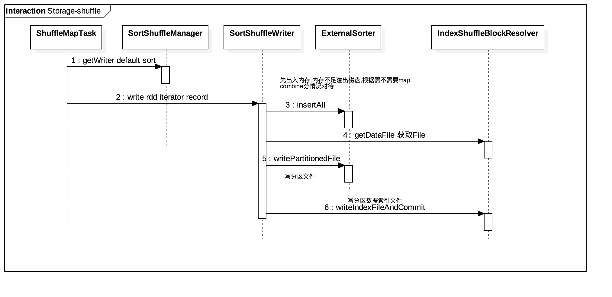
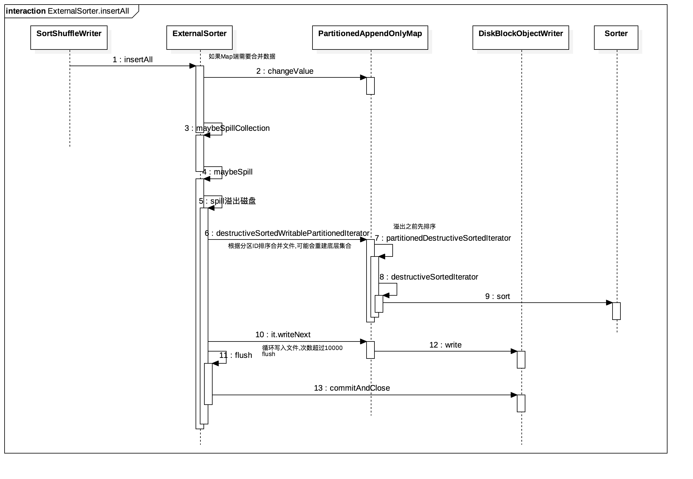
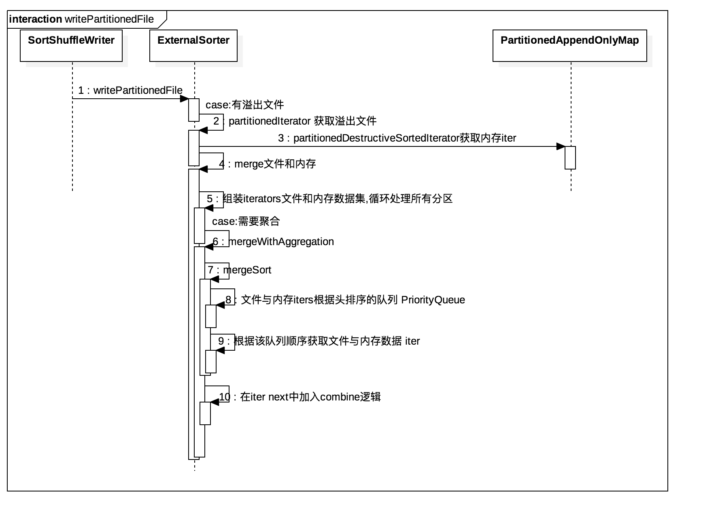

# spark core源码阅读-Storage shuffle(八)

本节主要介绍`RDD.aggregateByKey`导致的shuffle,`ShuffleMapTask`中Task如何处理`rdd.iterator`,
shuffle中Map端如何根据根据分区把数据写入文件.

## 主要类简述
- ShuffleManager
 Driver/Executors创建SparkEnv时创建该类,不同的ShuffleManager对应不同ShuffleWriter,
 通过Driver通过`spark.shuffle.manager`指定使用策略
 
 (1) HashShuffleManager
 
 (2) SortShuffleManager
  default,

- ShuffleWriter

  (1) SortShuffleWriter
  
  (1) SortShuffleWriter

- ExternalSorter

- IndexShuffleBlockResolver

- PartitionedAppendOnlyMap

- Sorter
  TimSort

## 主要方法

- `insertAll`

- `writePartitionedFile`

TODO 
- [TimSort](http://blog.csdn.net/yangzhongblog/article/details/8184707) JDK ComparableTimSort
- [RoaringBitmap]