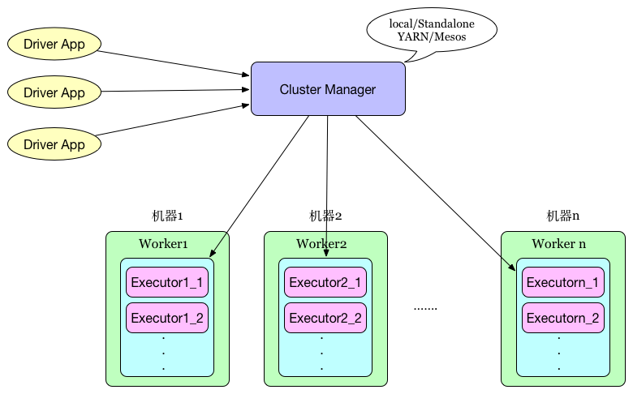

#spark core源码阅读-基本架构(二)

##Spark基本框架
###基本组件
首先有一个大体感知,下图是spark standalone模型的架构图

###几种模式
- local:本地测试使用
- YARN: 基于hadoop资源管理器
- Mesos: 一种比Yarn管理更细的资源管理器

**YARN的架构图:**

- ResourceManager: 集群资源管理器
- NodeManager: 每个节点的资源管理器,管理container的生命周期
- ApplicationManager: 一次Job App管理器, 本次Job任务的资源申请, 作业调度执行
- Container: 计算容器,负责执行任务

###基本术语
**spark job提交运行图:**

- `Driver App`:客户端应用程序,将任务转换成RDD,DAG并与资源调度器保持通信
- `Cluster Manager`: 常驻进程,Master是standalone模式下spark资源管理器,如果是yarn模式是托管给ResourceManager
- `Worke`r: 常驻进程 standalone模式下管理Executor, yarn模式下委托给NodeManager管理
- `Executor`: java计算进程,大量executors并发负责执行计算任务,在YARN中就是container
- `Job`: 代表一个工作流
- `Stage`: job根据DAG图被切分成不同类型的stage,每一种stage是一类并行tasks,他们有相同shuffle依赖,总的说还是tasks的一个抽象
- `Task`: 实际执行的任务,一组任务发送给Executor执行

