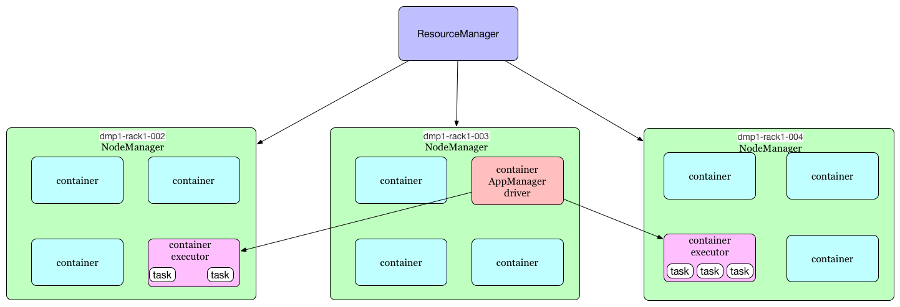
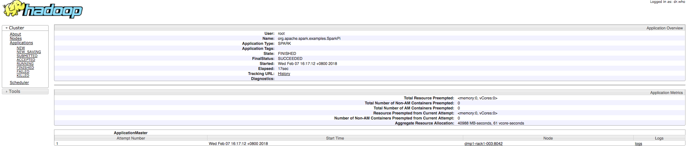
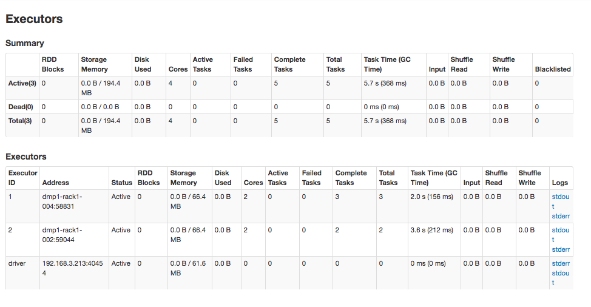
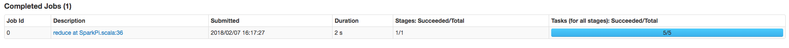
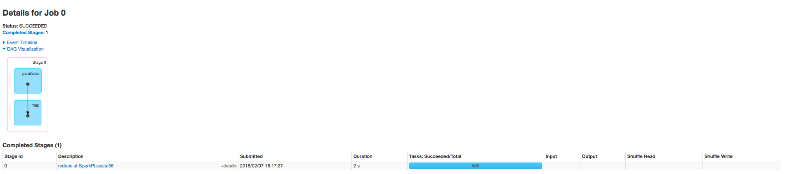
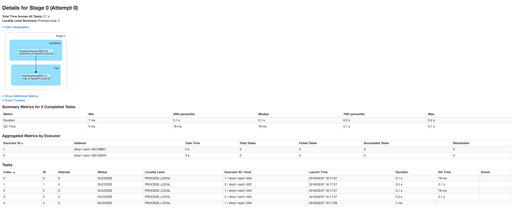
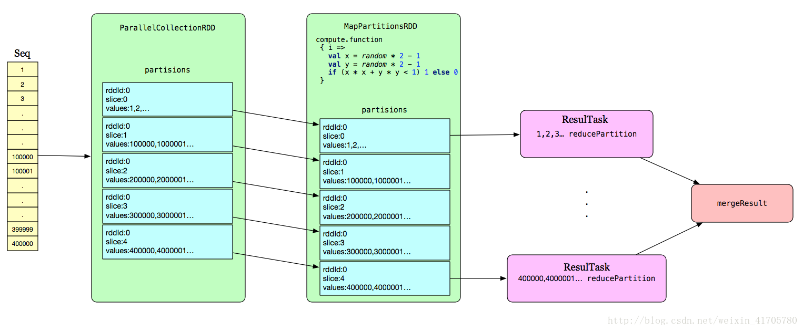

# spark core源码阅读-提交作业(三)

##通过例子了解spark提交执行流程
下面是spark计算PI,通过蒙特卡洛算法:
`在一个边长为a的正方形内一均匀概率随机投点，该点落在此正方形的内切圆中的概率即为内切圆与正方形的面积比值`
`即：Pi * (a / 2)^2 : a^2 = Pi / 4 = 落在圆中个数 / 总次数`

```scala
val count = spark
  .parallelize(1 until 500000L, 5)//对500000个次独立实验分5个task去执行
  .map { i =>
      val x = random * 2 - 1
      val y = random * 2 - 1
      if (x * x + y * y < 1) 1 else 0
    }//在圆内为1,其他为0
  .reduce(_ + _)//把所有圆内点计次
println("Pi is roughly " + 4.0 * count / 500000L)
```

**上面是一个很简单的分布式spark job, 首先我们看执行结果:**

- 1.提交spark作业,num-executors代表2个executor资源,5代表task数量:
```sh
[root@dmp1-rack1-004 ~]# spark-submit --class org.apache.spark.examples.SparkPi \
>     --master yarn-cluster \
>     --num-executors 2 \
>     --driver-memory 128M \
>     --executor-memory 128M \
>     --executor-cores 2 \
>    /opt/cloudera/parcels/CDH/lib/spark/lib/spark-examples.jar \
>     5
```

- 2.任务提交之后,ResourceManager从NodeManager找到一个container作为ApplicationMaster(AM),AM同时也是Driver,AM向RM请求2个资源作为executor,如下图:


- 3.在YARN资源管理UI中可以看到此Job


- 4.在spark UI中可以看到分配的executor


- 5.SparkUI中也描述此次Job执行情况:
Job粒度:


- 6.stage粒度,该Job只有一个Stage,如下图:


- 7.task粒度,此级别是spark中实际最细的执行单元,从下图我们可以很清晰的看到Executor ID_1一共跑了3个tasks共花了2s,Executor ID_2跑了2个task共花了4s


至此我们已经有一个大体的认识:

- 1.初始化SparkConf
- 2.初始化SparkContext
- 3.根据seq数据集,初始化ParallelCollectionRDD
- 4.Driver端通过RDD生成Partitions,把Job切分Stage,再通过partitions把stage转化成tasks,最后提交到task调度器,由调度器分配给Executor执行task
- 最后把Driver把task执行结果merge之后返回

逻辑上如下图:


