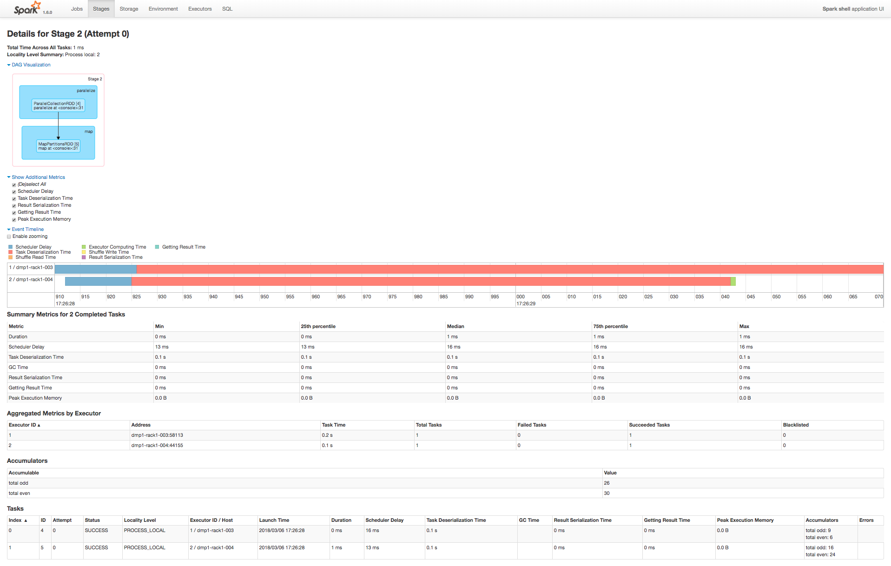
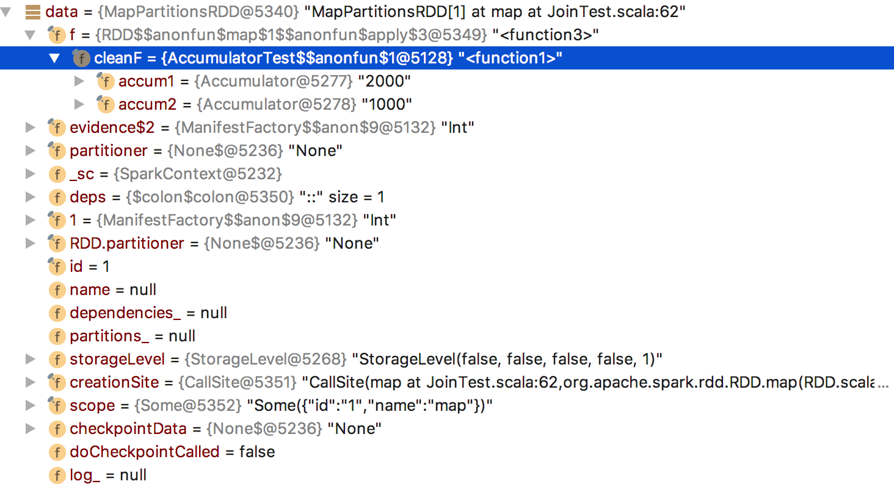

# spark-core源码阅读-累加器(十)

## 使用场景
累加器是一种支持并行只能`added`的特殊变量,常用来计次/求和,我们也可以自行定义新数据类型支持`added`
## 基本原理
累加器变量在每个task任务中依次`added`,把结果传到Driver端进行合并,所以这是分布式计算,只有driver端才能读取累加器最终值

## 先看一个例子
```scala
object AccumulatorTest {
  val conf = new SparkConf().setAppName("Spark Join")
  val sc = new SparkContext(conf)

  val accum1 = sc.accumulator(2000, "total even")
  val accum2 = sc.accumulator(1000, "total odd")
  val data = sc.parallelize(Array(1, 2, 3, 4, 5, 6, 7, 8, 9, 10), 2).map(x => {
    if (x % 2 == 0) accum1 += x
    else accum2 += x
    x
  })
  data.cache().distinct().count()
  //  data.foreach(println)
  //  data.foreach(accum += _)
  println(accum1.value)
  println(accum2.value)

  sc.stop()
}
```

例子中先通过`SparkContext.accumulator`初始化累加器,然后在MapPartitionsRDD-map中根据逻辑判断执行`added`操作

Spark UI图如下,其中Tasks-Accumulators展示了每个task不同类别累加值,Accumulators表展示该stage最终累加值


## 源码分析

### 抽象类`Accumulable`
```scala
class Accumulable[R, T] private[spark] (
    initialValue: R,
    param: AccumulableParam[R, T],
    val name: Option[String],
    internal: Boolean)
  extends Serializable {  
...
  @volatile @transient private var value_ : R = initialValue // Current value on master
  val zero = param.zero(initialValue)  // Zero value to be passed to workers
  private var deserialized = false

  Accumulators.register(this)  
...  
}
```

### 具体实现类`Accumulator`
```scala
class Accumulator[T] private[spark] (
    @transient private[spark] val initialValue: T,
    param: AccumulatorParam[T],
    name: Option[String],
    internal: Boolean)
  extends Accumulable
```
从上面可以看到`initialValue`/`value_`都是瞬时变量,不会被序列化

### AccumulatorParam
这里先举一种内部变量如`LongAccumulatorParam`,`AccumulatorParam`是可以扩展的,
主要实现`addInPlace`(added),`zero`(task中初始数据)两个方法

```scala
trait AccumulableParam[R, T] extends Serializable {
  /**
   * Add additional data to the accumulator value. Is allowed to modify and return `r`
   * for efficiency (to avoid allocating objects).
   *
   * @param r the current value of the accumulator
   * @param t the data to be added to the accumulator
   * @return the new value of the accumulator
   */
  def addAccumulator(r: R, t: T): R

  /**
   * Merge two accumulated values together. Is allowed to modify and return the first value
   * for efficiency (to avoid allocating objects).
   *
   * @param r1 one set of accumulated data
   * @param r2 another set of accumulated data
   * @return both data sets merged together
   */
  def addInPlace(r1: R, r2: R): R

  /**
   * Return the "zero" (identity) value for an accumulator type, given its initial value. For
   * example, if R was a vector of N dimensions, this would return a vector of N zeroes.
   */
  def zero(initialValue: R): R
}

trait AccumulatorParam[T] extends AccumulableParam[T, T] {
  def addAccumulator(t1: T, t2: T): T = {
    addInPlace(t1, t2)
  }
}
object AccumulatorParam {
...
  implicit object LongAccumulatorParam extends AccumulatorParam[Long] {
    def addInPlace(t1: Long, t2: Long): Long = t1 + t2
    def zero(initialValue: Long): Long = 0L
  }
...
}
```

## 逻辑分析
### 1.Driver端
(1).`SparkContext.accumulator`实例化,实际上调用`val acc = new Accumulator(initialValue, param, Some(name))`
(2).Accumulable中`Accumulators.register(this)`
  originals value是弱引用,意味着只要`register(a)`中a失去强引用,下一次gc,map中value就会被回收,最后在`ContextCleaner.doCleanupAccum`
  释放map中的key
```scala
private[spark] object Accumulators extends Logging {
...
  val originals = mutable.Map[Long, WeakReference[Accumulable[_, _]]]()
  
  def register(a: Accumulable[_, _]): Unit = synchronized {
    originals(a.id) = new WeakReference[Accumulable[_, _]](a)
  }
  
  def remove(accId: Long) {
    synchronized {
      originals.remove(accId)
    }
  }  
...
}
```
(3).`val data:MapPartitionsRDD`是由经过下面方法处理后得到,如下图所示
```scala
  def map[U: ClassTag](f: T => U): RDD[U] = withScope {
    val cleanF = sc.clean(f)
    new MapPartitionsRDD[U, T](this, (context, pid, iter) => iter.map(cleanF))
  }
```

这里我们发现`data`类型`MapPartitionsRDD`,`cleanF`是特质`Function1`的具体实现,不过多了两个成员变量accum1,accum2
(4).之前在'spark core源码阅读-Task介绍(六)'提到过Stage被序列化,然后broadcast出去,这里序列化stage就会包含rdd,
如`MapPartitionsRDD`会包含accum1,accum2即Accumulator类,经过Accumulator结构分析,value值不会传输

### 2.分布式计算
executor端

(1).`Task.runTask`反序列化RDD

```scala
    val (rdd, func) = ser.deserialize[(RDD[T], (TaskContext, Iterator[T]) => U)](
      ByteBuffer.wrap(taskBinary.value), Thread.currentThread.getContextClassLoader)
```


(2).上述`MapPartitionsRDD`反序列化时包含`Accumulator`,`taskContext.registerAccumulator(this)`注册累加器变量
```scala
private[spark] object Accumulators extends Logging {
  private def readObject(in: ObjectInputStream): Unit = Utils.tryOrIOException {
    in.defaultReadObject()
    value_ = zero
    deserialized = true
    // Automatically register the accumulator when it is deserialized with the task closure.
    //
    // Note internal accumulators sent with task are deserialized before the TaskContext is created
    // and are registered in the TaskContext constructor. Other internal accumulators, such SQL
    // metrics, still need to register here.
    val taskContext = TaskContext.get()
    if (taskContext != null) {
      taskContext.registerAccumulator(this)
    }
  }
}
```
taskContext实现类
```scala
private[spark] class TaskContextImpl(
    val stageId: Int,
    val partitionId: Int,
    override val taskAttemptId: Long,
    override val attemptNumber: Int,
    override val taskMemoryManager: TaskMemoryManager,
    @transient private val metricsSystem: MetricsSystem,
    internalAccumulators: Seq[Accumulator[Long]],
    val runningLocally: Boolean = false,
    val taskMetrics: TaskMetrics = TaskMetrics.empty)
  extends TaskContext
  with Logging {
...
  @transient private val accumulators = new HashMap[Long, Accumulable[_, _]]

  private[spark] override def registerAccumulator(a: Accumulable[_, _]): Unit = synchronized {
    accumulators(a.id) = a
  }
...
  private[spark] override def collectAccumulators(): Map[Long, Any] = synchronized {
    accumulators.mapValues(_.localValue).toMap
  }
...
}
```
(3).Accumulable再反序列化时,构造zero,即执行`AccumulableParam.zero`方法,`Accumulators.readObject`会把zero赋值
Accumulable.value_

```scala
class Accumulable[R, T] private[spark] (
    initialValue: R,
    param: AccumulableParam[R, T],
    val name: Option[String],
    internal: Boolean)
  extends Serializable {  
...
  @volatile @transient private var value_ : R = initialValue // Current value on master
  val zero = param.zero(initialValue)  // Zero value to be passed to workers
  private var deserialized = false

  Accumulators.register(this)  
...  
}
```

### 3.Driver最终合并累加器变量
(1)task执行完成之后向Driver端发送`CompletionEvent`事件,从而执行`handleTaskCompletion`,在每种task逻辑中都会执行
`updateAccumulators(event)`
```scala
  private def updateAccumulators(event: CompletionEvent): Unit = {
    val task = event.task
    val stage = stageIdToStage(task.stageId)
    if (event.accumUpdates != null) {
      try {
        Accumulators.add(event.accumUpdates)

        event.accumUpdates.foreach { case (id, partialValue) =>
          // In this instance, although the reference in Accumulators.originals is a WeakRef,
          // it's guaranteed to exist since the event.accumUpdates Map exists

          val acc = Accumulators.originals(id).get match {
            case Some(accum) => accum.asInstanceOf[Accumulable[Any, Any]]
            case None => throw new NullPointerException("Non-existent reference to Accumulator")
          }

          // To avoid UI cruft, ignore cases where value wasn't updated
          if (acc.name.isDefined && partialValue != acc.zero) {
            val name = acc.name.get
            val value = s"${acc.value}"
            stage.latestInfo.accumulables(id) =
              new AccumulableInfo(id, name, None, value, acc.isInternal)
            event.taskInfo.accumulables +=
              new AccumulableInfo(id, name, Some(s"$partialValue"), value, acc.isInternal)
          }
        }
      } catch {
        // If we see an exception during accumulator update, just log the
        // error and move on.
        case e: Exception =>
          logError(s"Failed to update accumulators for $task", e)
      }
    }
  }
```

(2)`Accumulators.add`中把初始值与task执行完的数据合并
```scala
  def add(values: Map[Long, Any]): Unit = synchronized {
    for ((id, value) <- values) {
      if (originals.contains(id)) {
        // Since we are now storing weak references, we must check whether the underlying data
        // is valid.
        originals(id).get match {
          case Some(accum) => accum.asInstanceOf[Accumulable[Any, Any]] ++= value
          case None =>
            throw new IllegalAccessError("Attempted to access garbage collected Accumulator.")
        }
      } else {
        logWarning(s"Ignoring accumulator update for unknown accumulator id $id")
      }
    }
  }
```

(4)所有该stage中所有的tasks执行完成,则该stage中的累加器变量就是最终变量

## 注意
如果如果stage被执行2次(如上例中`data.count`两次),则每个task中的数据会被重复计算,stage1<-stage2|stage1<-stage3,
如果累加器在stage1中,如果每个流程job只被执行一次,则数据正确不会重复

## Custom AccumulatorParam

```scala
object VectorAccumulatorParam extends AccumulatorParam[Vector] {
  def zero(initialValue: Vector): Vector = {
    Vector.zeros(initialValue.size)
  }
  def addInPlace(v1: Vector, v2: Vector): Vector = {
    v1 += v2
  }
}

// Then, create an Accumulator of this type:
val vecAccum = sc.accumulator(new Vector(...))(VectorAccumulatorParam)
```

## 参考
- https://cloud.tencent.com/developer/article/1032527