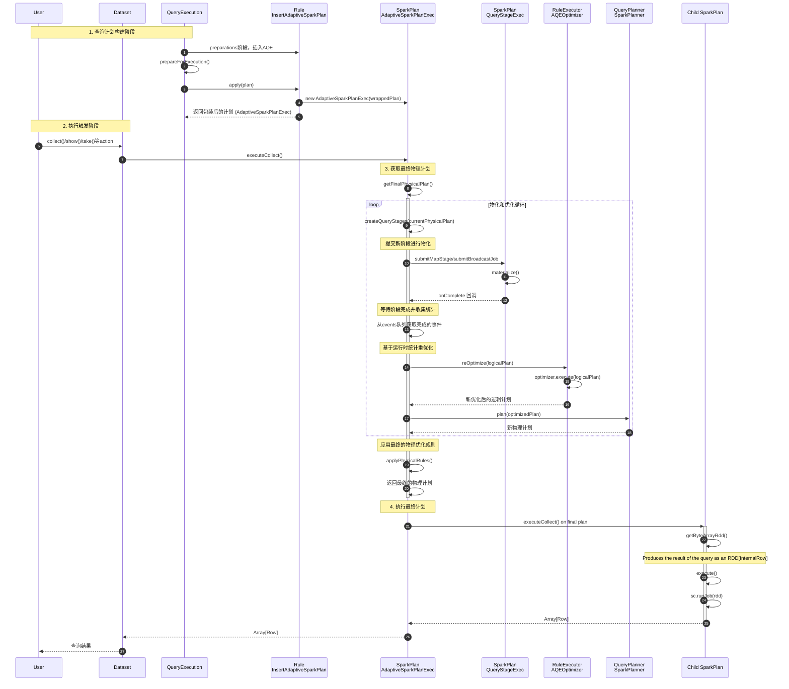
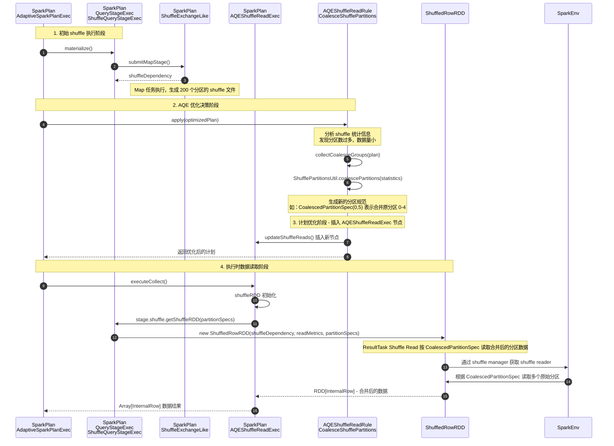
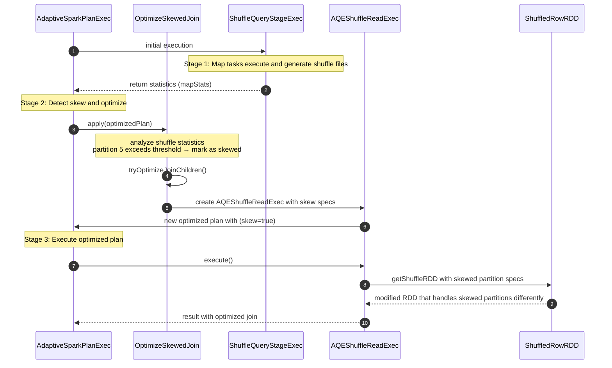
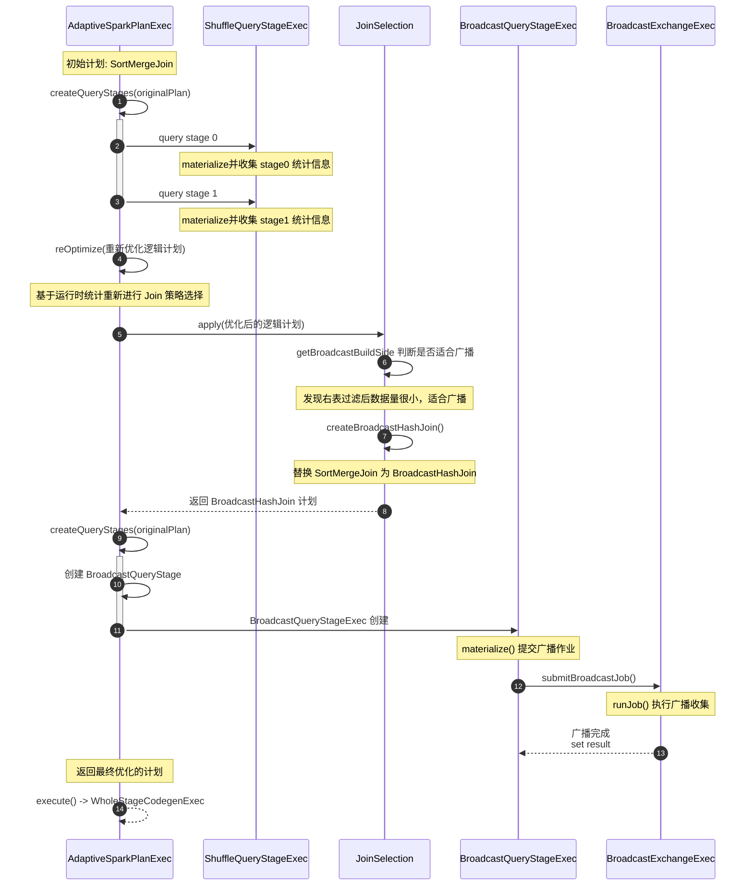
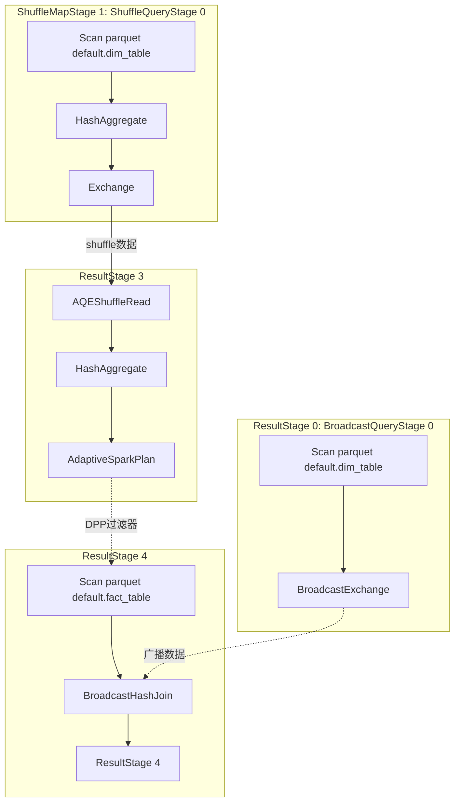
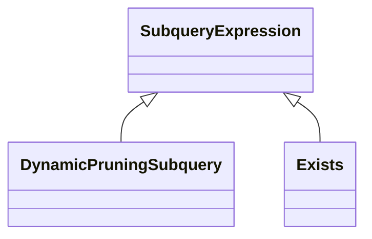

# AQE
Adaptive Query Execution (AQE) - AdaptiveSparkPlanExec(SparkPlan) 利用运行时统计信息来选择最高效的查询执行计划，
主要包含以下优化：
- Coalescing Post Shuffle Partitions
- Optimizing Skew Join
- Converting sort-merge join to broadcast join
- Converting sort-merge join to shuffled hash join
- Splitting skewed shuffle partitions: OptimizeSkewInRebalancePartitions
- optimize the shuffle read to local read: OptimizeShuffleWithLocalRead
- Dynamic Partition Pruning(DPP) 优化动态分区裁剪 - PlanAdaptiveDynamicPruningFilters

## Overview
  ```scala
  sql("SET spark.sql.adaptive.enabled = true")
  sql("SET spark.sql.shuffle.partitions = 2")
  sql("drop table if exists t1")
  sql("drop table if exists t2")
  spark.range(1, 21, 1, 10).selectExpr("id AS id", "CONCAT('name', id) AS name",) .createOrReplaceTempView("t1")
  spark.range(1, 21, 1, 10).selectExpr("id * 2 AS id", "id AS value",) .createOrReplaceTempView("t2")

  val df = sql(
  """
    |SELECT t1.id, t1.name, t2.value
    |FROM t1
    |JOIN t2
    |ON t1.id = t2.id
    |where t2.value > 5
    |""".stripMargin)
  df.show()
  ```
* [SMJ DAG img](asset/smj-AQE.png)
* [execution log](asset/join-AQE.log)

AQE 整体流程


## CoalesceShufflePartitions

此功能会根据映射输出统计信息合并后置洗牌分区，简化了运行查询时对洗牌分区数量的调优。
你无需设置合适的洗牌分区数量以适配数据集，在运行时选择合适的洗牌分区数量：
1. 提交submitMapStage，等待任务完成
2. Map 任务执行，产生 200 个分区的 shuffle 文件
3. 在运行rule时发现数据量很小，200 个分区导致过多的小任务
4. 分区合并：创建 CoalescedPartitionSpec 指定如何合并读取
5. 创建AQEShuffleReadExec




optimise plan:
```text
optimizeQueryStage - org.apache.spark.sql.execution.adaptive.CoalesceShufflePartitions => old【
CollectLimit 21
+- Project [cast(id#0 as string) AS id#14, name#1, cast(value#4 as string) AS value#16]
   +- SortMergeJoin [id#0], [id#3], Inner
      :- Sort [id#0 ASC NULLS FIRST], false, 0
      :  +- ShuffleQueryStage 0
      :     +- Exchange hashpartitioning(id#0, 200), ENSURE_REQUIREMENTS, [plan_id=51]
      :        +- *(1) Project [id#0, name#1]
      :           +- *(1) Filter isnotnull(id#0)
      :              +- *(1) ColumnarToRow
      :                 +- FileScan parquet default.t1[id#0,name#1,date#2] Batched: true, DataFilters: [isnotnull(id#0)], Format: Parquet, Location: CatalogFileIndex(1 paths)[file:/Users/juntao/src/github.com/apache/spark-v3.3.1-study/spark-wareh..., PartitionFilters: [], PushedFilters: [IsNotNull(id)], ReadSchema: struct<id:int,name:string>
      +- Sort [id#3 ASC NULLS FIRST], false, 0
         +- ShuffleQueryStage 1
            +- Exchange hashpartitioning(id#3, 200), ENSURE_REQUIREMENTS, [plan_id=79]
               +- *(2) Project [id#3, value#4]
                  +- *(2) Filter ((isnotnull(value#4) AND (value#4 > 1)) AND isnotnull(id#3))
                     +- *(2) ColumnarToRow
                        +- FileScan parquet default.t2[id#3,value#4,date#5] Batched: true, DataFilters: [isnotnull(value#4), (value#4 > 1), isnotnull(id#3)], Format: Parquet, Location: CatalogFileIndex(1 paths)[file:/Users/juntao/src/github.com/apache/spark-v3.3.1-study/spark-wareh..., PartitionFilters: [], PushedFilters: [IsNotNull(value), GreaterThan(value,1), IsNotNull(id)], ReadSchema: struct<id:int,value:int>
】AQE ==> new【
CollectLimit 21
+- Project [cast(id#0 as string) AS id#14, name#1, cast(value#4 as string) AS value#16]
   +- SortMergeJoin [id#0], [id#3], Inner
      :- Sort [id#0 ASC NULLS FIRST], false, 0
      :  +- AQEShuffleRead coalesced
      :     +- ShuffleQueryStage 0
      :        +- Exchange hashpartitioning(id#0, 200), ENSURE_REQUIREMENTS, [plan_id=51]
      :           +- *(1) Project [id#0, name#1]
      :              +- *(1) Filter isnotnull(id#0)
      :                 +- *(1) ColumnarToRow
      :                    +- FileScan parquet default.t1[id#0,name#1,date#2] Batched: true, DataFilters: [isnotnull(id#0)], Format: Parquet, Location: CatalogFileIndex(1 paths)[file:/Users/juntao/src/github.com/apache/spark-v3.3.1-study/spark-wareh..., PartitionFilters: [], PushedFilters: [IsNotNull(id)], ReadSchema: struct<id:int,name:string>
      +- Sort [id#3 ASC NULLS FIRST], false, 0
         +- AQEShuffleRead coalesced
            +- ShuffleQueryStage 1
               +- Exchange hashpartitioning(id#3, 200), ENSURE_REQUIREMENTS, [plan_id=79]
                  +- *(2) Project [id#3, value#4]
                     +- *(2) Filter ((isnotnull(value#4) AND (value#4 > 1)) AND isnotnull(id#3))
                        +- *(2) ColumnarToRow
                           +- FileScan parquet default.t2[id#3,value#4,date#5] Batched: true, DataFilters: [isnotnull(value#4), (value#4 > 1), isnotnull(id#3)], Format: Parquet, Location: CatalogFileIndex(1 paths)[file:/Users/juntao/src/github.com/apache/spark-v3.3.1-study/spark-wareh..., PartitionFilters: [], PushedFilters: [IsNotNull(value), GreaterThan(value,1), IsNotNull(id)], ReadSchema: struct<id:int,value:int>
】
```

## OptimizeSkewedJoin
[Example Code](https://github.com/juntaozhang/spark/blob/v3.3.1-study/examples/src/test/scala/cn/juntaozhang/example/spark/SortMergeJoinSpec.scala#L147):
```scala
spark
  .range(0, 1000, 1, 10)
  .selectExpr("id % 3 as key1", "id as value1")
  .createOrReplaceTempView("skewData1")
spark
  .range(0, 1000, 1, 10)
  .selectExpr("id % 1 as key2", "id as value2")
  .createOrReplaceTempView("skewData2")
sql("SET spark.sql.adaptive.enabled = true")
sql("SET spark.sql.autoBroadcastJoinThreshold = -1")
sql("SET spark.sql.adaptive.optimize.skewsInRebalancePartitions.enabled = false")
sql("SET spark.sql.adaptive.skewJoin.skewedPartitionThresholdInBytes = 2k")
sql("SET spark.sql.adaptive.advisoryPartitionSizeInBytes = 2k")      
sql("SET spark.sql.adaptive.coalescePartitions.minPartitionNum = 1") 
sql("SET spark.sql.shuffle.partitions = 10")                         
sql("SET spark.sql.adaptive.forceOptimizeSkewedJoin = true")
sql(
  """
    |SELECT key1
    |      ,value1
    |      ,key2
    |      ,value2
    |FROM skewData1
    |JOIN skewData2 ON key1 = key2
    |""".stripMargin).write.mode(SaveMode.Overwrite).saveAsTable("skewDataJoin")

```
table stat:
```text
skewData1:                 
+----+--------+            skewData2:                   skewDataJoin:    
|key1|count(1)|            +----+--------+              +----+--------+  
+----+--------+            |key2|count(1)|              |key1|count(1)|  
|   0|     334|            +----+--------+              +----+--------+  
|   2|     333|            |   0|    1000|              |   0|  334000|  
|   1|     333|            +----+--------+              +----+--------+  
+----+--------+ 
```

Rule apply overview:


Rule(OptimizeSkewedJoin)执行前后plan变化情况：
```text
org.apache.spark.sql.execution.adaptive.AdaptiveSparkPlanExec$ - applyPhysicalRules - org.apache.spark.sql.execution.adaptive.OptimizeSkewedJoin -->【
SortMergeJoin [key1#2L], [key2#8L], Inner
:- Sort [key1#2L ASC NULLS FIRST], false, 0
:  +- ShuffleQueryStage 0
:     +- Exchange hashpartitioning(key1#2L, 10), ENSURE_REQUIREMENTS, [plan_id=86]
:        +- *(1) Project [(id#0L % 3) AS key1#2L, id#0L AS value1#3L]
:           +- *(1) Filter isnotnull((id#0L % 3))
:              +- *(1) Range (0, 1000, step=1, splits=10)
+- Sort [key2#8L ASC NULLS FIRST], false, 0
   +- ShuffleQueryStage 1
      +- Exchange hashpartitioning(key2#8L, 10), ENSURE_REQUIREMENTS, [plan_id=100]
         +- *(2) Project [(id#6L % 1) AS key2#8L, id#6L AS value2#9L]
            +- *(2) Filter isnotnull((id#6L % 1))
               +- *(2) Range (0, 1000, step=1, splits=10)
】AQE --> 【
SortMergeJoin(skew=true) [key1#2L], [key2#8L], Inner
:- Sort [key1#2L ASC NULLS FIRST], false, 0
:  +- AQEShuffleRead skewed
:     +- ShuffleQueryStage 0
:        +- Exchange hashpartitioning(key1#2L, 10), ENSURE_REQUIREMENTS, [plan_id=86]
:           +- *(1) Project [(id#0L % 3) AS key1#2L, id#0L AS value1#3L]
:              +- *(1) Filter isnotnull((id#0L % 3))
:                 +- *(1) Range (0, 1000, step=1, splits=10)
+- Sort [key2#8L ASC NULLS FIRST], false, 0
   +- AQEShuffleRead skewed
      +- ShuffleQueryStage 1
         +- Exchange hashpartitioning(key2#8L, 10), ENSURE_REQUIREMENTS, [plan_id=100]
            +- *(2) Project [(id#6L % 1) AS key2#8L, id#6L AS value2#9L]
               +- *(2) Filter isnotnull((id#6L % 1))
                  +- *(2) Range (0, 1000, step=1, splits=10)
】

```

`OptimizeSkewedJoin.tryOptimizeJoinChildren`, 经过shuffle write, 根据shuffle partitions=10, 生成对应的shuffle block stat:
```text
        partition block index   :[ 0, 1, 2, 3, 4, 5,    6, 7, 8,    9    ]   
left:  shuffle 0, partition stat:[ 0, 0, 0, 0, 0, 2420, 0, 0, 2809, 2809 ]
right: shuffle 1, partition stat:[ 0, 0, 0, 0, 0, 6292, 0, 0, 0,    0    ]
```

根据执行计划：
- 左侧表 (shuffle 0)：partition 8，9 存在倾斜
- 右侧表 (shuffle 1)：partition 5 存在倾斜

两个表分别有10个分区，上述三个倾斜partition具体对应这两个表 shuffle write 的数据统计：
```
                        map idx : [ 0,   1,   2,   3,   4,   5,   6,   7,   8,   9   ]
shuffle 0, partition 5, map stat: [ 368, 228, 228, 228, 228, 228, 228, 228, 228, 228 ]
shuffle 1, partition 5, map stat: [ 955, 593, 593, 593, 593, 593, 593, 593, 593, 593 ]

shuffle 0, partition 8, map stat: [ 405, 405, 334, 228, 228, 251, 228, 251, 251, 228 ]
shuffle 1, partition 8, map stat: [ 0, 0, 0, 0, 0, 0, 0, 0, 0, 0 ]

shuffle 0, partition 9, map stat: [ 405, 405, 334, 228, 251, 251, 228, 251, 228, 228 ]
shuffle 1, partition 9, map stat: [ 0, 0, 0, 0, 0, 0, 0, 0, 0, 0 ]
```

| 序号 | leftSidePartitions                       | rightSidePartitions                       |
|------|------------------------------------------|------------------------------------------|
| 1    | CoalescedPartitionSpec(0,1,Some(0))      | CoalescedPartitionSpec(0,1,Some(0))      |
| 2    | CoalescedPartitionSpec(1,2,Some(0))      | CoalescedPartitionSpec(1,2,Some(0))      |
| 3    | CoalescedPartitionSpec(2,3,Some(0))      | CoalescedPartitionSpec(2,3,Some(0))      |
| 4    | CoalescedPartitionSpec(3,4,Some(0))      | CoalescedPartitionSpec(3,4,Some(0))      |
| 5    | CoalescedPartitionSpec(4,5,Some(0))      | CoalescedPartitionSpec(4,5,Some(0))      |
| 6    | CoalescedPartitionSpec(5,6,Some(2420))   | PartialReducerPartitionSpec(5,0,2,1548)  |
| 7    | CoalescedPartitionSpec(5,6,Some(2420))   | PartialReducerPartitionSpec(5,2,5,1779)  |
| 8    | CoalescedPartitionSpec(5,6,Some(2420))   | PartialReducerPartitionSpec(5,5,8,1779)  |
| 9    | CoalescedPartitionSpec(5,6,Some(2420))   | PartialReducerPartitionSpec(5,8,10,1186) |
| 10   | CoalescedPartitionSpec(6,7,Some(0))      | CoalescedPartitionSpec(6,7,Some(0))      |
| 11   | CoalescedPartitionSpec(7,8,Some(0))      | CoalescedPartitionSpec(7,8,Some(0))      |
| 12   | PartialReducerPartitionSpec(8,0,6,1851)  | CoalescedPartitionSpec(8,9,Some(0))      |
| 13   | PartialReducerPartitionSpec(8,6,10,958)  | CoalescedPartitionSpec(8,9,Some(0))      |
| 14   | PartialReducerPartitionSpec(9,0,6,1874)  | CoalescedPartitionSpec(9,10,Some(0))     |
| 15   | PartialReducerPartitionSpec(9,6,10,935)  | CoalescedPartitionSpec(9,10,Some(0))     |

序号 6-9 为倾斜处理结果：
- 左侧表 (shuffle 0, partition 5)
   - 原始：partition 5 有 2420 字节数据
   - 阈值计算：avg_bytes = 2024, threshold = 2024 × 1.2 = 2428.8
   - 比较：2420 < 2428.8 → 未超过极端倾斜阈值
   - 处理策略：**数据复制** - 将完整的 2420 字节数据复制到 4 个不同的 reduce 任务
   - 结果：[2420, 2420, 2420, 2420] ← 每个任务都持有完整数据副本
- 右侧表 (shuffle 1, partition 5)
   - 原始：partition 5 有 6292 字节数据
   - map 任务分布：[955, 593, 593, 593, 593, 593, 593, 593, 593, 593] (共10个map任务)
   - 处理策略：**数据切分** - 按 map 任务边界切分为 4 个较小的分区
   - 切分结果：
      - 第1部分：map任务 0-1 (955+593=1548 bytes)
      - 第2部分：map任务 2-4 (593+593+593=1779 bytes)
      - 第3部分：map任务 5-7 (593+593+593=1779 bytes)
      - 第4部分：map任务 8-9 (593+593=1186 bytes)
   - 最终：[1548, 1779, 1779, 1186] ← 将大分区切分成4个较小分区

同理处理结果如序列12, 13 与 14, 15

### OptimizeSkewed 失效
#### 倾斜数据来自于上游的同一个 Mapper
当倾斜分区的绝大部分数据集中在上游单个 Mapper 的单个 Block 时，AQE 的 OptimizeSkewedJoin 规则会失效 —— 因为 Spark 的 Shuffle 读取机制是 “要么读取整个 Mapper Block，要么不读”，无法只读取 Block 的一部分数据，导致倾斜分区无法被拆分。

场景 A:
```text
  left_table                                     right_table（skew table，全部来自 mapId=1）
  ┌────┬───────┬────────┐                        ┌────┬───────┬────────┐
  │ key│ value │ map id │                        │ key│ value │ map id │
  ├────┼───────┼────────┤                        ├────┼───────┼────────┤
  │  1 │   A   │   1    │                        │  1 │  A1   │   1    │  ┐
  └────┴───────┴────────┘                        │  1 │  A2   │   1    │  │ 
                                                 │  1 │  A3   │   1    │  │ 同一个block─1─0
                                                 │  1 │  A4   │   1    │  │ 
                                                 └────┴───────┴────────┘  ┘

  Mapper1产出文件：
    ┌───────────────────────────────────────┐
    │ Block for key=1                       │
    │ - left:  (1,A)                        │
    │ - right: (1,A1),(1,A2),(1,A3),(1,A4)  │ ← 单个不可拆分的Block
    └───────────────────────────────────────┘
```
场景 B:
```
  left_table                                     right_table（skew table，来自 2 个 Mapper）
  ┌────┬───────┬────────┐                        ┌────┬───────┬────────┐
  │ key│ value │ map id │                        │ key│ value │ map id │
  ├────┼───────┼────────┤                        ├────┼───────┼────────┤
  │  1 │   A   │   1    │                        │  1 │  A1   │   1    │  ┐ 属于 block─1─0
  └────┴───────┴────────┘                        │  1 │  A2   │   1    │  ┘ 
                                                 │  1 │  A3   │   2    │  ┐ 属于 block─2─0
                                                 │  1 │  A4   │   2    │  ┘ 
                                                 └────┴───────┴────────┘
  Mapper1产出文件：
    ┌─────────────────────────────┐
    │ Block1 for key=1            │
    │ - left:  (1,A)              │
    │ - right: (1,A1),(1,A2)      │ ← block-1-0
    └─────────────────────────────┘
  Mapper2产出文件：
    ┌─────────────────────────────┐
    │ Block1 for key=1            │
    │ - left:  (1,A)              │
    │ - right: (1,A3),(1,A4)      │ ← block-2-0
    └─────────────────────────────┘
```
结论:

| 场景    | Block分布 | 拆分可能性 | 原因 |
  |-------|-----------|------------|------|
| 场景A | 单个Mapper单个Block | ❌ 无法拆分 | Block是原子单位，无法内部拆分 |
| 场景B | 多个Mapper多个Block | ✅ 可以拆分 | 可按Block或Mapper维度拆分 |


#### FilePartition 合并的多个小文件之后视为一个逻辑单元，无法拆分

在 FilePartition.getFilePartitions()，FilePartition 的文件合并通过以下配置参数控制：
- `spark.sql.files.maxPartitionBytes`（默认 128MB）：每个 FilePartition 的最大字节数
- `spark.sql.files.openCostInBytes`（默认 4MB）：每个文件的打开成本估算

对倾斜处理的间接影响，当小文件被 FilePartition 合并到单个 map 任务中时，会产生以下影响：
- 通过 FilePartition 合并的多个小文件被当作一个逻辑单元处理
- 这些文件在 map 阶段生成的数据被视为一个整体
- AQE 在后续的 CoalesceShufflePartitions 或 OptimizeSkewedJoin 阶段无法再分割这些已经被合并的 map 任务

#### LeftOuter only support split left skew side
Left Outer Join：必须保留左表所有行，右表可以为 null

LeftOuter为什么不能split right呢？ 假设可以：
```text
left_table:                                   right_table (skew table):            
+----+-------+-----------+                    +----+-------+-----------+    
| key| value | partition |                    | key| value | partition |    
+----+-------+-----------+                    +----+-------+-----------+    
|  1 |   A   |   1       |                    |  1 |  A_1  |   1       |    
|  2 |   B   |   1       |                    |  1 |  A_2  |   1       |    
+----+-------+-----------+                    |  1 |  A_3  |   1       |    
                                              +----+-------+-----------+    

LeftOuter Join 正确结果
+----+-------+-------+
| key|value_l|value_r|
+----+-------+-------+
|  1 |   A   |  A_1  |
|  1 |   A   |  A_2  |
|  1 |   A   |  A_3  |
|  2 |   B   |  NULL |
+----+-------+-------+
```

split right table 
```text
left_table:                              right_table1:                        left JOIN right_table1             拼接后结果:  
+----+-------+-----------+               +----+-------+-----------+           +----+-------+-------+             +----+-------+-------+   
| key| value | partition | -------┬----> | key| value | partition | --------> | key|value_l|value_r| ------┬---> | key|value_l|value_r|   
+----+-------+-----------+        |      +----+-------+-----------+           +----+-------+-------+       |     +----+-------+-------+   
|  1 |   A   |   1       |        |      |  1 |  A_1  |   1       |           |  1 |   A   |  A_1  |       |     |  1 |   A   |  A_1  |   
|  2 |   B   |   1       |        |      |  1 |  A_2  |   1       |           |  1 |   A   |  A_2  |       |     |  1 |   A   |  A_2  |   
+----+-------+-----------+        |      +----+-------+-----------+           |  2 |   B   |  NULL |       |     |* 2 |   B   |  NULL |   
                                  |                                           +----+-------+-------+       |     |  1 |   A   |  A_3  |   
                                  |                                                                        |     |* 2 |   B   |  NULL |   
                                  |                                                                        |     +----+-------+-------+   
                                  |      right_table2:                        left JOIN right_table2       |                              
                                  |      +----+-------+-----------+           +----+-------+-------+       |                              
                                  └----> | key| value | partition | --------> | key|value_l|value_r| ------┘                           
                                         +----+-------+-----------+           +----+-------+-------+                                      
                                         |  1 |  A_3  |   1       |           |  1 |   A   |  A_3  |                                      
                                         +----+-------+-----------+           |  2 |   B   |  NULL |                                      
                                                                              +----+-------+-------+         
```
拼接后结果 `*`标识出异常行，可见 LeftOuter split right 破坏了原本的语义。

为了保持语义，其他情况如下：

| Join 类型         | canSplitLeftSide | canSplitRightSide | 说明         |
|-------------------|------------------|-------------------|-------------|
| Inner             | ✅ TRUE          | ✅ TRUE           | 两边都可拆分 |
| Cross             | ✅ TRUE          | ✅ TRUE           | 两边都可拆分 |
| LeftOuter         | ✅ TRUE          | ❌ FALSE          | 只能拆分左表 |
| RightOuter        | ❌ FALSE         | ✅ TRUE           | 只能拆分右表 |
| LeftSemi/LeftAnti | ✅ TRUE          | ❌ FALSE          | 只能拆分左表 |


## BroadcastHashJoinExec
Example code:
```scala
val df1 = spark.range(0, 1000000, 1, 47).selectExpr("id as key", "rand() as value1")
df1.createOrReplaceTempView("t1")

val df2 = spark.range(0, 1000000, 1, 49).select($"id".as("key"), rand().as("value2"))
df2.createOrReplaceTempView("t2")

sql("SET spark.sql.adaptive.enabled = true")
sql("SET spark.sql.adaptive.optimize.skewsInRebalancePartitions.enabled = true")
sql("SET spark.sql.adaptive.skewJoin.skewedPartitionThresholdInBytes = 512")
sql("SET spark.sql.adaptive.advisoryPartitionSizeInBytes = 512")
sql("SET spark.sql.adaptive.coalescePartitions.minPartitionNum = 1") // 最小分区数
sql("SET spark.sql.shuffle.partitions = 50")

sql(
  """
    |SELECT
    |  t1.key,
    |  t1.value1,
    |  t2.value2
    |FROM t1 join t2 ON t1.key = t2.key
    |WHERE t2.value2 < 0.001
    |""".stripMargin).write.mode(SaveMode.Overwrite).saveAsTable("t3")
```

Overview


初始计划为 SortMergeJoin
```text
Project [key#11L, value1#12, value2#18]
+- SortMergeJoin [key#11L], [key#17L], Inner
   :- Sort [key#11L ASC NULLS FIRST], false, 0
   :  +- Exchange hashpartitioning(key#11L, 50), ENSURE_REQUIREMENTS, [plan_id=66]
   :     +- Project [id#9L AS key#11L, rand(-6026619321627979221) AS value1#12]
   :        +- Range (0, 1000000, step=1, splits=47)
   +- Sort [key#17L ASC NULLS FIRST], false, 0
      +- Exchange hashpartitioning(key#17L, 50), ENSURE_REQUIREMENTS, [plan_id=67]
         +- Filter (value2#18 < 0.001)
            +- Project [id#15L AS key#17L, rand(-2020818180472969953) AS value2#18]
               +- Range (0, 1000000, step=1, splits=49)
```

左右表Shuffle Query Stage 物化阶段，运行时统计收集
```
Materialize query stage ShuffleQueryStageExec: 0
org.apache.spark.sql.execution.adaptive.AdaptiveSparkPlanExec$ final result ==>【
Exchange hashpartitioning(key#11L, 50), ENSURE_REQUIREMENTS, [plan_id=66]
+- Project [id#9L AS key#11L, rand(-6026619321627979221) AS value1#12]
   +- Range (0, 1000000, step=1, splits=47)
】AQE ==> 【
Exchange hashpartitioning(key#11L, 50), ENSURE_REQUIREMENTS, [plan_id=79]
+- *(1) Project [id#9L AS key#11L, rand(-6026619321627979221) AS value1#12]
   +- *(1) Range (0, 1000000, step=1, splits=47)
】

Materialize query stage ShuffleQueryStageExec: 1
org.apache.spark.sql.execution.adaptive.AdaptiveSparkPlanExec$ final result ==>【
Exchange hashpartitioning(key#17L, 50), ENSURE_REQUIREMENTS, [plan_id=67]
+- Filter (value2#18 < 0.001)
   +- Project [id#15L AS key#17L, rand(-2020818180472969953) AS value2#18]
      +- Range (0, 1000000, step=1, splits=49)
】AQE ==> 【
Exchange hashpartitioning(key#17L, 50), ENSURE_REQUIREMENTS, [plan_id=93]
+- *(2) Filter (value2#18 < 0.001)
   +- *(2) Project [id#15L AS key#17L, rand(-2020818180472969953) AS value2#18]
      +- *(2) Range (0, 1000000, step=1, splits=49)
】

```

根据物化后的统计数据 reOptimize
```
SparkStrategies$JoinSelection$ -->【
Join Inner, (key#11L = key#17L)
:- LogicalQueryStage Project [id#9L AS key#11L, rand(-6026619321627979221) AS value1#12], ShuffleQueryStage 0
+- LogicalQueryStage Filter (value2#18 < 0.001), ShuffleQueryStage 1
】 --> 【
BroadcastHashJoin [key#11L], [key#17L], Inner, BuildRight, false
:- PlanLater LogicalQueryStage Project [id#9L AS key#11L, rand(-6026619321627979221) AS value1#12], ShuffleQueryStage 0
+- PlanLater LogicalQueryStage Filter (value2#18 < 0.001), ShuffleQueryStage 1
】
```
`JoinSelection.createBroadcastHashJoin`, `getBroadcastBuildSide` 检测到右表数据量很小

AQE 阶段性优化后的plan：
```
Project [key#11L, value1#12, value2#18]
+- BroadcastHashJoin [key#11L], [key#17L], Inner, BuildRight, false
   :- ShuffleQueryStage 0
   :  +- Exchange hashpartitioning(key#11L, 50), ENSURE_REQUIREMENTS, [plan_id=79]
   :     +- *(1) Project [id#9L AS key#11L, rand(553926440727702417) AS value1#12]
   :        +- *(1) Range (0, 1000000, step=1, splits=47)
   +- BroadcastQueryStage 2
      +- BroadcastExchange HashedRelationBroadcastMode(List(input[0, bigint, false]),false), [plan_id=132]
         +- AQEShuffleRead local
            +- ShuffleQueryStage 1
               +- Exchange hashpartitioning(key#17L, 50), ENSURE_REQUIREMENTS, [plan_id=93]
                  +- *(2) Filter (value2#18 < 0.001)
                     +- *(2) Project [id#15L AS key#17L, rand(-8822450415916805176) AS value2#18]
                        +- *(2) Range (0, 1000000, step=1, splits=49)
```

创建广播查询阶段，createQueryStages BroadcastQueryStageExec
```
Materialize query stage BroadcastQueryStageExec: 2
BroadcastQueryStage 2
+- BroadcastExchange HashedRelationBroadcastMode(List(input[0, bigint, false]),false), [plan_id=130]
   +- AQEShuffleRead local
      +- ShuffleQueryStage 1
         +- Exchange hashpartitioning(key#17L, 50), ENSURE_REQUIREMENTS, [plan_id=93]
            +- *(2) Filter (value2#18 < 0.001)
               +- *(2) Project [id#15L AS key#17L, rand(7589909140076008121) AS value2#18]
                  +- *(2) Range (0, 1000000, step=1, splits=49)
```

广播作业执行
- BroadcastQueryStageExec.submitBroadcastJob()
- BroadcastExchangeExec.runJob() 执行广播收集

## ShuffledHashJoinExec
Example Code:
```scala
sql("SET spark.sql.autoBroadcastJoinThreshold = -1")
sql("SET spark.sql.adaptive.maxShuffledHashJoinLocalMapThreshold = 400")
sql("SET spark.sql.adaptive.coalescePartitions.minPartitionSize = 1000")
sql("SET spark.sql.adaptive.advisoryPartitionSizeInBytes = 100")
sql("SET spark.sql.shuffle.partitions = 3")

spark.range(0, 100, 1, 10).selectExpr("id % 10 AS c1", "CAST(id AS STRING) AS c2").createOrReplaceTempView("t1")
spark.range(0, 10, 1, 5).selectExpr("id AS c1", "CAST(id AS STRING) AS c2").createOrReplaceTempView("t2")

sql("SELECT t1.c1, t2.c2 FROM t1 JOIN t2 ON t1.c1 = t2.c1").write.mode(SaveMode.Overwrite).saveAsTable("t3")
```
Materialize query stage: 
- ShuffleQueryStageExec0: Exchange stat[800, 600, 1060]
- ShuffleQueryStageExec1: Exchange stat[160, 72, 320]

rule of `CoalesceShufflePartitions`:

| 序号 | leftSidePartitions                       | rightSidePartitions                      |
|------|------------------------------------------|------------------------------------------|
| 1    | CoalescedPartitionSpec(0,2,Some(1400))   | CoalescedPartitionSpec(0,2,Some(232))    |
| 2    | CoalescedPartitionSpec(2,3,Some(1060))   | CoalescedPartitionSpec(1,2,Some(320))    |


rule of `DynamicJoinSelection.selectJoinStrategy` -> `preferShuffledHashJoin`
```text
org.apache.spark.sql.execution.adaptive.AQEOptimizer@7d26b390 org.apache.spark.sql.execution.adaptive.DynamicJoinSelection --> old【
Project [c1#58L, c2#65]
+- Join Inner, (c1#58L = c1#64L)
   :- LogicalQueryStage Project [(id#56L % 10) AS c1#58L], ShuffleQueryStage 0
   +- LogicalQueryStage Project [id#62L AS c1#64L, cast(id#62L as string) AS c2#65], ShuffleQueryStage 1
】--> new【
Project [c1#58L, c2#65]
+- Join Inner, (c1#58L = c1#64L), rightHint=(strategy=prefer_shuffle_hash)
   :- LogicalQueryStage Project [(id#56L % 10) AS c1#58L], ShuffleQueryStage 0
   +- LogicalQueryStage Project [id#62L AS c1#64L, cast(id#62L as string) AS c2#65], ShuffleQueryStage 1
】
```

Strategy of `JoinSelection`:
```text
SparkPlanner(org.apache.spark.sql.hive.HiveSessionStateBuilder$$anon$2@ab11e76) - org.apache.spark.sql.execution.SparkStrategies$JoinSelection$ -->【
Join Inner, (c1#58L = c1#64L), rightHint=(strategy=prefer_shuffle_hash)
:- LogicalQueryStage Project [(id#56L % 10) AS c1#58L], ShuffleQueryStage 0
+- LogicalQueryStage Project [id#62L AS c1#64L, cast(id#62L as string) AS c2#65], ShuffleQueryStage 1
】 --> 【
ShuffledHashJoin [c1#58L], [c1#64L], Inner, BuildRight
:- PlanLater LogicalQueryStage Project [(id#56L % 10) AS c1#58L], ShuffleQueryStage 0
+- PlanLater LogicalQueryStage Project [id#62L AS c1#64L, cast(id#62L as string) AS c2#65], ShuffleQueryStage 1
】
```


## OptimizeShuffleWithLocalRead
在不新增 Shuffle、不调整分区结构的前提下，最大化 Shuffle 读取的本地性。

若 Shuffle 已有 10 个分区（由 CoalesceShufflePartitions 合并而来），
OptimizeShuffleWithLocalRead 不会改变这 10 个分区的数量 / 大小，
仅判断：这 10 个分区是否能在 “不新增 Shuffle” 的前提下，让 Task 调度到数据所在节点读取（本地读取）。

### ShuffleOrigin
ShuffleOrigin 是 Spark 对 Shuffle 算子的 “溯源标签”：

| 枚举值                          | 来源类型       | 产生场景                                                 |
|---------------------------------|--------------|------------------------------------------------------|
| `ENSURE_REQUIREMENTS`           | 内部自动插入   | Spark 执行 `EnsureRequirements` 规则时，为满足分区/排序要求自动插入 Shuffle |
| `REPARTITION_BY_COL`            | 用户显式指定   | 用户使用 `repartition(cols)`（仅指定分区列，未指定分区数）              |
| `REPARTITION_BY_NUM`            | 用户显式指定   | 用户使用 `repartition(num)`（明确指定分区数）                     |
| `REBALANCE_PARTITIONS_BY_NONE`  | 用户显式指定   | 用户使用 `rebalance()`（无分区列，仅重平衡分区大小）                    |
| `REBALANCE_PARTITIONS_BY_COL`   | 用户显式指定   | 用户使用 `rebalance(cols)`（按指定列重平衡分区）                    |

### ENSURE_REQUIREMENTS
比如`SortMergeJoin`硬性执行要求：两张表必须按 Join 键做 Hash 分区，且相同 Join 键的数据落在同一个分区：
- 检测问题, Rule `EnsureRequirements` 校验物理计划时，发现两张表的分区规则不满足 Join 要求；
- 插入 Shuffle：自动为两张表插入 ShuffleExchange 算子（打上 ENSURE_REQUIREMENTS 标签），强制按 key 重新 Hash 分区；
- 插入后，两张表的 key 数据会落在同一分区，满足 SortMergeJoin 的执行条件

比如 `HashAggregateExec`:
- GROUP BY 算子的执行要求：相同 `user_id` 必须落在同一个分区（否则聚合结果错误）；
- 若 `order` 表的分区规则不是按 `user_id` → EnsureRequirements 规则会插入 ENSURE_REQUIREMENTS 类型的 Shuffle，强制按 `user_id` 分区；
- AQE 可优化这个 Shuffle：比如将默认的 200 个分区合并为 50 个（减少 Task 数量），只要保证 user_id 分区规则不变。

### ShufflePartitionSpec
**条件**：
- ShuffleOrigin 为 `ENSURE_REQUIREMENTS` 和 `REBALANCE_PARTITIONS_BY_NONE`，可以执行此本地化优化策略
- `REPARTITION_BY_COL`, `REPARTITION_BY_COL` 和 `REBALANCE_PARTITIONS_BY_COL` 都代表用户明确的语义需求（如"按指定列分区"、"分N个区"）目前并不支持本地化优化（即使技术上可行）

**处理过程**

满足条件之后，在`getPartitionSpecs`生成两种类型的`ShufflePartitionSpec`:
- CoalescedMapperPartitionSpec(startMapIndex, endMapIndex, numReducers)：多台机器上的分区合并数据
  - 例如：CoalescedPartitionSpec(0,50,Some(54734)) 转换成了 CoalescedMapperPartitionSpec(0,49,50)
- PartialMapperPartitionSpec(mapIndex, startReducerIndex, endReducerIndex)：从单个 map 任务的特定 reduce 范围读取数据

| 分区规范类型                 | 读取方式                             | 本地性     |
|------------------------------|----------------------------------|------------|
| PartialMapperPartitionSpec   | 读取单个 map 任务的部分数据          | 本地       |
| CoalescedMapperPartitionSpec | 读取多个连续 map 任务的全部数据       | 本地       |
| CoalescedPartitionSpec       | 读取单个 reduce 分区的完整数据       | 可能跨网络 |
| PartialReducerPartitionSpec  | 读取单个 reduce 分区的部分 map 数据  | 可能跨网络 |

### ShuffledRowRDD.getPreferredLocations
**目的**:
`ShuffledRowRDD.getPreferredLocations`为每个 Task 提供 “数据所在的节点列表”，让 Spark 调度器优先将 Task 调度到这些节点上，实现数据本地化（Data Locality）。

CoalescedMapperPartitionSpec：
- 返回：多个机器位置（包含 startMapIndex 到 endMapIndex 范围内的所有 map 任务所在的机器）
- 调度行为：调度器可能会选择范围内的任一机器调度任务
- 本地性效果：部分数据可能本地，但无法避免跨网络读取其他机器的数据

PartialMapperPartitionSpec：
- 返回：单一机器位置（仅包含 mapIndex 任务所在的机器）
- 调度行为：调度器尽量在该机器上调度任务
- 本地性效果：最大可能实现完全本地读取（如果 task 在数据所在机器执行）

TODO：
PartialReducerPartitionSpec(reducerIndex, startMapIndex, endMapIndex) 和 CoalescedMapperPartitionSpec 在数据访问模式上确实很相似，在网络传输方面也没有本质区别，为啥不能算`local read`？

## OptimizeSkewInRebalancePartitions
Spark 先获取 Exchange 的分区统计数据，用 `advisoryPartitionSizeInBytes` 作为 “标尺” 判断哪些分区倾斜，再将倾斜分区拆成多个接近 “标尺大小” 的子分区

```scala
sql("SET spark.sql.adaptive.optimizeSkewsInRebalancePartitions.enabled = true")
sql("SET spark.sql.shuffle.partitions = 1")
sql("SET spark.sql.adaptive.coalescePartitions.minPartitionNum = 1")
sql("SET spark.sql.adaptive.advisoryPartitionSizeInBytes = 200")

spark.range(0, 10, 1, 3).selectExpr(
  "CASE WHEN id > 2 THEN 2 ELSE id END AS c1",
  "CAST(id AS STRING) AS c2"
).createOrReplaceTempView("v1")

sql("SELECT /*+ REBALANCE(c1) */ * FROM v1 SORT BY c1").write.mode(SaveMode.Overwrite).saveAsTable("v2")
sql("SELECT /*+ REBALANCE */ * FROM v1 SORT BY c1").write.mode(SaveMode.Overwrite).saveAsTable("v3")
```

为什么要该规则 REBALANCE_PARTITIONS_BY_COL / REBALANCE_PARTITIONS_BY_NONE?
- REBALANCE_*: 操作的语义就是"重新平衡分区"
  - 核心优化倾斜：拆分大分区、合并小分区，让每个分区数据量接近目标大小
- REPARTITION_*: 按用户指定的 “分区数 / 分区列” 强制重新分区，满足业务逻辑约束；
  - spark按规则重分区，不主动优化倾斜。

经过规则优化的plan：
```text
optimizeQueryStage - org.apache.spark.sql.execution.adaptive.OptimizeSkewInRebalancePartitions -> old【
Sort [c1#48L ASC NULLS FIRST], false, 0
+- ShuffleQueryStage 0
   +- Exchange hashpartitioning(c1#48L, 1), REBALANCE_PARTITIONS_BY_COL, [plan_id=51]
      +- *(1) Project [CASE WHEN (id#46L > 2) THEN 2 ELSE id#46L END AS c1#48L, cast(id#46L as string) AS c2#49]
         +- *(1) Range (0, 10, step=1, splits=3)
】AQE --> new【
Sort [c1#48L ASC NULLS FIRST], false, 0
+- AQEShuffleRead skewed
   +- ShuffleQueryStage 0
      +- Exchange hashpartitioning(c1#48L, 1), REBALANCE_PARTITIONS_BY_COL, [plan_id=51]
         +- *(1) Project [CASE WHEN (id#46L > 2) THEN 2 ELSE id#46L END AS c1#48L, cast(id#46L as string) AS c2#49]
            +- *(1) Range (0, 10, step=1, splits=3)
】
```

**计算过程**

假设 advisoryPartitionSizeInBytes = 200 字节（根据您的日志推断）

 原始情况:
 - Reduce Partition 0: 总计 309 字节,来自 Map 1 ~ 3(106, 97, 106)
 - 问题: 单个分区超过 200 字节阈值，需要拆分

 拆分算法（基于 ShufflePartitionsUtil.coalescePartitions）:
 1. 计算目标分区大小: 200 字节
 2. 计算需要的分区数: ceil(309/200) = 2 个分区
 3. 按比例分配数据:
    - 目标分区1: 0-200 字节范围
      - Map Task 0: 106 字节 (累加: 106) < 200
      - Map Task 1: 97 字节 (累加: 203) >= 200
      - → 第一个分区包含 Map Task 0,1: PartialReducerPartitionSpec(0, 0, 2, 203)
    - 目标分区2: 201-400 字节范围
      - 从 Map Task 2 开始，剩余 309-203 = 106 字节
      - → 第二个分区包含 Map Task 2: PartialReducerPartitionSpec(0, 2, 3, 106)


## PlanAdaptiveDynamicPruningFilters
Example code:
```scala
val factData = Seq(
  (1, "2023-01-01", 100),
  (2, "2023-01-02", 200),
  (3, "2023-01-03", 300)
).toDF("id", "date", "value")

val dimData = Seq(
  ("2023-01-01", "New Year"),
  ("2023-01-02", "Day After New Year")
).toDF("date", "event")

factData.write.partitionBy("date").mode("overwrite").saveAsTable("fact_table")
dimData.write.mode("overwrite").saveAsTable("dim_table")

sql("set spark.sql.codegen.wholeStage=false")
sql("set spark.sql.optimizer.dynamicPartitionPruning.reuseBroadcastOnly=false")
sql("set spark.sql.exchange.reuse=false")
val result = spark.sql(
  """
  SELECT f.id, f.value, d.event
  FROM fact_table f
  JOIN dim_table d
  ON f.date = d.date
  WHERE d.event = 'New Year'
""")
result.show()
```
[ddp.log](asset/ddp.log)


### PartitionPruning
#### SubqueryExpression
用于表示包含子查询计划（subquery plan）的表达式，为各种子查询操作（如 IN 子查询、EXISTS子查询、动态裁剪子查询等）提供统一的模型和处理框架



#### DynamicPruningSubquery
```text
Filter dynamicpruning#49 [date#32]
:  +- Filter ((isnotnull(event#34) AND (event#34 = New Year)) AND isnotnull(date#33))
:     +- Relation default.dim_table[date#33,event#34] parquet
```
`Filter` 中 `Condition` 是 `DynamicPruningSubquery`，
什么是 `DynamicPruningSubquery` ？

它是一个表达式节点，先执行 buildQuery（通常是小表）获取连接键值列表，然后用这些值过滤streamed side的分区：
- [date#32]：表示裁剪的目标列是 fact_table 的 date#32（即分区列）
- dynamicpruning#50： #50 是 DPP 推导出来的 “裁剪条件 ID”
  - 把 dim_table 过滤后得到的 date#33 取值（比如 2023-01-01）
  - 映射为对 fact_table.date#32 的裁剪条件 => date#32 IN ('2023-01-01')


SparkOptimizer：
```text
SparkOptimizer(org.apache.spark.sql.internal.BaseSessionStateBuilder$$anon$2@6fc9c0cc) org.apache.spark.sql.execution.dynamicpruning.PartitionPruning --> old【
GlobalLimit 21
+- LocalLimit 21
   +- Project [cast(id#30 as string) AS id#43, cast(value#31 as string) AS value#44, event#34]
      +- Join Inner, (date#32 = date#33)
         :- Filter isnotnull(date#32)
         :  +- Relation default.fact_table[id#30,value#31,date#32] parquet
         +- Filter ((isnotnull(event#34) AND (event#34 = New Year)) AND isnotnull(date#33))
            +- Relation default.dim_table[date#33,event#34] parquet
】--> new【
GlobalLimit 21
+- LocalLimit 21
   +- Project [cast(id#30 as string) AS id#43, cast(value#31 as string) AS value#44, event#34]
      +- Join Inner, (date#32 = date#33)
         :- Filter dynamicpruning#49 [date#32]
         :  :  +- Filter ((isnotnull(event#34) AND (event#34 = New Year)) AND isnotnull(date#33))
         :  :     +- Relation default.dim_table[date#33,event#34] parquet
         :  +- Filter isnotnull(date#32)
         :     +- Relation default.fact_table[id#30,value#31,date#32] parquet
         +- Filter ((isnotnull(event#34) AND (event#34 = New Year)) AND isnotnull(date#33))
            +- Relation default.dim_table[date#33,event#34] parquet
】
```

SparkPlanner：
```text
SparkPlanner(org.apache.spark.sql.hive.HiveSessionStateBuilder$$anon$2@6528d339) - org.apache.spark.sql.execution.datasources.FileSourceStrategy$ -->【
Filter (isnotnull(date#32) AND dynamicpruning#49 [date#32])
:  +- Filter ((isnotnull(event#34) AND (event#34 = New Year)) AND isnotnull(date#33))
:     +- Relation default.dim_table[date#33,event#34] parquet
+- Relation default.fact_table[id#30,value#31,date#32] parquet
】 --> 【
FileScan parquet default.fact_table[id#30,value#31,date#32] Batched: false, DataFilters: [], Format: Parquet, Location: InMemoryFileIndex(3 paths)[file:/Users/juntao/src/github.com/apache/spark-v3.3.1-study/spark-ware..., PartitionFilters: [isnotnull(date#32), dynamicpruning#49 [date#32]], PushedFilters: [], ReadSchema: struct<id:int,value:int>
   +- Filter ((isnotnull(event#34) AND (event#34 = New Year)) AND isnotnull(date#33))
      +- Relation default.dim_table[date#33,event#34] parquet
】
```

InsertAdaptiveSparkPlan
```text
15:54:35.839 [ScalaTest-run-running-PhysicalPlanSpec] DEBUG org.apache.spark.sql.execution.adaptive.InsertAdaptiveSparkPlan - Adaptive execution enabled for plan: 
CollectLimit 21
+- Project [cast(id#30 as string) AS id#43, cast(value#31 as string) AS value#44, event#34]
   +- BroadcastHashJoin [date#32], [date#33], Inner, BuildRight, false
      :- FileScan parquet default.fact_table[id#30,value#31,date#32] Batched: false, DataFilters: [], Format: Parquet, Location: InMemoryFileIndex(3 paths)[file:/Users/juntao/src/github.com/apache/spark-v3.3.1-study/spark-ware..., PartitionFilters: [isnotnull(date#32), dynamicpruning#49 [date#32]], PushedFilters: [], ReadSchema: struct<id:int,value:int>
      :     +- Filter ((isnotnull(event#34) AND (event#34 = New Year)) AND isnotnull(date#33))
      :        +- Relation default.dim_table[date#33,event#34] parquet
      +- Project [date#33, event#34]
         +- Filter ((isnotnull(event#34) AND (event#34 = New Year)) AND isnotnull(date#33))
            +- FileScan parquet default.dim_table[date#33,event#34] Batched: false, DataFilters: [isnotnull(event#34), (event#34 = New Year), isnotnull(date#33)], Format: Parquet, Location: InMemoryFileIndex(1 paths)[file:/Users/juntao/src/github.com/apache/spark-v3.3.1-study/spark-ware..., PartitionFilters: [], PushedFilters: [IsNotNull(event), EqualTo(event,New Year), IsNotNull(date)], ReadSchema: struct<date:string,event:string>
 ==>
CollectLimit 21
+- Project [cast(id#30 as string) AS id#43, cast(value#31 as string) AS value#44, event#34]
   +- BroadcastHashJoin [date#32], [date#33], Inner, BuildRight, false
      :- FileScan parquet default.fact_table[id#30,value#31,date#32] Batched: false, DataFilters: [], Format: Parquet, Location: InMemoryFileIndex(3 paths)[file:/Users/juntao/src/github.com/apache/spark-v3.3.1-study/spark-ware..., PartitionFilters: [isnotnull(date#32), dynamicpruningexpression(date#32 IN dynamicpruning#49)], PushedFilters: [], ReadSchema: struct<id:int,value:int>
      :     +- SubqueryAdaptiveBroadcast dynamicpruning#49, 0, false, Filter ((isnotnull(event#34) AND (event#34 = New Year)) AND isnotnull(date#33)), [date#33]
      :        +- AdaptiveSparkPlan isFinalPlan=false
      :           +- Filter ((isnotnull(event#34) AND (event#34 = New Year)) AND isnotnull(date#33))
      :              +- FileScan parquet default.dim_table[date#33,event#34] Batched: false, DataFilters: [isnotnull(event#34), (event#34 = New Year), isnotnull(date#33)], Format: Parquet, Location: InMemoryFileIndex(1 paths)[file:/Users/juntao/src/github.com/apache/spark-v3.3.1-study/spark-ware..., PartitionFilters: [], PushedFilters: [IsNotNull(event), EqualTo(event,New Year), IsNotNull(date)], ReadSchema: struct<date:string,event:string>
      +- Project [date#33, event#34]
         +- Filter ((isnotnull(event#34) AND (event#34 = New Year)) AND isnotnull(date#33))
            +- FileScan parquet default.dim_table[date#33,event#34] Batched: false, DataFilters: [isnotnull(event#34), (event#34 = New Year), isnotnull(date#33)], Format: Parquet, Location: InMemoryFileIndex(1 paths)[file:/Users/juntao/src/github.com/apache/spark-v3.3.1-study/spark-ware..., PartitionFilters: [], PushedFilters: [IsNotNull(event), EqualTo(event,New Year), IsNotNull(date)], ReadSchema: struct<date:string,event:string>
```
executedPlan
```text
AdaptiveSparkPlan isFinalPlan=false
+- CollectLimit 21
   +- Project [cast(id#30 as string) AS id#43, cast(value#31 as string) AS value#44, event#34]
      +- BroadcastHashJoin [date#32], [date#33], Inner, BuildRight, false
         :- FileScan parquet default.fact_table[id#30,value#31,date#32] Batched: false, DataFilters: [], Format: Parquet, Location: InMemoryFileIndex(3 paths)[file:/Users/juntao/src/github.com/apache/spark-v3.3.1-study/spark-ware..., PartitionFilters: [isnotnull(date#32), dynamicpruningexpression(date#32 IN dynamicpruning#49)], PushedFilters: [], ReadSchema: struct<id:int,value:int>
         :     +- SubqueryAdaptiveBroadcast dynamicpruning#49, 0, false, Filter ((isnotnull(event#34) AND (event#34 = New Year)) AND isnotnull(date#33)), [date#33]
         :        +- AdaptiveSparkPlan isFinalPlan=false
         :           +- Filter ((isnotnull(event#34) AND (event#34 = New Year)) AND isnotnull(date#33))
         :              +- FileScan parquet default.dim_table[date#33,event#34] Batched: false, DataFilters: [isnotnull(event#34), (event#34 = New Year), isnotnull(date#33)], Format: Parquet, Location: InMemoryFileIndex(1 paths)[file:/Users/juntao/src/github.com/apache/spark-v3.3.1-study/spark-ware..., PartitionFilters: [], PushedFilters: [IsNotNull(event), EqualTo(event,New Year), IsNotNull(date)], ReadSchema: struct<date:string,event:string>
         +- BroadcastExchange HashedRelationBroadcastMode(List(input[0, string, false]),false), [plan_id=52]
            +- Filter ((isnotnull(event#34) AND (event#34 = New Year)) AND isnotnull(date#33))
               +- FileScan parquet default.dim_table[date#33,event#34] Batched: false, DataFilters: [isnotnull(event#34), (event#34 = New Year), isnotnull(date#33)], Format: Parquet, Location: InMemoryFileIndex(1 paths)[file:/Users/juntao/src/github.com/apache/spark-v3.3.1-study/spark-ware..., PartitionFilters: [], PushedFilters: [IsNotNull(event), EqualTo(event,New Year), IsNotNull(date)], ReadSchema: struct<date:string,event:string>

```

### PlanAdaptiveDynamicPruningFilters - Aggregation

Aggregation(rule)：
* 第一个 HashAggregate 是 partialAggregate,
* 第二个 HashAggregate 是 finalAggregate,
* 第一个 HashAggregateExec 设置了 requiredChildDistributionExpressions，对其子节点的分区分布要求：需要按照哪些表达式进行分区。
```text
SparkPlanner(org.apache.spark.sql.hive.HiveSessionStateBuilder$$anon$2@67b3960b) - org.apache.spark.sql.execution.SparkStrategies$Aggregation$ -->【
Aggregate [date#33 AS date#33#54], [date#33 AS date#33#54]
+- Filter ((isnotnull(event#34) AND (event#34 = New Year)) AND isnotnull(date#33))
   +- Relation default.dim_table[date#33,event#34] parquet
】 --> 【
HashAggregate(keys=[date#33#54], functions=[], output=[date#33#54])
+- HashAggregate(keys=[date#33 AS date#33#54], functions=[], output=[date#33#54])
   +- PlanLater Filter ((isnotnull(event#34) AND (event#34 = New Year)) AND isnotnull(date#33))
】
```

ShuffleMapStage 1: ShuffleQueryStage 0 (DPP 子查询)，执行过程：
- FileScan：扫描 dim_table，过滤 event = 'New Year' 的记录
- HashAggregate：对过滤后的 date 列进行去重聚合
- Exchange：按 date 列进行哈希分区，将相同 date 值的数据分到同一分区，以便去重
```
org.apache.spark.sql.execution.adaptive.AdaptiveSparkPlanExec$ - applyPhysicalRules - org.apache.spark.sql.execution.exchange.EnsureRequirements -->【
HashAggregate(keys=[date#33#54], functions=[], output=[date#33#54])
+- HashAggregate(keys=[date#33 AS date#33#54], functions=[], output=[date#33#54])
   +- Filter ((isnotnull(event#34) AND (event#34 = New Year)) AND isnotnull(date#33))
      +- FileScan parquet default.dim_table[date#33,event#34] Batched: false, DataFilters: [isnotnull(event#34), (event#34 = New Year), isnotnull(date#33)], Format: Parquet, Location: InMemoryFileIndex(1 paths)[file:/Users/juntao/src/github.com/apache/spark-v3.3.1-study/spark-ware..., PartitionFilters: [], PushedFilters: [IsNotNull(event), EqualTo(event,New Year), IsNotNull(date)], ReadSchema: struct<date:string,event:string>
】AQE --> 【
HashAggregate(keys=[date#33#54], functions=[], output=[date#33#54])
+- Exchange hashpartitioning(date#33#54, 200), ENSURE_REQUIREMENTS, [plan_id=116]
   +- HashAggregate(keys=[date#33 AS date#33#54], functions=[], output=[date#33#54])
      +- Filter ((isnotnull(event#34) AND (event#34 = New Year)) AND isnotnull(date#33))
         +- FileScan parquet default.dim_table[date#33,event#34] Batched: false, DataFilters: [isnotnull(event#34), (event#34 = New Year), isnotnull(date#33)], Format: Parquet, Location: InMemoryFileIndex(1 paths)[file:/Users/juntao/src/github.com/apache/spark-v3.3.1-study/spark-ware..., PartitionFilters: [], PushedFilters: [IsNotNull(event), EqualTo(event,New Year), IsNotNull(date)], ReadSchema: struct<date:string,event:string>
】
```

ResultStage 3: DPP 子查询结果处理，执行过程：
1. ShuffledRowRDD：从 Stage 1 生成的 shuffle 文件中读取数据
2. HashAggregate：在 reduce 端完成最终的去重聚合
3. SubqueryAdaptiveBroadcast：将去重后的 date 值列表作为动态分区裁剪的过滤器

```text
optimizeQueryStage - org.apache.spark.sql.execution.adaptive.PlanAdaptiveDynamicPruningFilters -> old【
CollectLimit 21
+- Project [cast(id#30 as string) AS id#43, cast(value#31 as string) AS value#44, event#34]
   +- BroadcastHashJoin [date#32], [date#33], Inner, BuildRight, false
      :- FileScan parquet default.fact_table[id#30,value#31,date#32] Batched: false, DataFilters: [], Format: Parquet, Location: InMemoryFileIndex(3 paths)[file:/Users/juntao/src/github.com/apache/spark-v3.3.1-study/spark-ware..., PartitionFilters: [isnotnull(date#32), dynamicpruningexpression(date#32 IN dynamicpruning#49)], PushedFilters: [], ReadSchema: struct<id:int,value:int>
      :     +- SubqueryAdaptiveBroadcast dynamicpruning#49, 0, false, Filter ((isnotnull(event#34) AND (event#34 = New Year)) AND isnotnull(date#33)), [date#33]
      :        +- AdaptiveSparkPlan isFinalPlan=false
      :           +- Filter ((isnotnull(event#34) AND (event#34 = New Year)) AND isnotnull(date#33))
      :              +- FileScan parquet default.dim_table[date#33,event#34] Batched: false, DataFilters: [isnotnull(event#34), (event#34 = New Year), isnotnull(date#33)], Format: Parquet, Location: InMemoryFileIndex(1 paths)[file:/Users/juntao/src/github.com/apache/spark-v3.3.1-study/spark-ware..., PartitionFilters: [], PushedFilters: [IsNotNull(event), EqualTo(event,New Year), IsNotNull(date)], ReadSchema: struct<date:string,event:string>
      +- BroadcastQueryStage 0
         +- BroadcastExchange HashedRelationBroadcastMode(List(input[0, string, false]),false), [plan_id=70]
            +- Filter ((isnotnull(event#34) AND (event#34 = New Year)) AND isnotnull(date#33))
               +- FileScan parquet default.dim_table[date#33,event#34] Batched: false, DataFilters: [isnotnull(event#34), (event#34 = New Year), isnotnull(date#33)], Format: Parquet, Location: InMemoryFileIndex(1 paths)[file:/Users/juntao/src/github.com/apache/spark-v3.3.1-study/spark-ware..., PartitionFilters: [], PushedFilters: [IsNotNull(event), EqualTo(event,New Year), IsNotNull(date)], ReadSchema: struct<date:string,event:string>
】AQE --> new【
CollectLimit 21
+- Project [cast(id#30 as string) AS id#43, cast(value#31 as string) AS value#44, event#34]
   +- BroadcastHashJoin [date#32], [date#33], Inner, BuildRight, false
      :- FileScan parquet default.fact_table[id#30,value#31,date#32] Batched: false, DataFilters: [], Format: Parquet, Location: InMemoryFileIndex(3 paths)[file:/Users/juntao/src/github.com/apache/spark-v3.3.1-study/spark-ware..., PartitionFilters: [isnotnull(date#32), dynamicpruningexpression(date#32 IN dynamicpruning#49)], PushedFilters: [], ReadSchema: struct<id:int,value:int>
      :     +- Subquery dynamicpruning#49, [id=#118]
      :        +- AdaptiveSparkPlan isFinalPlan=false
      :           +- HashAggregate(keys=[date#33#54], functions=[], output=[date#33#54])
      :              +- Exchange hashpartitioning(date#33#54, 200), ENSURE_REQUIREMENTS, [plan_id=116]
      :                 +- HashAggregate(keys=[date#33 AS date#33#54], functions=[], output=[date#33#54])
      :                    +- Filter ((isnotnull(event#34) AND (event#34 = New Year)) AND isnotnull(date#33))
      :                       +- FileScan parquet default.dim_table[date#33,event#34] Batched: false, DataFilters: [isnotnull(event#34), (event#34 = New Year), isnotnull(date#33)], Format: Parquet, Location: InMemoryFileIndex(1 paths)[file:/Users/juntao/src/github.com/apache/spark-v3.3.1-study/spark-ware..., PartitionFilters: [], PushedFilters: [IsNotNull(event), EqualTo(event,New Year), IsNotNull(date)], ReadSchema: struct<date:string,event:string>
      +- BroadcastQueryStage 0
         +- BroadcastExchange HashedRelationBroadcastMode(List(input[0, string, false]),false), [plan_id=70]
            +- Filter ((isnotnull(event#34) AND (event#34 = New Year)) AND isnotnull(date#33))
               +- FileScan parquet default.dim_table[date#33,event#34] Batched: false, DataFilters: [isnotnull(event#34), (event#34 = New Year), isnotnull(date#33)], Format: Parquet, Location: InMemoryFileIndex(1 paths)[file:/Users/juntao/src/github.com/apache/spark-v3.3.1-study/spark-ware..., PartitionFilters: [], PushedFilters: [IsNotNull(event), EqualTo(event,New Year), IsNotNull(date)], ReadSchema: struct<date:string,event:string>
】
```

### ReusedExchangeExec
```scala
sql("set spark.sql.exchange.reuse=true")
```
createQueryStages -> reuseQueryStage
`ResultStage 4` filter 会直接使用`ResultStage 0`,跳过了 `ShuffleMapStage 1` 和`ResultStage 3`，即aggregation job,
具体plan 如下：
```text
+- Project [cast(id#20 as string) AS id#33, cast(value#21 as string) AS value#34, event#24]
   +- BroadcastHashJoin [date#22], [date#23], Inner, BuildRight, false
      :- FileScan parquet default.fact_table[id#20,value#21,date#22] Batched: false, DataFilters: [], Format: Parquet, Location: InMemoryFileIndex(3 paths)[file:/Users/juntao/src/github.com/apache/spark-v3.3.1-study/spark-ware..., PartitionFilters: [isnotnull(date#22), dynamicpruningexpression(date#22 IN dynamicpruning#39)], PushedFilters: [], ReadSchema: struct<id:int,value:int>
      :     +- SubqueryBroadcast dynamicpruning#39, 0, [date#23], [id=#76]
      :        +- AdaptiveSparkPlan isFinalPlan=true
                  +- == Final Plan ==
                     BroadcastQueryStage 0
                     +- ReusedExchange [date#23, event#24], BroadcastExchange HashedRelationBroadcastMode(List(input[0, string, false]),false), [plan_id=42]
                  +- == Initial Plan ==
                     BroadcastExchange HashedRelationBroadcastMode(List(input[0, string, false]),false), [plan_id=70]
                     +- Filter ((isnotnull(event#24) AND (event#24 = New Year)) AND isnotnull(date#23))
                        +- FileScan parquet default.dim_table[date#23,event#24] Batched: false, DataFilters: [isnotnull(event#24), (event#24 = New Year), isnotnull(date#23)], Format: Parquet, Location: InMemoryFileIndex(1 paths)[file:/Users/juntao/src/github.com/apache/spark-v3.3.1-study/spark-ware..., PartitionFilters: [], PushedFilters: [IsNotNull(event), EqualTo(event,New Year), IsNotNull(date)], ReadSchema: struct<date:string,event:string>
      +- BroadcastQueryStage 0
         +- BroadcastExchange HashedRelationBroadcastMode(List(input[0, string, false]),false), [plan_id=42]
            +- Filter ((isnotnull(event#24) AND (event#24 = New Year)) AND isnotnull(date#23))
               +- FileScan parquet default.dim_table[date#23,event#24] Batched: false, DataFilters: [isnotnull(event#24), (event#24 = New Year), isnotnull(date#23)], Format: Parquet, Location: InMemoryFileIndex(1 paths)[file:/Users/juntao/src/github.com/apache/spark-v3.3.1-study/spark-ware..., PartitionFilters: [], PushedFilters: [IsNotNull(event), EqualTo(event,New Year), IsNotNull(date)], ReadSchema: struct<date:string,event:string>
```
### 条件：显示式的逻辑关联关系
- 语法上的显式 JOIN，fact_table 按 date 分区，date 与 dim_table.date 显式 JOIN
    ```text
    SELECT * 
    FROM fact_table f
    JOIN dim_table d ON f.date = d.date  -- 分区列显式 JOIN
    WHERE d.event = 'New Year';
    ```
- 列之间有明确的等价 / 包含关系，fact_table 按 date 分区，f.date IN (d.date) 是显式逻辑关联
    ```text
    SELECT *
    FROM fact_table f
    WHERE f.date IN (
    SELECT DISTINCT date
    FROM dim_table d
    WHERE d.event = 'New Year'
    );
    ```
-  JOIN 列无逻辑关联DPP失效，fact_table 按 date 分区，但 JOIN 列是 user_id（与分区列无关）
    ```text
    SELECT *
    FROM fact_table f
    JOIN dim_table d ON f.user_id = d.user_id  -- JOIN 列≠分区列
    WHERE d.event = 'New Year';
    ```


# Reference
- [official doc](https://spark.apache.org/docs/3.5.6/sql-performance-tuning.html#adaptive-query-execution)
- [Spark AQE SkewedJoin 在字节跳动的实践和优化](https://developer.volcengine.com/articles/7219226929969233975)