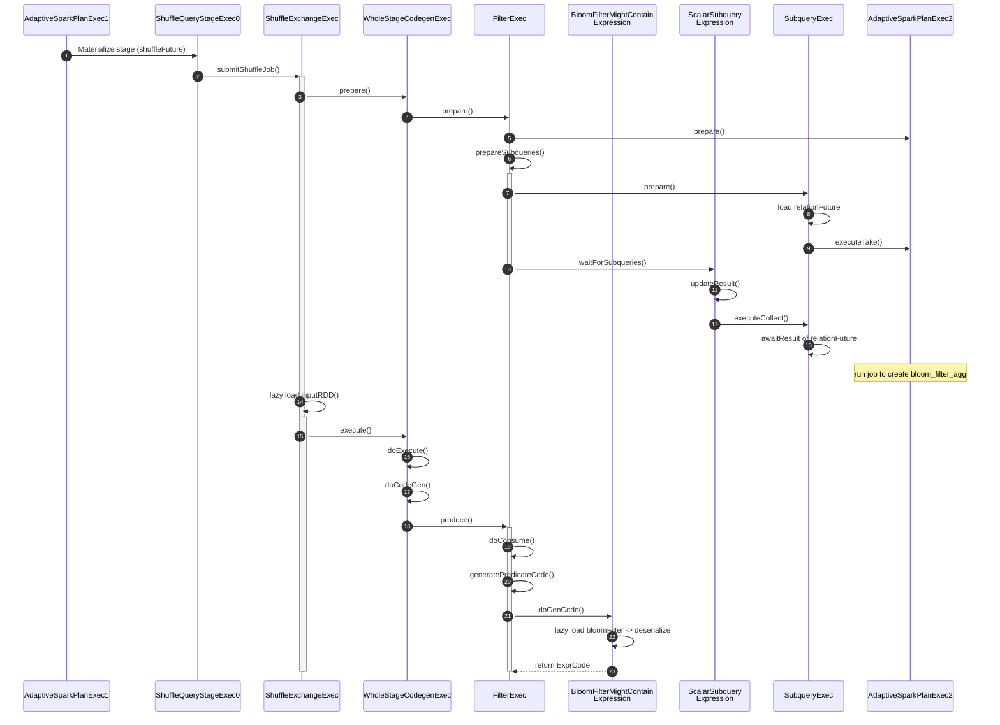

# InjectRuntimeFilter
运行时过滤器注入的机制，用于在执行期间基于运行时统计信息注入过滤条件。
- injectBloomFilter
- injectInSubqueryFilter（TODO）：在查询执行时动态注入子查询过滤条件，通过在运行时基于子查询的结果来过滤数据。
  - 与 [DPP](AQE.md#dynamicpruningsubquery) 区别？
    - injectInSubqueryFilter 专注于行过滤
    - DPP 专注于分区裁剪

# injectBloomFilter
Bloom Filter Aggregation 是 Spark SQL 中的一项优化技术，通过构建 Bloom 过滤器来减少 Join 操作中的数据传输和处理量，特别适用于大表与小表的连接场景。

## 原理

```text
sql("SET spark.sql.autoBroadcastJoinThreshold = -1")
sql("SET spark.sql.shuffle.partitions = 3")
sql("SET spark.sql.adaptive.coalescePartitions.enabled = false")
sql("SET spark.sql.optimizer.runtime.bloomFilter.enabled = true")
sql("SET spark.sql.optimizer.runtime.bloomFilter.applicationSideScanSizeThreshold = 50K")
sql(
  """
    |SELECT t1.key, t1.value1, t2.value2
    |FROM t1 JOIN t2 ON t1.key = t2.key
    |where t2.value2 > 0.01
    |""".stripMargin).write.mode(SaveMode.Overwrite).saveAsTable("t3")
```
- t1大表
- t2小表，不满足broadcast 条件
- [sql log](asset/bloom_filter_agg.log)


优化后的sql：
```sql
SELECT t.key, t.value1, t2.value2
FROM(
  SELECT key, value1
  FROM t1
  WHERE might_contain(
    (SELECT bloom_filter_agg(key)
     FROM t2
     WHERE t2.value2 > 0.01),
    t1.key)) t
JOIN(
  SELECT key, value2
  FROM t2
  WHERE t2.value2 > 0.01
) t2 ON t.key = t2.key
```

### 优化规则注入
- 识别符合条件的 Join 操作（Inner | LeftSemi | RightOuter）
  - 为什么不支持left join？ 因为left 需要保留大表所有记录，bloom filter目的是过滤掉大表中的一部分数据 
- 检查是否有选择性过滤条件
- 在较小的连接侧构建 Bloom Filter
- 将 Bloom Filter 以标量子查询形式传递到较大的连接侧

### 优化条件
优化规则应用需要满足多个条件：
- creation side（小表）有过滤条件且过滤条件简单，如`t2.value2 > 0.01`
- application side（大表）足够大以使优化有价值，> 10G
- Join 操作涉及 shuffle 或可能产生 shuffle
  - 比如可以优化成broadcast join，就可以跳过此优化
- already a DPP filter, 就跳过

### Logical plan
```text
SparkOptimizer(org.apache.spark.sql.internal.BaseSessionStateBuilder$$anon$2@4f31e47a) org.apache.spark.sql.catalyst.optimizer.InjectRuntimeFilter --> old【
CreateDataSourceTableAsSelectCommand `t3`, Overwrite, [key, value1, value2]
+- Project [key#59L, value1#60, value2#62]
   +- Join Inner, (key#59L = key#61L)
      :- Filter isnotnull(key#59L)
      :  +- Relation default.t1[key#59L,value1#60] parquet
      +- Filter ((isnotnull(value2#62) AND (value2#62 > 0.01)) AND isnotnull(key#61L))
         +- Relation default.t2[key#61L,value2#62] parquet
】--> new【
CreateDataSourceTableAsSelectCommand `t3`, Overwrite, [key, value1, value2]
+- Project [key#59L, value1#60, value2#62]
   +- Join Inner, (key#59L = key#61L)
      :- Filter might_contain(scalar-subquery#73 [], xxhash64(key#59L, 42))
      :  :  +- Aggregate [bloom_filter_agg(xxhash64(key#61L, 42), 1000000, 8388608, 0, 0) AS bloomFilter#72]
      :  :     +- Project [key#61L]
      :  :        +- Filter ((isnotnull(value2#62) AND (value2#62 > 0.01)) AND isnotnull(key#61L))
      :  :           +- Relation default.t2[key#61L,value2#62] parquet
      :  +- Filter isnotnull(key#59L)
      :     +- Relation default.t1[key#59L,value1#60] parquet
      +- Filter ((isnotnull(value2#62) AND (value2#62 > 0.01)) AND isnotnull(key#61L))
         +- Relation default.t2[key#61L,value2#62] parquet
】
```

### Execution Plan
```text
Execute CreateDataSourceTableAsSelectCommand `t3`, Overwrite, [key, value1, value2]
+- AdaptiveSparkPlan isFinalPlan=false id=1
   +- Project [key#59L, value1#60, value2#62]
      +- SortMergeJoin [key#59L], [key#61L], Inner
         :- Sort [key#59L ASC NULLS FIRST], false, 0
         :  +- Exchange hashpartitioning(key#59L, 3), ENSURE_REQUIREMENTS, [plan_id=66]
         :     +- Filter (isnotnull(key#59L) AND might_contain(Subquery subquery#73, [id=#57], xxhash64(key#59L, 42)))
         :        :  +- Subquery subquery#73, [id=#57]
         :        :     +- AdaptiveSparkPlan isFinalPlan=false id=2
         :        :        +- ObjectHashAggregate(keys=[], functions=[bloom_filter_agg(xxhash64(key#61L, 42), 1000000, 8388608, 0, 0)], output=[bloomFilter#72])
         :        :           +- Exchange SinglePartition, ENSURE_REQUIREMENTS, [plan_id=55]
         :        :              +- ObjectHashAggregate(keys=[], functions=[partial_bloom_filter_agg(xxhash64(key#61L, 42), 1000000, 8388608, 0, 0)], output=[buf#75])
         :        :                 +- Project [key#61L]
         :        :                    +- Filter ((isnotnull(value2#62) AND (value2#62 > 0.01)) AND isnotnull(key#61L))
         :        :                       +- FileScan parquet default.t2[key#61L,value2#62] Batched: true, DataFilters: [isnotnull(value2#62), (value2#62 > 0.01), isnotnull(key#61L)], Format: Parquet, Location: InMemoryFileIndex(1 paths)[file:/Users/juntao/src/github.com/apache/spark-v3.3.1-study/spark-ware..., PartitionFilters: [], PushedFilters: [IsNotNull(value2), GreaterThan(value2,0.01), IsNotNull(key)], ReadSchema: struct<key:bigint,value2:double>
         :        +- FileScan parquet default.t1[key#59L,value1#60] Batched: true, DataFilters: [isnotnull(key#59L)], Format: Parquet, Location: InMemoryFileIndex(1 paths)[file:/Users/juntao/src/github.com/apache/spark-v3.3.1-study/spark-ware..., PartitionFilters: [], PushedFilters: [IsNotNull(key)], ReadSchema: struct<key:bigint,value1:double>
         +- Sort [key#61L ASC NULLS FIRST], false, 0
            +- Exchange hashpartitioning(key#61L, 3), ENSURE_REQUIREMENTS, [plan_id=67]
               +- Filter ((isnotnull(value2#62) AND (value2#62 > 0.01)) AND isnotnull(key#61L))
                  +- FileScan parquet default.t2[key#61L,value2#62] Batched: true, DataFilters: [isnotnull(value2#62), (value2#62 > 0.01), isnotnull(key#61L)], Format: Parquet, Location: InMemoryFileIndex(1 paths)[file:/Users/juntao/src/github.com/apache/spark-v3.3.1-study/spark-ware..., PartitionFilters: [], PushedFilters: [IsNotNull(value2), GreaterThan(value2,0.01), IsNotNull(key)], ReadSchema: struct<key:bigint,value2:double>

```


## 核心组件
### BloomFilterAggregate
一个用于在 Spark SQL
中创建和合并布隆过滤器的用户定义聚合函数（UDAF），通过在数据分区上并行构建布隆过滤器来实现高效的集合成员查询和连接优化。

### BloomFilterMightContain
一个用户定义函数（UDF），用于检查给定元素是否可能存在于布隆过滤器中（返回布尔值，存在误判但无漏判），常用于连接优化中的快速过滤操作。


### FilterExec
`FilterExec(condition=BloomFilterMightContain(bloomFilter,bloomFilterExpression, valueExpression))`
是一个过滤执行节点

其作用是：对输入数据流中的每一行执行布隆过滤器检查，通过评估 BloomFilterMightContain
表达式来判断当前行是否可能存在于目标集合中，
只保留那些通过布隆过滤器检查（可能匹配）的行，从而减少后续shuffle IO 开销。

### execution.ScalarSubquery
在查询执行期间计算一个返回单个值（标量）的子查询结果，通常用于动态过滤或计算场景，如在布隆过滤器场景中，它会预先计算并返回布
隆过滤器对象，供外层查询中的条件表达式（如 BloomFilterMightContain）使用，实现了在运行时基于子查询结果进行动态过滤的功能。
`bloomFilterExpression=ScalarSubquery(plan=SubqueryExec)`

`updateResult`->`plan.executeCollect()` 阻塞等待`SubqueryExec`的执行结果

### SubqueryExec
执行一个子查询并返回其结果，通常用于子查询表达式的计算，如在标量子查询（ScalarSubquery）或相关子查询中，它会独立执行一个完整查
询计划并返回结果给父查询使用，常用于动态过滤条件、相关查询等场景。

提交AQE2 plan，获取bloomFilter 的计划：
```text
AdaptiveSparkPlan isFinalPlan=true id=2
+- == Final Plan ==
   ObjectHashAggregate(keys=[], functions=[bloom_filter_agg(xxhash64(key#61L, 42), 1000000, 8388608, 0, 0)], output=[bloomFilter#72])
   +- ShuffleQueryStage 0
      +- Exchange SinglePartition, ENSURE_REQUIREMENTS, [plan_id=141]
         +- ObjectHashAggregate(keys=[], functions=[partial_bloom_filter_agg(xxhash64(key#61L, 42), 1000000, 8388608, 0, 0)], output=[buf#75])
            +- *(1) Project [key#61L]
               +- *(1) Filter ((isnotnull(value2#62) AND (value2#62 > 0.01)) AND isnotnull(key#61L))
                  +- *(1) ColumnarToRow
                     +- FileScan parquet default.t2[key#61L,value2#62] Batched: true, DataFilters: [isnotnull(value2#62), (value2#62 > 0.01), isnotnull(key#61L)], Format: Parquet, Location: InMemoryFileIndex(1 paths)[file:/Users/juntao/src/github.com/apache/spark-v3.3.1-study/spark-ware..., PartitionFilters: [], PushedFilters: [IsNotNull(value2), GreaterThan(value2,0.01), IsNotNull(key)], ReadSchema: struct<key:bigint,value2:double>
+- == Initial Plan ==
   ObjectHashAggregate(keys=[], functions=[bloom_filter_agg(xxhash64(key#61L, 42), 1000000, 8388608, 0, 0)], output=[bloomFilter#72])
   +- Exchange SinglePartition, ENSURE_REQUIREMENTS, [plan_id=55]
      +- ObjectHashAggregate(keys=[], functions=[partial_bloom_filter_agg(xxhash64(key#61L, 42), 1000000, 8388608, 0, 0)], output=[buf#75])
         +- Project [key#61L]
            +- Filter ((isnotnull(value2#62) AND (value2#62 > 0.01)) AND isnotnull(key#61L))
               +- FileScan parquet default.t2[key#61L,value2#62] Batched: true, DataFilters: [isnotnull(value2#62), (value2#62 > 0.01), isnotnull(key#61L)], Format: Parquet, Location: InMemoryFileIndex(1 paths)[file:/Users/juntao/src/github.com/apache/spark-v3.3.1-study/spark-ware..., PartitionFilters: [], PushedFilters: [IsNotNull(value2), GreaterThan(value2,0.01), IsNotNull(key)], ReadSchema: struct<key:bigint,value2:double>

```


## 执行流程
`Execution Plan`中 AQE1 materialize stage0 与stage1：

ShuffleQueryStageExec 0 (plan_id=95)：
- 负责处理连接左表 t1 的数据
- 执行流程：FileScan t1 -> Filter (应用布隆过滤器) -> Exchange hashpartitioning(key#59L, 3)
- 在这个阶段中，通过布隆过滤器预先过滤 t1 中的记录，只保留那些可能在 t2 中存在匹配的行
- 最终按 key#59L 进行哈希分区

ShuffleQueryStageExec 1 (plan_id=117)：
- 负责处理连接右表 t2 的数据
- 执行流程：FileScan t2 -> Filter (value2 > 0.01) -> Exchange hashpartitioning(key#61L, 3)
- 对 t2 应用过滤条件后，同样按 key#61L 进行哈希分区
 
### ShuffleQueryStageExec 0


- 构建侧（Creation Side）：首先通过子查询执行布隆过滤器聚合操作
    - 从 t2 表读取数据并应用过滤条件
    - 通过 bloom_filter_agg 创建布隆过滤器

- 应用侧（Application Side）：使用构建好的布隆过滤器过滤 t1 表的数据
    - 在 Filter 操作中使用 might_contain 函数检查 t1 中的每一行
    - 只有通过布隆过滤器检查的行才会继续向下游传递

- 减少 Shuffle I/O：通过预先过滤掉 t1 中那些在 t2 中肯定不存在匹配的记录，显著减少了需要进行 shuffle 的数据量，从而大大优化了后续连接操作的性能。


```text
21:16:23.981 [ScalaTest-run-running-PhysicalPlanSpec] DEBUG org.apache.spark.sql.execution.adaptive.ShuffleQueryStageExec - Materialize query stage ShuffleQueryStageExec: 0, query stage plan:
Exchange hashpartitioning(key#59L, 3), ENSURE_REQUIREMENTS, [plan_id=95]
+- *(1) Filter (isnotnull(key#59L) AND might_contain(Subquery subquery#73, [id=#57], xxhash64(key#59L, 42)))
   :  +- Subquery subquery#73, [id=#57]
   :     +- AdaptiveSparkPlan isFinalPlan=false id=2
   :        +- ObjectHashAggregate(keys=[], functions=[bloom_filter_agg(xxhash64(key#61L, 42), 1000000, 8388608, 0, 0)], output=[bloomFilter#72])
   :           +- Exchange SinglePartition, ENSURE_REQUIREMENTS, [plan_id=55]
   :              +- ObjectHashAggregate(keys=[], functions=[partial_bloom_filter_agg(xxhash64(key#61L, 42), 1000000, 8388608, 0, 0)], output=[buf#75])
   :                 +- Project [key#61L]
   :                    +- Filter ((isnotnull(value2#62) AND (value2#62 > 0.01)) AND isnotnull(key#61L))
   :                       +- FileScan parquet default.t2[key#61L,value2#62] Batched: true, DataFilters: [isnotnull(value2#62), (value2#62 > 0.01), isnotnull(key#61L)], Format: Parquet, Location: InMemoryFileIndex(1 paths)[file:/Users/juntao/src/github.com/apache/spark-v3.3.1-study/spark-ware..., PartitionFilters: [], PushedFilters: [IsNotNull(value2), GreaterThan(value2,0.01), IsNotNull(key)], ReadSchema: struct<key:bigint,value2:double>
   +- *(1) ColumnarToRow
      +- FileScan parquet default.t1[key#59L,value1#60] Batched: true, DataFilters: [isnotnull(key#59L)], Format: Parquet, Location: InMemoryFileIndex(1 paths)[file:/Users/juntao/src/github.com/apache/spark-v3.3.1-study/spark-ware..., PartitionFilters: [], PushedFilters: [IsNotNull(key)], ReadSchema: struct<key:bigint,value1:double>
```

### ShuffleQueryStageExec 1
```text
21:16:27.217 [ScalaTest-run-running-PhysicalPlanSpec] DEBUG org.apache.spark.sql.execution.adaptive.ShuffleQueryStageExec - Materialize query stage ShuffleQueryStageExec: 1, query stage plan:
Exchange hashpartitioning(key#61L, 3), ENSURE_REQUIREMENTS, [plan_id=117]
+- *(2) Filter ((isnotnull(value2#62) AND (value2#62 > 0.01)) AND isnotnull(key#61L))
   +- *(2) ColumnarToRow
      +- FileScan parquet default.t2[key#61L,value2#62] Batched: true, DataFilters: [isnotnull(value2#62), (value2#62 > 0.01), isnotnull(key#61L)], Format: Parquet, Location: InMemoryFileIndex(1 paths)[file:/Users/juntao/src/github.com/apache/spark-v3.3.1-study/spark-ware..., PartitionFilters: [], PushedFilters: [IsNotNull(value2), GreaterThan(value2,0.01), IsNotNull(key)], ReadSchema: struct<key:bigint,value2:double>
```

- 负责处理连接的右表 t2 数据
- 同样按 key#61L 进行哈希分区，为后续与 ShuffleQueryStageExec: 0 的结果进行连接做准备

## Bloom Filter 的过滤条件策略优化
上文在条件中提到
`creation side（小表）有过滤条件且条件简单，如t2.value2 > 0.01`，这判断相对粗放，
如果 t2 表本身不大，没有过滤条件的情况下，直接将整表构建成布隆过滤器可能更有效。

# Reference
- [Row-level Runtime Filters in Spark](https://docs.google.com/document/d/16IEuyLeQlubQkH8YuVuXWKo2-grVIoDJqQpHZrE7q04/edit?pli=1&tab=t.0#heading=h.4v65wq7vzy4q)
- [This PR bloom filter is from shuffle](https://github.com/apache/spark/pull/29065) not from table directly

