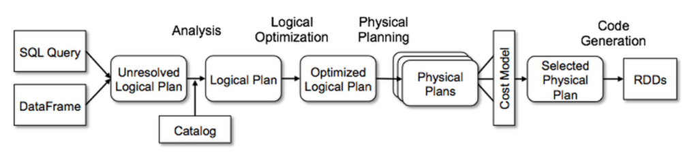
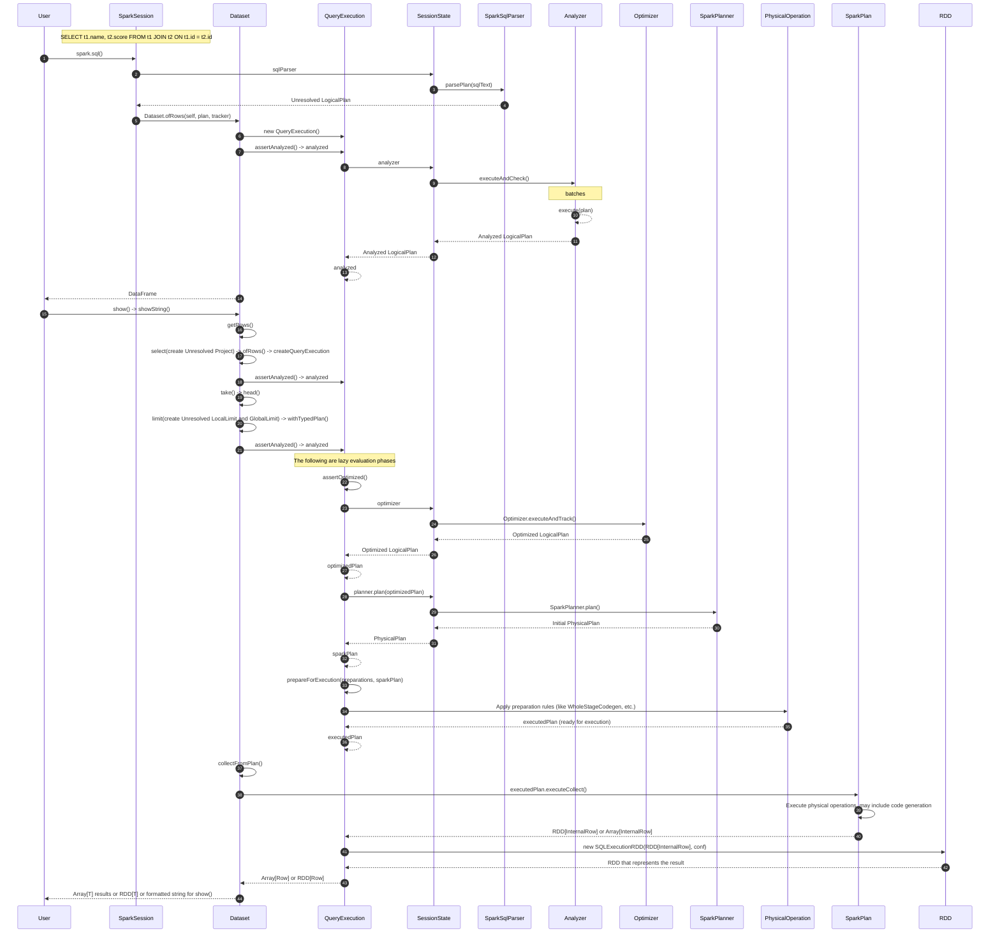
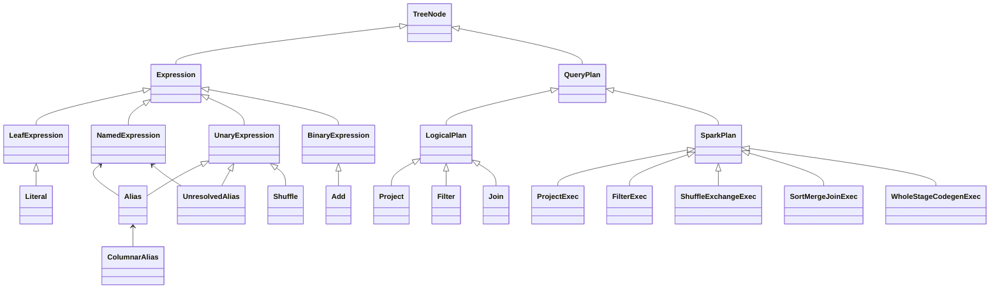
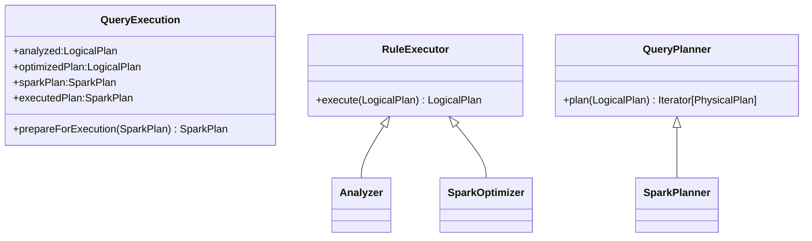

# Catalyst

## Overview

1. SqlParser：SQL 执行先会经过 SQL Parser 解析成 Unresolved Logical Plan
2. Analyzer：主要利用 Catalog 信息将 Unresolved Logical Plan 解析成 Analyzed Logical Plan；
3. SparkOptimizer：利用一些 Rule （规则）将 Analyzed logical plan 优化成 Optimized Logical Plan；
   - 谓词下推
   - Join 策略选择
   - 常量折叠
   - sort project裁剪
4. SparkPlanner：把 Logical Plan 转换成 多个 SparkPlan（Physical Plans，当前只取第一个）
5. prepareForExecution：准备执行阶段，包括如AQE（运行时动态优化）、CodeGen （转换成高效的 JVM 字节码，避免传统虚函数的开销）。
6. 提交RDD：executedPlan 通过 toRdd 转为 RDD，后续就是正常的spark流程。

Catalyst 的过程包括 2 ~ 3

### SQL to RDD pipeline




### TreeNode Class Hierarchy

- Expression 表示计算表达式
- QueryPlan 表示查询操作结构

| 维度     | LogicalPlan              | SparkPlan                   |
|----------|--------------------------|-----------------------------|
| 作用     | 逻辑查询计划，描述做什么 | 物理查询计划，描述如何执行  |
| 执行     | 不直接执行               | 直接执行，返回 RDD          |
| 表达式   | 包含表达式定义           | 包含表达式并执行            |
| 优化     | 在此阶段进行查询优化     | 优化后的执行计划            |
| 参与组件 | Analyzer, Optimizer      | Physical planner, Execution |




## SessionState

SessionState 是一个会话状态管理器，负责维护和管理 SparkSession 的各种组件，包括：
- sqlParser：SQL 解析
- catalog（会话目录）：管理数据库、表、函数等元数据
- analyzer（分析器）：负责逻辑计划的分析和解析
- optimizer（优化器）：负责逻辑计划的优化
- planner（物理计划器）：负责将优化后的逻辑计划转换为物理计划
- prepareForExecution：通过根据需要插入 shuffle 操作和内部行格式转换.

## Example
```sql
SET spark.sql.adaptive.enabled = false;
SET spark.sql.shuffle.partitions = 2;
SELECT t1.id, t1.name, t2.value
FROM t1
JOIN t2
ON t1.id = t2.id
```
* [Code](https://github.com/juntaozhang/spark/blob/v3.3.1-study/examples/src/test/scala/cn/juntaozhang/example/spark/SortMergeJoinSpec.scala#L120)
* [execution log](asset/join.log)
* [SMJ DAG img](asset/smj.png)

## SparkSqlParser
- [antlr4](../antlr4.md)
- SparkSqlParserSuite

解析之后的Unresolved Logical Plan
```text
'Project ['t1.id, 't1.name, 't2.value]
+- 'Join Inner, ('t1.id = 't2.id)
   :- 'UnresolvedRelation [t1], [], false
   +- 'UnresolvedRelation [t2], [], false
```
## Analyzer
SQL 经过 rules：
- ResolveRelations：解析表关系，将未解析的表引用转换为具体的数据源关系
- FindDataSourceTable：查找和替换数据源表（非 Hive 表）为逻辑关系
- ResolveReferences：解析表达式中的引用（列名、别名等）到具体的属性

Analyzed Logical Plan
```text
Project [id#20, name#21, value#24]
+- Join Inner, (id#20 = id#23)
   :- SubqueryAlias spark_catalog.default.t1
   :  +- Relation default.t1[id#20,name#21,date#22] parquet
   +- SubqueryAlias spark_catalog.default.t2
      +- Relation default.t2[id#23,value#24,date#25] parquet
```

`df.show()` 经过rule：

- ResolveAliases：解析未解析的别名（UnresolvedAlias）为具体的别名（Alias）

```text
GlobalLimit 21
+- LocalLimit 21
   +- Project [cast(id#20 as string) AS id#34, cast(name#21 as string) AS name#35, cast(value#24 as string) AS value#36]
      +- Project [id#20, name#21, value#24]
         +- Join Inner, (id#20 = id#23)
            :- SubqueryAlias spark_catalog.default.t1
            :  +- Relation default.t1[id#20,name#21,date#22] parquet
            +- SubqueryAlias spark_catalog.default.t2
               +- Relation default.t2[id#23,value#24,date#25] parquet
```

## SparkOptimizer
Rule-based Optimizer(RBO)，它通过一系列预定义的规则来优化查询计划，`LogicalPlan` -> `LogicalPlan`

- ColumnPruning：移除查询计划中不需要的列，只保留最终结果需要的列
- SimplifyCasts：移除不必要的类型转换（Cast）操作
- RemoveRedundantAliases：移除不改变列名、类型或元数据的冗余别名
- PushDownPredicates：将过滤条件尽可能下推到查询计划的更深层

```text
GlobalLimit 21
+- LocalLimit 21
   +- Project [cast(id#20 as string) AS id#34, name#21, cast(value#24 as string) AS value#36]
      +- Join Inner, (id#20 = id#23)
         :- Project [id#20, name#21]
         :  +- Filter isnotnull(id#20)
         :     +- Relation default.t1[id#20,name#21,date#22] parquet
         +- Project [id#23, value#24]
            +- Filter isnotnull(id#23)
               +- Relation default.t2[id#23,value#24,date#25] parquet
```

## SparkPlanner
物理计划，`LogicalPlan` -> `SparkPlan`
- SpecialLimits：优化带有 LIMIT 子句的查询，特别是与排序结合的场景
- BasicOperators：将基本的逻辑操作符转换为对应的物理执行节点（Project -> ProjectExec, Filter -> FilterExec）
- JoinSelection：Logical Join -> Sort Merge Join/Broadcast Hash Join/Shuffle Hash Join等
- FileSourceStrategy：优化文件数据源的扫描操作，实现谓词下推、分区裁剪等优化

```text
CollectLimit 21
+- Project [cast(id#20 as string) AS id#34, name#21, cast(value#24 as string) AS value#36]
   +- SortMergeJoin [id#20], [id#23], Inner
      :- Project [id#20, name#21]
      :  +- Filter isnotnull(id#20)
      :     +- FileScan parquet default.t1[id#20,name#21,date#22] Batched: true, DataFilters: [isnotnull(id#20)], Format: Parquet, Location: CatalogFileIndex(1 paths)[file:/Users/juntao/src/github.com/apache/spark-v3.3.1-study/spark-wareh..., PartitionFilters: [], PushedFilters: [IsNotNull(id)], ReadSchema: struct<id:int,name:string>
      +- Project [id#23, value#24]
         +- Filter isnotnull(id#23)
            +- FileScan parquet default.t2[id#23,value#24,date#25] Batched: true, DataFilters: [isnotnull(id#23)], Format: Parquet, Location: CatalogFileIndex(1 paths)[file:/Users/juntao/src/github.com/apache/spark-v3.3.1-study/spark-wareh..., PartitionFilters: [], PushedFilters: [IsNotNull(id)], ReadSchema: struct<id:int,value:int>
```

## QueryExecution.prepareForExecution
把物理计划（Physical Plan）`SparkPlan` 转换成可执行计划（Execution Plan） `SparkPlan`
- EnsureRequirements：确保分区、排序等要求
- ApplyColumnarRulesAndInsertTransitions：负责在物理计划中找到合适的列式处理机会，插入必要的行/列转换节点，使支持列式执行的算子能够协同工作，以实现更好的查询性能。
- [AdaptiveSparkPlanExec](AQE.md)：AQE 自适应执行，动态分区合并会根据运行时数据大小决策，Join 策略选择会考虑实际数据量等，Cost-based Optimizations(CBO)基于代价的优化
- [CollapseCodegenStages](catalyst.md#code-generation)：自动识别物理计划中可以被 WholeStageCodegenExec 优化的连续算子链

```text
CollectLimit 21
+- *(5) Project [cast(id#20 as string) AS id#34, name#21, cast(value#24 as string) AS value#36]
   +- *(5) SortMergeJoin [id#20], [id#23], Inner
      :- *(2) Sort [id#20 ASC NULLS FIRST], false, 0
      :  +- Exchange hashpartitioning(id#20, 2), ENSURE_REQUIREMENTS, [plan_id=58]
      :     +- *(1) Project [id#20, name#21]
      :        +- *(1) Filter isnotnull(id#20)
      :           +- *(1) ColumnarToRow
      :              +- FileScan parquet default.t1[id#20,name#21,date#22] Batched: true, DataFilters: [isnotnull(id#20)], Format: Parquet, Location: CatalogFileIndex(1 paths)[file:/Users/juntao/src/github.com/apache/spark-v3.3.1-study/spark-wareh..., PartitionFilters: [], PushedFilters: [IsNotNull(id)], ReadSchema: struct<id:int,name:string>
      +- *(4) Sort [id#23 ASC NULLS FIRST], false, 0
         +- Exchange hashpartitioning(id#23, 2), ENSURE_REQUIREMENTS, [plan_id=68]
            +- *(3) Project [id#23, value#24]
               +- *(3) Filter isnotnull(id#23)
                  +- *(3) ColumnarToRow
                     +- FileScan parquet default.t2[id#23,value#24,date#25] Batched: true, DataFilters: [isnotnull(id#23)], Format: Parquet, Location: CatalogFileIndex(1 paths)[file:/Users/juntao/src/github.com/apache/spark-v3.3.1-study/spark-wareh..., PartitionFilters: [], PushedFilters: [IsNotNull(id)], ReadSchema: struct<id:int,value:int>
```


## Code Generation
将一个完整的物理计划阶段（包含多个连续算子）“整体编译” 为一段高效的 JVM 字节码，替代传统的算子间逐行迭代执行模式，从而大幅提升查询执行效率。


### 全阶段代码生成 - WholeStageCodegenExec
executedPlan 优化成高效的JVM字节码。将连续的算子合并为一个代码块，数据在内存中直接传递，无需中间转换。

<details>
<summary>GeneratedIteratorForCodegenStage5 SortMergeJoin</summary>

```java
/* 001 */ public Object generate(Object[] references) {
/* 002 */   return new GeneratedIteratorForCodegenStage5(references);
/* 003 */ }
/* 004 */
/* 005 */ // codegenStageId=5
/* 006 */ final class GeneratedIteratorForCodegenStage5 extends org.apache.spark.sql.execution.BufferedRowIterator {
/* 007 */   private Object[] references;
/* 008 */   private scala.collection.Iterator[] inputs;
/* 009 */   private scala.collection.Iterator smj_streamedInput_0;
/* 010 */   private scala.collection.Iterator smj_bufferedInput_0;
/* 011 */   private InternalRow smj_streamedRow_0;
/* 012 */   private InternalRow smj_bufferedRow_0;
/* 013 */   private int smj_value_2;
/* 014 */   private org.apache.spark.sql.execution.ExternalAppendOnlyUnsafeRowArray smj_matches_0;
/* 015 */   private int smj_value_3;
/* 016 */   private boolean wholestagecodegen_initJoin_0;
/* 017 */   private org.apache.spark.sql.catalyst.expressions.codegen.UnsafeRowWriter[] smj_mutableStateArray_0 = new org.apache.spark.sql.catalyst.expressions.codegen.UnsafeRowWriter[2];
/* 018 */
/* 019 */   public GeneratedIteratorForCodegenStage5(Object[] references) {
/* 020 */     this.references = references;
/* 021 */   }
/* 022 */
/* 023 */   public void init(int index, scala.collection.Iterator[] inputs) {
/* 024 */     partitionIndex = index;
/* 025 */     this.inputs = inputs;
/* 026 */     smj_streamedInput_0 = inputs[0];
/* 027 */     smj_bufferedInput_0 = inputs[1];
/* 028 */
/* 029 */     smj_matches_0 = new org.apache.spark.sql.execution.ExternalAppendOnlyUnsafeRowArray(2147483632, 2147483647);
/* 030 */     smj_mutableStateArray_0[0] = new org.apache.spark.sql.catalyst.expressions.codegen.UnsafeRowWriter(4, 32);
/* 031 */     smj_mutableStateArray_0[1] = new org.apache.spark.sql.catalyst.expressions.codegen.UnsafeRowWriter(3, 96);
/* 032 */
/* 033 */   }
/* 034 */
/* 035 */   private boolean smj_findNextJoinRows_0(
/* 036 */     scala.collection.Iterator streamedIter,
/* 037 */     scala.collection.Iterator bufferedIter) {
/* 038 */     smj_streamedRow_0 = null;
/* 039 */     int comp = 0;
/* 040 */     while (smj_streamedRow_0 == null) {
/* 041 */       if (!streamedIter.hasNext()) return false;
/* 042 */       smj_streamedRow_0 = (InternalRow) streamedIter.next();
/* 043 */       boolean smj_isNull_0 = smj_streamedRow_0.isNullAt(0);
/* 044 */       int smj_value_0 = smj_isNull_0 ?
/* 045 */       -1 : (smj_streamedRow_0.getInt(0));
/* 046 */       if (smj_isNull_0) {
/* 047 */         smj_streamedRow_0 = null;
/* 048 */         continue;
/* 049 */
/* 050 */       }
/* 051 */       if (!smj_matches_0.isEmpty()) {
/* 052 */         comp = 0;
/* 053 */         if (comp == 0) {
/* 054 */           comp = (smj_value_0 > smj_value_3 ? 1 : smj_value_0 < smj_value_3 ? -1 : 0);
/* 055 */         }
/* 056 */
/* 057 */         if (comp == 0) {
/* 058 */           return true;
/* 059 */         }
/* 060 */         smj_matches_0.clear();
/* 061 */       }
/* 062 */
/* 063 */       do {
/* 064 */         if (smj_bufferedRow_0 == null) {
/* 065 */           if (!bufferedIter.hasNext()) {
/* 066 */             smj_value_3 = smj_value_0;
/* 067 */             return !smj_matches_0.isEmpty();
/* 068 */           }
/* 069 */           smj_bufferedRow_0 = (InternalRow) bufferedIter.next();
/* 070 */           boolean smj_isNull_1 = smj_bufferedRow_0.isNullAt(0);
/* 071 */           int smj_value_1 = smj_isNull_1 ?
/* 072 */           -1 : (smj_bufferedRow_0.getInt(0));
/* 073 */           if (smj_isNull_1) {
/* 074 */             smj_bufferedRow_0 = null;
/* 075 */             continue;
/* 076 */           }
/* 077 */           smj_value_2 = smj_value_1;
/* 078 */         }
/* 079 */
/* 080 */         comp = 0;
/* 081 */         if (comp == 0) {
/* 082 */           comp = (smj_value_0 > smj_value_2 ? 1 : smj_value_0 < smj_value_2 ? -1 : 0);
/* 083 */         }
/* 084 */
/* 085 */         if (comp > 0) {
/* 086 */           smj_bufferedRow_0 = null;
/* 087 */         } else if (comp < 0) {
/* 088 */           if (!smj_matches_0.isEmpty()) {
/* 089 */             smj_value_3 = smj_value_0;
/* 090 */             return true;
/* 091 */           } else {
/* 092 */             smj_streamedRow_0 = null;
/* 093 */           }
/* 094 */         } else {
/* 095 */           smj_matches_0.add((UnsafeRow) smj_bufferedRow_0);
/* 096 */           smj_bufferedRow_0 = null;
/* 097 */         }
/* 098 */       } while (smj_streamedRow_0 != null);
/* 099 */     }
/* 100 */     return false; // unreachable
/* 101 */   }
/* 102 */
/* 103 */   protected void processNext() throws java.io.IOException {
/* 104 */     if (!wholestagecodegen_initJoin_0) {
/* 105 */       wholestagecodegen_initJoin_0 = true;
/* 106 */
/* 107 */       ((org.apache.spark.sql.execution.joins.SortMergeJoinExec) references[1] /* plan */).getTaskContext().addTaskCompletionListener(
/* 108 */         new org.apache.spark.util.TaskCompletionListener() {
/* 109 */           @Override
/* 110 */           public void onTaskCompletion(org.apache.spark.TaskContext context) {
/* 111 */             ((org.apache.spark.sql.execution.metric.SQLMetric) references[2] /* spillSize */).add(smj_matches_0.spillSize());
/* 112 */           }
/* 113 */         });
/* 114 */
/* 115 */     }
/* 116 */
/* 117 */     while (smj_findNextJoinRows_0(smj_streamedInput_0, smj_bufferedInput_0)) {
/* 118 */       boolean smj_isNull_2 = false;
/* 119 */       int smj_value_4 = -1;
/* 120 */
/* 121 */       boolean smj_isNull_3 = false;
/* 122 */       UTF8String smj_value_5 = null;
/* 123 */
/* 124 */       smj_isNull_2 = smj_streamedRow_0.isNullAt(0);
/* 125 */       smj_value_4 = smj_isNull_2 ? -1 : (smj_streamedRow_0.getInt(0));
/* 126 */       smj_isNull_3 = smj_streamedRow_0.isNullAt(1);
/* 127 */       smj_value_5 = smj_isNull_3 ? null : (smj_streamedRow_0.getUTF8String(1));
/* 128 */       scala.collection.Iterator<UnsafeRow> smj_iterator_0 = smj_matches_0.generateIterator();
/* 129 */
/* 130 */       while (smj_iterator_0.hasNext()) {
/* 131 */         InternalRow smj_bufferedRow_1 = (InternalRow) smj_iterator_0.next();
/* 132 */
/* 133 */         ((org.apache.spark.sql.execution.metric.SQLMetric) references[0] /* numOutputRows */).add(1);
/* 134 */
/* 135 */         // common sub-expressions
/* 136 */
/* 137 */         boolean project_isNull_0 = smj_isNull_2;
/* 138 */         UTF8String project_value_0 = null;
/* 139 */         if (!smj_isNull_2) {
/* 140 */           project_value_0 = UTF8String.fromString(String.valueOf(smj_value_4));
/* 141 */         }
/* 142 */         boolean smj_isNull_5 = smj_bufferedRow_1.isNullAt(1);
/* 143 */         int smj_value_7 = smj_isNull_5 ?
/* 144 */         -1 : (smj_bufferedRow_1.getInt(1));
/* 145 */         boolean project_isNull_3 = smj_isNull_5;
/* 146 */         UTF8String project_value_3 = null;
/* 147 */         if (!smj_isNull_5) {
/* 148 */           project_value_3 = UTF8String.fromString(String.valueOf(smj_value_7));
/* 149 */         }
/* 150 */         smj_mutableStateArray_0[1].reset();
/* 151 */
/* 152 */         smj_mutableStateArray_0[1].zeroOutNullBytes();
/* 153 */
/* 154 */         if (project_isNull_0) {
/* 155 */           smj_mutableStateArray_0[1].setNullAt(0);
/* 156 */         } else {
/* 157 */           smj_mutableStateArray_0[1].write(0, project_value_0);
/* 158 */         }
/* 159 */
/* 160 */         if (smj_isNull_3) {
/* 161 */           smj_mutableStateArray_0[1].setNullAt(1);
/* 162 */         } else {
/* 163 */           smj_mutableStateArray_0[1].write(1, smj_value_5);
/* 164 */         }
/* 165 */
/* 166 */         if (project_isNull_3) {
/* 167 */           smj_mutableStateArray_0[1].setNullAt(2);
/* 168 */         } else {
/* 169 */           smj_mutableStateArray_0[1].write(2, project_value_3);
/* 170 */         }
/* 171 */         append((smj_mutableStateArray_0[1].getRow()).copy());
/* 172 */
/* 173 */       }
/* 174 */       if (shouldStop()) return;
/* 175 */     }
/* 176 */     ((org.apache.spark.sql.execution.joins.SortMergeJoinExec) references[1] /* plan */).cleanupResources();
/* 177 */   }
/* 178 */
/* 179 */ }
```
</details>
<details>
<summary>GeneratedIteratorForCodegenStage2 Sort</summary>

```java
/* 001 */ public Object generate(Object[] references) {
/* 002 */   return new GeneratedIteratorForCodegenStage2(references);
/* 003 */ }
/* 004 */
/* 005 */ // codegenStageId=2
/* 006 */ final class GeneratedIteratorForCodegenStage2 extends org.apache.spark.sql.execution.BufferedRowIterator {
/* 007 */   private Object[] references;
/* 008 */   private scala.collection.Iterator[] inputs;
/* 009 */   private boolean sort_needToSort_0;
/* 010 */   private org.apache.spark.sql.execution.UnsafeExternalRowSorter sort_sorter_0;
/* 011 */   private org.apache.spark.executor.TaskMetrics sort_metrics_0;
/* 012 */   private scala.collection.Iterator<UnsafeRow> sort_sortedIter_0;
/* 013 */   private scala.collection.Iterator inputadapter_input_0;
/* 014 */
/* 015 */   public GeneratedIteratorForCodegenStage2(Object[] references) {
/* 016 */     this.references = references;
/* 017 */   }
/* 018 */
/* 019 */   public void init(int index, scala.collection.Iterator[] inputs) {
/* 020 */     partitionIndex = index;
/* 021 */     this.inputs = inputs;
/* 022 */     sort_needToSort_0 = true;
/* 023 */     sort_sorter_0 = ((org.apache.spark.sql.execution.SortExec) references[0] /* plan */).createSorter();
/* 024 */     sort_metrics_0 = org.apache.spark.TaskContext.get().taskMetrics();
/* 025 */
/* 026 */     inputadapter_input_0 = inputs[0];
/* 027 */
/* 028 */   }
/* 029 */
/* 030 */   private void sort_addToSorter_0() throws java.io.IOException {
/* 031 */     while ( inputadapter_input_0.hasNext()) {
/* 032 */       InternalRow inputadapter_row_0 = (InternalRow) inputadapter_input_0.next();
/* 033 */
/* 034 */       sort_sorter_0.insertRow((UnsafeRow)inputadapter_row_0);
/* 035 */       // shouldStop check is eliminated
/* 036 */     }
/* 037 */
/* 038 */   }
/* 039 */
/* 040 */   protected void processNext() throws java.io.IOException {
/* 041 */     if (sort_needToSort_0) {
/* 042 */       long sort_spillSizeBefore_0 = sort_metrics_0.memoryBytesSpilled();
/* 043 */       sort_addToSorter_0();
/* 044 */       sort_sortedIter_0 = sort_sorter_0.sort();
/* 045 */       ((org.apache.spark.sql.execution.metric.SQLMetric) references[3] /* sortTime */).add(sort_sorter_0.getSortTimeNanos() / 1000000);
/* 046 */       ((org.apache.spark.sql.execution.metric.SQLMetric) references[1] /* peakMemory */).add(sort_sorter_0.getPeakMemoryUsage());
/* 047 */       ((org.apache.spark.sql.execution.metric.SQLMetric) references[2] /* spillSize */).add(sort_metrics_0.memoryBytesSpilled() - sort_spillSizeBefore_0);
/* 048 */       sort_metrics_0.incPeakExecutionMemory(sort_sorter_0.getPeakMemoryUsage());
/* 049 */       sort_needToSort_0 = false;
/* 050 */     }
/* 051 */
/* 052 */     while ( sort_sortedIter_0.hasNext()) {
/* 053 */       UnsafeRow sort_outputRow_0 = (UnsafeRow)sort_sortedIter_0.next();
/* 054 */
/* 055 */       append(sort_outputRow_0);
/* 056 */
/* 057 */       if (shouldStop()) return;
/* 058 */     }
/* 059 */   }
/* 060 */
/* 061 */ }
```
</details>

<details>
<summary>GeneratedIteratorForCodegenStage1 Project+Filter+ColumnarToRow</summary>

```java
/* 001 */ public Object generate(Object[] references) {
/* 002 */   return new GeneratedIteratorForCodegenStage1(references);
/* 003 */ }
/* 004 */
/* 005 */ // codegenStageId=1
/* 006 */ final class GeneratedIteratorForCodegenStage1 extends org.apache.spark.sql.execution.BufferedRowIterator {
/* 007 */   private Object[] references;
/* 008 */   private scala.collection.Iterator[] inputs;
/* 009 */   private int columnartorow_batchIdx_0;
/* 010 */   private org.apache.spark.sql.execution.vectorized.OnHeapColumnVector[] columnartorow_mutableStateArray_2 = new org.apache.spark.sql.execution.vectorized.OnHeapColumnVector[3];
/* 011 */   private org.apache.spark.sql.catalyst.expressions.codegen.UnsafeRowWriter[] columnartorow_mutableStateArray_3 = new org.apache.spark.sql.catalyst.expressions.codegen.UnsafeRowWriter[3];
/* 012 */   private org.apache.spark.sql.vectorized.ColumnarBatch[] columnartorow_mutableStateArray_1 = new org.apache.spark.sql.vectorized.ColumnarBatch[1];
/* 013 */   private scala.collection.Iterator[] columnartorow_mutableStateArray_0 = new scala.collection.Iterator[1];
/* 014 */
/* 015 */   public GeneratedIteratorForCodegenStage1(Object[] references) {
/* 016 */     this.references = references;
/* 017 */   }
/* 018 */
/* 019 */   public void init(int index, scala.collection.Iterator[] inputs) {
/* 020 */     partitionIndex = index;
/* 021 */     this.inputs = inputs;
/* 022 */     columnartorow_mutableStateArray_0[0] = inputs[0];
/* 023 */
/* 024 */     columnartorow_mutableStateArray_3[0] = new org.apache.spark.sql.catalyst.expressions.codegen.UnsafeRowWriter(3, 64);
/* 025 */     columnartorow_mutableStateArray_3[1] = new org.apache.spark.sql.catalyst.expressions.codegen.UnsafeRowWriter(3, 64);
/* 026 */     columnartorow_mutableStateArray_3[2] = new org.apache.spark.sql.catalyst.expressions.codegen.UnsafeRowWriter(2, 32);
/* 027 */
/* 028 */   }
/* 029 */
/* 030 */   private void columnartorow_nextBatch_0() throws java.io.IOException {
/* 031 */     if (columnartorow_mutableStateArray_0[0].hasNext()) {
/* 032 */       columnartorow_mutableStateArray_1[0] = (org.apache.spark.sql.vectorized.ColumnarBatch)columnartorow_mutableStateArray_0[0].next();
/* 033 */       ((org.apache.spark.sql.execution.metric.SQLMetric) references[1] /* numInputBatches */).add(1);
/* 034 */       ((org.apache.spark.sql.execution.metric.SQLMetric) references[0] /* numOutputRows */).add(columnartorow_mutableStateArray_1[0].numRows());
/* 035 */       columnartorow_batchIdx_0 = 0;
/* 036 */       columnartorow_mutableStateArray_2[0] = (org.apache.spark.sql.execution.vectorized.OnHeapColumnVector) columnartorow_mutableStateArray_1[0].column(0);
/* 037 */       columnartorow_mutableStateArray_2[1] = (org.apache.spark.sql.execution.vectorized.OnHeapColumnVector) columnartorow_mutableStateArray_1[0].column(1);
/* 038 */       columnartorow_mutableStateArray_2[2] = (org.apache.spark.sql.execution.vectorized.OnHeapColumnVector) columnartorow_mutableStateArray_1[0].column(2);
/* 039 */
/* 040 */     }
/* 041 */   }
/* 042 */
/* 043 */   protected void processNext() throws java.io.IOException {
/* 044 */     if (columnartorow_mutableStateArray_1[0] == null) {
/* 045 */       columnartorow_nextBatch_0();
/* 046 */     }
/* 047 */     while ( columnartorow_mutableStateArray_1[0] != null) {
/* 048 */       int columnartorow_numRows_0 = columnartorow_mutableStateArray_1[0].numRows();
/* 049 */       int columnartorow_localEnd_0 = columnartorow_numRows_0 - columnartorow_batchIdx_0;
/* 050 */       for (int columnartorow_localIdx_0 = 0; columnartorow_localIdx_0 < columnartorow_localEnd_0; columnartorow_localIdx_0++) {
/* 051 */         int columnartorow_rowIdx_0 = columnartorow_batchIdx_0 + columnartorow_localIdx_0;
/* 052 */         do {
/* 053 */           boolean columnartorow_isNull_0 = columnartorow_mutableStateArray_2[0].isNullAt(columnartorow_rowIdx_0);
/* 054 */           int columnartorow_value_0 = columnartorow_isNull_0 ? -1 : (columnartorow_mutableStateArray_2[0].getInt(columnartorow_rowIdx_0));
/* 055 */
/* 056 */           boolean filter_value_2 = !columnartorow_isNull_0;
/* 057 */           if (!filter_value_2) continue;
/* 058 */
/* 059 */           ((org.apache.spark.sql.execution.metric.SQLMetric) references[2] /* numOutputRows */).add(1);
/* 060 */
/* 061 */           // common sub-expressions
/* 062 */
/* 063 */           boolean columnartorow_isNull_1 = columnartorow_mutableStateArray_2[1].isNullAt(columnartorow_rowIdx_0);
/* 064 */           UTF8String columnartorow_value_1 = columnartorow_isNull_1 ? null : (columnartorow_mutableStateArray_2[1].getUTF8String(columnartorow_rowIdx_0));
/* 065 */           columnartorow_mutableStateArray_3[2].reset();
/* 066 */
/* 067 */           columnartorow_mutableStateArray_3[2].zeroOutNullBytes();
/* 068 */
/* 069 */           if (false) {
/* 070 */             columnartorow_mutableStateArray_3[2].setNullAt(0);
/* 071 */           } else {
/* 072 */             columnartorow_mutableStateArray_3[2].write(0, columnartorow_value_0);
/* 073 */           }
/* 074 */
/* 075 */           if (columnartorow_isNull_1) {
/* 076 */             columnartorow_mutableStateArray_3[2].setNullAt(1);
/* 077 */           } else {
/* 078 */             columnartorow_mutableStateArray_3[2].write(1, columnartorow_value_1);
/* 079 */           }
/* 080 */           append((columnartorow_mutableStateArray_3[2].getRow()));
/* 081 */
/* 082 */         } while(false);
/* 083 */         if (shouldStop()) { columnartorow_batchIdx_0 = columnartorow_rowIdx_0 + 1; return; }
/* 084 */       }
/* 085 */       columnartorow_batchIdx_0 = columnartorow_numRows_0;
/* 086 */       columnartorow_mutableStateArray_1[0] = null;
/* 087 */       columnartorow_nextBatch_0();
/* 088 */     }
/* 089 */   }
/* 090 */
/* 091 */ }
```
</details>

<details>
<summary>GeneratedIteratorForCodegenStage4 Sort</summary>

```java
/* 001 */ public Object generate(Object[] references) {
/* 002 */   return new GeneratedIteratorForCodegenStage4(references);
/* 003 */ }
/* 004 */
/* 005 */ // codegenStageId=4
/* 006 */ final class GeneratedIteratorForCodegenStage4 extends org.apache.spark.sql.execution.BufferedRowIterator {
/* 007 */   private Object[] references;
/* 008 */   private scala.collection.Iterator[] inputs;
/* 009 */   private boolean sort_needToSort_0;
/* 010 */   private org.apache.spark.sql.execution.UnsafeExternalRowSorter sort_sorter_0;
/* 011 */   private org.apache.spark.executor.TaskMetrics sort_metrics_0;
/* 012 */   private scala.collection.Iterator<UnsafeRow> sort_sortedIter_0;
/* 013 */   private scala.collection.Iterator inputadapter_input_0;
/* 014 */
/* 015 */   public GeneratedIteratorForCodegenStage4(Object[] references) {
/* 016 */     this.references = references;
/* 017 */   }
/* 018 */
/* 019 */   public void init(int index, scala.collection.Iterator[] inputs) {
/* 020 */     partitionIndex = index;
/* 021 */     this.inputs = inputs;
/* 022 */     sort_needToSort_0 = true;
/* 023 */     sort_sorter_0 = ((org.apache.spark.sql.execution.SortExec) references[0] /* plan */).createSorter();
/* 024 */     sort_metrics_0 = org.apache.spark.TaskContext.get().taskMetrics();
/* 025 */
/* 026 */     inputadapter_input_0 = inputs[0];
/* 027 */
/* 028 */   }
/* 029 */
/* 030 */   private void sort_addToSorter_0() throws java.io.IOException {
/* 031 */     while ( inputadapter_input_0.hasNext()) {
/* 032 */       InternalRow inputadapter_row_0 = (InternalRow) inputadapter_input_0.next();
/* 033 */
/* 034 */       sort_sorter_0.insertRow((UnsafeRow)inputadapter_row_0);
/* 035 */       // shouldStop check is eliminated
/* 036 */     }
/* 037 */
/* 038 */   }
/* 039 */
/* 040 */   protected void processNext() throws java.io.IOException {
/* 041 */     if (sort_needToSort_0) {
/* 042 */       long sort_spillSizeBefore_0 = sort_metrics_0.memoryBytesSpilled();
/* 043 */       sort_addToSorter_0();
/* 044 */       sort_sortedIter_0 = sort_sorter_0.sort();
/* 045 */       ((org.apache.spark.sql.execution.metric.SQLMetric) references[3] /* sortTime */).add(sort_sorter_0.getSortTimeNanos() / 1000000);
/* 046 */       ((org.apache.spark.sql.execution.metric.SQLMetric) references[1] /* peakMemory */).add(sort_sorter_0.getPeakMemoryUsage());
/* 047 */       ((org.apache.spark.sql.execution.metric.SQLMetric) references[2] /* spillSize */).add(sort_metrics_0.memoryBytesSpilled() - sort_spillSizeBefore_0);
/* 048 */       sort_metrics_0.incPeakExecutionMemory(sort_sorter_0.getPeakMemoryUsage());
/* 049 */       sort_needToSort_0 = false;
/* 050 */     }
/* 051 */
/* 052 */     while ( sort_sortedIter_0.hasNext()) {
/* 053 */       UnsafeRow sort_outputRow_0 = (UnsafeRow)sort_sortedIter_0.next();
/* 054 */
/* 055 */       append(sort_outputRow_0);
/* 056 */
/* 057 */       if (shouldStop()) return;
/* 058 */     }
/* 059 */   }
/* 060 */
/* 061 */ }
```
</details>

<details>
<summary>GeneratedIteratorForCodegenStage3 Project+Filter+ColumnarToRow</summary>

```java
/* 001 */ public Object generate(Object[] references) {
/* 002 */   return new GeneratedIteratorForCodegenStage3(references);
/* 003 */ }
/* 004 */
/* 005 */ // codegenStageId=3
/* 006 */ final class GeneratedIteratorForCodegenStage3 extends org.apache.spark.sql.execution.BufferedRowIterator {
/* 007 */   private Object[] references;
/* 008 */   private scala.collection.Iterator[] inputs;
/* 009 */   private int columnartorow_batchIdx_0;
/* 010 */   private org.apache.spark.sql.execution.vectorized.OnHeapColumnVector[] columnartorow_mutableStateArray_2 = new org.apache.spark.sql.execution.vectorized.OnHeapColumnVector[3];
/* 011 */   private org.apache.spark.sql.catalyst.expressions.codegen.UnsafeRowWriter[] columnartorow_mutableStateArray_3 = new org.apache.spark.sql.catalyst.expressions.codegen.UnsafeRowWriter[3];
/* 012 */   private org.apache.spark.sql.vectorized.ColumnarBatch[] columnartorow_mutableStateArray_1 = new org.apache.spark.sql.vectorized.ColumnarBatch[1];
/* 013 */   private scala.collection.Iterator[] columnartorow_mutableStateArray_0 = new scala.collection.Iterator[1];
/* 014 */
/* 015 */   public GeneratedIteratorForCodegenStage3(Object[] references) {
/* 016 */     this.references = references;
/* 017 */   }
/* 018 */
/* 019 */   public void init(int index, scala.collection.Iterator[] inputs) {
/* 020 */     partitionIndex = index;
/* 021 */     this.inputs = inputs;
/* 022 */     columnartorow_mutableStateArray_0[0] = inputs[0];
/* 023 */
/* 024 */     columnartorow_mutableStateArray_3[0] = new org.apache.spark.sql.catalyst.expressions.codegen.UnsafeRowWriter(3, 32);
/* 025 */     columnartorow_mutableStateArray_3[1] = new org.apache.spark.sql.catalyst.expressions.codegen.UnsafeRowWriter(3, 32);
/* 026 */     columnartorow_mutableStateArray_3[2] = new org.apache.spark.sql.catalyst.expressions.codegen.UnsafeRowWriter(2, 0);
/* 027 */
/* 028 */   }
/* 029 */
/* 030 */   private void columnartorow_nextBatch_0() throws java.io.IOException {
/* 031 */     if (columnartorow_mutableStateArray_0[0].hasNext()) {
/* 032 */       columnartorow_mutableStateArray_1[0] = (org.apache.spark.sql.vectorized.ColumnarBatch)columnartorow_mutableStateArray_0[0].next();
/* 033 */       ((org.apache.spark.sql.execution.metric.SQLMetric) references[1] /* numInputBatches */).add(1);
/* 034 */       ((org.apache.spark.sql.execution.metric.SQLMetric) references[0] /* numOutputRows */).add(columnartorow_mutableStateArray_1[0].numRows());
/* 035 */       columnartorow_batchIdx_0 = 0;
/* 036 */       columnartorow_mutableStateArray_2[0] = (org.apache.spark.sql.execution.vectorized.OnHeapColumnVector) columnartorow_mutableStateArray_1[0].column(0);
/* 037 */       columnartorow_mutableStateArray_2[1] = (org.apache.spark.sql.execution.vectorized.OnHeapColumnVector) columnartorow_mutableStateArray_1[0].column(1);
/* 038 */       columnartorow_mutableStateArray_2[2] = (org.apache.spark.sql.execution.vectorized.OnHeapColumnVector) columnartorow_mutableStateArray_1[0].column(2);
/* 039 */
/* 040 */     }
/* 041 */   }
/* 042 */
/* 043 */   protected void processNext() throws java.io.IOException {
/* 044 */     if (columnartorow_mutableStateArray_1[0] == null) {
/* 045 */       columnartorow_nextBatch_0();
/* 046 */     }
/* 047 */     while ( columnartorow_mutableStateArray_1[0] != null) {
/* 048 */       int columnartorow_numRows_0 = columnartorow_mutableStateArray_1[0].numRows();
/* 049 */       int columnartorow_localEnd_0 = columnartorow_numRows_0 - columnartorow_batchIdx_0;
/* 050 */       for (int columnartorow_localIdx_0 = 0; columnartorow_localIdx_0 < columnartorow_localEnd_0; columnartorow_localIdx_0++) {
/* 051 */         int columnartorow_rowIdx_0 = columnartorow_batchIdx_0 + columnartorow_localIdx_0;
/* 052 */         do {
/* 053 */           boolean columnartorow_isNull_0 = columnartorow_mutableStateArray_2[0].isNullAt(columnartorow_rowIdx_0);
/* 054 */           int columnartorow_value_0 = columnartorow_isNull_0 ? -1 : (columnartorow_mutableStateArray_2[0].getInt(columnartorow_rowIdx_0));
/* 055 */
/* 056 */           boolean filter_value_2 = !columnartorow_isNull_0;
/* 057 */           if (!filter_value_2) continue;
/* 058 */
/* 059 */           ((org.apache.spark.sql.execution.metric.SQLMetric) references[2] /* numOutputRows */).add(1);
/* 060 */
/* 061 */           // common sub-expressions
/* 062 */
/* 063 */           boolean columnartorow_isNull_1 = columnartorow_mutableStateArray_2[1].isNullAt(columnartorow_rowIdx_0);
/* 064 */           int columnartorow_value_1 = columnartorow_isNull_1 ? -1 : (columnartorow_mutableStateArray_2[1].getInt(columnartorow_rowIdx_0));
/* 065 */           columnartorow_mutableStateArray_3[2].reset();
/* 066 */
/* 067 */           columnartorow_mutableStateArray_3[2].zeroOutNullBytes();
/* 068 */
/* 069 */           if (false) {
/* 070 */             columnartorow_mutableStateArray_3[2].setNullAt(0);
/* 071 */           } else {
/* 072 */             columnartorow_mutableStateArray_3[2].write(0, columnartorow_value_0);
/* 073 */           }
/* 074 */
/* 075 */           if (columnartorow_isNull_1) {
/* 076 */             columnartorow_mutableStateArray_3[2].setNullAt(1);
/* 077 */           } else {
/* 078 */             columnartorow_mutableStateArray_3[2].write(1, columnartorow_value_1);
/* 079 */           }
/* 080 */           append((columnartorow_mutableStateArray_3[2].getRow()));
/* 081 */
/* 082 */         } while(false);
/* 083 */         if (shouldStop()) { columnartorow_batchIdx_0 = columnartorow_rowIdx_0 + 1; return; }
/* 084 */       }
/* 085 */       columnartorow_batchIdx_0 = columnartorow_numRows_0;
/* 086 */       columnartorow_mutableStateArray_1[0] = null;
/* 087 */       columnartorow_nextBatch_0();
/* 088 */     }
/* 089 */   }
/* 090 */
/* 091 */ }
```
</details>

### 特殊表达式代码生成 - CodeGeneratorWithInterpretedFallback
确保了 Spark SQL 即能在正常情况下利用代码生成获得高性能，
又能在代码生成失败时提供可靠的备选方案，体现了"先尝试高性能实现，失败则回退到稳定实现"的设计思想。
#### ShuffleMapTask write 时 ShuffleDependency 中的 inputRDD

- 为每行数据计算目标分区ID
- 将 (partitionId, InternalRow) 对作为 shuffle 的输入
- 确保数据按目标分区正确组织

<details>
<summary>ShuffleExchangeExec shuffleDependency -> UnsafeProjection.create</summary>

```java
/* 001 */ public java.lang.Object generate(Object[] references) {
/* 002 */   return new SpecificUnsafeProjection(references);
/* 003 */ }
/* 004 */
/* 005 */ class SpecificUnsafeProjection extends org.apache.spark.sql.catalyst.expressions.UnsafeProjection {
/* 006 */
/* 007 */   private Object[] references;
/* 008 */   private org.apache.spark.sql.catalyst.expressions.codegen.UnsafeRowWriter[] mutableStateArray_0 = new org.apache.spark.sql.catalyst.expressions.codegen.UnsafeRowWriter[1];
/* 009 */
/* 010 */   public SpecificUnsafeProjection(Object[] references) {
/* 011 */     this.references = references;
/* 012 */     mutableStateArray_0[0] = new org.apache.spark.sql.catalyst.expressions.codegen.UnsafeRowWriter(1, 0);
/* 013 */
/* 014 */   }
/* 015 */
/* 016 */   public void initialize(int partitionIndex) {
/* 017 */
/* 018 */   }
/* 019 */
/* 020 */   // Scala.Function1 need this
/* 021 */   public java.lang.Object apply(java.lang.Object row) {
/* 022 */     return apply((InternalRow) row);
/* 023 */   }
/* 024 */
/* 025 */   public UnsafeRow apply(InternalRow i) {
/* 026 */     mutableStateArray_0[0].reset();
/* 027 */
/* 028 */
/* 029 */     mutableStateArray_0[0].zeroOutNullBytes();
/* 030 */
/* 031 */     boolean isNull_0 = false;
/* 032 */     int value_0 = -1;
/* 033 */     if (2 == 0) {
/* 034 */       isNull_0 = true;
/* 035 */     } else {
/* 036 */       int value_1 = 42;
/* 037 */       boolean isNull_2 = i.isNullAt(0);
/* 038 */       int value_2 = isNull_2 ?
/* 039 */       -1 : (i.getInt(0));
/* 040 */       if (!isNull_2) {
/* 041 */         value_1 = org.apache.spark.unsafe.hash.Murmur3_x86_32.hashInt(value_2, value_1);
/* 042 */       }
/* 043 */
/* 044 */       int remainder_0 = value_1 % 2;
/* 045 */       if (remainder_0 < 0) {
/* 046 */         value_0=(remainder_0 + 2) % 2;
/* 047 */       } else {
/* 048 */         value_0=remainder_0;
/* 049 */       }
/* 050 */
/* 051 */     }
/* 052 */     if (isNull_0) {
/* 053 */       mutableStateArray_0[0].setNullAt(0);
/* 054 */     } else {
/* 055 */       mutableStateArray_0[0].write(0, value_0);
/* 056 */     }
/* 057 */     return (mutableStateArray_0[0].getRow());
/* 058 */   }
/* 059 */
/* 060 */
/* 061 */ }
```
</details>


#### SortExec createSorter
GeneratedIteratorForCodegenStage1 / GeneratedIteratorForCodegenStage4 use `SortExec.createSorter`：

<details>
<summary>SortExec createSorter() -> UnsafeProjection.create</summary>

```java
/* 001 */ public java.lang.Object generate(Object[] references) {
/* 002 */   return new SpecificUnsafeProjection(references);
/* 003 */ }
/* 004 */
/* 005 */ class SpecificUnsafeProjection extends org.apache.spark.sql.catalyst.expressions.UnsafeProjection {
/* 006 */
/* 007 */   private Object[] references;
/* 008 */   private org.apache.spark.sql.catalyst.expressions.codegen.UnsafeRowWriter[] mutableStateArray_0 = new org.apache.spark.sql.catalyst.expressions.codegen.UnsafeRowWriter[1];
/* 009 */
/* 010 */   public SpecificUnsafeProjection(Object[] references) {
/* 011 */     this.references = references;
/* 012 */     mutableStateArray_0[0] = new org.apache.spark.sql.catalyst.expressions.codegen.UnsafeRowWriter(1, 0);
/* 013 */
/* 014 */   }
/* 015 */
/* 016 */   public void initialize(int partitionIndex) {
/* 017 */
/* 018 */   }
/* 019 */
/* 020 */   // Scala.Function1 need this
/* 021 */   public java.lang.Object apply(java.lang.Object row) {
/* 022 */     return apply((InternalRow) row);
/* 023 */   }
/* 024 */
/* 025 */   public UnsafeRow apply(InternalRow i) {
/* 026 */     mutableStateArray_0[0].reset();
/* 027 */
/* 028 */
/* 029 */     mutableStateArray_0[0].zeroOutNullBytes();
/* 030 */
/* 031 */     boolean isNull_0 = false;
/* 032 */     int value_0 = -1;
/* 033 */     if (2 == 0) {
/* 034 */       isNull_0 = true;
/* 035 */     } else {
/* 036 */       int value_1 = 42;
/* 037 */       boolean isNull_2 = i.isNullAt(0);
/* 038 */       int value_2 = isNull_2 ?
/* 039 */       -1 : (i.getInt(0));
/* 040 */       if (!isNull_2) {
/* 041 */         value_1 = org.apache.spark.unsafe.hash.Murmur3_x86_32.hashInt(value_2, value_1);
/* 042 */       }
/* 043 */
/* 044 */       int remainder_0 = value_1 % 2;
/* 045 */       if (remainder_0 < 0) {
/* 046 */         value_0=(remainder_0 + 2) % 2;
/* 047 */       } else {
/* 048 */         value_0=remainder_0;
/* 049 */       }
/* 050 */
/* 051 */     }
/* 052 */     if (isNull_0) {
/* 053 */       mutableStateArray_0[0].setNullAt(0);
/* 054 */     } else {
/* 055 */       mutableStateArray_0[0].write(0, value_0);
/* 056 */     }
/* 057 */     return (mutableStateArray_0[0].getRow());
/* 058 */   }
/* 059 */
/* 060 */
/* 061 */ }
```
</details>
<details>
<summary>SortExec createSorter() -> RowOrdering.create</summary>

```java
/* 001 */ public SpecificOrdering generate(Object[] references) {
/* 002 */   return new SpecificOrdering(references);
/* 003 */ }
/* 004 */
/* 005 */ class SpecificOrdering extends org.apache.spark.sql.catalyst.expressions.BaseOrdering {
/* 006 */
/* 007 */   private Object[] references;
/* 008 */
/* 009 */
/* 010 */   public SpecificOrdering(Object[] references) {
/* 011 */     this.references = references;
/* 012 */
/* 013 */   }
/* 014 */
/* 015 */   public int compare(InternalRow a, InternalRow b) {
/* 016 */
/* 017 */     boolean isNull_0 = a.isNullAt(0);
/* 018 */     int value_0 = isNull_0 ?
/* 019 */     -1 : (a.getInt(0));
/* 020 */     boolean isNull_1 = b.isNullAt(0);
/* 021 */     int value_1 = isNull_1 ?
/* 022 */     -1 : (b.getInt(0));
/* 023 */     if (isNull_0 && isNull_1) {
/* 024 */       // Nothing
/* 025 */     } else if (isNull_0) {
/* 026 */       return -1;
/* 027 */     } else if (isNull_1) {
/* 028 */       return 1;
/* 029 */     } else {
/* 030 */       int comp = (value_0 > value_1 ? 1 : value_0 < value_1 ? -1 : 0);
/* 031 */       if (comp != 0) {
/* 032 */         return comp;
/* 033 */       }
/* 034 */     }
/* 035 */
/* 036 */     return 0;
/* 037 */   }
/* 038 */
/* 039 */
/* 040 */ }
```
</details>

#### Deserialize all elements from action
<details>
<summary>Deserializer constructProjection -> SafeProjection.create</summary>

```java
/* 001 */ public java.lang.Object generate(Object[] references) {
/* 002 */   return new SpecificSafeProjection(references);
/* 003 */ }
/* 004 */
/* 005 */ class SpecificSafeProjection extends org.apache.spark.sql.catalyst.expressions.codegen.BaseProjection {
/* 006 */
/* 007 */   private Object[] references;
/* 008 */   private InternalRow mutableRow;
/* 009 */
/* 010 */
/* 011 */   public SpecificSafeProjection(Object[] references) {
/* 012 */     this.references = references;
/* 013 */     mutableRow = (InternalRow) references[references.length - 1];
/* 014 */
/* 015 */   }
/* 016 */
/* 017 */   public void initialize(int partitionIndex) {
/* 018 */
/* 019 */   }
/* 020 */
/* 021 */   public java.lang.Object apply(java.lang.Object _i) {
/* 022 */     InternalRow i = (InternalRow) _i;
/* 023 */     org.apache.spark.sql.Row value_7 = CreateExternalRow_0(i);
/* 024 */     if (false) {
/* 025 */       mutableRow.setNullAt(0);
/* 026 */     } else {
/* 027 */
/* 028 */       mutableRow.update(0, value_7);
/* 029 */     }
/* 030 */
/* 031 */     return mutableRow;
/* 032 */   }
/* 033 */
/* 034 */
/* 035 */   private org.apache.spark.sql.Row CreateExternalRow_0(InternalRow i) {
/* 036 */     Object[] values_0 = new Object[3];
/* 037 */
/* 038 */     boolean isNull_2 = i.isNullAt(0);
/* 039 */     UTF8String value_2 = isNull_2 ?
/* 040 */     null : (i.getUTF8String(0));
/* 041 */     boolean isNull_1 = true;
/* 042 */     java.lang.String value_1 = null;
/* 043 */     if (!isNull_2) {
/* 044 */       isNull_1 = false;
/* 045 */       if (!isNull_1) {
/* 046 */
/* 047 */         Object funcResult_0 = null;
/* 048 */         funcResult_0 = value_2.toString();
/* 049 */         value_1 = (java.lang.String) funcResult_0;
/* 050 */
/* 051 */       }
/* 052 */     }
/* 053 */     if (isNull_1) {
/* 054 */       values_0[0] = null;
/* 055 */     } else {
/* 056 */       values_0[0] = value_1;
/* 057 */     }
/* 058 */
/* 059 */     boolean isNull_4 = i.isNullAt(1);
/* 060 */     UTF8String value_4 = isNull_4 ?
/* 061 */     null : (i.getUTF8String(1));
/* 062 */     boolean isNull_3 = true;
/* 063 */     java.lang.String value_3 = null;
/* 064 */     if (!isNull_4) {
/* 065 */       isNull_3 = false;
/* 066 */       if (!isNull_3) {
/* 067 */
/* 068 */         Object funcResult_1 = null;
/* 069 */         funcResult_1 = value_4.toString();
/* 070 */         value_3 = (java.lang.String) funcResult_1;
/* 071 */
/* 072 */       }
/* 073 */     }
/* 074 */     if (isNull_3) {
/* 075 */       values_0[1] = null;
/* 076 */     } else {
/* 077 */       values_0[1] = value_3;
/* 078 */     }
/* 079 */
/* 080 */     boolean isNull_6 = i.isNullAt(2);
/* 081 */     UTF8String value_6 = isNull_6 ?
/* 082 */     null : (i.getUTF8String(2));
/* 083 */     boolean isNull_5 = true;
/* 084 */     java.lang.String value_5 = null;
/* 085 */     if (!isNull_6) {
/* 086 */       isNull_5 = false;
/* 087 */       if (!isNull_5) {
/* 088 */
/* 089 */         Object funcResult_2 = null;
/* 090 */         funcResult_2 = value_6.toString();
/* 091 */         value_5 = (java.lang.String) funcResult_2;
/* 092 */
/* 093 */       }
/* 094 */     }
/* 095 */     if (isNull_5) {
/* 096 */       values_0[2] = null;
/* 097 */     } else {
/* 098 */       values_0[2] = value_5;
/* 099 */     }
/* 100 */
/* 101 */     final org.apache.spark.sql.Row value_0 = new org.apache.spark.sql.catalyst.expressions.GenericRowWithSchema(values_0, ((org.apache.spark.sql.types.StructType) references[0] /* schema */));
/* 102 */
/* 103 */     return value_0;
/* 104 */   }
/* 105 */
/* 106 */ }
```
</details>


### GeneratedIteratorForCodegenStage vs UnsafeProjection
GeneratedIteratorForCodegenStage (生成的 BufferedRowIterator 子类)

- 位置：物理执行计划层面
- 时机：在 SparkPlan 执行时（doExecute()）生成和使用
- 作用：编译整个物理执行阶段的代码，实现 Whole Stage Codegen
- 具体：在 WholeStageCodegenExec.doExecute() 中生成和实例化，用于执行整个代码生成阶段

UnsafeProjection (包括 SpecificUnsafeProjection)

- 位置：RDD 转换内部
- 时机：在 RDD 转换操作中使用（如 map、flatMap 等）
- 作用：将输入行转换为输出行，用于投影操作
- 具体：在物理算子的 doExecute() 或表达式求值中使用

# Reference
- [Deep Dive into Spark SQL's Catalyst Optimizer](https://www.databricks.com/blog/2015/04/13/deep-dive-into-spark-sqls-catalyst-optimizer.html)
- [一条 SQL 在 Apache Spark 之旅](https://www.iteblog.com/archives/2561.html)