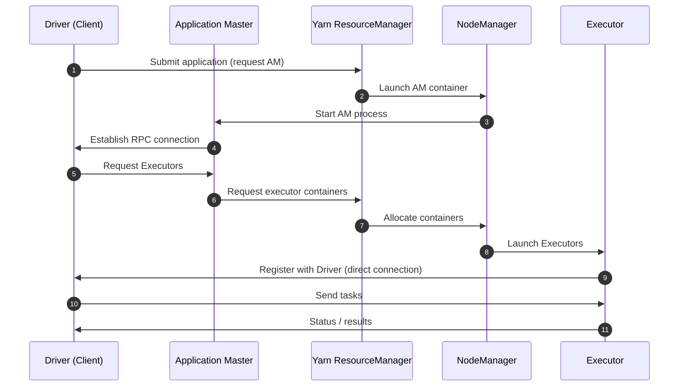
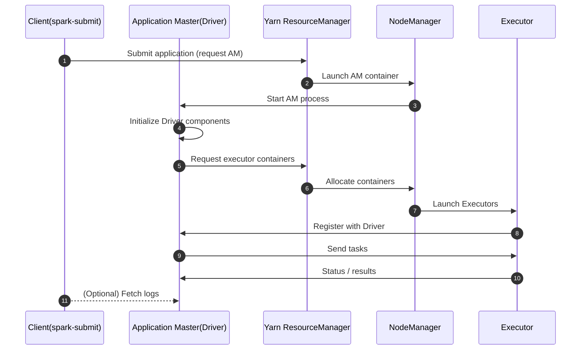
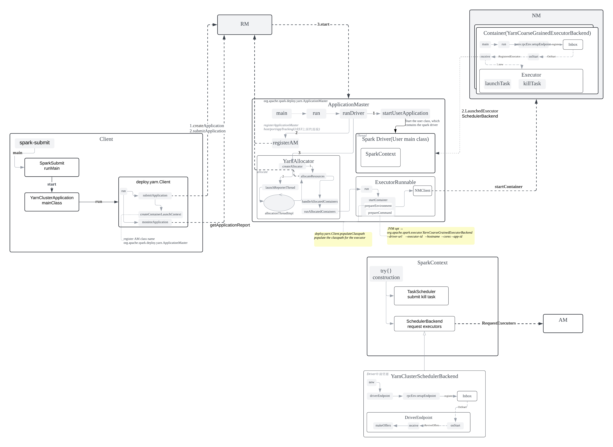
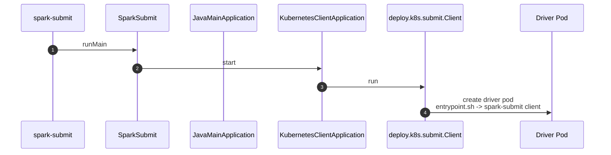
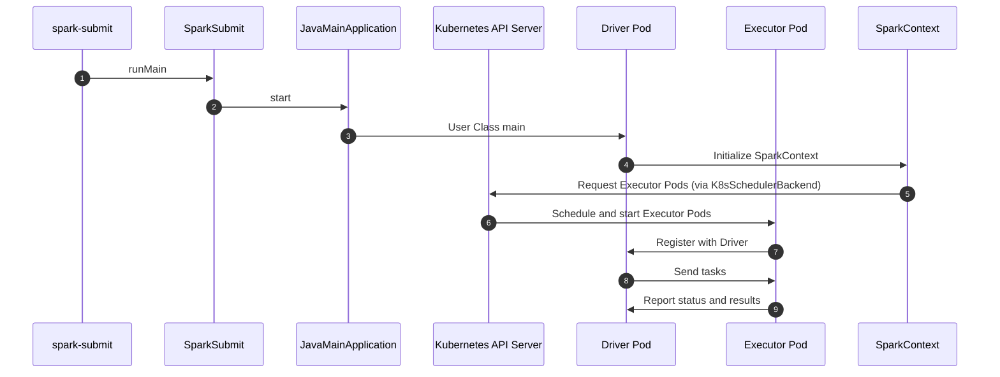
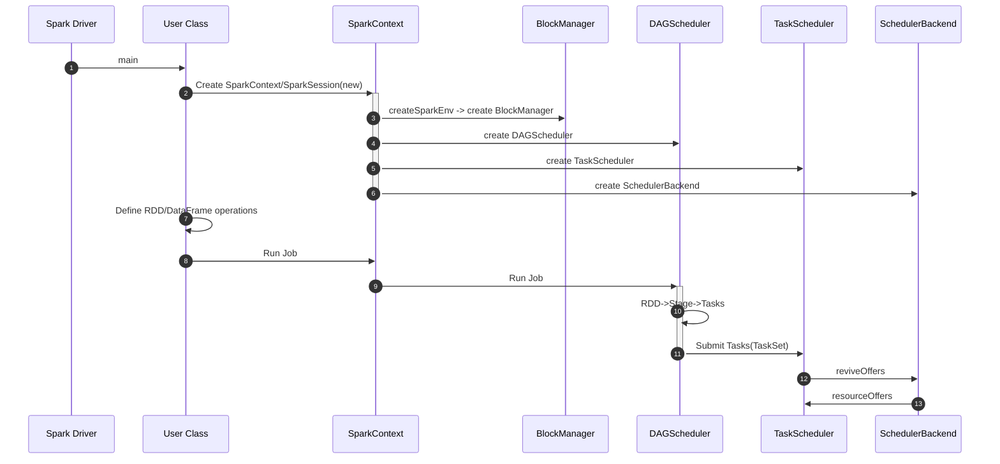

# Spark Driver 架构与部署模式详解

## 概述

Spark Driver 是 Spark 应用程序的控制中心，负责将用户代码转换为 DAG 并协调任务执行。根据部署环境和需求，Driver 可以运行在不同的模式下，每种模式在架构和通信机制上都有显著差异。

本文档详细介绍：
- Driver 在不同集群管理器（YARN、Kubernetes）下的部署架构
- Client 模式 vs Cluster 模式的技术差异
- Driver 内部组件的初始化和调度流程
- 各种部署模式的适用场景和技术特点

## YARN 集群部署模式

### Client 模式：Driver 和 AM 分离架构

- Driver 在客户端启动后，向 YARN 的 ResourceManager 提交应用，请求启动 AM。
- YARN 在集群中启动 AM 后，AM 会主动与客户端的 Driver 建立 RPC 连接。
- Driver 通过 AM 向 YARN 申请 Executor 资源，AM 负责具体的资源申请和 Executor 启动，并将结果反馈给 Driver。
- Executor 启动后，直接与客户端的 Driver 建立连接，接收 Task 并汇报执行状态（不经过 AM）。

**ApplicationMaster 职责**：
- 作为 Spark 应用在 YARN 中的"代理"，与 ResourceManager 交互申请 Container 资源
- 管理 Executor 的完整生命周期：启动、监控、故障恢复和销毁
- 在 Client 模式下，AM 主要负责资源管理，Driver 运行在客户端处理任务调度
- 处理 YARN 应用状态报告和资源释放，确保集群资源的有效利用

### Cluster 模式：Driver 和 AM 合并架构

**Cluster 模式特点**：
- Driver 与 ApplicationMaster 合并为单一进程，实现完全的集群内运行
- AM 内部启动 Driver 线程（`runDriver()` 方法），统一处理任务调度和资源管理
- 客户端提交应用后可以断开连接，应用在集群内自主运行
- 更适合生产环境的批处理作业和无人值守场景
- 故障恢复时整个 Driver 状态都在集群内，提高了可靠性
## Yarn cluster details

## SparkApplication
- JavaMainApplication
- YarnClusterApplication
- KubernetesClientApplication
## Kubernetes 集群部署模式

### Driver 提交和运行流程

**spark-submit.sh create Driver Pod**

**Driver and Executor communication flow**
- Driver pod 直接运行 JavaMainApplication(user class)
- 从 user class 创建 spark context，进而创建 driver components
- 然后 user class 再提交 spark job

**完整运行流程**：
1. **提交阶段**：客户端通过 `spark-submit` 向 K8s API Server 提交 Driver Pod 定义
2. **Driver 启动**：K8s 调度并启动 Driver Pod，执行用户应用程序
3. **资源申请**：Driver 内的 KubernetesClusterSchedulerBackend 向 API Server 申请 Executor Pod
4. **Executor 管理**：K8s 根据资源请求调度 Executor Pod，支持动态扩缩容
5. **任务执行**：Executor 向 Driver 注册后接收和执行任务

**Kubernetes 集群特点**：
- 没有 ApplicationMaster 角色，Driver 直接运行在 Kubernetes Pod 中
- 使用 KubernetesClusterSchedulerBackend 直接与 K8s API Server 交互申请 Executor Pod
- Driver Pod 通过 Kubernetes 原生机制管理 Executor Pod 的生命周期
- 支持动态资源分配，根据作业需求自动扩缩容 Executor 数量
- 利用 Kubernetes 的服务发现和负载均衡能力进行通信

## Driver 内部架构与调度流程

### SparkContext 初始化和组件创建

**核心组件初始化流程**：
- 创建 SparkContext，调用 `createTaskScheduler()` 方法根据 master URL 选择对应的 ClusterManager
- 根据部署模式（YARN/K8s/Standalone）创建相应的 SchedulerBackend 实现
- 创建 DAGScheduler，负责将 RDD 操作转换为 Stage DAG，处理 shuffle 依赖
- 创建 TaskScheduler 和 SchedulerBackend，处理任务调度和资源管理
- 建立心跳机制，监控任务状态、处理失败重试，收集执行结果

**调度机制详解**：
- DAGScheduler 将 RDD graph 在 shuffle 边界处分解为 Stage，窄依赖操作会被流水线化到同一个 Stage 中
- 向 TaskScheduler 提交 TaskSet，每个 TaskSet 包含基于已有数据可独立运行的 Task
- SchedulerBackend 通过 `makeOffers()` 申请资源，通过 `resourceOffers()` 进行资源调度
- TaskScheduler 负责单个 Task 的重试，DAGScheduler 负责 Stage 级别的重新提交

## 部署模式总结与对比

| 技术维度 | YARN Client | YARN Cluster | Kubernetes Cluster |
|----------|-------------|--------------|-------------------|
| **Driver位置** | 客户端机器 | AM容器内 | Driver Pod |
| **AM角色** | 独立进程，仅管理Executor | 合并进程，统一管理 | 无AM概念 |
| **资源申请流程** | Driver→AM→RM | Driver(AM)→RM | Driver→K8s API |
| **网络依赖** | 客户端可达集群 | 集群内通信 | 集群内通信 |
| **故障恢复机制** | 依赖客户端 | YARN重启AM | K8s重启Pod |
| **适用场景** | 交互式开发、调试 | 生产批处理 | 云原生环境 |
| **主要优点** | 支持实时交互、便于调试 | 完全集群化、无客户端依赖 | 容器化部署、自动扩缩容 |
| **主要缺点** | 依赖客户端、网络要求高 | 调试困难、日志查看不便 | 学习成本高、资源开销大 |