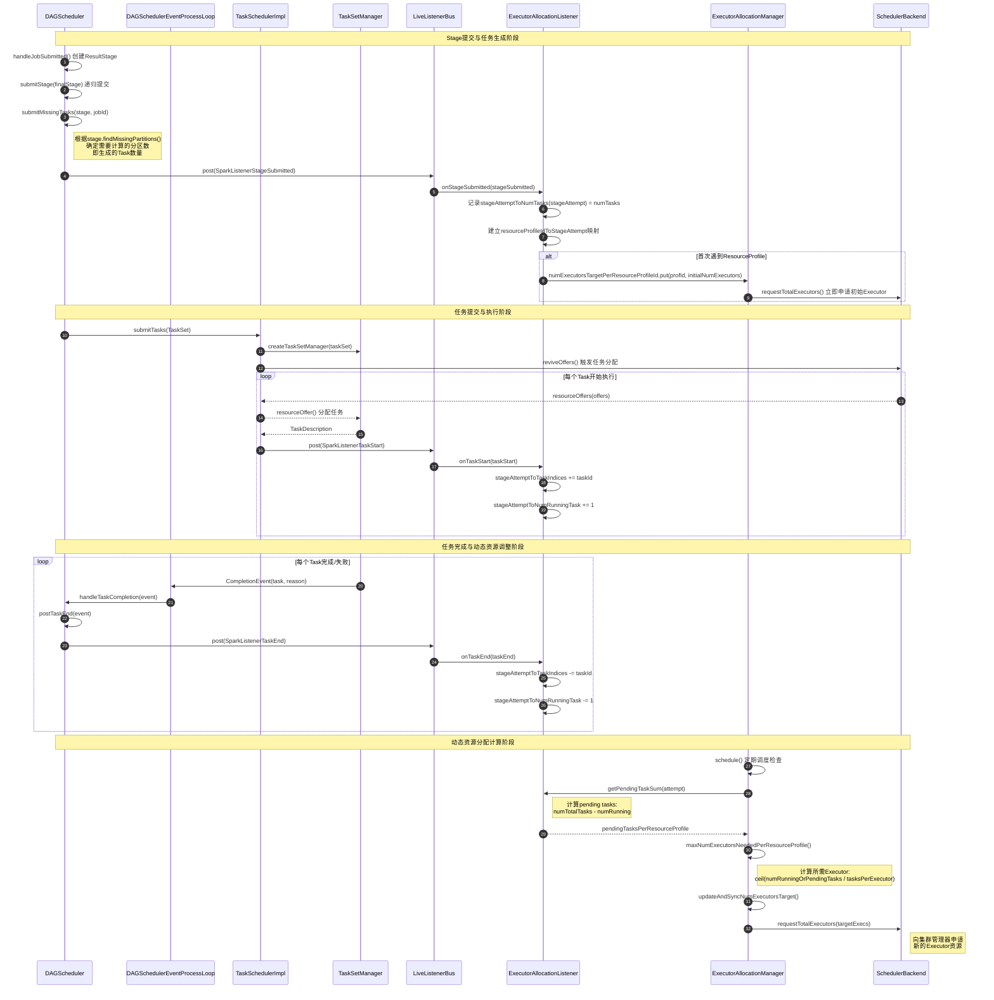
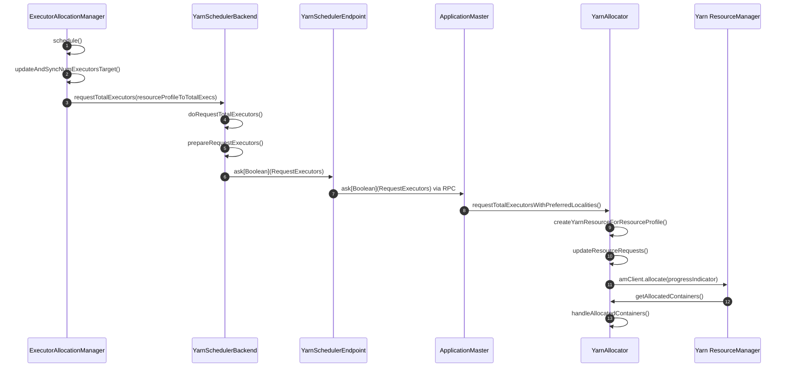
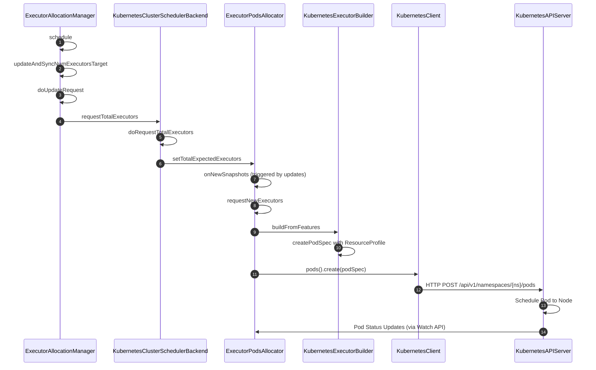

# 资源申请机制详解

## 概述

Spark 3.1+引入了**ResourceProfile**机制，实现了细粒度的资源管理。资源申请机制从传统的"一刀切"模式发展为支持不同RDD使用不同资源配置的灵活模式。

### 核心特性
- **向后兼容**：传统spark-submit配置依然有效
- **细粒度控制**：支持RDD级别的资源定义
- **动态分配**：根据workload自动调整executor数量
- **GPU支持**：原生支持GPU等自定义资源

## 任务调度与资源分配流程

Spark的资源管理包含两个层面：**Executor资源申请**（向集群管理器申请容器）和**任务资源分配**（在已有Executor上分配具体任务）。

Executor资源申请：从DAGScheduler提交Stage到ExecutorAllocationManager**计算Executor数量**的完整流程：



**流程总结**：

- **Stage提交**: `DAGScheduler.handleJobSubmitted()` → `submitStage()` → `submitMissingTasks()`
- **任务数量确定**: `stage.findMissingPartitions()`返回需要计算的分区，对应生成的Task数量
- **Stage事件触发**: `DAGScheduler.submitMissingTasks()`中触发`SparkListenerStageSubmitted`事件
- **ExecutorAllocationListener数据更新**:
  - `onStageSubmitted`: 记录`stageAttemptToNumTasks`，建立ResourceProfile映射
  - `onTaskStart`: 更新`stageAttemptToTaskIndices`和`stageAttemptToNumRunningTask`
  - `onTaskEnd`: 移除完成任务，减少运行中任务计数
- **Task完成处理**: `DAGScheduler.handleTaskCompletion()` → `postTaskEnd()` → 触发`SparkListenerTaskEnd`
- **Executor数量计算**: `ExecutorAllocationManager.maxNumExecutorsNeededPerResourceProfile()`
- **资源申请**: `updateAndSyncNumExecutorsTarget()` → `requestTotalExecutors()`

**Pending Tasks计算公式**：
```
每个Stage的pendingTasks = stageAttemptToNumTasks - stageAttemptToNumRunningTask
按ResourceProfile聚合 = Σ(各Stage的pendingTasks)
所需Executor数量 = ceil(pendingTasks / tasksPerExecutor)
```
## 资源申请流程对比

### Yarn模式资源申请流程



### Kubernetes模式资源申请流程



### 核心差异对比

| 对比维度 | Yarn模式 | Kubernetes模式 |
|---------|----------|----------------|
| **资源管理器** | Yarn ResourceManager | Kubernetes API Server |
| **资源单位** | Container | Pod |
| **中间组件** | ApplicationMaster + YarnAllocator | ExecutorPodsAllocator + KubernetesClient |
| **通信方式** | RPC (RequestExecutors Event) | HTTP REST API |
| **资源创建** | createYarnResourceForResourceProfile | buildFromFeatures + createPodSpec |
| **状态监控** | launchReporterThread轮询 | Watch API实时推送 |
| **资源配置** | Yarn容器资源配置 | Kubernetes Pod Spec |
| **失败处理** | Yarn重新分配容器 | Pod重启策略 + 重新创建 |

### 流程说明

上述流程图展示的是**新Executor申请流程**，与前面的**任务调度流程**共同构成Spark完整的资源管理体系：

- **任务调度流程**（reviveOffers→resourceOffers）：在现有Executor上分配和运行具体任务
- **Executor申请流程**（下面详述）：向集群管理器申请新的Executor容器/Pod

#### Yarn模式流程详解：

**阶段1：动态分配触发**
1. **ExecutorAllocationManager.schedule()**: 定期检查executor需求，触发资源调整
2. **updateAndSyncNumExecutorsTarget()**: 更新`numExecutorsTargetPerResourceProfileId`

**阶段2：资源请求准备**
3. **requestTotalExecutors()**: ExecutorAllocationManager调用YarnSchedulerBackend
4. **doRequestTotalExecutors()**: YarnSchedulerBackend处理请求
5. **prepareRequestExecutors()**: 准备RequestExecutors消息，包含：
   ```scala
   // YarnSchedulerBackend.scala:195-201
   RequestExecutors(
     resourceProfileToTotalExecs,           // ResourceProfile -> 目标executor数量
     numLocalityAwareTasksPerResourceProfileId,  // 本地性感知任务数
     filteredRPHostToLocalTaskCount,       // 本地性偏好
     excludedNodes                         // 排除节点
   )
   ```

**阶段3：RPC通信**
6. **YarnSchedulerEndpoint.ask()**: 通过RPC向ApplicationMaster发送RequestExecutors
7. **ApplicationMaster.receiveAndReply()**: AM接收并处理ResourceExecutors请求

**阶段4：Yarn资源分配**
8. **requestTotalExecutorsWithPreferredLocalities()**: YarnAllocator处理资源请求
9. **createYarnResourceForResourceProfile()**: 为每个ResourceProfile创建Yarn资源配置：
   ```scala
   // YarnAllocator.scala:265-275
   val resourcesWithDefaults = ResourceProfile.getResourcesForClusterManager(
     rp.id, rp.executorResources, memoryOverheadFactor, sparkConf, isPythonApp, resourceNameMapping)
   val yarnResource = Resource.newInstance(
     resourcesWithDefaults.executorMemoryMiB + resourcesWithDefaults.memoryOffheapMiB,
     resourcesWithDefaults.cores)
   ```

**阶段5：容器分配和启动**
10. **updateResourceRequests()**: 更新向Yarn ResourceManager的资源请求
11. **amClient.allocate()**: 向Yarn ResourceManager申请容器
12. **getAllocatedContainers()**: 获取ResourceManager分配的容器
13. **handleAllocatedContainers()**: 处理分配的容器，启动executor进程

### Yarn模式的关键源码位置

| 组件 | 源码文件 | 关键方法 | 作用 |
|------|----------|----------|------|
| **YarnSchedulerBackend** | `YarnSchedulerBackend.scala` | `doRequestTotalExecutors()` | 处理资源请求的入口点 |
| **YarnSchedulerEndpoint** | `YarnSchedulerBackend.scala` | `receiveAndReply()` | RPC消息处理，转发RequestExecutors |
| **ApplicationMaster** | `ApplicationMaster.scala` | `receiveAndReply()` | AM端处理RequestExecutors消息 |
| **YarnAllocator** | `YarnAllocator.scala` | `requestTotalExecutorsWithPreferredLocalities()` | 核心资源分配逻辑 |
| **YarnAllocator** | `YarnAllocator.scala` | `createYarnResourceForResourceProfile()` | ResourceProfile到Yarn资源的映射 |
| **YarnAllocator** | `YarnAllocator.scala` | `allocateResources()` | 与ResourceManager交互的核心方法 |

### Yarn模式的资源分配特点

#### 基于轮询的资源分配
```scala
// YarnAllocator.scala:379-385
def allocateResources(): Unit = synchronized {
  updateResourceRequests()
  val progressIndicator = 0.1f
  // Poll the ResourceManager. This doubles as a heartbeat if there are no pending container requests.
  val allocateResponse = amClient.allocate(progressIndicator)
  val allocatedContainers = allocateResponse.getAllocatedContainers()
  // ...
}
```

与Kubernetes的Watch API不同，Yarn采用**轮询模式**：
- **定期轮询**: ApplicationMaster定期调用`amClient.allocate()`
- **同步响应**: ResourceManager同步返回分配的容器
- **简单可靠**: 避免了复杂的异步回调机制

#### 资源配置精确映射
```scala
// YarnAllocator.scala:268-271
val yarnResource = Resource.newInstance(
  resourcesWithDefaults.executorMemoryMiB + resourcesWithDefaults.memoryOffheapMiB,  // 总内存
  resourcesWithDefaults.cores                                                       // CPU核心数
)
```

Yarn的资源配置更简单直接：
- **内存**: `executor-memory + memory-overhead + offheap-memory`
- **CPU**: 直接映射`executor-cores`到`vcores`
- **自定义资源**: 通过`yarn.scheduler.capacity.resource-calculator`支持

#### Kubernetes模式流程：
1. **ExecutorAllocationManager.schedule()**: 定期检查executor需求（与Yarn相同）
2. **updateAndSyncNumExecutorsTarget()**: 更新`numExecutorsTargetPerResourceProfileId`（与Yarn相同）
3. **doRequestTotalExecutors()**: K8sSchedulerBackend处理请求
4. **setTotalExpectedExecutors()**: 设置`totalExpectedExecutorsPerResourceProfileId`
5. **onNewSnapshots()**: 响应Pod状态快照更新，触发实际分配
6. **requestNewExecutors()**: 批量创建executor pod请求
7. **buildFromFeatures()**: 根据ResourceProfile构建Pod规格
8. **pods().create()**: 通过Kubernetes客户端创建Pod
9. **HTTP POST**: 向Kubernetes API Server发送Pod创建请求
10. **Pod调度**: Kubernetes调度器将Pod分配到合适的节点
11. **状态更新**: 通过Watch API实时获取Pod状态变化

### Kubernetes模式的独特特性

#### 1. 快照驱动的分配机制
```scala
// ExecutorPodsAllocator.scala:52-53
private val totalExpectedExecutorsPerResourceProfileId = new ConcurrentHashMap[Int, Int]()
snapshotsStore.addSubscriber(podAllocationDelay) {
  onNewSnapshots(applicationId, schedulerBackend, _)
}
```

与Yarn的推送模式不同，Kubernetes采用**快照驱动**的分配机制：
- **snapshotsStore**: 维护Pod状态的快照存储
- **podAllocationDelay**: 批量分配延迟，避免频繁API调用
- **onNewSnapshots**: 当Pod状态变化时触发重新评估和分配

#### 2. 批量Pod创建优化
```scala
// ExecutorPodsAllocator.scala:56-60
private val podAllocationSize = conf.get(KUBERNETES_ALLOCATION_BATCH_SIZE)      // 默认5
private val podAllocationDelay = conf.get(KUBERNETES_ALLOCATION_BATCH_DELAY)    // 默认1s
private val maxPendingPods = conf.get(KUBERNETES_MAX_PENDING_PODS)              // 默认Int.MaxValue
```

Kubernetes模式支持批量创建Pod以提高效率：
- **批量大小控制**: 避免同时创建过多Pod导致API Server压力
- **延迟分配**: 收集一定时间内的请求后批量处理
- **待处理Pod限制**: 防止创建过多待调度的Pod

#### 3. Pod生命周期管理
```scala
// ExecutorPodsAllocator.scala:86-91
private val newlyCreatedExecutors = mutable.LinkedHashMap.empty[Long, (Int, Long)]
private val schedulerKnownNewlyCreatedExecs = mutable.LinkedHashMap.empty[Long, Int]
private val podCreationTimeout = math.max(podAllocationDelay * 5, conf.get(KUBERNETES_ALLOCATION_EXECUTOR_TIMEOUT))
```

Kubernetes模式具有更复杂的生命周期管理：
- **新建Pod跟踪**: 追踪已请求但未在快照中出现的Pod
- **调度器感知Pod**: 区分调度器已知和未知的新建Pod
- **超时处理**: 自动清理创建超时的Pod

#### 4. 资源配置映射

**Yarn模式资源映射**：
```scala
// YarnAllocator: 直接映射到Yarn容器资源
memory: executor-memory + executor-memory-overhead
vcores: executor-cores
```

**Kubernetes模式资源映射**：
```scala
// KubernetesExecutorBuilder: 映射到Pod Spec
requests:
  memory: executor-memory
  cpu: executor-cores
limits:
  memory: executor-memory + executor-memory-overhead
  cpu: executor-cores (可配置倍数)
```

### 架构选择建议

#### 选择Yarn的场景：
- **传统Hadoop生态**: 已有Yarn集群基础设施
- **大规模批处理**: 对资源利用率要求极高
- **稳定性优先**: 成熟的ResourceManager机制
- **简单部署**: 不需要容器化复杂性

#### 选择Kubernetes的场景：
- **云原生环境**: 容器化、微服务架构
- **混合工作负载**: Spark + 其他容器化应用
- **弹性扩缩容**: 利用Kubernetes的自动扩缩容能力
- **资源隔离**: 更强的多租户隔离能力
- **DevOps集成**: 与CI/CD、监控、日志系统深度集成

## 核心原理

### numExecutorsTargetPerResourceProfileId

这是Spark动态分配的核心数据结构：

```scala
// ExecutorAllocationManager.scala:145-146
private[spark] val numExecutorsTargetPerResourceProfileId = new mutable.HashMap[Int, Int]
```

- **Key**: ResourceProfile ID
- **Value**: 该ResourceProfile所需的目标executor数量

#### 典型状态示例：
```scala
// 单一默认ResourceProfile的应用
numExecutorsTargetPerResourceProfileId(0) = 5  // 默认ResourceProfile需要5个executor

// 多ResourceProfile的复杂应用
numExecutorsTargetPerResourceProfileId(0) = 3  // 默认ResourceProfile: 3个executor
numExecutorsTargetPerResourceProfileId(1) = 2  // CPU密集型ResourceProfile: 2个executor
numExecutorsTargetPerResourceProfileId(2) = 1  // GPU ResourceProfile: 1个executor
```

### ResourceProfile与Stage的关系

**重要**：ResourceProfile与Stage是"一对多"关系。

#### Stage ResourceProfile确定流程：

1. **收集阶段**：收集Stage中所有RDD的ResourceProfile
   ```scala
   // DAGScheduler.scala: getShuffleDependenciesAndResourceProfiles()
   val resourceProfiles = new HashSet[ResourceProfile]
   // 遍历Stage中的所有RDD
   Option(toVisit.getResourceProfile).foreach(resourceProfiles += _)
   ```

2. **合并阶段**：将多个ResourceProfile合并为一个
   ```scala
   // DAGScheduler.scala: mergeResourceProfilesForStage()
   val resourceProfile = if (stageResourceProfiles.size > 1) {
     // 合并策略：取各资源的最大值
     val mergedProfile = stageResourceProfiles.drop(1)
       .foldLeft(startResourceProfile)((a, b) => mergeResourceProfiles(a, b))
   } else if (stageResourceProfiles.size == 1) {
     stageResourceProfiles.head
   } else {
     // 使用默认ResourceProfile
     sc.resourceProfileManager.defaultResourceProfile
   }
   ```

3. **Stage创建**：使用合并后的ResourceProfile创建Stage
   ```scala
   val stage = new ShuffleMapStage(..., resourceProfile.id)
   ```

### 资源申请触发机制

当新的ResourceProfile ID出现时，会自动在`numExecutorsTargetPerResourceProfileId`中创建entry：

```scala
// ExecutorAllocationManager.scala:711-720
override def onStageSubmitted(stageSubmitted: SparkListenerStageSubmitted): Unit = {
  val profId = stageSubmitted.stageInfo.resourceProfileId

  if (!numExecutorsTargetPerResourceProfileId.contains(profId)) {
    numExecutorsTargetPerResourceProfileId.put(profId, initialNumExecutors)  // 新增entry
    if (initialNumExecutors > 0) {
      // 立即向集群管理器申请资源
      client.requestTotalExecutors(
        numExecutorsTargetPerResourceProfileId.toMap,
        numLocalityAwareTasksPerResourceProfileId.toMap,
        rpIdToHostToLocalTaskCount)
    }
  }
}
```

## ResourceProfile机制

### 基本用法

#### 1. RDD级别资源定义
```scala
import org.apache.spark.resource._

// 创建轻量级ResourceProfile
val lightProfile = new ResourceProfileBuilder()
  .require(new ExecutorResourceRequests()
    .cores(2)
    .memory("4g"))
  .require(new TaskResourceRequests()
    .cpus(1))
  .build()

// 创建重量级ResourceProfile
val heavyProfile = new ResourceProfileBuilder()
  .require(new ExecutorResourceRequests()
    .cores(8)
    .memory("16g"))
  .require(new TaskResourceRequests()
    .cpus(2))
  .build()

// 应用到不同RDD
val preprocessedData = rawData
  .withResources(lightProfile)    // 使用轻量级资源
  .map(preprocess)

val model = preprocessedData
  .withResources(heavyProfile)    // 使用重量级资源
  .map(training)
```

#### 2. 默认ResourceProfile处理

如果RDD没有显式设置ResourceProfile：

```scala
// RDD.scala: getResourceProfile()
def getResourceProfile(): ResourceProfile = resourceProfile.getOrElse(null)  // 返回null

// DAGScheduler创建Stage时的处理
if (stageResourceProfiles.isEmpty) {
  // 使用默认ResourceProfile (ID=0)
  sc.resourceProfileManager.defaultResourceProfile
}
```

### ResourceProfile生命周期

1. **创建**: 通过`ResourceProfileBuilder`或系统默认创建
2. **注册**: 添加到`ResourceProfileManager`并分配唯一ID
3. **应用**: 通过`rdd.withResources()`关联到RDD
4. **执行**: Stage提交时触发资源申请
5. **清理**: Stage完成后相关资源可能被回收

## 动态资源分配

### 核心配置参数

```bash
# 启用动态分配
spark.dynamicAllocation.enabled=true

# 基本范围配置
spark.dynamicAllocation.minExecutors=1        # 最小executor数量
spark.dynamicAllocation.initialExecutors=3    # 初始executor数量
spark.dynamicAllocation.maxExecutors=20       # 最大executor数量

# 扩容策略
spark.dynamicAllocation.schedulerBacklogTimeout=5s           # 任务积压5秒后开始扩容
spark.dynamicAllocation.sustainedSchedulerBacklogTimeout=3s  # 持续积压3秒继续扩容
spark.dynamicAllocation.executorAllocationRatio=1.0          # 资源分配比例

# 缩容策略
spark.dynamicAllocation.executorIdleTimeout=60s              # executor空闲60秒后回收
spark.dynamicAllocation.cachedExecutorIdleTimeout=300s       # 有缓存的executor空闲5分钟后回收

# 必需依赖
spark.shuffle.service.enabled=true                           # 启用external shuffle service
```

### 动态分配算法

#### 扩容算法（指数增长）：
```scala
// ExecutorAllocationManager.scala: addExecutors()
var numExecutorsTarget = math.max(numExecutorsTargetPerResourceProfileId(rpId),
    executorMonitor.executorCountWithResourceProfile(rpId))
numExecutorsTarget += numExecutorsToAddPerResourceProfileId(rpId)  // 指数增长
numExecutorsTarget = math.min(numExecutorsTarget, maxNumExecutorsNeeded)
numExecutorsTarget = math.max(math.min(numExecutorsTarget, maxNumExecutors), minNumExecutors)
```

**扩容过程示例**：
```
初始: 2个executor
第1次扩容(5s后): 2 + 1 = 3个executor
第2次扩容(3s后): 3 + 2 = 5个executor
第3次扩容(3s后): 5 + 4 = 9个executor
第4次扩容(3s后): 9 + 8 = 17个executor (受maxNumExecutors=20限制，实际为17)
```

#### 缩容算法：
```scala
// ExecutorAllocationManager.scala: decrementExecutors()
numExecutorsTargetPerResourceProfileId(rpId) = math.max(maxNeeded, minNumExecutors)
```

缩容更保守，直接降到实际需要的数量，但不低于`minNumExecutors`。

## spark-submit配置详解

### 完整配置模板

```bash
spark-submit \
  # === 基本资源配置 ===
  --master yarn \
  --deploy-mode cluster \
  --executor-cores 4 \                    # 每个executor的CPU核心数
  --executor-memory 8g \                  # 每个executor的内存
  --executor-memory-overhead 1g \         # executor内存开销
  --driver-cores 2 \                      # driver的CPU核心数
  --driver-memory 4g \                    # driver内存

  # === 动态分配配置 ===
  --conf spark.dynamicAllocation.enabled=true \
  --conf spark.dynamicAllocation.minExecutors=2 \
  --conf spark.dynamicAllocation.initialExecutors=5 \
  --conf spark.dynamicAllocation.maxExecutors=50 \
  --conf spark.dynamicAllocation.schedulerBacklogTimeout=5s \
  --conf spark.dynamicAllocation.sustainedSchedulerBacklogTimeout=3s \
  --conf spark.dynamicAllocation.executorIdleTimeout=60s \
  --conf spark.dynamicAllocation.cachedExecutorIdleTimeout=300s \
  --conf spark.shuffle.service.enabled=true \

  # === Task并发配置 ===
  --conf spark.task.cpus=1 \              # 每个task需要的CPU核心数
  --conf spark.task.maxFailures=3 \       # task最大失败重试次数
  --conf spark.default.parallelism=200 \  # 默认并行度（RDD操作）
  --conf spark.sql.shuffle.partitions=400 \ # SQL shuffle分区数

  # === 调度配置 ===
  --conf spark.scheduler.mode=FAIR \      # 调度模式（FIFO/FAIR）
  --conf spark.locality.wait=3s \         # 数据本地性等待时间

  # === GPU配置（可选） ===
  --conf spark.executor.resource.gpu.amount=1 \
  --conf spark.executor.resource.gpu.discoveryScript=/opt/getGpusResources.sh \
  --conf spark.task.resource.gpu.amount=1 \

  # === 应用配置 ===
  --class com.example.MyApp \
  --name "MySparkApp" \
  /path/to/myapp.jar
```

### spark-submit与ResourceProfile的关系

#### 1. 默认ResourceProfile创建
```scala
// ResourceProfile.scala: getDefaultExecutorResources()
private def getDefaultExecutorResources(conf: SparkConf): Map[String, ExecutorResourceRequest] = {
  val ereqs = new ExecutorResourceRequests()
  val cores = conf.get(EXECUTOR_CORES)              // --executor-cores的值
  ereqs.cores(cores)
  val memory = conf.get(EXECUTOR_MEMORY)            // --executor-memory的值
  ereqs.memory(memory.toString)
  // ... 处理其他资源
}
```

#### 2. 兼容性保证
- **默认ResourceProfile (ID=0)**: 由spark-submit参数创建
- **自定义ResourceProfile (ID>0)**: 由`rdd.withResources()`创建
- **向后兼容**: 不使用新API的应用行为完全不变

## executor-cores与task关系

### 核心公式

```
每个executor的最大并发task数 = executor_cores / spark.task.cpus
```

### 详细计算逻辑

```scala
// ResourceProfile.scala: calculateTasksAndLimitingResource()
private def calculateTasksAndLimitingResource(sparkConf: SparkConf): Unit = {
  val cpusPerTask = taskResources.get(ResourceProfile.CPUS)
    .map(_.amount).getOrElse(sparkConf.get(CPUS_PER_TASK).toDouble).toInt
  val coresPerExecutor = getExecutorCores.getOrElse(sparkConf.get(EXECUTOR_CORES))
  val tasksBasedOnCores = coresPerExecutor / cpusPerTask  // 核心计算！

  // 检查其他资源限制（如GPU）
  // 取最小值作为最终限制
}
```

### 实际示例

#### 场景1：CPU密集型任务
```bash
--executor-cores 8
--conf spark.task.cpus=2
# 结果：每个executor最多 8/2 = 4个并发task
```

#### 场景2：I/O密集型任务
```bash
--executor-cores 4
--conf spark.task.cpus=1  # 默认值
# 结果：每个executor最多 4/1 = 4个并发task
```

#### 场景3：GPU限制的任务
```bash
--executor-cores 8
--conf spark.task.cpus=2
--conf spark.executor.resource.gpu.amount=2    # 2个GPU
--conf spark.task.resource.gpu.amount=1        # 每task需要1个GPU
# 结果：受GPU限制，每个executor最多2个并发task（而非CPU的4个）
```

### 并发度计算

```
应用总并发task数 = executor数量 × 每executor最大task数
实际并发受限因子 = min(CPU限制, GPU限制, 内存限制, ...)
```

#### 完整示例：
```bash
# 配置
--executor-cores 8
--conf spark.task.cpus=2
--conf spark.dynamicAllocation.maxExecutors=10
--conf spark.default.parallelism=200

# 计算过程
每executor最大task数 = 8 / 2 = 4
最大总并发task数 = 10 × 4 = 40
实际需要executor数 = 200 / 4 = 50

# 结果：动态分配会尝试申请50个executor，但受maxExecutors=10限制
# 最终并发度为 10 × 4 = 40个task
```

## GPU资源支持

Spark 3.0+全面支持GPU资源管理。

### GPU配置参数

```bash
# spark-submit级别的GPU配置
spark-submit \
  --conf spark.executor.resource.gpu.amount=2 \                    # 每个executor 2个GPU
  --conf spark.executor.resource.gpu.discoveryScript=/opt/getGpus.sh \ # GPU发现脚本
  --conf spark.executor.resource.gpu.vendor=nvidia \               # GPU厂商
  --conf spark.task.resource.gpu.amount=1 \                        # 每个task 1个GPU
  MyGpuApp.jar
```

### GPU发现脚本

```bash
#!/bin/bash
# /opt/getGpusResources.sh
# 使用nvidia-smi获取可用GPU列表
ADDRS=`nvidia-smi --query-gpu=index --format=csv,noheader | sed -e ':a' -e 'N' -e'$!ba' -e 's/\n/","/g'`
echo {\"name\": \"gpu\", \"addresses\":[\"$ADDRS\"]}

# 输出示例：{"name": "gpu", "addresses":["0","1","2","3"]}
```

### ResourceProfile中的GPU配置

```scala
// 创建GPU ResourceProfile
val gpuProfile = new ResourceProfileBuilder()
  .require(new ExecutorResourceRequests()
    .cores(4)
    .memory("8g")
    .resource("gpu", 2, "/opt/getGpusResources.sh", "nvidia"))  // 2个GPU
  .require(new TaskResourceRequests()
    .cpus(1)
    .resource("gpu", 1))                                        // 每task 1个GPU
  .build()

// 应用到RDD
val gpuResults = data
  .withResources(gpuProfile)
  .map(gpuAcceleratedFunction)  // GPU加速计算
```

### 混合工作负载示例

```scala
// 数据预处理（CPU）+ 模型训练（GPU）
val cpuProfile = new ResourceProfileBuilder()
  .require(new ExecutorResourceRequests().cores(2).memory("4g"))
  .build()

val gpuProfile = new ResourceProfileBuilder()
  .require(new ExecutorResourceRequests()
    .cores(4).memory("8g")
    .resource("gpu", 1, "/opt/getGpusResources.sh", "nvidia"))
  .require(new TaskResourceRequests().resource("gpu", 1))
  .build()

// ETL管道
val preprocessed = rawData
  .withResources(cpuProfile)     // CPU预处理
  .map(preprocess)

val model = preprocessed
  .withResources(gpuProfile)     // GPU训练
  .map(trainModel)

// 对应的numExecutorsTargetPerResourceProfileId可能为:
// {0: 2, 1: 3, 2: 1}  // 默认、CPU、GPU三种ResourceProfile
```

## 实战配置示例

### 1. CPU密集型应用（机器学习）

```bash
spark-submit \
  --executor-cores 8 \
  --executor-memory 32g \
  --conf spark.task.cpus=4 \                    # 每task使用更多CPU
  --conf spark.dynamicAllocation.enabled=true \
  --conf spark.dynamicAllocation.maxExecutors=20 \
  --conf spark.default.parallelism=80 \         # 20×(8/4)=40，设置为2倍
  MLTrainingApp.jar
```

### 2. I/O密集型应用（ETL）

```bash
spark-submit \
  --executor-cores 4 \
  --executor-memory 16g \
  --conf spark.task.cpus=1 \                    # 每task使用较少CPU
  --conf spark.dynamicAllocation.enabled=true \
  --conf spark.dynamicAllocation.maxExecutors=50 \
  --conf spark.sql.shuffle.partitions=800 \     # 更多分区提高I/O并发
  ETLPipeline.jar
```

### 3. 内存密集型应用（大数据分析）

```bash
spark-submit \
  --executor-cores 6 \
  --executor-memory 64g \
  --executor-memory-overhead 8g \               # 更大的内存开销
  --conf spark.task.cpus=2 \
  --conf spark.dynamicAllocation.maxExecutors=10 \
  --conf spark.sql.adaptive.enabled=true \     # 启用AQE优化
  BigDataAnalytics.jar
```

### 4. GPU加速应用（深度学习）

```bash
spark-submit \
  --executor-cores 8 \
  --executor-memory 32g \
  --conf spark.task.cpus=2 \
  --conf spark.executor.resource.gpu.amount=2 \
  --conf spark.executor.resource.gpu.discoveryScript=/opt/getGpus.sh \
  --conf spark.task.resource.gpu.amount=1 \
  --conf spark.dynamicAllocation.maxExecutors=5 \  # GPU资源珍贵，限制数量
  DeepLearningApp.jar
```

### 5. 混合工作负载应用

```scala
// 应用代码示例
object MixedWorkloadApp {
  def main(args: Array[String]): Unit = {
    val spark = SparkSession.builder()
      .appName("MixedWorkloadApp")
      .getOrCreate()

    // 轻量级预处理Profile
    val etlProfile = new ResourceProfileBuilder()
      .require(new ExecutorResourceRequests().cores(2).memory("4g"))
      .build()

    // 重量级分析Profile
    val analyticsProfile = new ResourceProfileBuilder()
      .require(new ExecutorResourceRequests().cores(8).memory("16g"))
      .require(new TaskResourceRequests().cpus(2))
      .build()

    // GPU训练Profile
    val gpuProfile = new ResourceProfileBuilder()
      .require(new ExecutorResourceRequests()
        .cores(4).memory("8g")
        .resource("gpu", 1, "/opt/getGpus.sh", "nvidia"))
      .require(new TaskResourceRequests().resource("gpu", 1))
      .build()

    // 数据管道
    val rawData = spark.read.parquet("/data/raw")

    val cleaned = rawData
      .withResources(etlProfile)           // 轻量级清洗
      .filter(cleaningFunction)

    val features = cleaned
      .withResources(analyticsProfile)     // 重量级特征工程
      .map(featureEngineering)

    val model = features
      .withResources(gpuProfile)           // GPU训练
      .map(gpuTraining)

    model.write.save("/models/output")
  }
}
```

对应spark-submit配置：
```bash
spark-submit \
  --conf spark.dynamicAllocation.enabled=true \
  --conf spark.dynamicAllocation.minExecutors=1 \
  --conf spark.dynamicAllocation.maxExecutors=20 \
  --conf spark.executor.resource.gpu.amount=1 \
  --conf spark.executor.resource.gpu.discoveryScript=/opt/getGpus.sh \
  --conf spark.shuffle.service.enabled=true \
  --class MixedWorkloadApp \
  mixed-workload-app.jar
```

## 总结

Spark 3.3.1的资源申请机制实现了从**静态配置**到**动态适应**，从**统一资源**到**差异化资源**的重大升级：

1. **numExecutorsTargetPerResourceProfileId**是动态分配的核心，按ResourceProfile ID管理executor目标数量
2. **ResourceProfile**支持RDD级别的细粒度资源定义，实现真正的workload感知
3. **动态分配**提供智能的扩缩容机制，在成本和性能间取得平衡
4. **GPU支持**为AI/ML工作负载提供了原生的加速资源管理
5. **向后兼容**确保现有应用无缝迁移