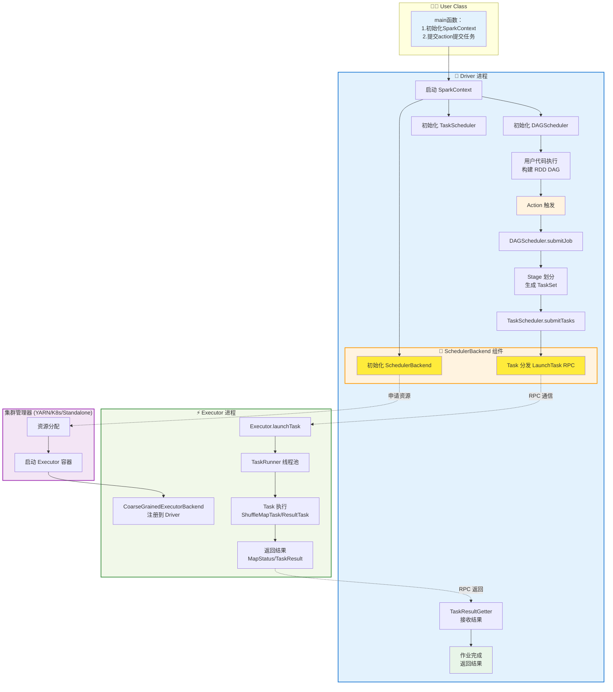
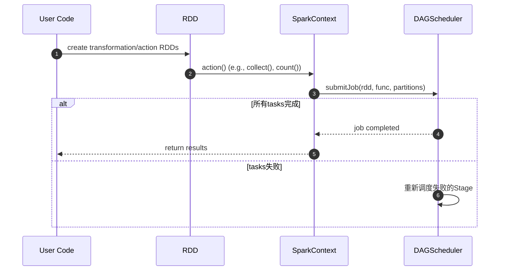
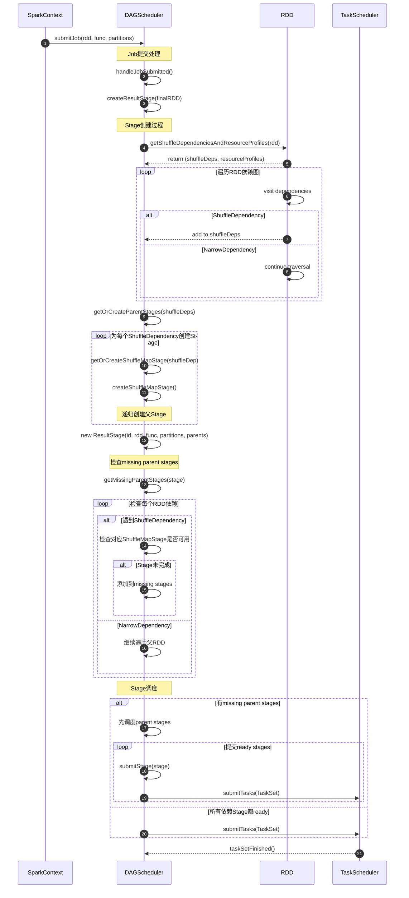
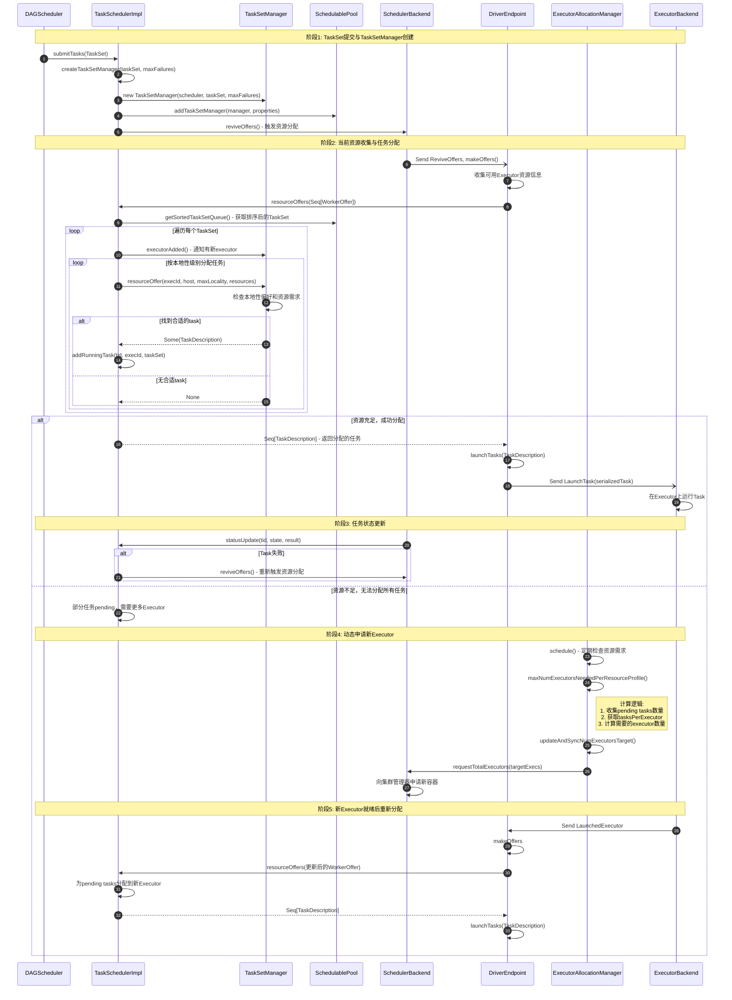
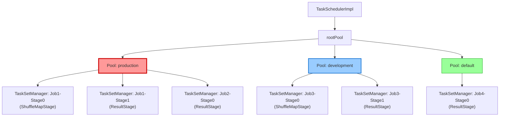

# Spark Submit Job 组件详解

## Spark 的运行流程？

流程描述：
1. 提交应用：用户通过 spark-submit 提交应用程序，启动 Driver JVM 进程。
2. 初始化上下文：Driver 启动并初始化 SparkContext，创建 SparkEnv、DAGScheduler、TaskScheduler 和 SchedulerBackend 等核心组件。
3. 申请资源：SparkContext 通过 SchedulerBackend 向集群管理器（YARN/K8s/Standalone）申请 Executor 资源。
4. 启动 Executor：集群管理器启动 CoarseGrainedExecutorBackend 进程，向 Driver 注册并建立 RPC 连接。
5. 构建 RDD DAG：用户代码中的 transformations 在 Driver 端构建 RDD 血统关系（lineage），形成 DAG。
6. 触发作业提交：Action 操作（如 collect()）触发 SparkContext.runJob()，提交作业给 DAGScheduler。
7. Stage 划分：DAGScheduler 根据 ShuffleDependency（宽依赖）将 DAG 划分为 Stage，构建 Stage DAG。
8. 生成 TaskSet：DAGScheduler 为每个 Stage 生成 TaskSet，包含多个 Task（每个 RDD partition 对应一个 Task）。
9. Task 调度：TaskScheduler 接收 TaskSet，根据数据本地性和资源可用性选择合适的 Executor。
10. Task 分发：SchedulerBackend 通过 RPC 将序列化的 Task 发送给选定的 Executor（LaunchTask 消息）。
11. Task 执行：Executor 在 ThreadPool 中执行 Task，调用 Task.runTask() 方法：
    - ShuffleMapTask：执行 RDD 计算并写入 Shuffle 文件，返回 MapStatus
    - ResultTask：执行 RDD 计算并应用最终函数，返回计算结果
12. 结果收集：TaskResultGetter 接收 Task 结果，更新 TaskSetManager 状态，通知 DAGScheduler Stage 完成。
13. 作业完成：所有 Stage 完成后，DAGScheduler 通知 SparkContext 作业完成，返回最终结果。
14. 资源清理：作业结束后，SparkContext 关闭，释放 Executor 资源，清理临时文件。

## 进程架构详解

### Driver Yarn Cluster 进程架构

**Driver JVM 进程**：包含用户应用程序和所有调度组件，是 Spark 应用的控制中心
1. **用户应用程序**：运行用户的 main 方法，创建 SparkContext/SparkSession
2. **核心调度组件**：
   - **SparkContext**：应用程序入口，协调各组件工作
   - **DAGScheduler**：将 RDD 操作转换为 Stage DAG，处理 Stage 级别的调度
   - **TaskScheduler**：将 TaskSet 分配给具体的 Executor，处理 Task 级别的调度
   - **SchedulerBackend**：与集群管理器交互，管理 Executor 资源和 RPC 通信

### Executor 进程架构

**Executor JVM 进程**：每个 Executor 对应一个独立的 JVM 进程，包含一个 CoarseGrainedExecutorBackend 和一个 Executor 实例
1. **两阶段启动流程**：
   - **阶段1**：JVM 启动后首先创建 CoarseGrainedExecutorBackend，作为 RPC 端点与 Driver 建立连接
   - **阶段2**：向 Driver 注册成功后才创建真正的 Executor 实例，开始接收和执行任务
2. **职责分离**：CoarseGrainedExecutorBackend 专职处理 RPC 通信，Executor 专职管理任务执行线程池
3. **容错设计**：只有注册成功的 Executor 才会被创建，避免资源浪费和无效连接

## DAGScheduler

DAGScheduler核心职责包括：

- **Stage DAG构建**：分析用户已构建的RDD DAG，在Shuffle边界处划分并构建Stage DAG
- **任务提交**：将Stage转换为TaskSet提交给底层TaskScheduler
- **故障恢复**：处理因Shuffle输出文件丢失导致的故障，重新提交Stage
- **本地性优化**：基于RDD的preferred locations确定任务运行位置

### RDD operation类型
- **Transformation**：如map、filter、reduceByKey等，定义RDD的转换操作
- **Action**：如collect、count、saveAsTextFile等，触发实际计算并返回结果

### Stage类型
- **ResultStage**：最终执行Action操作的Stage
- **ShuffleMapStage**：为Shuffle操作写入map输出文件的Stage

### Stage划分原理

1. **Shuffle边界识别**：
    - 遇到`ShuffleDependency`时创建新的Stage
    - `NarrowDependency`的RDD可以pipeline到同一个Stage

2. **Stage依赖关系**：
    - ResultStage依赖ShuffleMapStage
    - Stage之间只能有Shuffle依赖，不能有Narrow依赖

3. **Stage调度顺序**：
    - 必须先完成所有父Stage才能开始子Stage
    - 采用拓扑排序确定Stage执行顺序

### Stage DAG构建流程

#### DAG的主要步骤

| 步骤 | 处理过程 | 关键方法 |
|------|----------|----------|
| **1. Action触发** | 用户调用Action方法（如collect、count），触发Job提交 | `submitJob()` |
| **2. RDD依赖分析** | 遍历RDD依赖图，识别ShuffleDependency和NarrowDependency | `getShuffleDependenciesAndResourceProfiles()` |
| **3. Stage划分** | 在shuffle边界处分割RDD图，创建Stage DAG | `createResultStage()`, `getOrCreateParentStages()` |
| **4. Stage排序** | 检查父Stage依赖关系，确定Stage执行顺序 | `getMissingParentStages()` |
| **5. Task创建** | 根据Stage类型和分区数创建具体的Task，组成TaskSet | `submitStage()` |
| **6. Task提交** | 将TaskSet提交给TaskScheduler进行资源分配和执行 | `submitTasks()` |

#### 实际应用示例

```scala
// 示例：WordCount程序的Stage划分
val textFile = sc.textFile("hdfs://...")           // Stage 0 开始
val words = textFile.flatMap(_.split(" "))         // 仍在 Stage 0 (narrow dependency)
val pairs = words.map(word => (word, 1))           // 仍在 Stage 0 (narrow dependency)
val counts = pairs.reduceByKey(_ + _)               // Stage 0 结束，Stage 1 开始 (shuffle dependency)
counts.collect()                                    // Stage 1：ResultStage

// Stage划分结果：
// Stage 0 (ShuffleMapStage): textFile -> flatMap -> map -> write shuffle files
// Stage 1 (ResultStage): read shuffle files -> reduceByKey -> collect
```

#### submitJob overview
Driver 调用Action触发Job提交，DAGScheduler根据RDD DAG构建Stage DAG：


#### Stage(TaskSet) 创建详细流程



## TaskScheduler
TaskSchedulerImpl负责将 DAGScheduler 生成的 TaskSet 分配给具体的 Executor。它根据 SchedulerBackend 提供的资源信息，
选择合适的 Executor，然后提交SchedulerBackend运行任务。

主要方法：
- **submitTasks()**: 为TaskSet创建TaskSetManager，加入调度池，触发资源分配
- **resourceOffers()**: 接收SchedulerBackend的资源提供，遍历TaskSet按本地性分配任务
- **statusUpdate()**: 处理任务状态更新，转发给对应的TaskSetManager
- **taskSetFinished()**: 清理已完成TaskSet的相关状态和映射关系

### submitTasks 主要步骤

| 步骤 | 处理过程 | 触发条件 |
|------|----------|----------|
| **1. TaskSet注册** | 创建TaskSetManager，加入调度池，建立任务跟踪映射 | DAGScheduler提交TaskSet |
| **2. 资源收集** | 收集当前可用Executor资源，触发resourceOffers | TaskSet提交后立即执行 |
| **3. 任务分配** | 根据本地性偏好和资源需求，将Task分配给合适的Executor | 有可用资源时 |
| **4. 任务执行监控** | 处理任务状态更新，统计进度，处理失败重试 | 任务运行期间持续进行 |
| **5. 动态扩容** | 检测资源不足，向集群管理器申请新Executor | 任务pending且资源不足 |
| **6. 重新调度** | 新Executor注册后，重新分配pending任务 | 新Executor可用时 |



### TaskScheduler中的rootPool(调度池)

Fair Scheduler（公平调度器）


FIFO Scheduler（先进先出调度器）


## TaskSetManager
- **resourceOffer()**: 根据本地性偏好和资源需求选择合适的任务进行分配
- **handleSuccessfulTask()**: 处理任务成功完成，更新进度，检查TaskSet是否全部完成
- **handleFailedTask()**: 处理任务失败，执行重试逻辑，决定是否重新调度或标记TaskSet失败
- **executorAdded()**: 响应新executor加入，可能触发延迟调度的任务重新分配


## SchedulerBackend

- **SchedulerBackend**：集群管理器的核心抽象接口，定义了与底层集群（yarn/k8s/Standalone）交互的基本能力。
  - ExecutorAllocationClient:
    - `requestTotalExecutors`: call by `ExecutorAllocationManager.schedule` adjust requested executors
  - DriverEndpoint.Event
    - LaunchedExecutor: 用于通知集群管理器某个 Executor 已成功启动
    - RemoveExecutor: 用于移除指定的 Executor
    - ReviveOffers: 把定时申请的资源（workOffers）提供给TaskScheduler，触发任务调度，enrich task
    - LaunchTask: 真实下发任务给 Executor
    - KillTask: 用于终止正在运行的任务
    - StatusUpdate: 用于接收 Executor 发送的任务状态更新
- **CoarseGrainedSchedulerBackend**：
是 SchedulerBackend 的一个重要实现类，采用 "粗粒度" 资源分配模式（一次性申请所有需要的资源，
任务共享资源），大多数集群管理器（如 YARN、K8s、Standalone）都基于它扩展。
  - YarnClusterSchedulerBackend：YARN 集群管理器的 `CoarseGrainedSchedulerBackend` 实现，负责与 YARN ResourceManager 交互
  - KubernetesClusterSchedulerBackend：Kubernetes 集群管理器的 `CoarseGrainedSchedulerBackend` 实现，负责与 K8s API 交互

## ExecutorBackend
### 入口，组件初始化
- 作为 executor 的启动入口，首先初始化 SparkEnv
  - SparkEnv 初始化时，会创建 rpcEnv、blockManager、shuffleManager，memoryManager
    - NettyRpcEnv 会创建 Dispatcher

#### NettyRpcEnv
NettyRpcEnv是Spark分布式计算的通信基石，确保Driver、Executor和其他组件之间能够高效、可靠地通信，支持Spark的各种分布式操作。
- 通过setupEndpoint注册RPC端点
- 通过send/ask方法发送消息
- Dispatcher将消息路由到目标端点

#### Dispatcher
Dispatcher在Spark的分布式通信中扮演着中枢角色，确保了RPC消息能够高效、可靠地传递到各个组件，是Spark集群内部通信的基础。
- postOneWayMessage --> MessageLoop / Inbox -> local queue
- postToOutbox --> Outbox --> remote RPC

### onStart    
- 注册 RegisterExecutor 到 SchedulerBackend

### 接收的 events
运行在每个Container 上的组件，负责与 Driver 端的 SchedulerBackend 通信。
它接收来自 Driver 的任务指令，执行任务，并将执行结果和状态汇报回 Driver。
Will create Executor instance to run task.

Container = 1 ExecutorBackend = 1 Executor.

- statusUpdate： report task status to Driver
- **CoarseGrainedExecutorBackend**：是 ExecutorBackend 的一个重要实现类，负责在 Executor 端与 Driver 进行通信。
  它接收来自 Driver 的任务指令，执行任务，并将执行结果和状态汇报回 Driver。
  - RegisteredExecutor: create Executor, and send registration to Driver
  - LaunchTask: launch task receive from Driver, `executor` will run task
  - KillTask: kill task by id, `executor` will kill the task
  - StopExecutor/Shutdown: stop executor

#### Executor
Executor 处理 ExecutorBackend 的 LaunchTask 、KillTask 事件
- launchTask
- killTask

#### TaskRunner
- TaskRunner是Executor执行 Task 的实际载体，通过精细的生命周期管理和资源控制，确保任务能够高效、可靠地执行，并将结果准确返回给Driver。
- 实现 java Runnable， 是一个线程
- 执行 Task 的 run 方法

