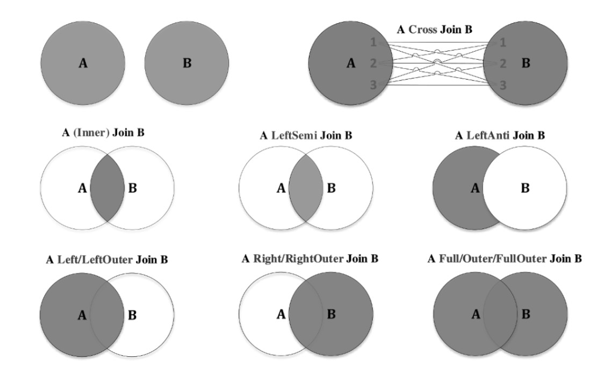

## Inner vs Semi

Left Semi Join 的输出列完全来自左表，右表的列不会出现在结果中。
Left Semi Join => `where key in (...)`
Left anti join => `where key not in (...)`

case 1:
```text
left_table:                        right_table:
+----+-------+                    +----+-------+
| key| value |                    | key| value |
+----+-------+                    +----+-------+
|  1 |  L_1  |                    |  1 |  R_1  |
|  2 |  L_2  |                    |  1 |  R_2  |
+----+-------+                    +----+-------+

Inner Join:
+-----+-------+---------+
|L.key|L.value| R.value |
+-----+-------+---------+
|  1  |  L_1  |   R_1   |
|  1  |  L_1  |   R_2   |
+-----+-------+---------+

Left Semi Join:
+-----+-------+
| key | value |
+-----+-------+
|  1  |  L_1  |
+-----+-------+
```

case2:
```
left_table:                        right_table:
+----+-------+                    +----+-------+
| key| value |                    | key| value |
+----+-------+                    +----+-------+
|  1 |  L_1  |                    |  1 |  R_1  |
|  1 |  L_2  |                    |  1 |  R_2  |
|  2 |  L_3  |                    +----+-------+
+----+-------+

Inner Join:
+-----+-------+---------+
|L.key|L.value| R.value |
+-----+-------+---------+
|  1  |  L_1  |   R_1   |
|  1  |  L_2  |   R_2   |
|  1  |  L_1  |   R_1   |
|  1  |  L_2  |   R_2   |
+-----+-------+---------+

Left Semi Join:
+----+-------+
| key| value |
+----+-------+
|  1 |  L_1  |
|  1 |  L_2  |
+----+-------+
```

## Join Optimization
```
   Join 类型                    触发条件                                                             原理                                                        适用场景
  ━━━━━━━━━━━━━━━━━━━━━━━━━━━━━━━━━━━━━━━━━━━━━━━━━━━━━━━━━━━━━━━━━━━━━━━━━━━━━━━━━━━━━━━━━━━━━━━━━━━━━━━━━━━━━━━━━━━━━━━━━━━━━━━━━━━━━━━━━━━━━━━━━━━━━━━━━━━━━━━━━━━━━━━━━━━━━━━━━━━━━━━━
   Broadcast Hash Join          一边 <= autoBroadcastJoinThreshold (10MB)                            广播小表到所有 executor，建 hash table，大表逐行 probe      小表 join 大表
   Shuffle Hash Join            两边都大，但一边相对较小；spark.sql.join.preferSortMergeJoin=false   两边都 shuffle 按 key 分区，小表建 hash table，大表 probe   中等表 join 大表，内存够
   Sort Merge Join              两边都大，默认首选                                                   两边 shuffle 排序，然后归并扫描匹配                         大表 join 大表，最稳定
   Broadcast Nested Loop Join   非等值连接，一边能广播                                               广播小表，双层循环匹配                                      非等值 + 小表
   Cartesian Product            无连接条件，或两边都大且非等值                                       暴力笛卡尔积                                                尽量避免
   Shuffled Nested Loop Join    Spark 3.x 很少用                                                     两边 shuffle 后嵌套循环                                     基本不用
```

spark 默认 使用 SMJ 替换 Shuffle Hash Join

### Bucket Join
> Paimon 的 Bucket Join 利用 DataSource V2 的 SupportsReportPartitioning 接口，向 Spark 报告表的分桶分布信息。Spark Join 优化器识别到两边分桶兼容后，消除 Shuffle Exchange，实现零 Shuffle Join。
这是 Paimon 相比 Spark 原生 Parquet 分桶表更可靠、更高效的湖仓 Join 优化。
