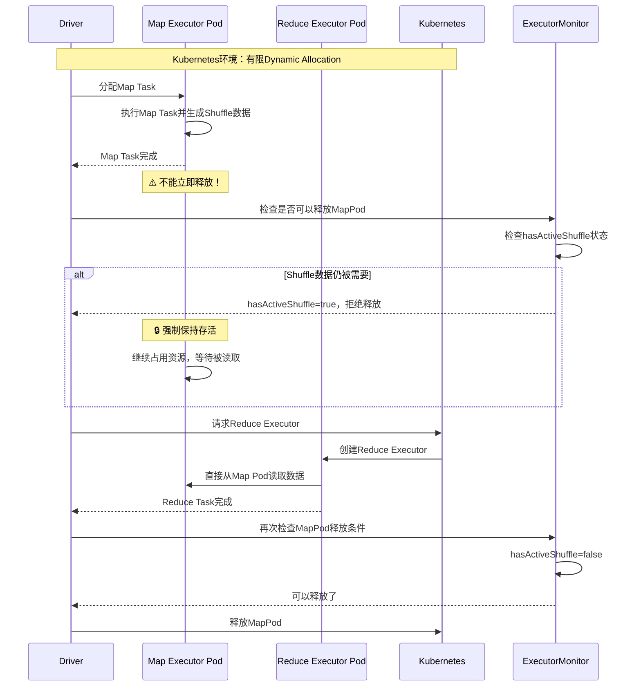

```mermaid
  sequenceDiagram
      participant Driver as Driver
      participant MapPod as Map Executor Pod
      participant ReducePod as Reduce Executor Pod
      participant K8s as Kubernetes
      participant Monitor as ExecutorMonitor

      Note over Driver, K8s: Kubernetes环境：有限Dynamic Allocation

      Driver->>MapPod: 分配Map Task
      MapPod->>MapPod: 执行Map Task并生成Shuffle数据
      MapPod-->>Driver: Map Task完成

      Note over MapPod: ⚠️ 不能立即释放！
      Driver->>Monitor: 检查是否可以释放MapPod
      Monitor->>Monitor: 检查hasActiveShuffle状态

      alt Shuffle数据仍被需要
          Monitor-->>Driver: hasActiveShuffle=true，拒绝释放
          Note over MapPod: 🔒 强制保持存活
          MapPod->>MapPod: 继续占用资源，等待被读取
      end

      Driver->>K8s: 请求Reduce Executor
      K8s->>ReducePod: 创建Reduce Executor
      ReducePod->>MapPod: 直接从Map Pod读取数据

      ReducePod-->>Driver: Reduce Task完成
      Driver->>Monitor: 再次检查MapPod释放条件
      Monitor->>Monitor: hasActiveShuffle=false
      Monitor-->>Driver: 可以释放了
      Driver->>K8s: 释放MapPod

```

核心约束：

1. 依赖性约束：Executor不能在有shuffle数据被需要时释放
2. 时序约束：必须等待downstream Job完成才能释放upstream资源
3. 状态约束：需要维护复杂的shuffle依赖跟踪状态
4. 超时约束：需要额外的shuffle-specific超时配置