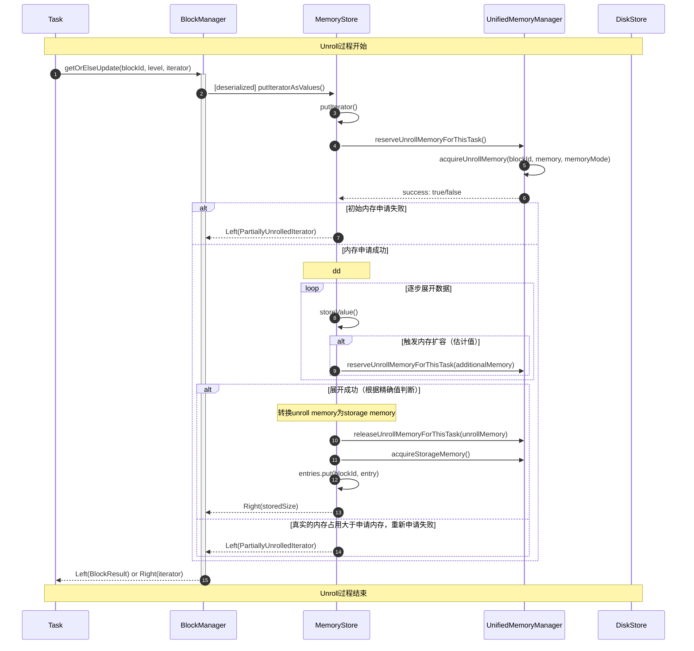
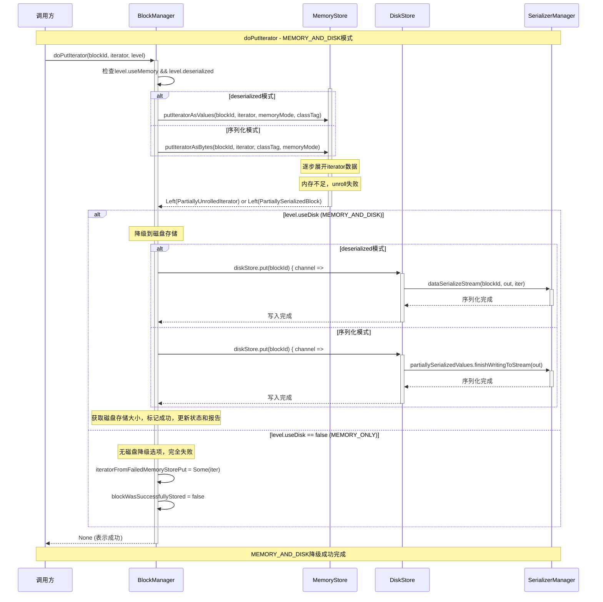
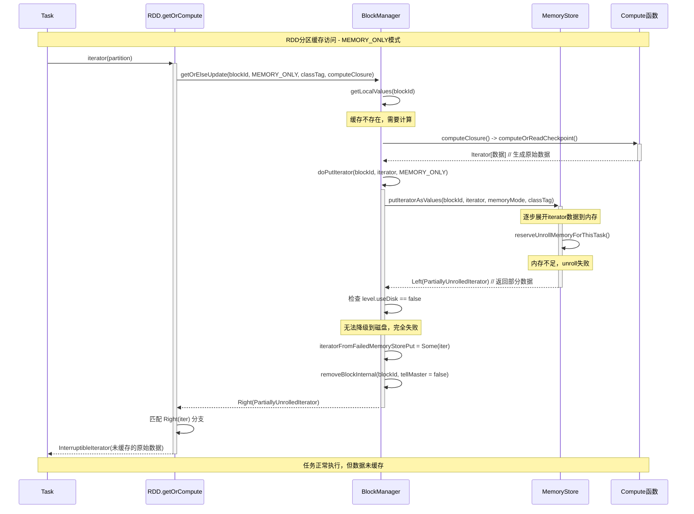
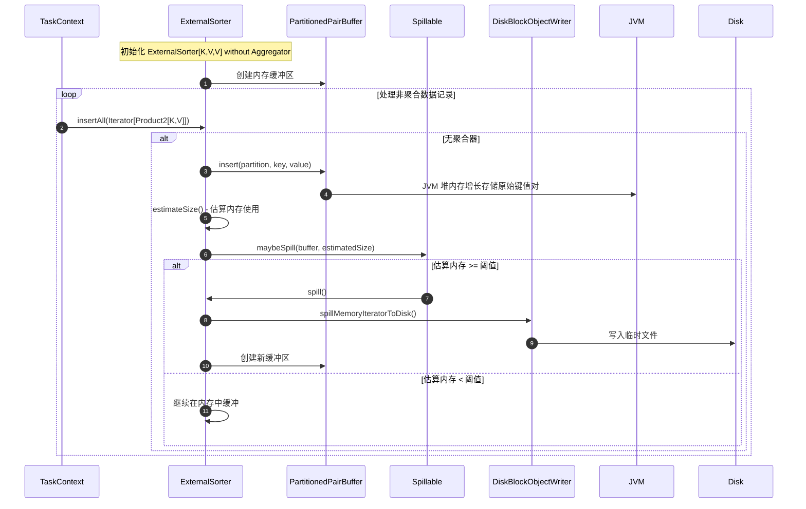
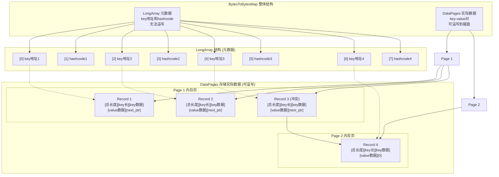
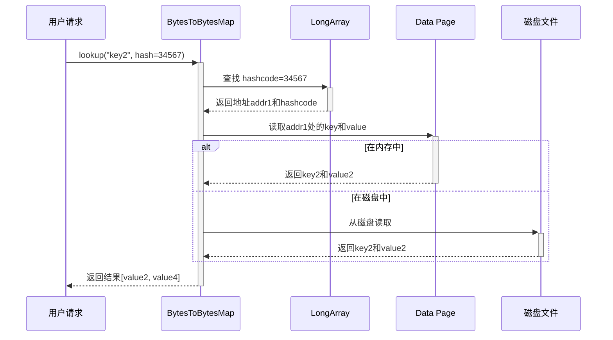
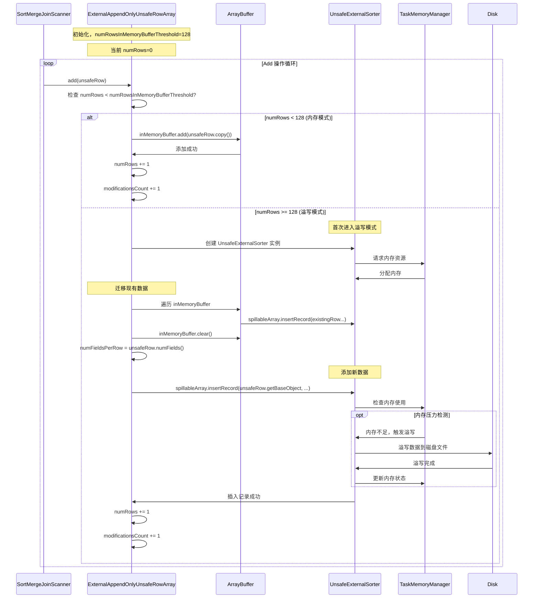
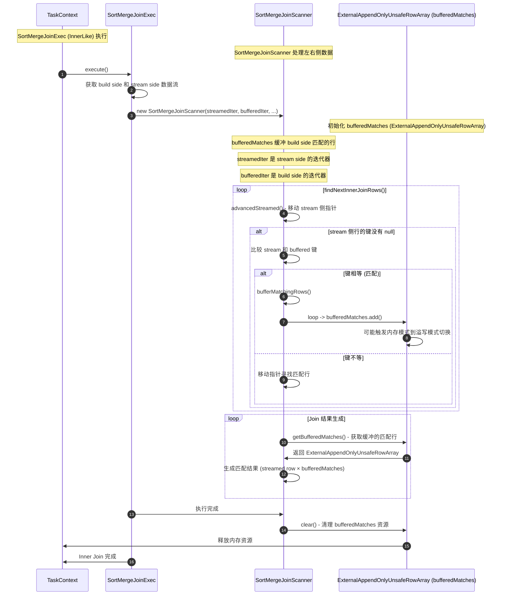

# Spark Memory Management

## Spark 默认内存管理？

**默认使用 UnifiedMemoryManager（统一内存管理）**

- ✅ **动态边界**: Execution和Storage内存之间可以相互借用
- ✅ **软边界**: 不是硬性分割，而是动态调整的边界
- ✅ **默认启用**: Spark 1.6+后的默认选择，替代了StaticMemoryManager

**内存总体划分**
```text
┌─────────────────────────────────────────────────────────────┐
│                    JVM Heap (例如: 1GB)                      │
├─────────────────────────────────────────────────────────────┤
│ Reserved Memory (300MB)                                     │ 40%
│ - 系统元数据、内部数据结构、OOM保护                              │
├─────────────────────────────────────────────────────────────┤
│ Unified Memory Region (420MB = (1024-300) * 0.6)            │ 60%
│ ┌─────────────────┬─────────────────────────────────────┐   │
│ │ Storage Memory  │ Execution Memory                    │   │
│ │ (210MB默认)      │ (210MB默认)                         │   │
│ │ ↕ 可借用         │ ↕ 可借用                             │   │
│ └─────────────────┴─────────────────────────────────────┘   │
└─────────────────────────────────────────────────────────────┘
```

例如：
[memory-example.md](memory-example.md)

**关于User Memory与memoryOverhead区分：在spark 管理之外，一般on-heap是user memory，off-heap是overhead**
```text
Container Total Memory
├── JVM Heap Memory (spark.executor.memory=4GB)
│   ├── Reserved Memory (300MB)
│   ├── Unified Memory Pool (2.4GB) - Spark管理
│   └── User Memory (1.4GB) - JVM堆内，Spark不管理
│
└── MemoryOverhead (spark.executor.memoryOverhead=1GB) - 非堆内存
    ├── Metaspace: 类加载器、方法区元数据
    ├── Code Cache: JIT编译后的本地代码缓存
    ├── GC工作内存: 垃圾回收器自身的工作内存
    ├── Parquet/ORC向量化缓冲区
    ├── Netty Direct Memory: Shuffle拉取缓冲区(maxSizeInFlight) + Netty Arena Pool
    └── 线程栈空间：on-heap（非用户内存）
```

## Spark 分配策略是什么？

**动态借用策略(不对称竞争机制)**

场景1: Shuffle密集型任务 (Execution优势)
```text
初始状态 (总内存420MB, storageRegionSize=210MB):
Storage Memory  : █████████░░░  250MB (超出storageRegionSize 40MB)
Execution Memory: █████░░░░░░░  170MB

Shuffle操作需要100MB:
Storage Memory  : ██████████░░░  210MB (被驱逐到storageRegionSize边界)
Execution Memory: ██████████░░░  210MB (获得足够内存进行Shuffle)
```

场景2: Cache密集型任务 (Storage劣势)
```text
初始状态 (总内存420MB, storageRegionSize=210MB):
Storage Memory: ████████░░░░░░  180MB
Execution Memory: ██████████░░  240MB (正在执行Shuffle)

Cache操作需要100MB:
Storage Memory: ████████░░░░░░  180MB (只能等待Execution释放空闲内存)
Execution Memory: ██████████░░  240MB (不能被驱逐，继续运行)

如果Execution释放60MB空闲:
Storage Memory: █████████░░░░  220MB (借用60MB空闲内存)
Execution Memory: ████████░░░░░  180MB (保留运行所需内存)
```

## Execution Memory
Spark 为任务执行过程中计算密集型操作分配的内存区域，
专门用于存储 Shuffle、Join、Sort、Aggregation 等计算过程中产生的临时数据与中间数据结构。
例如：
1. Shuffle Write流程
   - 流程1: UnsafeShuffleWriter路径
     ```text
     UnsafeShuffleWriter.write()
       -> insertRecord() [UnsafeShuffleWriter.java:250]
         -> ShuffleExternalSorter.insertRecord() [ShuffleExternalSorter.java:408]
           -> acquireNewPageIfNecessary() [ShuffleExternalSorter.java:395]
             -> allocatePage(required) [ShuffleExternalSorter.java:399]
     ```
   - 流程2: SortShuffleWriter路径
     ```text  
     SortShuffleWriter.write() [SortShuffleWriter.scala:63]
       -> ExternalSorter.insertAll() [ExternalSorter.scala:185]
         -> map.changeValue() / buffer.insert() [ExternalSorter.scala:200,208]
           -> maybeSpillCollection() [ExternalSorter.scala:201,209]
             -> maybeSpill() [ExternalSorter.scala:223,228]
               -> Spillable.acquireMemory() [向TaskMemoryManager申请execution内存]
     ```

2. ExternalAppendOnlyMap
   - RDD Aggregation流程
   - CoGroupedRDD join流程
  ```text
     ExternalAppendOnlyMap.insertAll() [ExternalAppendOnlyMap.scala:143]
    -> currentMap.changeValue() [ExternalAppendOnlyMap.scala:164]
      -> maybeSpill() [ExternalAppendOnlyMap.scala:161]
        -> Spillable.acquireMemory() [向TaskMemoryManager申请execution内存]
  ```

3. SQL Tungsten Aggregation流程
  ```text
  TungstenAggregationIterator.processInputs()
    -> UnsafeFixedWidthAggregationMap.append() [UnsafeFixedWidthAggregationMap.java:135]
      -> BytesToBytesMap.append() [BytesToBytesMap.java:758]
        -> acquireNewPage() [BytesToBytesMap.java:780]
          -> allocatePage(required) [BytesToBytesMap.java:842]
   ```
4. BlockStoreShuffleReader有 sort 时使用 Execution Memory
   - 有排序时：创建ExternalSorter进行排序，通过insertAllAndUpdateMetrics使用Execution Memory
   - 无排序时：直接返回聚合后的迭代器，不使用Execution Memory
5. BypassMergeSortShuffleWriter 不使用 Execution Memory
6. Shuffle Read(shuffleClient.fetchBlocks): 使用Netty Direct Memory，不是Execution Memory

### Unroll是什么？
- Unroll 是将Iterator数据逐步展开到内存的过程
- 默认先申请1MB内存(`spark.storage.unrollMemoryThreshold`)
- 在不知道数据总大小的情况下，渐进式地评估是否能完全缓存到内存

**Unroll过程**: Iterator数据 → 预先申请1MB → 逐步unroll → 检查大小 → 决定继续或降级

具体 Unroll 流程：

## Storage Memory
缓存 Spark 计算过程中需要重复使用的数据
- RDD 缓存：通过 rdd.persist() 或 rdd.cache() 缓存的数据
- 广播变量：通过 sc.broadcast() 创建的广播变量
- DataFrame/Dataset 缓存：通过 df.cache() 缓存的数据

### StorageLevel设置成MEMORY_AND_DISK，如果一个block unroll失败会怎么样？

**Unroll失败的情况**:
- 内存不足无法完成unroll过程
- 数据大小超过可用内存限制
- Storage内存被Execution借用导致空间不够

**失败后的自动降级策略** (源码 `MemoryStore.scala`):
1. **检查StorageLevel**: 如果设置了`useDisk = true`
2. **降级到磁盘**: 自动调用DiskStore进行磁盘存储
3. **保证可用性**: 后续访问时从磁盘读取(性能较低但数据不丢失)

**完整降级流程**:
RDD.persist(MEMORY_AND_DISK) → 尝试内存缓存 → [内存不足] → 自动降级到磁盘存储 → 保证数据可用性



**用途**: 通过渐进式unroll避免盲目消耗内存，通过降级策略确保数据在内存不足时仍然可用。
### RDD MEMORY_ONLY，如果一个block unroll失败？会怎么样？
- 当MEMORY_ONLY模式下的unroll失败时，Spark不会保存该block(partition)任何部分数据
- iteratorFromFailedMemoryStorePut被返回给调用者，但这个迭代器在当前任务使用完后就被丢弃了
- 没有任何数据被缓存到内存或磁盘中


- 只重新计算缓存失败的特定partition
- 其他partition如果缓存成功，直接从缓存读取
- 从未被访问过的partition不会被动计算
- 每个partition的生命周期完全独立

具体流程如图：

- MEMORY_ONLY：失败时数据完全丢失，下次需要完全重新计算该partition的全部数据
- MEMORY_AND_DISK：失败时会spill到磁盘，下次可以从磁盘读取，避免重新计算


### MEMORY_ONLY_SER 与 MEMORY_ONLY 的性能权衡是什么？

**MEMORY_ONLY (反序列化存储)**：
- ✅ **访问速度快**: 对象直接存储在堆内存中，无需反序列化
- ✅ **CPU开销低**: 直接访问Java对象，无额外计算
- ❌ **内存占用大**: Java对象有对象头、指针等额外开销
- ❌ **GC压力大**: 大量对象增加垃圾回收负担

**MEMORY_ONLY_SER (序列化存储)**：
- ❌ **访问速度慢**: 每次访问需要反序列化操作
- ❌ **CPU开销高**: 序列化/反序列化消耗CPU资源
- ✅ **内存占用小**: 序列化后数据更紧凑，可节省2-5倍内存
- ✅ **GC友好**: 减少堆中对象数量，降低GC压力

## User Memory
Spark无法追踪User Memory使用，完全由用户代码控制
`User Memory = maxHeapMemory × (1 - spark.memory.fraction)`，


1. UDF内存使用
    ```scala
    // 例子: 用户UDF中的对象创建
    val myUDF = udf((data: String) => {
      val largeList = data.split(",").map(_.trim)  // 每行都创建新数组
      largeList.filter(_.length > 5)               // 创建过滤后的新数组
    })
    ```

2. Driver端内存
   - 配置加载: SparkConf对象和配置文件解析
   - SparkContext: 大量的内部对象和状态维护
   - DAGScheduler: 任务调度相关的数据结构

3. 第三方库内存
   - JDBC连接池 - Connection、Statement等Java对象
   - Kryo序列化 - ByteArrayOutputStream、byte[]等缓冲区
   - Kafka客户端对象 - KafkaConsumer、ProducerRecord等
   - Protobuf对象 - Java对象和内部字节数组

## memoryOverhead
`MemoryOverhead = Executor总内存 - Spark直接管理的内存`,
Executor进程中不被Spark直接管理的内存，包括JVM固有开销、系统级开销、第三方库分配的内存等。\
含普通JVM Direct Memory (用户代码、部分第三方库)

1. JVM非堆内存开销
   - Metaspace: 类加载器、方法区元数据
   - Code Cache: JIT编译后的本地代码缓存
   - 普通JVM Direct Memory: java.nio.ByteBuffer.allocateDirect()
2. Spark内部非堆内存
   - Parquet/ORC缓冲区
   - 网络通信: **Netty**的DirectByteBuffers和事件循环缓冲区
     - Kafka网络缓冲区 - 底层网络通信的off-heap缓冲区
     - 其他网络通信 - Netty Direct Memory用于数据传输
3. 系统级开销
   - 线程栈: 每个Executor线程的栈空间 (默认1MB/线程)
   - GC开销: 垃圾回收器自身的工作内存
   - 本地库: JNI调用时的本地内存分配

## OOM 常见场景


| 内存类型             | 场景                          | RCA                                                                                                                         |
|------------------|-----------------------------|-----------------------------------------------------------------------------------------------------------------------------|
| Execution Memory | Driver 拉取大量数据               | 使用 collect()、take()、count() 等操作将大数据集拉取到 driver，Driver 内存不足以容纳所有收集的数据	                                                       | 
| Execution Memory | sortByKey中 Shuffle 操作       | ExternalSorter， 估算不准 → 溢写不及时 → PartitionedAppendOnlyMap/PartitionedPairBuffer 持续增长 → OOM                                    | 
| Execution Memory | reduceByKey、groupByKey、join | ExternalAppendOnlyMap, 阈值过高：currentMap 内存映射可能占用超过申请Execution Memory                                                         | 
| Execution Memory | Hash Join                   | 在内存中创建大哈希表的 Hash Join，build side使用BytesToBytesMap中的LongArray无法溢写导致的内存压力                                                     | 
| Execution Memory | SMJ，数据倾斜                    | bufferMatchingRows() 方法在找到匹配的 key 时，会批量调用 bufferedMatches.add() 来添加所有匹配的 records，如果匹配的 records数量巨大，在达到溢写阈值之前，内存会持续累积并最终 OOM | 
| Storage Memory   | Broadcast 大量数据              | 使用 broadcast() 向所有 executors 广播大数据集，广播变量太大，超出可用内存	                                                                          | 
| User Memory      | mapPartitions 操作            | 使用 mapPartitions() 函数在迭代器中缓存中间结果                                                                                            | 
| Memory Overhead  | Netty shuffle 缓存            | 通过一个 executor 多个task fetch data 接近 maxRemoteBlockSizeFetchToMem=200m，会占用大量的堆外内存                                             |


## ExternalSorter


map 和 buffer 虽然是 JVM 堆内存，但逻辑内存申请属于 Execution Memory，这个管理的值是估计值，不是实际内存；
如果在 spill 时能多申请到内存，就不溢出磁盘了。
内存管理和实际的 map(PartitionedAppendOnlyMap) / buffer(PartitionedPairBuffer) 扩充管理是分离的。
- 估算值过低 → 不及时溢写 → map/buffer 在 JVM 堆中持续增长 → JVM 堆 OOM

使用在需要sort的场景：
- shuffle read(BlockStoreShuffleReader)
- shuffle write(SortShuffleWriter)


### 非聚合模式 (PartitionedPairBuffer)


## ExternalAppendOnlyMap
ExternalAppendOnlyMap Spark 中一个外部溢写映射类，专门用于处理大规模聚合操作，当内存不足时会将排序后的内容溢写到磁盘。

1. 聚合操作的内存管理：对输入的键值对进行聚合
2. 内存溢写机制：当内存不足时自动溢写到磁盘，(阈值过高：内存映射可能占用超过可用内存，导致 OOM)
3. 外部排序合并：将内存和磁盘中的多个有序流进行合并

在 CoGroupedRDD 中，ExternalAppendOnlyMap 被用于多 RDD 协分组（cogroup）操作,
多个 RDD 中的相同键需要被合并到一个元组中,
比如 join，`(k, a) cogroup (k, b)` produces k -> Array(ArrayBuffer as, ArrayBuffer bs).


## BytesToBytesMap
典型使用场景ShuffledHashJoinExec，buildHashedRelation会build 如UnsafeHashedRelation, 
binaryMap为BytesToBytesMap 结构：

LongArray 只存储在内存(数据量太大会OOM)：
- key 的内存地址编码（不是 key 本身，而是指向 dataPages 中的位置）
- key 的完整 hashcode（用于快速比较）

DataPages 存储在MemoryBlock，可以溢出磁盘:
- 存储实际的 key-value 对数据格式: [total size][key size][key data][value data][next pointer]

**结构图**


**查找过程示例**


## ExternalAppendOnlyUnsafeRowArray
SortMergeJoin执行流程中，当streamed side遍历到特定key时，
`ExternalAppendOnlyUnsafeRowArray` 作为build side的匹配缓冲区，
临时存储该key对应的所有build side记录，用于完成join匹配。



**SortMergeJoinScanner inner join流程**



### UnsafeExternalSorter
numElementsForSpillThreshold = Integer.MAX_VALUE，通常设置得很高，
在达到溢写阈值之前，内存会持续累积并最终超过 JVM 堆内存限制导致 OOM。
