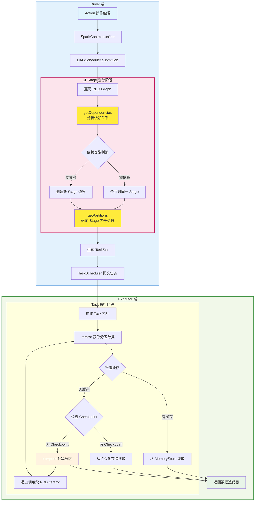

# RDD

## RDD 简述

**1. compute(split: Partition, context: TaskContext): Iterator[T]**
- **作用**: RDD最核心的方法，定义如何计算每个分区的数据
- **实现**: 由具体RDD子类实现，如MapPartitionsRDD、ShuffledRDD等
- **调用**: 通过iterator()间接调用，实际执行数据计算逻辑

**2. getPartitions: Array[Partition]**
- **作用**: 返回RDD的所有分区信息，定义数据如何分割
- **实现**: 各RDD子类根据数据源特性实现（如文件分片、范围分区等）
- **调用**: 在作业规划阶段确定任务数量，`rdd.partitions.length`即为任务数

**3. getDependencies: Seq[Dependency[_]]**
- **作用**: 返回当前RDD对父RDD的依赖关系（窄依赖或宽依赖）
- **实现**: 定义血统关系，用于DAG构建和故障恢复
- **调用**: DAGScheduler根据依赖关系划分Stage边界

**4. iterator(split: Partition, context: TaskContext): Iterator[T]**
- **作用**: 获取指定分区的数据迭代器，处理缓存和checkpoint逻辑
- **实现**: 先检查缓存，再检查checkpoint，最后调用compute()
- **调用**: 在Executor端实际获取数据时使用

**方法调用关系**：

RDD 的生命周期与调度过程：
- 构建 DAG：由 transformations 构建依赖图；
- 划分 Stage：根据宽依赖分 stage；
- 生成 TaskSet：对每个 partition 生成 一个task； 
- Task 调度执行：DAGScheduler 负责 Stage 调度，TaskScheduler 负责 Task 分配给 Executor，
SchedulerBackend 负责 Task 下发给 Executor
- 缓存管理（cache/persist）：通过内存管理模块保存中间数据；
- 失败恢复：Task 失败时重新执行，数据丢失时根据 lineage 重新计算；

## RDD 类型
- **Transformation**：如map、filter、reduceByKey等，定义RDD的转换操作
- **Action**：如collect、count、saveAsTextFile等，触发实际计算并返回结果

## 宽依赖 vs 窄依赖
- **宽依赖（Wide Dependency）**: 一个 RDD 的分区依赖于多个父 RDD 的分区，通常会引发 Shuffle 操作
- **窄依赖（Narrow Dependency）**: 一个 RDD 的分区仅依赖于单个父 RDD 的分区，可以在同一个 Stage 内完成计算


# Q&A

## 1. RDD 核心概念与基础

### RDD 懒执行机制的优势是什么？

**核心优势**：
- **优化机会**: 延迟到 Action 时才执行，可以进行全局优化（如管道化、谓词下推）
- **资源节约**: 避免不必要的中间结果存储
- **容错能力**: 通过血统重新计算，无需持久化中间状态

**管道化优化**: 多个窄依赖转换（map→filter→map）在同一 Task 中串行执行，数据流式处理。

### RDD 是否线程安全？

| 组件 | 线程安全性        | 风险            |
|-----|--------------|---------------|
| **RDD 元数据读取** | ✅ 安全         | 不可变对象         |
| **Action 操作** | ⚠️使用AsyncRDDActions | checkpoint 失效 |
| **Transformation 操作** | ✅ 安全         | 创建新 RDD，无副作用  |
| **累加器操作** | ✅ 安全         | 内部有同步机制       |
| **广播变量读取** | ✅ 安全         | 只读访问          |

```scala
// RDD 是不可变对象，多线程读取完全安全
val rdd = sc.parallelize(1 to 1000)
val threads = (1 to 10).map { i =>
  new Thread(() => {
    println(s"Thread $i: partitions = ${rdd.getNumPartitions}")  // 安全
    println(s"Thread $i: dependencies = ${rdd.dependencies}")   // 安全
  })
}
threads.foreach(_.start())  // 完全安全
```

### SparkContext 非线程安全吗？在多线程环境中并发操作同一个 RDD 会有什么问题？
SparkContext 本身设计上不是线程安全的，但是多线程并发action不影响结果。

源码分析结论：
**runJob vs submitJob**：
```text
runJob = submitJob + progressBar.finishAll() + doCheckpoint()
progressBar.finishAll() 内部有 synchronized 保护
```

使用runJob：
```scala
rdd1.checkpoint()
val thread1 = new Thread(() => rdd1.collect())
val thread2 = new Thread(() => rdd1.count())
thread1.start()
thread2.start()
```

使用 AsyncRDDActions，直接使用submitJob，会忽略 doCheckpoint：
```scala
import org.apache.spark.rdd.AsyncRDDActions
rdd1.checkpoint()
val future1 = rdd1.collectAsync()  // 底层仍用 submitJob，但包装为 Future
val future2 = rdd1.countAsync()
val results = Seq(future1.get(), future2.get())
```

## 2. RDD 转换操作 (Transformations)

### groupByKey() 和 reduceByKey() 都会产生宽依赖，但为什么通常推荐使用 reduceByKey() 而不是 groupByKey()？
 
核心差异：\
虽然两者都产生宽依赖并触发 Shuffle，但关键区别在于 `reduceByKey` 支持 **Map-side Combine**（在 Map 阶段进行预聚合，减少 Shuffle 数据量的优化技术） 预聚合，而 `groupByKey` 默认禁用此优化。

技术原理：
- `reduceByKey`: 聚合操作（如求和、取最大值），Map 端预聚合可将 1000万条记录压缩到 100万条
- `groupByKey`: 收集操作（collect_list），预聚合无法减少数据量，反而增加 CompactBuffer 开销

性能对比：\
在典型场景下，`reduceByKey` 比 `groupByKey` 快 5-10 倍，主要体现在 Shuffle 阶段的网络 I/O 和内存使用上。

实践建议：\
避免 `groupByKey().mapValues(_.sum)` 这种反模式，应直接使用 `reduceByKey(_ + _)`。

### reduceByKey vs reduceByKeyLocally 有什么区别？
`rdd.reduceByKeyLocally(_ + _)` 等价于 `rdd.reduceByKey(_ + _).collect().toMap`，实际上就是个语法糖，\
最终结果集要较小，需要在 Driver 端直接使用，两种情况如果结果集过大都会导致 OOM。
**核心差异：**

| 对比维度 | reduceByKey | reduceByKeyLocally |
|---------|-------------|-------------------|
| **返回类型** | `RDD[(K, V)]` | `Map[K, V]` |
| **操作类型** | Transformation（懒执行） | Action（立即执行） |

### map vs mapPartitions 有什么区别？

**核心差异**：`map` 逐条处理，`mapPartitions` 按分区批量处理。

**使用场景**：
- **mapPartitions**: IO 密集型（数据库写入、文件操作），每个分区只建立一次连接
- **map**: CPU 密集型（数学计算、简单转换），避免分区过大 OOM

**典型例子**：
```scala
// 错误：每条记录都创建数据库连接
rdd.map { record =>
  val conn = DriverManager.getConnection(url)  // 创建连接开销大
  conn.execute(s"INSERT INTO table VALUES($record)")
}

// 正确：每个分区只创建一次连接
rdd.mapPartitions { partition =>
  val conn = DriverManager.getConnection(url)  // 分区级别复用
  partition.map(record => conn.execute(s"INSERT INTO table VALUES($record)"))
}
```

### mapPartitions 可能会导致什么问题？如何避免？

**主要问题**：
- **OOM**: 整个分区数据加载到内存
- **资源泄露**: 数据库连接等资源与分区生命周期绑定，处理时间长导致资源耗尽
- **数据倾斜**: 大分区会放大上述问题

**解决方案**：
```scala
// 1. 控制分区大小
rdd.repartition(partitionCount)  // 避免单分区过大

// 2. 资源安全释放
rdd.mapPartitions { partition =>
  val conn = DriverManager.getConnection(url)
  try {
    partition.map(processRecord)
  } finally {
    conn.close()  // 确保资源释放
  }
}

// 3. 分割成小批
rdd.mapPartitions { partition =>
  partition.grouped(batchSize).flatMap { batch =>
    val conn = connectionPool.getConnection()  // 每批次获取连接
    try {
      processBatch(batch, conn)
    } finally {
      connectionPool.returnConnection(conn)  // 及时归还连接池
    }
  }
}
```

### coalesce vs repartition 有什么区别？
- `repartition` 就是 `coalesce(numPartitions, shuffle = true)` 的简写。
- `coalesce` 默认不 shuffle，只能减少分区数；`repartition` 强制 shuffle，可增可减分区数。
- 减少分区用 `coalesce`（性能好），增加分区或需要数据均衡用 `repartition`。
  - rdd.coalesce(2000)     // ❌ 无效，分区数不会增加
  - rdd.repartition(2000)  // ✅ 有效，强制增加分区

### sortByKey vs repartitionAndSortWithinPartitions 有什么区别？

**知识点：**
- **sortByKey**: 总是创建新的 RangePartitioner，强制触发 Shuffle
- **repartitionAndSortWithinPartitions**: 智能判断分区器，相同时避免 Shuffle
- **ExternalSorter**: Spark 内部排序器，支持内存+磁盘的外部排序

**核心差异：**
```scala
// sortByKey 源码：总是创建 ShuffledRDD
def sortByKey(): RDD[(K, V)] = {
  val part = new RangePartitioner(numPartitions, self, ascending)
  new ShuffledRDD[K, V, V](self, part)  // 🚨 一定会 Shuffle
}

// repartitionAndSortWithinPartitions 源码：智能优化
def repartitionAndSortWithinPartitions(partitioner: Partitioner): RDD[(K, V)] = {
  if (self.partitioner == Some(partitioner)) {
    // ✅ 分区器相同，只做分区内排序，无 Shuffle
    self.mapPartitions(iter => new ExternalSorter(...).insertAll(iter))
  } else {
    // ❌ 分区器不同，需要 Shuffle
    new ShuffledRDD[K, V, V](self, partitioner)
  }
}
```

**Spark 1.6 优化实践：**
```scala
// HBase Bulk Load 场景优化
val regions = getHBaseRegionBoundaries()  // 预先获取分区边界
val hbasePartitioner = new CustomHBasePartitioner(regions)

// 错误做法：重复 Shuffle
val step1 = rawRDD.partitionBy(hbasePartitioner)  // Shuffle 1
val step2 = step1.sortByKey()                     // Shuffle 2 (重新分区)

// 正确做法：避免重复 Shuffle
val step1 = rawRDD.partitionBy(hbasePartitioner)                    // Shuffle 1
val step2 = step1.repartitionAndSortWithinPartitions(hbasePartitioner) // 无 Shuffle
```

## 3. RDD 行动操作 (Actions)

### countAsync() vs count()

**核心区别**：同步阻塞 vs 异步非阻塞执行

```scala
import scala.concurrent.Future
import org.apache.spark.FutureAction

// 同步执行 - 阻塞当前线程
val count1: Long = rdd.count()  // 等待完成后返回结果

// 异步执行 - 立即返回 Future
val futureCount: FutureAction[Long] = rdd.countAsync()  // 立即返回
val count2: Long = futureCount.get()  // 手动等待结果
```

**使用场景对比**：

| 对比维度 | count() | countAsync() |
|---------|---------|--------------|
| **执行方式** | 同步阻塞 | 异步非阻塞 |
| **返回类型** | `Long` | `FutureAction[Long]` |
| **线程影响** | 阻塞调用线程 | 不阻塞调用线程 |
| **适用场景** | 简单顺序执行 | 并发执行多个操作 |

**实际应用示例**：
```scala
// count1 与 count2 串行执行，总耗时 ≈ 各RDD执行时间之和
val count1 = rdd1.count()
val count2 = rdd2.count()

// 并发执行，总耗时 ≈ max(各RDD执行时间)
val future1 = rdd1.countAsync()  // 立即启动
val future2 = rdd2.countAsync()  // 立即启动

// 等待所有结果
val count1 = future1.get()
val count2 = future2.get()
```

**注意事项**：
- `countAsync()` 基于 Scala Future，需要隐式 ExecutionContext
- 适用于需要并发执行多个独立 RDD 操作的场景
- 可以使用 `futureAction.cancel()` 取消正在执行的异步操作

### 多线程环境中并发操作同一个 RDD 会有什么问题？

SparkContext 本身设计上不是线程安全的，但是多线程并发action不影响结果。

#### 源码分析结论：
**runJob vs submitJob**：
```text
runJob = submitJob + progressBar.finishAll() + doCheckpoint()
progressBar.finishAll() 内部有 synchronized 保护
```

使用runJob：
```scala
rdd1.checkpoint()
val thread1 = new Thread(() => rdd1.collect())
val thread2 = new Thread(() => rdd1.count())
thread1.start()
thread2.start()
```

使用 AsyncRDDActions，直接使用submitJob，会忽略 doCheckpoint：
```scala
import org.apache.spark.rdd.AsyncRDDActions
rdd1.checkpoint()
val future1 = rdd1.collectAsync()  // 底层仍用 submitJob，但包装为 Future
val future2 = rdd1.countAsync()
val results = Seq(future1.get(), future2.get())
```

## 4. 缓存与持久化

### cache vs persist 有什么区别？

`cache()` 是 `persist()` 的简化版本，使用默认存储级别：
- **RDD**: `cache() = persist(MEMORY_ONLY)`
- **DataFrame**: `cache() = persist(MEMORY_AND_DISK)`

### Cache 会影响 Job 执行时间吗？

**会影响，但分情况**：

- **第一次执行**：比未 cache **稍慢**（需要额外写入 MemoryStore）
- **第二次执行**：**显著加速**（直接读缓存，跳过上游计算）

**结论**：cache 是为多次使用而设计的，单次使用反而有性能损失。

### checkpoint vs cache 有什么区别？

**本质差异**：checkpoint 是**容错机制**，cache 是**性能优化**。

**核心区别**：
- **checkpoint**: 写入可靠存储（HDFS），**切断lineage**，Executor 挂掉也能恢复
- **cache**: 存储在 Executor 内存/磁盘，**保留lineage**，Executor 挂掉需要重算
- **localCheckpoint**: `persist(MEMORY_AND_DISK)` + **截断血统**，executor 失败时无法恢复

**使用场景**：
- **checkpoint**: ML 迭代训练（血统过长、异常风险高）、关键中间结果保护
- **cache**: 多次使用的 RDD（如特征工程后的数据集）、短期重复计算优化

**典型例子**：
```scala
// ML 场景：迭代训练
val features = rawData.map(preprocess).filter(validate)
features.checkpoint()  // 避免每次迭代重新预处理，血统过长风险

// ETL 场景：多次聚合
val cleanData = rawData.filter(isValid).map(transform)
cleanData.cache()      // 后续多个统计分析会重复使用
val stat1 = cleanData.groupBy("region").count()
val stat2 = cleanData.groupBy("category").sum("amount")
```

### 有几种 Checkpoint 机制？`ReliableCheckpointRDD` 和 `LocalCheckpointRDD` 的适用场景和实现差异是什么？

**两种 Checkpoint 机制**：

**RDD API**：
```scala
// 1. Reliable Checkpoint - 写入可靠存储（HDFS），切断血统
rdd.checkpoint()

// 2. Local Checkpoint - persist(MEMORY_AND_DISK) + 截断血统
rdd.localCheckpoint()

// 手动触发 Checkpoint, private 方法
rdd.doCheckpoint()
```

**Dataset API**（更丰富）：
```scala
// 1. Reliable Checkpoint
df.checkpoint()                    // eager=true（立即执行）
df.checkpoint(eager = false)       // 延迟到下次action执行

// 2. Local Checkpoint
df.localCheckpoint()               // eager=true（立即执行）
df.localCheckpoint(eager = false)  // 延迟到下次action执行
```

**实现差异**：
- **Reliable**: 数据安全性高，但 I/O 开销大，完全切断血统
- **Local**: persist + 截断血统，executor 失败时无法恢复（不可靠）
- **eager 参数**：只在 Dataset API 中有，控制是否立即执行 `doCheckpoint()`

## 5. 分区与数据倾斜

### HashPartitioner vs RangePartitioner 适用场景？

**HashPartitioner**:
- 适用于均匀分布的 key，简单快速
- 风险：热点 key 导致数据倾斜

**RangePartitioner**:
- 通过采样确定分区边界，数据分布更均匀
- 适用于可排序的 key，避免倾斜

### `HashPartitioner` 和 `RangePartitioner` 在处理数据倾斜时的表现如何？

**HashPartitioner 倾斜问题**：
```scala
// HashPartitioner: key.hashCode() % numPartitions
def getPartition(key: Any): Int = Utils.nonNegativeMod(key.hashCode, numPartitions)

// 问题：热点key导致严重倾斜
// 示例：key="user123" 总是映射到同一分区，造成该分区数据量巨大
```

**RangePartitioner 倾斜解决机制**：
```scala
// 1. 数据采样阶段
def sketch[K](rdd: RDD[K], sampleSizePerPartition: Int): (Long, Array[(Int, Long, Array[K])])
// 每分区采样sampleSizePerPartitionHint个数据点(默认20)

// 2. 分区边界计算
// 基于采样数据的分位数确定边界，使每个分区数据量尽可能均匀
val rangeBounds = determineBounds(sketched, partitions)

// 3. 分区分配
def getPartition(key: K): Int = {
  // 通过二分查找确定key应该分配到哪个分区
  val partition = binarySearch(rangeBounds, key)
}
```

**性能对比**：
- **HashPartitioner**: 快速但易倾斜，适用于key分布均匀的场景
- **RangePartitioner**: 倾斜友好但有采样开销，适用于sortByKey等需要数据排序的场景

### 如何解决 RDD 数据倾斜问题？

**识别方法**: 观察任务执行时间差异巨大，某些分区数据量过大。

**解决策略**:
- **重新分区**: `repartition(n)` 或自定义分区器
- **加盐技术**: 给热点 key 添加随机前缀，拆分后再聚合
- **预聚合**: 先局部聚合减少数据量，再全局聚合

### Spark 中如何实现分区级别的数据本地性优化？

**本地性级别优先级**：
枚举顺序：PROCESS_LOCAL(0) < NODE_LOCAL(1) < NO_PREF(2) < RACK_LOCAL(3) < ANY(4)

- PROCESS_LOCAL (0) - 最优：进程内缓存，零延迟
- NODE_LOCAL (1) - 次优：节点内传输，最小网络开销
- NO_PREF (2) - 中等：无数据依赖，零网络传输成本
- RACK_LOCAL (3) - 较差：跨机架传输，中等网络成本
- ANY (4) - 最差：任意位置，可能跨数据中心，最高网络成本

NO_PREF 不是为了性能优化，而是为了资源分配公平性——确保有数据本地性需求的任务能够获得应有的资源，避免被无关任务抢占。

**场景**：host1 有空闲 Executor E，TaskA（NODE_LOCAL，偏好 host1），TaskB（NO_PREF，无偏好）
- **第1轮**：maxLocality=PROCESS_LOCAL，TaskB 想要调度但被阻止
- **第2轮**：maxLocality=NODE_LOCAL，TaskA 成功调度到 host1，获得数据本地性
- **第3轮**：maxLocality=NO_PREF，TaskB 在其他 executor 上调度
- **结果**：避免了 TaskB 抢占有本地性价值的 executor，确保 Task A 获得最优性能

**实际调度流程**：
- **优先级调度**: 先尝试 PROCESS_LOCAL，失败后逐级降级
- **等待超时**: 每个级别等待 `spark.locality.wait` 时间（默认3s）
- **动态调整**: executor 增减时重新计算本地性级别

## 6. 性能优化与机制

### 为什么 DataFrame/Dataset 通常比 RDD 性能更好？Catalyst 优化器无法优化 RDD 操作的根本原因是什么？

**RDD 限制**：
```scala
// RDD 是黑盒操作，Catalyst 无法感知函数内部逻辑
rdd.map(row => complexTransformation(row))  // 无法优化
rdd.filter(row => row.age > 30)            // 无法下推
```

**DataFrame/Dataset 优势**：
```scala
// 结构化 API，Catalyst 可以进行全面优化
df.select("name", "age").filter($"age" > 30)
// 自动优化：谓词下推、列裁剪、代码生成等
```

**性能差异根源**：
1. **代码生成**: Catalyst 生成高效的 Java 代码，避免虚函数调用
2. **内存布局**: Tungsten 使用堆外内存和列式存储
3. **优化器**: 成本估算、规则优化、物理计划选择
4. **向量化**: 批量处理多行数据，提高 CPU 利用率

**RDD 仍有价值的场景**：
- 非结构化数据处理
- 复杂的用户自定义逻辑
- 需要精确控制分区和本地性

### RDD 的懒加载机制在 DAGScheduler 中是如何实现的？多个连续的窄依赖转换（如 `map().filter().map()`）是如何在运行时进行管道化优化的？

**懒加载触发流程**：
```scala
// 1. Transformation：只构建 RDD Graph，不执行计算
rdd.map(f1).filter(f2).map(f3)  // 创建3个 MapPartitionsRDD，构建依赖链

// 2. Action：触发 DAGScheduler.submitJob()
rdd.collect() → SparkContext.runJob() → DAGScheduler.submitJob()
```

**管道化优化核心**：
```scala
// MapPartitionsRDD.compute() - 管道化的关键
override def compute(split: Partition, context: TaskContext): Iterator[U] = {
  f(context, split.index, firstParent[T].iterator(split, context))
}

// RDD.iterator() - 递归调用父 RDD
final def iterator(split: Partition, context: TaskContext): Iterator[T] = {
  if (storageLevel != StorageLevel.NONE) {
    getOrCompute(split, context)  // 从缓存读取
  } else {
    computeOrReadCheckpoint(split, context)  // 递归计算
  }
}
```

**实际执行效果**：
- **窄依赖链**：`ParallelCollectionRDD → MapRDD(f1) → FilterRDD(f2) → MapRDD(f3)`
- **单 Task 执行**：`iter.map(f1).filter(f2).map(f3)`，数据流式处理，无中间物化
- **内存效率**：每条记录逐一通过整个转换管道，内存占用最小

### 累加器和广播变量的线程安全性？
```scala
val acc = sc.longAccumulator()
val broadcast = sc.broadcast(Map("key" -> "value"))

// ✅ 安全：累加器内部有同步机制
rdd.foreachPartition { iter =>
  iter.foreach(_ => acc.add(1))  // 线程安全
}

// ✅ 安全：广播变量只读访问
rdd.map { x =>
  val sharedData = broadcast.value  // 线程安全
  x + sharedData.size
}
```

## 7. 容错与故障恢复

### 当 Shuffle 文件丢失时，Spark 如何通过 RDD lineage 进行故障恢复？

**血统恢复机制**：
1. **FetchFailedException** 抛出：下游 Task 无法获取 Shuffle 数据
2. **DAGScheduler 处理**：`handleTaskCompletion()` 检测到 FetchFailedException
3. **Stage 重提交**：标记相关 ShuffleMapStage 为失败，重新提交
4. **血统追溯**：递归重新计算依赖的父 RDD，直到找到可用数据或源头

**如果是 LocalCheckpoint，Executor 失败时无法恢复！**

**LocalCheckpoint 恢复流程对比**：

| 场景 | 可靠 Checkpoint | LocalCheckpoint |
|------|----------------|-----------------|
| **Task 失败 (Executor存活)** | ✅ 从 HDFS 读取 | ✅ 从本地存储读取 |
| **Executor 失败** | ✅ 从 HDFS 读取 | ❌ **直接抛异常** |
| **数据丢失** | ✅ 从可靠存储恢复 | ❌ **无法恢复** |

**关键区别**：
- **Task 失败**：如果只是单个 Task 异常，但 Executor 进程仍存活，LocalCheckpoint 数据仍在 BlockManager 中，下游使用者可以正常恢复
- **Executor 失败**：如果整个 Executor 进程崩溃，LocalCheckpoint 数据随之丢失，由于血统已截断，无法重新计算

**使用建议**：
- **LocalCheckpoint**: 仅用于迭代算法的性能优化，不依赖容错性
- **可靠 Checkpoint**: 用于生产环境关键数据保护
- **注意**: LocalCheckpoint 后如果 Executor 失败，整个 Job 会失败

## 8. 新特性
### Spark 3.1+ 引入了 `ResourceProfile` 机制，`RDD.withResources()` 方法如何实现 RDD 级别的细粒度资源管理？这与传统的 spark-submit 资源配置有什么本质区别？

```scala
val cpuProfile = new ResourceProfileBuilder()
  .require(new ExecutorResourceRequests().cores(2).memory("4g"))
  .build()

// ETL管道
val preprocessed = rawData
  .withResources(cpuProfile)
  .map(preprocess)
```
**核心机制**：
- **RDD 级别资源定义**：每个 RDD 可以有独立的 ResourceProfile，指定不同的 CPU、内存、GPU 需求
- **动态 Executor 申请**：DAGScheduler 根据 Stage 的 ResourceProfile 动态申请具有相应资源配置的 Executor
- **向后兼容**：未指定 ResourceProfile 的 RDD 使用默认配置（来自 spark-submit 参数）

**与传统配置的区别**：
- 传统：整个应用使用统一资源配置（--executor-cores, --executor-memory）
- 新机制：支持同一应用内不同 RDD 使用不同资源配置，实现真正的 workload-aware 资源分配

### RDDBarrier是 Spark 2.4+ 引入的新特性，它解决了什么问题？在什么场景下需要使用 `rdd.barrier().mapPartitions()`？

**解决的问题**：
- **分布式深度学习**：需要所有 worker 同时启动，进行参数同步和梯度聚合
- **集体通信**：MPI 风格的 AllReduce、AllGather 等操作需要所有任务协同
- **同步计算**：某些算法要求所有分区必须同时处理数据


**核心 API 说明**：
- `context.allGather(message: String)`: 收集所有任务的消息到每个任务
- `context.barrier()`: 同步屏障，等待所有任务到达此点
- `context.getTaskInfos()`: 获取所有任务的信息（地址、端口等）
- `context.partitionId()`: 获取当前分区ID

**API 行为详解**：

1. **`context.allGather()` 是阻塞操作**：
   - 等待所有任务都调用 `allGather` 后才返回
   - 每个任务都会收到所有任务的消息
   - 本身就有同步效果

2. **`context.barrier()` 的额外作用**：
   - 确保所有任务都完成了梯度更新操作
   - 提供显式的同步点，增强代码可读性
   - 处理异常情况（如某个任务在 allGather 后异常退出）

**TensorFlow on Spark 示例**：
```scala
val trainingRDD = sc.parallelize(dataset, numWorkers)
val finalModels = trainingRDD.barrier().mapPartitions { batch =>
  val context = BarrierTaskContext.get()
  val workerId = context.partitionId()

  // 启动 TensorFlow worker
  val tf = TensorFlow.create(workerId, context.getTaskInfos())

  for (step <- 1 to maxSteps) {
    // 1. 本地训练：基于本partition的数据计算局部梯度
    tf.trainStep(batch)  // 只使用当前partition的数据

    // 2. 获取局部梯度（每个worker独有的）
    val localGradients = tf.getGradients()  // 基于local batch计算的梯度

    // 3. AllGather: 收集所有worker的局部梯度（阻塞等待）
    val allLocalGradients = context.allGather(serialize(localGradients))
    // allLocalGradients = [grad_worker0, grad_worker1, grad_worker2, grad_worker3]

    // 4. 计算全局平均梯度
    val globalAvgGradients = average(allLocalGradients.map(deserialize))

    // 5. 使用全局梯度更新本地模型（所有worker用相同梯度更新）
    tf.updateWeights(globalAvgGradients)

    // 6. 确保所有worker都完成了权重更新（可选，因为allGather已经同步了）
    context.barrier()
  }

  // 7. 只返回一个模型即可（所有模型都相同）
  if (workerId == 0) Iterator(tf.getModel()) else Iterator.empty
}

// 收集最终模型（只有一个，因为所有worker的模型都相同）
val finalModel = finalModels.collect().head
```

```
Epoch 1:
Worker 0: batch_0 → local_grad_0 ┐
Worker 1: batch_1 → local_grad_1 ├─ allGather → global_avg_grad → 更新所有worker
Worker 2: batch_2 → local_grad_2 ┤                                     ↓
Worker 3: batch_3 → local_grad_3 ┘                               所有模型保持一致
```
