# Task 在 Executor 中的运行流程
## 代码示例
```scala
val textFile = sc.textFile("hdfs://...")           // Stage 0 开始
val words = textFile.flatMap(_.split(" "))         // 仍在 Stage 0 (narrow dependency)
val pairs = words.map(word => (word, 1))           // 仍在 Stage 0 (narrow dependency)
val counts = pairs.reduceByKey(_ + _)               // Stage 0 结束，Stage 1 开始 (shuffle dependency)
counts.collect()                                    // Stage 1：ResultStage
```

## Task 执行完整流程
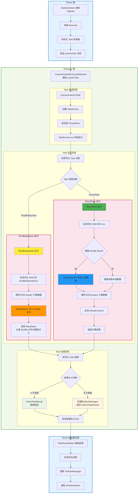

## ShuffleMapTask
- **继承关系**: `extends Task[MapStatus]`
- **职责**: 处理 Shuffle Write 操作，将 RDD 数据按分区器分桶写入磁盘
- **关键参数**:
  - `taskBinary: Broadcast[Array[Byte]]` - 广播的 RDD 和 ShuffleDependency
  - `partition: Partition` - 要处理的 RDD 分区
  - `mapId: Long` - Map 任务的唯一标识

**Stage 0: ShuffleMapTask 执行流程**

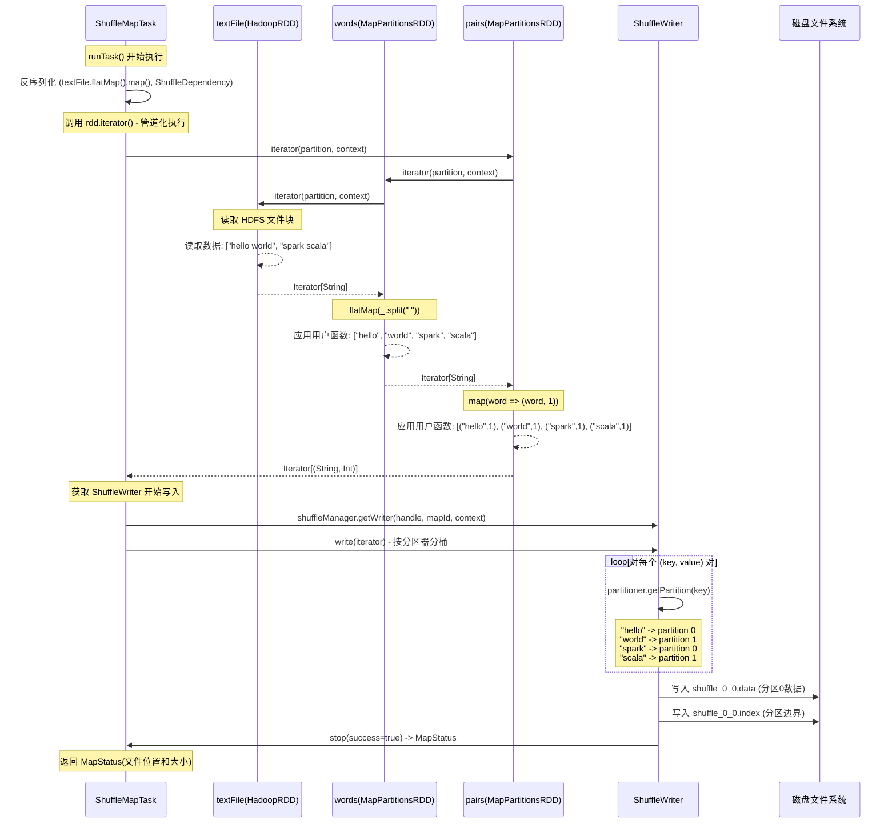

**关键特性**:
- **数据分桶**: 根据 `Partitioner.getPartition(key)` 将数据分配到不同的输出分区
- **文件格式**: 生成 `.data` 文件（数据）和 `.index` 文件（分区边界索引）
- **Push-based Shuffle**: 支持主动推送数据到 Merge 服务器减少 Shuffle Read 开销
- **度量收集**: 通过 `ShuffleWriteMetricsReporter` 收集写入指标

## ResultTask
- **继承关系**: `extends Task[U]`
- **职责**: 执行最终的结果计算，可能包含 Shuffle Read
- **关键参数**:
  - `taskBinary: Broadcast[Array[Byte]]` - 广播的 RDD 和执行函数
  - `outputId: Int` - 在 Job 中的输出索引

**Stage 1: ResultTask 执行流程**
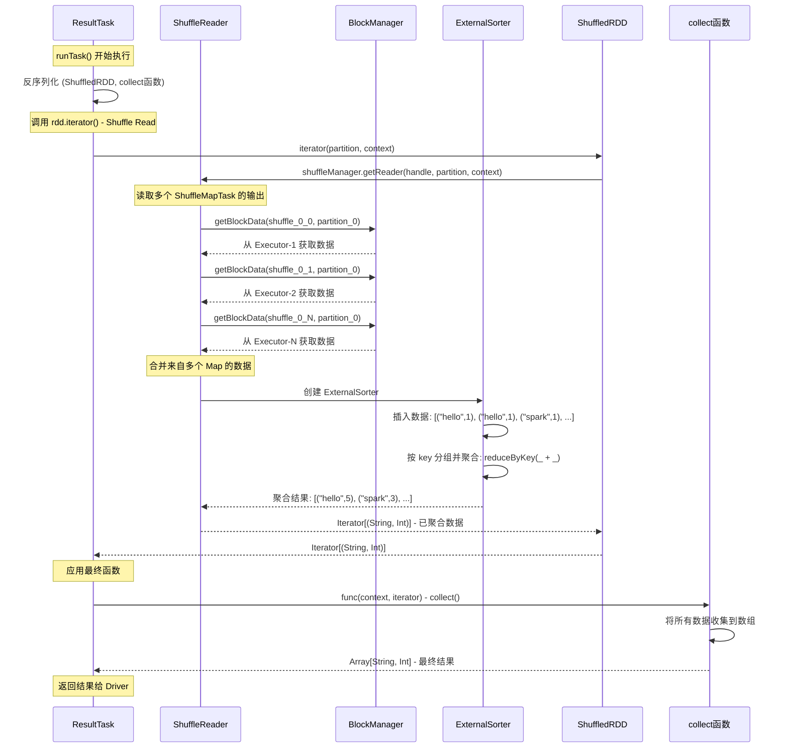

**关键特性**:
- **Shuffle Read**: 自动处理从多个 ShuffleMapTask 读取和合并数据
- **网络传输**: 通过 BlockManager 获取远程 Shuffle 数据
- **内存管理**: 使用 ExternalSorter 进行基于磁盘的排序合并
- **容错处理**: Shuffle Read 失败时会重新获取数据

## SortShuffleManager
- registerShuffle(): 注册 ShuffleHandle 任务，初始化相关数据结构。
- getReader(): 返回 ShuffleReader 实例，负责读取排序后的数据。
- getWriter(): 返回 ShuffleWriter 实例，负责将数据排序后写入磁盘。

## ShuffleHandle 类型详解
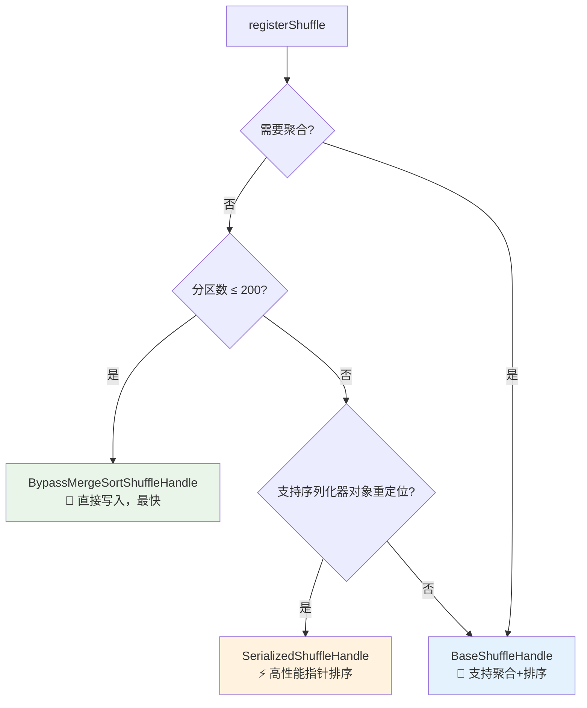

**性能对比**:

| 特性 | BypassMergeSortShuffleHandle | SerializedShuffleHandle | BaseShuffleHandle |
|------|----------------------------|------------------------|------------------|
| **写入速度** | 🚀 最快 (直接写入) | ⚡ 快 (指针排序) | 🐌 较慢 (完整排序) |
| **内存使用** | 📈 高 (多文件缓冲区) | 📉 低 (序列化数据) | 📊 中等 (ExternalSorter) |
| **CPU开销** | 🔥 最低 (无排序) | ⚡ 低 (只排序指针) | 💪 高 (完整排序+聚合) |
| **适用场景** | 小分区数重分区 | 大数据Shuffle | 聚合操作 |
| **限制条件** | 🔒 苛刻 (分区≤200 + 无聚合) | ⚠️ 中等 (Kryo + 无聚合 + 分区≤1677万) | ✅ 无限制 |
| **网络传输** | 原数据量 | 原数据量 | 聚合后减少 |
| **Reduce端压力** | 🔥 高 (需完整排序) | ⚡ 中等 (需key排序) | 📉 低 (只需归并) |
| **典型用例** | `repartition(100)` | `sortByKey()`, `repartition(1000)` | `reduceByKey()`, `aggregateByKey()` |

**选择建议**:
- **小分区重分区**: BypassMergeSortShuffleHandle (如100个分区的repartition)
- **大数据排序**: SerializedShuffleHandle + Kryo (如TB级数据的sortByKey)
- **聚合计算**: BaseShuffleHandle (如reduceByKey、groupByKey)

Spark 3.3.1 中的 `SortShuffleManager.registerShuffle()` 根据不同条件选择最优的 ShuffleHandle 类型:

### 1. BypassMergeSortShuffleHandle
绕过合并排序**特性**:
- 绕过排序: 每个分区直接写入独立文件，避免排序开销
- 适用场景: 分区数少且无聚合需求的操作（如 `repartition`, `partitionBy`）
- 性能: 最快的写入速度，但会产生大量小文件

**选择条件**:
1. mapSideCombine = false (不需要 Map 端预聚合)
2. partitioner.numPartitions <= bypassMergeThreshold (分区数 ≤ 阈值，默认200)

**使用示例**:
```scala
// 触发 BypassMergeSortShuffleHandle
rdd.repartition(100)  // 分区数 < 200，无聚合
rdd.partitionBy(customPartitioner)
```

### 2. SerializedShuffleHandle
**选择条件**:
1. serializer.supportsRelocationOfSerializedObjects = true (支持序列化对象重定位，如Kryo) 
2. dependency.mapSideCombine = false (不需要 Map 端聚合)
3. partitioner.numPartitions <= MAX_SHUFFLE_OUTPUT_PARTITIONS (分区数 ≤ 16777216)

**特性**:
- **序列化排序**: 直接操作序列化后的二进制数据，避免反序列化开销
- **内存效率**: 使用 `UnsafeShuffleWriter` 进行基于指针的排序
- **高性能**: 适用于大数据量的 Shuffle 操作
- **排序支持**: 完全支持排序操作，通过 map 端 partition 排序 + reduce 端 key 排序实现

**使用示例**:
```scala
// 配置 Kryo 序列化器
spark.conf.set("spark.serializer", "org.apache.spark.serializer.KryoSerializer")

// 以下操作都可能触发 SerializedShuffleHandle
rdd.sortByKey()               // ✅ 完全支持排序
rdd.repartition(1000)         // ✅ 支持重分区
rdd.partitionBy(partitioner)  // ✅ 支持分区操作
```


### 3. BaseShuffleHandle (通用兜底方案)
**选择条件**:
当不满足上述两种特化条件时的兜底选择：
1. 需要聚合操作 (mapSideCombine = true)
2. 分区数超大 (> 16777216)
3. 不支持序列化对象重定位 (非Kryo序列化器)

**特性**:
- **完整排序能力**: 使用 `SortShuffleWriter` 在 map 端完成 partition + key 双重排序
- **Map端预聚合**: 支持 combiner 函数，显著减少网络传输和 reduce 端计算压力
- **ExternalSorter**: 内存+磁盘的外部排序，支持大数据量处理和自动 spill
- **通用兼容**: 支持所有 Shuffle 操作，包括复杂聚合、排序、分组
- **内存管理**: 动态内存分配，避免 OOM，但内存使用相对较高


## BypassMergeSortShuffleWriter
BypassMergeSortShuffleWriter 采用最简单的写入策略：
1. 每个 reduce 分区对应一个独立的临时文件
2. 数据直接写入对应分区的文件，无需排序或合并
3. 最终将所有临时文件按顺序合并为单一的 .data 文件，生成 .index 文件记录分区边界


## UnsafeShuffleWriter
UnsafeShuffleWriter 采用"指针排序"替代"数据排序"的策略：
1. 数据与索引分离：序列化数据连续存储在内存页中，排序操作只针对轻量级指针数组
2. 压缩指针设计：将 partition ID、page 号、页内偏移量打包进单个64位指针
3. 局部排序策略：仅按 partition ID 排序，实现数据按分区聚集，避免昂贵的 key 比较
4. 零拷贝输出：按排序后的指针顺序直接拷贝序列化数据，无需反序列化

这种设计在需要按partition分组但不需要key排序的场景下，比传统方式节省50%以上的内存并显著提高排序性能。\
但代价是无法进行key级别的排序，这就是为什么sortByKey操作仍然需要在reduce端完成。

假设有以下5条记录需要shuffle，使用3个reduce分区(partition 0,1,2)：
```text
// 为每条记录创建指针
Record 0: ("hello", 1)  → partition=2, pageId=0, offset=0
Record 1: ("world", 2)  → partition=1, pageId=0, offset=8
Record 2: ("spark", 3)  → partition=0, pageId=0, offset=16
Record 3: ("java", 4)   → partition=1, pageId=0, offset=24
Record 4: ("scala", 5)  → partition=2, pageId=0, offset=32

打包成64位long指针：

指针数组（排序前）：
Index 0: 0x0000020000000000  // partition=2, pageId=0, offset=0  ("hello")
Index 1: 0x0000010000000008  // partition=1, pageId=0, offset=8  ("world")
Index 2: 0x0000000000000010  // partition=0, pageId=0, offset=16 ("spark")
Index 3: 0x0000010000000018  // partition=1, pageId=0, offset=24 ("java")
Index 4: 0x0000020000000020  // partition=2, pageId=0, offset=32 ("scala")

排序过程：

排序前的指针数组：
[0x0000020000000000, 0x0000010000000008, 0x0000000000000010, 0x0000010000000018, 0x0000020000000020]
对应partition:  [2,                1,                0,                1,                2]
对应数据:       [("hello",1),       ("world",2),      ("spark",3),      ("java",4),       ("scala",5)]

排序后的指针数组：
[0x0000000000000010, 0x0000010000000008, 0x0000010000000018, 0x0000020000000000, 0x0000020000000020]
对应partition:  [0,                1,                1,                2,                2]
对应数据:       [("spark",3),       ("world",2),      ("java",4),       ("hello",1),      ("scala",5)]

最终输出文件结构：
Shuffle Output File:
┌─────────────────────────────────────┐
│ Partition 0: [spark,3]              │
│ Partition 1: [world,2][java,4]      │
│ Partition 2: [hello,1][scala,5]     │
└─────────────────────────────────────┘
```

## SortShuffleWriter

**Map端工作流程**:
```
数据处理流程:
输入记录 → ExternalSorter →
├─ 内存缓冲区 (聚合+排序) →
├─ Spill到磁盘 (按需) →
└─ 最终归并输出 → 已排序的partition文件

优势: Reduce端只需简单归并，压力分散
劣势: Map端内存和CPU开销较大
```

**性能特点**:
- **Map端开销**: 较高内存和CPU使用，但数据处理完整
- **Reduce端轻松**: 只需归并已排序流，内存和计算压力小
- **网络传输**: 聚合操作能大幅减少传输数据量
- **容错性**: 强大的spill机制，适合内存受限环境

## ShuffleReader
**统一的读取接口**：虽然不同的ShuffleHandle产生不同格式的数据，但Spark使用统一的`BlockStoreShuffleReader`来处理所有shuffle读取操作。

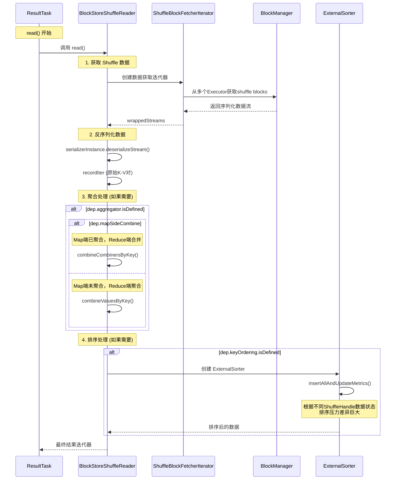

| ShuffleHandle | 网络传输量 | 反序列化开销 | 聚合开销 | 排序开销 | ResultTask总压力 |
|--------------|----------|------------|---------|---------|----------------|
| **BypassMergeSortShuffleHandle** | 🔥 原始数据量 | ⚡ 标准 | 🔥 **完整聚合** | 🔥 **完整排序** | 🔥 **高** |
| **SerializedShuffleHandle** | 🔥 原始数据量 | ⚡ 标准 | 🔥 **完整聚合** | 🔥 **完整排序** | 🔥 **高** |
| **BaseShuffleHandle** | ✅ 聚合后数据 | ⚡ 标准 | ✅ 简单合并 | ✅ **归并操作** | ✅ **最低** |

### BypassMergeSortShuffleHandle 和 SerializedShuffleHandle 读取

相同点

- 输出结果: 都生成单个.data文件 + .index文件，文件格式完全一致
- 排序程度: Map端都只按partition分组，partition内数据无序
- ResultTask压力: 由于数据无序，都需要完整的key排序和聚合处理

不同点

- 写入策略: BypassMergeSortShuffleHandle采用多文件并行写入后合并；SerializedShuffleHandle使用指针数组排序直接写入
- 内存消耗: BypassMergeSortShuffleHandle需要为每个分区维护独立缓冲区，内存要求更高；SerializedShuffleHandle基于序列化
  数据和轻量指针，内存效率更佳

### BaseShuffleHandle 读取

**性能影响**: ✅ **最轻计算负荷**
- 归并操作：已排序数据的简单合并
- 低内存压力：数据已聚合，量小
- 低CPU开销：主要是流式归并

### 批量读取优化 (Batch Fetch)
是什么？
```text
  对每个Executor分别发送多个小请求

  Executor-1:
  ├─ 请求 block_1_0 → HTTP请求1
  ├─ 请求 block_1_1 → HTTP请求2
  └─ 请求 block_1_2 → HTTP请求3

  Executor-2:
  ├─ 请求 block_2_0 → HTTP请求4
  ├─ 请求 block_2_1 → HTTP请求5
  └─ 请求 block_2_2 → HTTP请求6

  总HTTP请求数: 6次 (每个block一个请求)
  TCP连接数: 仍然是20个 (每个Executor一个)

  ✅ 批量读取优化:
  对每个Executor发送一个批量请求

  Executor-1:
  └─ 批量请求 [block_1_0, block_1_1, block_1_2] → 1个HTTP请求

  Executor-2:
  └─ 批量请求 [block_2_0, block_2_1, block_2_2] → 1个HTTP请求
```

**批量读取条件**:
- 支持序列化对象重定位 (Kryo)
- 压缩编解码器支持流拼接
- 未启用IO加密
- 未使用旧版fetch协议

## ResultTask 读取 Shuffle Block 的详细流程

### Part 1: Reduce端 - Iterator驱动的懒加载流程

ShuffleBlockFetcherIterator：将复杂的分布式数据获取操作包装成简单的Iterator接口，
多源数据统一获取器。
- 本地块: fetchLocalBlocks(localBlocks)
- Host-Local: fetchAllHostLocalBlocks()
- 远程块: 通过网络从其他Executor获取
- Push-Merged: pushBasedFetchHelper.fetchAllPushMergedLocalBlocks()

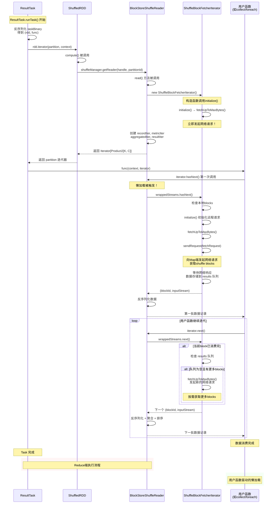

### Part 2: 网络协议回调链详细时序图

专门展示OneForOneBlockFetcher中callback和listener的调用流程，分为大文件(stream)和小文件(fetchChunk)两种策略：

#### ExternalShuffleService 策略时序图

**策略原理**: 连接到独立的ExternalShuffleService进程(端口7337)，由该服务读取磁盘上的shuffle文件。优势是Executor崩溃后数据仍可访问，支持Dynamic Allocation。

**使用场景**: `spark.shuffle.service.enabled=true`

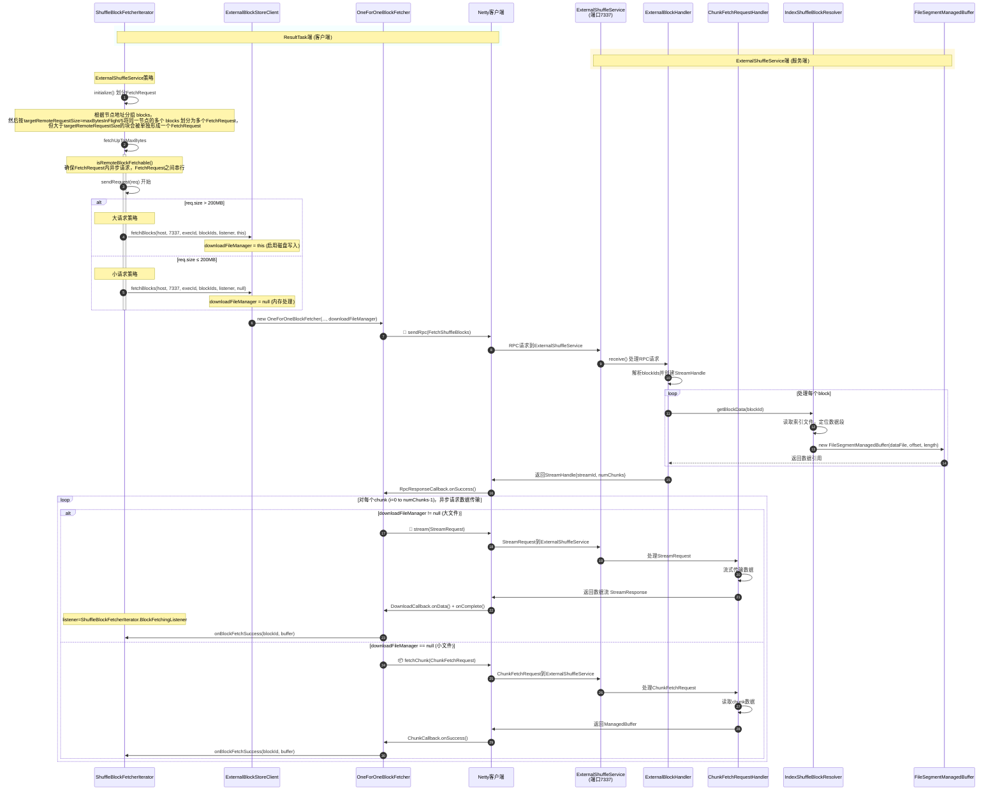

##### stream vs fetchChunk

| 方法                  | 数据处理                | 内存使用    | 适用场景        |
  |---------------------|---------------------|---------|-------------|
| client.stream()     | 流式写入临时文件            | 低（流式处理） | 大文件(>200MB) |
| client.fetchChunk() | 直接内存中的ManagedBuffer | 高（全部加载） | 小文件(≤200MB) |


##### 大文件策略 (req.size > 200MB) - stream() + DownloadCallback
ResultTask client端
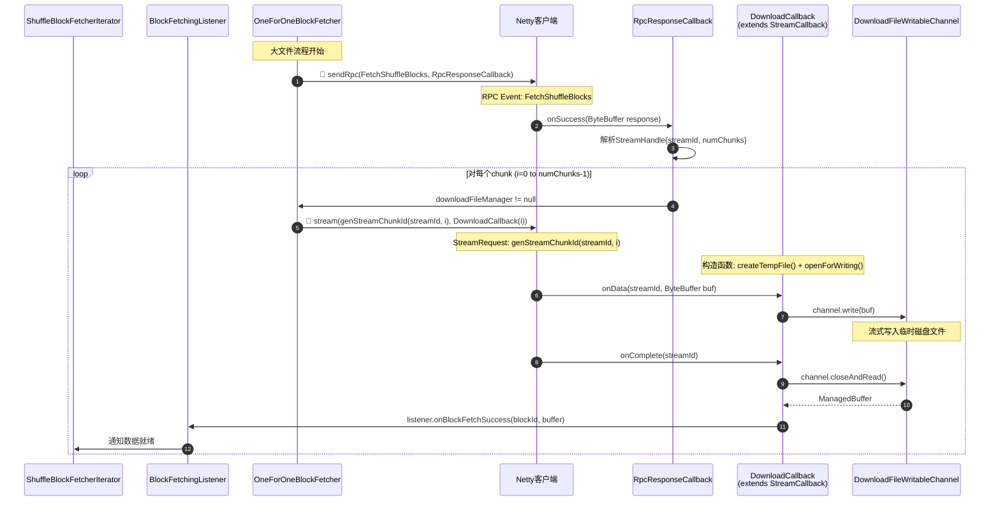

MapShuffleTask Server端
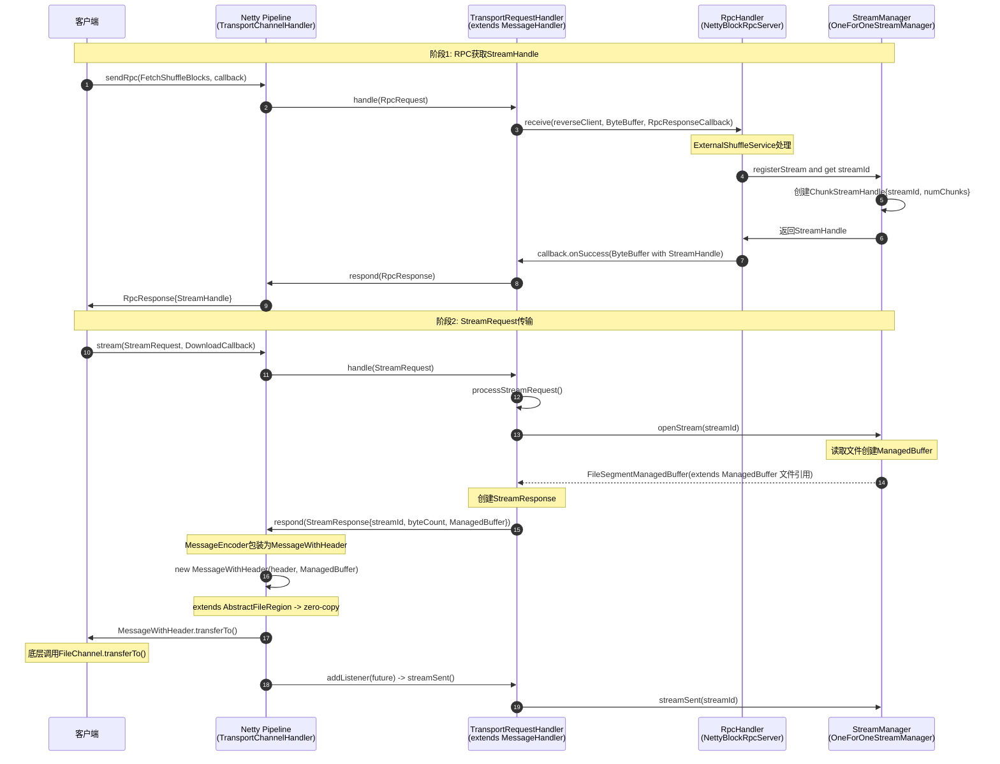
- OneForOneStreamManager 是 Spark 中用于管理点对点流数据传输的组件。
- FileSegmentManagedBuffer 是 “文件流” 的封装，适合大文件的分段传输，核心是减少内存占用。


##### 小文件策略 (req.size ≤ 200MB) - fetchChunk() + ChunkCallback
ResultTask client端
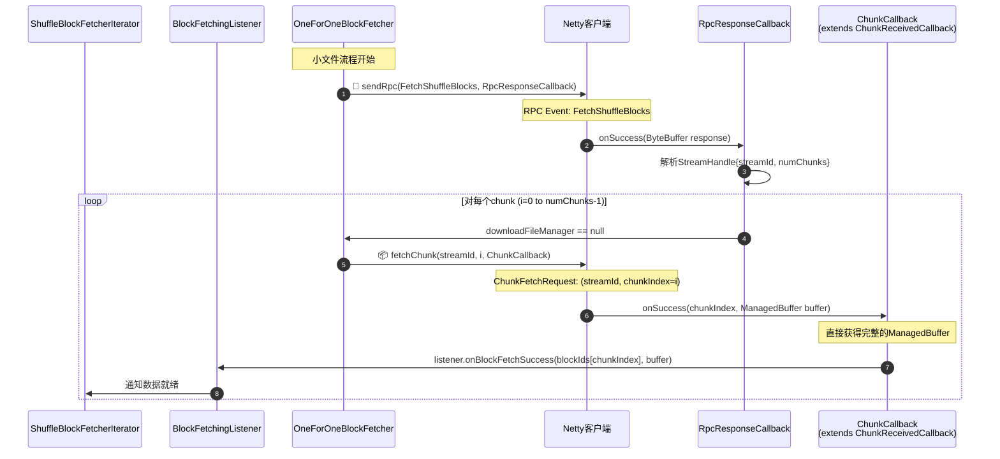

MapShuffleTask Server端
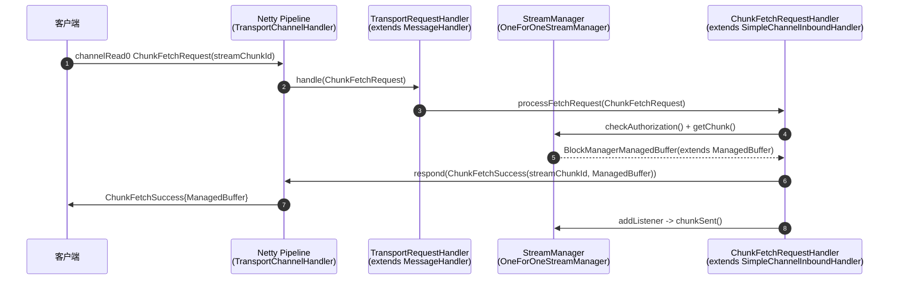
BlockManagerManagedBuffer 是 “内存块” 的封装，适合内存中数据的快速访问，核心是提供高效的数据操作接口。

BlockData data 存储在内存
- On-Heap 内存：不支持零拷贝，需先将堆内数据拷贝到 DirectByteBuffer，“堆内 → 直接内存”
- Off-Heap 内存：属于内核态可访问内存，无需 JVM 堆拷贝，从直接内存拷贝到网卡缓冲区，无用户态 → 内核态的拷贝
  - 只有当 ByteBuffer 是 DirectByteBuffer 时，`chunks.length == 1` 才能在网络传输场景下实现真正的
    zero-copy


**核心回调链总结**：
- **第一阶段**: `sendRpc(FetchShuffleBlocks)` → `RpcResponseCallback.onSuccess()` → 解析`StreamHandle`
- **第二阶段 - stream流程**: `stream(StreamRequest)` → `DownloadCallback.onData()` → `DownloadCallback.onComplete()` → `BlockFetchingListener.onBlockFetchSuccess()`
- **第二阶段 - fetchChunk流程**: `fetchChunk(ChunkFetchRequest)` → `ChunkCallback.onSuccess()` → `BlockFetchingListener.onBlockFetchSuccess()`

#### NettyBlockTransferService 策略时序图

**策略原理**: 直接连接到目标Executor的BlockManager(动态端口)，从该Executor获取shuffle数据。优势是减少中间层开销，但要求目标Executor必须存活。

**使用场景**: `spark.shuffle.service.enabled=false` (默认)

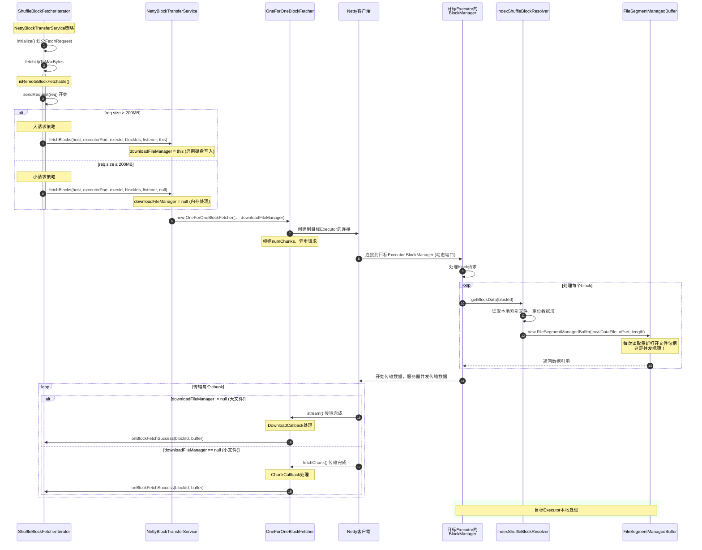

ExternalShuffleService vs NettyBlockTransferService 对比：

| 配置项 | ExternalShuffleService | NettyBlockTransferService |
|--------|----------------------|---------------------------|
| `spark.shuffle.service.enabled` | ✅ true | ❌ false |
| 目标服务 | ExternalShuffleService进程 | 目标Executor |
| 端口 | `spark.shuffle.service.port` (7337) | Executor的BlockManager端口 |
| 容错性 | ✅ Executor崩溃后仍可用 | ❌ 依赖Executor存活 |
| Dynamic Allocation | ✅ 完全支持 | ⚠️ 受限 |


# Q&A
## 什么是serializer.supportsRelocationOfSerializedObjects？
序列化器对象重定位: 能够重新排列序列化流中对象的字节顺序，而不影响反序列化的正确性。\

1. JavaSerializer - ❌ 不支持
2. KryoSerializer - ⚠️ 条件支持(必须启用 auto-reset 功能)
   ```scala
   private[spark] override lazy val supportsRelocationOfSerializedObjects: Boolean = {
     newInstance().asInstanceOf[KryoSerializerInstance].getAutoReset()
   }
   ```

比如[JavaSerializationTest](../../algorithm/src/test/java/cn/juntaozhang/jdk/JavaSerializationTest.java)中的测试：
```text
--- 测试正常顺序反序列化 ---
正常顺序 - 成功读取:
  第一个对象: Person{name='Alice', age=25}
  第二个对象: Person{name='Bob', age=30}

--- 测试重新排列后反序列化 ---
重新排列 - 反序列化失败:
  错误: StreamCorruptedException: invalid stream header: 7371007E

--- 字节内容分析 ---
第一个对象 字节分析:
  前20个字节: AC ED 00 05 73 72 00 2F 63 6E 2E 6A 75 6E 74 61 6F 7A 68 61 
  包含Java序列化魔法数字: true
  包含类名信息: true

第二个对象 字节分析:
  前20个字节: 73 71 00 7E 00 00 00 00 00 1E 74 00 03 42 6F 62 
  包含Java序列化魔法数字: false
  包含类名信息: false
```
\
假设我们有：

- obj1 = "Hello"
- obj2 = "World"

✅ 支持重定位的序列化器示例：
```text
// 1. 打开序列化输出流
serOut.open()
position = 0

// 2. 写入第一个对象
serOut.write("Hello")
serOut.flush()
position = 5  // "Hello" 占用5个字节
obj1Bytes = output[0:4] = [0x48, 0x65, 0x6c, 0x6c, 0x6f]  // "Hello"的字节

// 3. 写入第二个对象
serOut.write("World")
serOut.flush()
position2 = 10  // 总共10个字节
obj2Bytes = output[5:9] = [0x57, 0x6f, 0x72, 0x6c, 0x64]  // "World"的字节

// 4. 原始序列化流
原始流: [0x48, 0x65, 0x6c, 0x6c, 0x6f, 0x57, 0x6f, 0x72, 0x6c, 0x64]
|----------obj1Bytes----------|----------obj2Bytes----------|

// 5. 关键测试：重新排列字节块
重排列流: [obj2Bytes] concatenate [obj1Bytes]
= [0x57, 0x6f, 0x72, 0x6c, 0x64, 0x48, 0x65, 0x6c, 0x6c, 0x6f]
= [----------obj2Bytes----------][----------obj1Bytes----------]

// 6. 反序列化重排列的流
serIn.open(重排列流)
result = serIn.readObjects()
result should be ("World", "Hello")  // 对应 (obj2, obj1)
```
❌ 不支持重定位的序列化器示例：
```text
// Java序列化的情况
serOut.open()

// 写入第一个对象
serOut.write("Hello")
// 实际写入：[String类定义][长度信息][0x48, 0x65, 0x6c, 0x6c, 0x6f]
obj1Bytes = [类定义+长度+"Hello"]

// 写入第二个对象
serOut.write("World")
// 实际写入：[String类引用][长度信息][0x57, 0x6f, 0x72, 0x6c, 0x64]
obj2Bytes = [类引用+长度+"World"]  // 注意：这里没有完整类定义！

// 原始流能正常反序列化
原始流: [类定义+长度+"Hello"][类引用+长度+"World"] ✅

// 重排列后就失败了
重排列流: [类引用+长度+"World"][类定义+长度+"Hello"]
// 反序列化时：❌ 找不到类引用指向的类定义！
```
## Kryo Auto-Reset 的核心机制
- 默认情况：Kryo 的 auto-reset 是启用的
- 启用 Auto-Reset：每个对象后立即清空引用表 → 无跨对象依赖 → 支持重定位
- 禁用 Auto-Reset：维护全局引用表优化重复对象 → 存在跨对象引用 → 不支持重定位

原理：每个对象序列化后立即清空引用表
```text
序列化过程:
obj1 → [完整数据1] → reset() → 引用表清空
obj2 → [完整数据2] → reset() → 引用表清空
obj1 → [完整数据1] → reset() → 引用表清空

重排序后:
[完整数据2][完整数据1][完整数据1] → ✅ 反序列化成功
```

❌ Auto-Reset 禁用 = 不支持重定位
```text
重排序后:
[引用id=1][完整数据1][完整数据2]
反序列化时: 先遇到id=1的引用，但引用表中还没有id=1 → ❌ 失败
```


## ShuffleExternalSorter: UnsafeShuffleWriter基于指针排序，最后输出非连续的跳跃访问，spark 如何优化这个问题？
排序类：`ShuffleExternalSorter`\
排序仅限part维度, part内的数据相对位置不变，比如A在B左边，如果它们最终输出相同part时A仍然在B左边。

假设我们有 9 条记录，分布在 3 个内存页，2 个 partition：
```text
  Cache限制: 只能缓存1个页面
  Memory Pages:
  ┌─────────────────────────────────────────┐
  │ Page 0: [R0(p=0), R1(p=1), R2(p=0)]     │
  │ Page 1: [R3(p=1), R4(p=0), R5(p=1)]     │
  │ Page 2: [R6(p=0), R7(p=1), R8(p=0)]     │
  └─────────────────────────────────────────┘

  原始记录顺序:    R0, R1, R2, R3, R4, R5, R6, R7, R8
  对应partition:  0,  1,  0,  1,  0,  1,  0,  1,  0

  按partition分组:
  - Partition 0: R0(Page0), R2(Page0), R4(Page1), R6(Page2), R8(Page2)
  - Partition 1: R1(Page0), R3(Page1), R5(Page1), R7(Page2)

  合并处理顺序:  R0→R2→R4→R6→R8 →R1→R3→R5→R7
  Page Access: P0→P0→P1→P2→P2 →P0→P1→P1→P2
```
每个 partition 内部的记录仍然保持原始顺序，减少了随机访问开销。\
在写入磁盘时，`ShuffleExternalSorter` 会按 partition 顺序将数据写入输出文件，\
确保每个 partition 的数据是连续存储的，从而优化了磁盘 I/O 性能。

每个partition 理论上load一次Page0～N到内存，有多少partition就load多少遍page0～N到内存

## 传统Pull模式 vs 新Push模式 Shuffle数据传输对比？

### 传统Pull模式（现有Spark Shuffle）
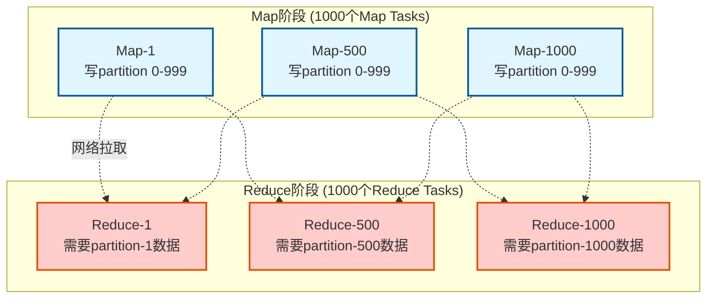
现有优化措施：
- 文件合并: 每个Map将多个分区合并为单个.data文件
- 批量读取: ShuffleBlockBatchId将连续block合并为单次请求
- 连接复用: 连接池 + 并发控制
- 流控优化: maxBytesInFlight, maxReqsInFlight等限制

### Push模式（Spark 3.2+）
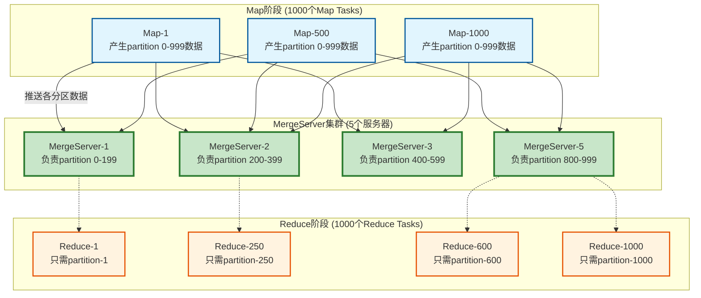

| 对比维度  | 传统Pull模式     | Push模式           | 改进倍数                    |
  |-------|--------------|------------------|-------------------------|
| 网络连接对 | M×R (100万)   | M×S + R×1 (6000) | 167倍，pull优化会减少但是不会改变数量级 |
| 文件碎片化 | 每Map产生R个段    | 预合并大文件           | 显著改善                    |
| 容错成本  | Map失败重算全部分区  | 增量恢复             | 大幅降低                    |
| 网络热点  | 集中在热门Reducer | 分散到MergeServer   | 负载均衡                    |


## Push-Based Shuffle 完整分析(TODO)

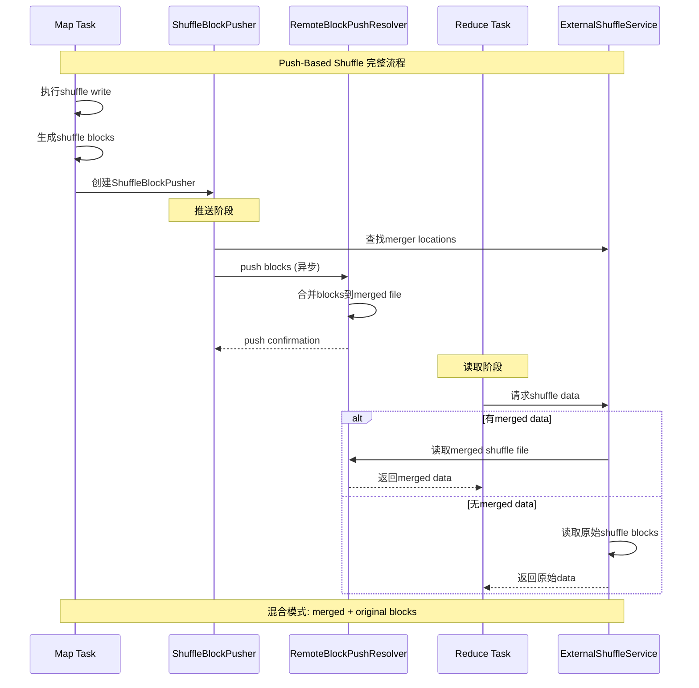

YARN实现特点：
- ✅ 内置支持：Spark 3.2+版本内置，无需额外组件
- ✅ NodeManager集成：作为YARN NodeManager的辅助服务运行
- ✅ 生产就绪：经过充分测试，稳定性好
- ⚠️ 功能有限：基础的merge功能，优化空间有限

Kubernetes + Celeborn的优势：
- ✅ 专业化设计：Celeborn专门为大规模shuffle优化
- ✅ 更好性能：分层存储、智能分区策略
- ✅ 云原生友好：更适合Kubernetes环境
- ✅ 功能丰富：支持更多高级特性

实现对比表

| 特性    | YARN + RemoteBlockPushResolver | Kubernetes + Celeborn |
  |-------|--------------------------------|-----------------------|
| 集成方式  | Spark内置                        | 外部服务                  |
| 部署复杂度 | 🟢 低（NodeManager自带）            | 🟡 中等（独立部署）           |
| 性能优化  | 🟡 基础优化                        | 🟢 深度优化               |
| 扩展性   | 🟡 受限于NodeManager              | 🟢 独立伸缩               |
| 资源隔离  | 🟡 与NodeManager共享              | 🟢 独立资源池              |
| 故障恢复  | 🟡 基础容错                        | 🟢 高级容错机制             |

## 为什么 BypassMergeSortShuffleWriter 最后要拼接成一个文件？
1000 Map × 20个reduce task并发，很多地方说的不接成一个文件会导致"Too many open files"，在默认配置下防止文件句柄爆炸， 目前版本不存在该问题。

真相是：BypassMergeSortShuffleWriter的文件合并主要是为了架构统一性，而不是解决任何实际的性能或稳定性问题。
```text
  ┌─ IndexShuffleBlockResolver ─┐
  │ 期望: 单个.data + .index文件  │
  │ 接口: getBlockData(offset)   │
  └─────────────────────────────┘
             ↑ 必须兼容
  ┌─ BypassMergeSortShuffleWriter ─┐
  │ 自然产出: 200个分散的小文件       │
  │ 架构要求: 必须合并成单文件        │
  └───────────────────────────────┘
```


## IndexShuffleBlockResolver作用？

IndexShuffleBlockResolver是Spark Shuffle架构的关键抽象层，它：

1. 统一了接口：让不同的ShuffleWriter可以无缝协作
2. 简化了Reader：所有shuffle读取都通过相同的逻辑
3. 优化了访问：支持单分区和批量分区的高效访问
4. 保证了一致性：提供原子性写入和容错机制

## 如果 某个 Executor 所在节点宕机（并运行着 Map Task），那么 Spark 是否需要把整个 ShuffleMapStage 全部重算，还是只重算部分？
```text
  场景A: 启用External Shuffle Service

  ✅ 最佳情况 - 无需重算:
  ┌─────────────────┐         ┌──────────────────────┐
  │ Executor-1 宕机  │  ────→  │ External Shuffle     │ ← 数据仍然可访问
  │ (已完成Map Task) │         │ Service (独立进程)    │
  └─────────────────┘         └──────────────────────┘
                                        ↓
                              ResultTask可以正常读取shuffle数据
                              ⟹ 无需重算任何Map Task


  场景B: 未启用External Shuffle Service

  🔥 需要部分重算:
  ┌─────────────────┐   shuffle数据   ┌──────────────────────┐
  │ Executor-1 宕机  │  ──────X────→  │ Executor-1本地磁盘    │ ← 数据丢失
  │                 │                 │ (随executor一起宕机) │
  └─────────────────┘                 └──────────────────────┘
                                              ↓
                                     只重算Executor-1上的Map Tasks
                                     其他Executor的Map Tasks保持不变

  工作原理:
  MapOutputTracker维护的映射关系:
  ┌─────────────────────────────────────────────────────────┐
  │ ShuffleMapStage-0:                                      │
  │ ├─ Partition-0 → Executor-1 ✅ (保留)                   │
  │ ├─ Partition-1 → Executor-2 ❌ (宕机,移除)              │
  │ ├─ Partition-2 → Executor-3 ✅ (保留)                   │
  │ ├─ Partition-3 → Executor-2 ❌ (宕机,移除)              │
  │ └─ Partition-4 → Executor-1 ✅ (保留)                   │
  └─────────────────────────────────────────────────────────┘

  重算范围: 只有Partition-1和Partition-3需要重新执行
  
  
```