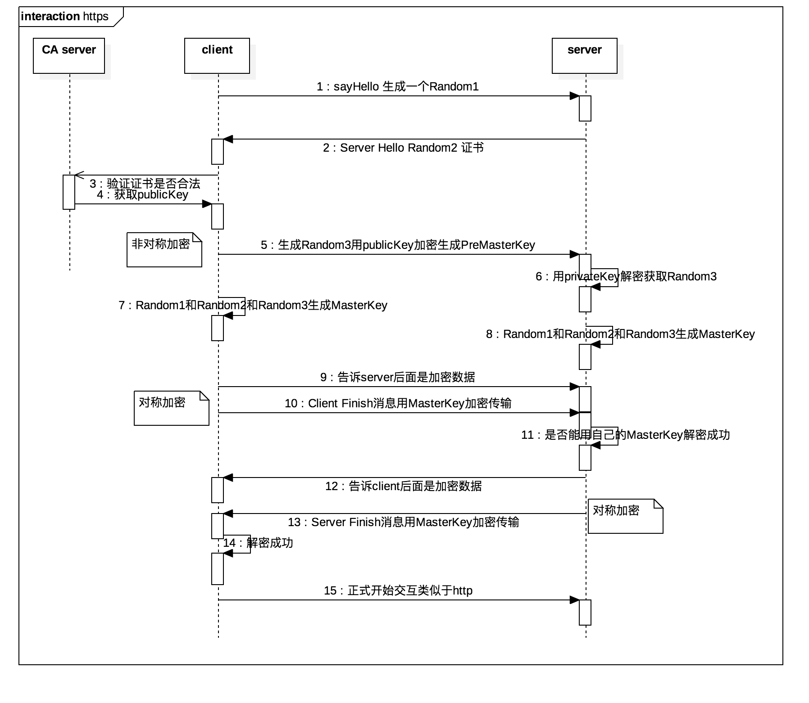

# https

## 概念
SSL(secure socket layer)安全套接字层
TLS(transport layer security)安全传输层

先有Netscape公司研发出来SSL,广泛引用之后在此基础上由IETF(Internet Engineering Task Force，Internet工程任务组),
执行新的规范协议

## 过程
- 1.client hello
  - (1).支持协议的版本号
  - (2).生成随机数Random1
  - (3).支持的加密方法/压缩方法

- 2.server hello

  *Server Key Exchange
  如果是DH算法，这里发送服务器使用的DH参数。RSA算法不需要这一步。
  
  *Cerficate Request(可选)
    服务端可以向客户端发出 Cerficate Request 消息，要求客户端发送证书对客户端的合法性进行验证。比如，金融机构往往
    只允许认证客户连入自己的网络，就会向正式客户提供USB密钥，里面就包含了一张客户端证书

  - (1).确认协议版本号
  - (2).生成随机数Random2
  - (3).确认加密方法
  - (4).发送客户端证书

- 3.Client Certificate Verify
  - (1).client key exchange
  - (2).证书验证,生成PreMaster Key
  - (3).ChangeCipherSpec
        ChangeCipherSpec是一个独立协议,告诉对方我已近切换好之前协商好的加密套件

- 4.Server Finish

流程如下:

## 参考
- [SSL/TLS原理详解](https://segmentfault.com/a/1190000002554673)
- [SSL/TLS 握手过程详解](http://www.jianshu.com/p/7158568e4867)